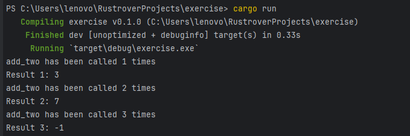
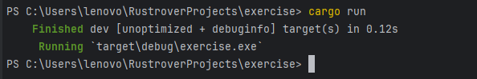

# Rust 程序语言设计 assignment1  

<center>姓名：陈实 学号：2215015058 成绩：  </center>

## 选择题

1. b
2. b
3. d
4. d
5. b
6. a
7. c
8. a
9. d
10. a **struct name如果是指结构体名，选d，如果是结构体对象名，选a**
11. b

## 简答题

12. 请你比较 C++和 Rust 两种编程语言在内存使用的安全和性能上有何不同？

    * 内存安全性
      * C++由程序员自己管理内存，在编译的时候不会检查内存的安全性，所以容易出现内存泄漏和内存溢出的问题
      * Rust在编译的时候会检查内存的安全性，所以不会出现内存泄漏和内存溢出的问题
    * 性能
      * Rust的性能与C++相当。Rust通过零成本抽象和无运行时开销的特性，保证了与手动管理内存的C++相媲美的性能水平
      * 具体来说C++的性能可能会更好一些，因为Rust的内存安全性检查会带来一些性能损耗，但在release模式下，Rust的性能会更接近C++
  
13. Rust 程序语言中的所有是什么？它需要遵循什么规则，请简要说明。

    * 所有：每个值都有一个所有者，它是该值的唯一控制者。当所有者超出作用域时，其拥有的值将被销毁
    * 所有权规则：
      * Rust 中的每一个值都有一个 所有者（owner）。
      * 值在任一时刻有且只有一个所有者。
      * 当所有者（变量）离开作用域，这个值将被丢弃。

14. Rust 程序语言中变量与数据交互的方式有哪几种？请你分别解释并举例说明。

    1. 移动（Move）
       * 当一个变量赋值给另一个变量时，原变量的所有权会被转移给新变量，原变量将无法再被使用

       ```rust
       let s1 = String::from("hello");
       let s2 = s1; // s1的所有权被转移给s2
       println!("{}", s1); // 编译错误
       ```

    2. 拷贝（Copy）
       * 当一个变量赋值给另一个变量时，如果该变量的类型实现了Copy trait，那么原变量的值会被拷贝给新变量，原变量仍然可以继续使用，int、float、bool、char、tuple等存储在栈上的类型都实现了Copy trait

       ```rust
       let x = 5;
       let y = x; // x的值被拷贝给y
       println!("{}", x); // 正常输出5
       ```

    3. 克隆（Clone）
         * 使用clone方法可以对变量进行深拷贝，即拷贝变量的所有权和值，原变量和新变量都可以继续使用

        ```rust
         let s1 = String
        let s2 = s1.clone(); // s1的值被拷贝给s2
        println!("{}", s1); // 正常输出hello
        ```

## 编程题

15. 创建一个函数，该函数接受一个名为 val 的参数，该参数是包含元素 1, 3, 5, 7 的向量 Vec 类型。在函数内部，首先检查向量的第一个元素是否等于 1。如果等于 1，则返回 true，否则返回 false。然后在向量中添加一个随机生成的介于 10 到 20 之间的整数。最后，对向量进行排序，并打印出排序后的向量。函数应返回向量中的最大值和最小值。

    main.rs文件：

    ```rust
    use rand::Rng;

    //题目要求的函数，返回值是一个元组，元组的第一个值是bool类型，第二个值是向量中的最大值，第三个值是向量中的最小值
    fn func(val: &mut Vec<i32>) -> (i32, i32) {
        let mut ans = (0, 0);
        if val[0] == 1 {
            println!("true");
        } else {
            println!("false");
        }

        //添加一个随机生成的介于 10 到 20 之间的整数
        let mut rng = rand::thread_rng();
        let num = rng.gen_range(10..20);
        val.push(num);

        //冒泡排序
        for i in 0..val.len() {
            for j in i..val.len() {
                if val[j] > val[i] {
                    let temp = val[i];
                    val[i] = val[j];
                    val[j] = temp;
                }
            }
        }
        ans.0 = val[0];
        ans.1 = val[val.len() - 1];
        println!("{:?}", val);
        ans
    }

    fn main() {
        let mut val = vec![1, 3, 5, 7];
        let ans = func(&mut val);
        println!("{:?}", ans);
    }
    ```

    Cargo.toml文件：

    ```toml
    [dependencies]
    rand = "0.9.0-alpha.1"
    ```

    控制台输出：

    

16. 创建一个名为 add_two 的函数，它接受一个 i8 类型的参数并将其增加 2。然后，在不使用全局或静态变量的情况下，设计一个机制来追踪此函数在程序生命周期内被调用的次数，并在每次函数调用时打印出调用次数。考虑到 Rust 的所有权和借用规则，此函数的参数应当通过值传递，确保简单性和函数调用的独立性。在 main 函数中调用 add_two 3 次，并打印最终结果

**解题思路：将add_two函数封装在一个结构体中，结构体中有一个成员变量call_count用来记录add_two函数被调用的次数，然后在add_two函数中对call_count进行自增操作，最后在main函数中调用add_two函数3次，每次调用都会打印出调用次数**

```rust
struct AddTracker {
    call_count: usize,
}

impl AddTracker {
    fn new() -> Self {
        AddTracker { call_count: 0 }
    }

    fn add_two(&mut self, x: i8) -> i8 {
        self.call_count += 1;
        println!("add_two has been called {} times", self.call_count);
        x + 2
    }
}

fn main() {
    let mut tracker = AddTracker::new();

    let result1 = tracker.add_two(1);
    println!("Result 1: {}", result1);

    let result2 = tracker.add_two(5);
    println!("Result 2: {}", result2);

    let result3 = tracker.add_two(-3);
    println!("Result 3: {}", result3);
}
```

控制台输出：
    

17.  Option\<T> 类型是一个非常有用的枚举，用于处理可能不存在的值。 假设你正在开发一个应用程序，需要从配置文件中读取一些设置。配置文件是简单的键值对格式.

```rust
//目标函数，接受配置文件的内容和键名，返回键值
fn parse_config(contents: &str, key: &str) -> Option<i32> {
   let mut ans = None;
   //按行读取配置文件
   for line in contents.lines() {
       //按等号分割键值对
       let mut iter = line.split("=");
       //取出键和值
       let k = iter.next().unwrap();
       let v = iter.next().unwrap();
       //如果键名和目标键名相同，将值转换为i32类型并返回
       if k == key {
           ans = v.parse::<i32>().ok();
           break;
       }
   }
   ans
}
fn main() {
// 测试用例
   let config = "max_connections=100\ndefault_timeout=60";
   assert_eq!(parse_config(config, "max_connections"), Some(100)); // 应返回 Some(100)
   assert_eq!(parse_config(config, "default_timeout"), Some(60));
   assert_eq!(parse_config(config, "min_connections"), None);
   assert_eq!(parse_config("invalid=abc", "invalid"), None);
}
```

控制台输出：


