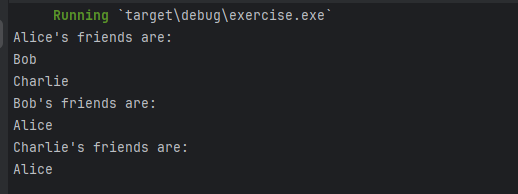

# Rust 程序语言设计 assignment2

<center>姓名：陈实 学号：2215015058 成绩：  </center>

## 选择题

1. c
2. a
3. c
4. b
5. d
6. c
7. c
8. b
9. b
10. a
11. a
12. c

## 简答题

13. Smart pointers 是什么？它和 reference 的区别是什么？并简要阐述 Box\<T>、Rc\<T>、Ref\<T>的区别。
    1. 智能指针（Smart Pointers） 是一种拥有更多功能的指针，它不仅能指向某个值，还能在指针离开作用域时自动执行某些操作，比如内存管理和资源释放。Rust 中的智能指针通常是指那些实现了 Deref 和 Drop 特性的类型。

    2. 智能指针与引用的区别：

        引用（Reference） 是对已有数据的借用，不能拥有数据的所有权，且不能控制数据的生命周期。
        智能指针 可以拥有数据的所有权，并且通常在指针被销毁时自动释放资源。
        Box\<T\>、Rc\<T\>、Ref\<T\> 的区别：
    3. Box\<T>、Rc\<T>、Ref\<T>的区别
        Box\<T\>：用于在堆上分配值，拥有数据的唯一所有权，适用于单一所有者场景。
        Rc\<T\>（Reference Counted Smart Pointer）：用于在堆上分配值，允许多个所有者，通过引用计数来管理数据的共享所有权，但不适用于并发环境。
        Ref\<T\> 和 RefCell\<T\>：用于在运行时执行借用检查，允许在编译时无法确定的情况下进行可变借用，通过 RefCell 包装后的值可以在运行时进行可变借用和不可变借用。

14. Rust 的错误处理机制包括哪些？它们都分别用于什么情况？
    Rust 的错误处理机制主要包括 Result<T, E> 和 panic!：

    1.  Result<T, E>：

        用于可恢复的错误。
        Result 是一个枚举类型，有两个变体：Ok(T) 表示操作成功并返回一个值，Err(E) 表示操作失败并返回一个错误。
        常用于函数返回值中，以表明函数调用的成功或失败。
    2.  panic!：

        于不可恢复的错误。
        当程序遇到无法处理的错误时，会调用 panic! 宏，导致程序崩溃并打印错误信息。
        常用于测试或原型开发中，用于快速发现错误。

15. Macros 是什么？请你说明在 Rust 中 macros 和 function 的相同点和不同点，并简要阐述 Rust 和 C 语言中 macros 的区别。

    1. Macros（宏） 是一种在编译时展开的代码生成工具。它们允许你编写能够生成其他代码的代码，可以用于减少重复代码、实现代码生成和模板等功能。

    2. Rust 中的宏与函数的相同点和不同点：

      * 相同点：
        都是可重用的可以接受参数的代码块。

      * 不同点：

        宏：在编译时展开，生成代码并插入到调用宏的地方。宏可以进行模式匹配，生成复杂的代码结构，适用于代码生成、减少重复代码等场景。
        函数：在运行时调用，有明确的输入和输出，适用于需要执行特定逻辑的场景。

    * Rust 和 C 语言中宏的区别：

      * Rust 中的宏：
        更加安全，具有强类型检查和模式匹配能力，避免了一些常见的宏使用错误。
        支持递归和复杂的模式匹配，可以生成更加复杂和安全的代码。
      * C 语言中的宏：
        没有类型检查，简单的文本替换，容易导致宏相关的错误和调试困难。

16. 在 Rust 中，迭代器提供了一个灵活和强大的方式来处理集合中的数据。本题要求你
    使用迭代器对 `Vec<String>` 类型的向量进行更高级的操作，完成以下任务：
    a. 创建一个包含多个字符串的向量 `words`。每个字符串代表一个单词。
    b. 使用迭代器过滤出所有长度大于 3 的单词。
    c. 将这些单词转换为全大写。
    d. 计算并打印转换后单词的平均长度。
    e. 将这些单词按字母顺序排序，并返回一个新的向量。
    要求
    - 尽量使用迭代器方法链来实现这一功能。
    - 平均长度的计算结果应该是 `f64` 类型。
    - 注意处理空向量的情况，避免除以零错误

    ```rust
    fn main(){
    let words = vec!["hello".to_string(), "world".to_string(), "rust".to_string(), "is".to_string(), "fun".to_string()];
    let mut sum = 0;
    let mut count = 0;
    let mut new_words = words.iter().filter(|x| x.len() > 3).map(|x| x.to_uppercase()).collect::<Vec<String>>();
    println!("{:?}", new_words);
    for word in &new_words {
        sum += word.len();
        count += 1;
    }
    let avg = if count == 0 {
        0.0
    } else {
        sum as f64 / count as f64
    };
    println!("Average length: {}", avg);
    new_words.sort();
    ```

    

17. 实现一个简单的社交网络，其中一个用户可以关注多个用户。每个用户包含其名字以及关注的用户列表。要求：
    a. 使用 Box<T> 在堆上分配用户结构。
    b. 使用 Rc<T> 来实现用户的多重所有权，以便一个用户可以被多个用户关注。
    c. 使用 RefCell<T> 来实现用户列表的内部可变性，以便能够修改关注的用户列表。
    具体步骤如下：
    定义一个 User 结构体，包含 name（String 类型） 和 friends（RefCell<Vec<Rc<User>>> 类型）；实现一个 User 的方法 follow，用于让一个用户关注另一个用户；实现一个 User 的方法 show_friends，用于打印用户的所有关注者的名字。
    要求写出完整的代码，并确保代码能够正确编译和运行。

    ```rust
    use std::cell::RefCell;
    use std::rc::Rc;

    struct User {
        name: String,
        friends: RefCell<Vec<Rc<User>>>,
    }

    impl User {
        fn follow(&self, user: Rc<User>) {
            self.friends.borrow_mut().push(user);
        }
        fn show_friends(&self) {
            for friend in self.friends.borrow().iter() {
                println!("{}", friend.name);
            }
        }
    }

    fn main(){
        let alice = Rc::new(User {
            name: "Alice".to_string(),
            friends: RefCell::new(vec![]),
        });
        let bob = Rc::new(User {
            name: "Bob".to_string(),
            friends: RefCell::new(vec![]),
        });
        let charlie = Rc::new(User {
            name: "Charlie".to_string(),
            friends: RefCell::new(vec![]),
        });
        alice.follow(Rc::clone(&bob));
        alice.follow(Rc::clone(&charlie));
        alice.show_friends();
    }
    ```

    

18. 有五位哲学家围坐在一张圆桌旁，桌上放有五根筷子。每位哲学家只有在同时拿起他左边和右边的筷子时才能进餐。每位哲学家进餐完毕后，需要放下他使用的两根筷子，然后继续思考。为了防止死锁，确保程序能够正确实现哲学家就餐过程，使得所有哲学家能够公平地进餐。
    要求：
    a. 使用多线程模拟哲学家的行为。
    b. 使用互斥锁 (Mutex) 来管理筷子的使用。
    c. 实现一个函数 dine，该函数启动五个哲学家线程，并保证不会发生死锁。
    d. 每位哲学家在思考和进餐时需要打印相应的状态。

    ```rust
    use std::sync::{Arc, Mutex};
    use std::thread;

    struct Philosopher {
        name: String,
        left: usize,
        right: usize,
    }

    impl Philosopher {
        fn new(name: &str, left: usize, right: usize) -> Philosopher {
            Philosopher {
                name: name.to_string(),
                left,
                right,
            }
        }

        fn dine(&self, table: &Table) {
            let _left = table.forks[self.left].lock().unwrap();
            let _right = table.forks[self.right].lock().unwrap();
            println!("{} is eating.", self.name);
            thread::sleep_ms(1000);
            println!("{} is done eating.", self.name);
        }
    }

    struct Table {
        forks: Vec<Mutex<()>>,
    }

    fn main() {
        let table = Arc::new(Table {
            forks: vec![
                Mutex::new(()),
                Mutex::new(()),
                Mutex::new(()),
                Mutex::new(()),
                Mutex::new(()),
            ],
        });

        let philosophers = vec![
            Philosopher::new("Judith Butler", 0, 1),
            Philosopher::new("Gilles Deleuze", 1, 2),
            Philosopher::new("Karl Marx", 2, 3),
            Philosopher::new("Emma Goldman", 3, 4),
            Philosopher::new("Michel Foucault", 0, 4),
        ];

        let handles: Vec<_> = philosophers.into_iter().map(|p| {
            let table = table.clone();
            thread::spawn(move || {
                p.dine(&table);
            })
        }).collect();

        for h in handles {
            h.join().unwrap();
        }
    }
    ```

    