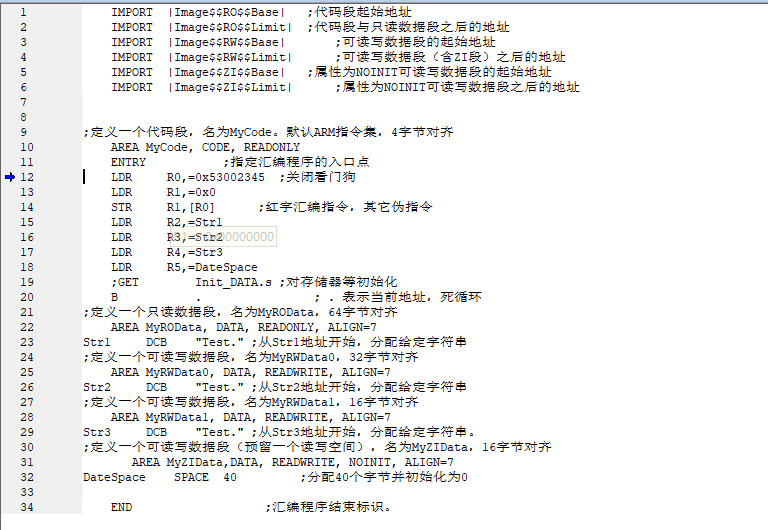

# 嵌入式第一次作业

<center>计算机2101 陈实 2215015058</center>

## 1. 实验环境

1. ADS1.2: 用于编写和调试代码

## 2. 实验内容

1. 安装ADS1.2，在CodeWarrior 中make(汇编、连接) 该程序，并将映像文件装入AXD中模拟执行
2. 观察映像文件的组织：
    1. 观察各段的安排次序。
    2. 修改RO Base为0x800，汇编后再观察各段的次序、地址。
    3. 修改RW Base为0xC00，汇编后再观察各段的次序、地址。
    4. 观察MyZIData数据段是否存在，为什么？
    5. 调整源代码中各段顺序，汇编后再观察各段的次序、地址。
    6. 改变各段对齐方式，改变各数据段长度，再进行观察，总结对齐规律。
3. 观察伪指令“LDR  R0,=0x53002345”及其它指令
    1. 有没有文字池，若有，观察文字池的地址及内容。
    2. 观察这些指令对应的机器指令，说明对应的汇编指令及寻址方式
4. 单步执行，观察寄存器情况。
5. 增加其它感兴趣的指令，比如堆栈操作、转移等指令，观察其机器指令情况。单步执行，观察寄存器情况。

## 3. 实验过程

### make与装载执行


### 观察映像文件的组织

#### 观察各段的安排次序

| 段名 | 地址 |
| :---: | :---: |
| Image\$\$RO\$\$Base | 0x000 |
| Image\$\$RO\$\$Limit | 0x080 |
| Image\$\$RW\$\$Base | 0x080 |
| Image\$\$RW\$\$Limit | 0x0f0 |
| Image\$\$ZI\$\$Base | 0x0c0 |
| Image\$\$ZI\$\$Limit | 0x0f0 |

1. RO段：包含MyCode和MyROData，地址从0x00000000开始，长度为0x80。
    1. MyCode中有8条指令，反汇编后的机器码共8条，每条指令占4字节，共32字节。其中有5条指令需要文字池，共20字节，ARM默认4字节对齐，所以MyCode的长度为32字节。所以占用的地址空间为0x00000000-0x00000034。
        

    2. MyROData，64字节对齐，所以占用的地址空间为0x00000040-0x00000080。
        

2. RW段：
    1. 包含MyRWData0，32字节对齐，字符串长度小于32字节，所以占用32字节，所以占用的地址空间为0x00000080-0x000000a0
        
    2. 包含MyRWData1，16字节对齐，字符串长度大于16字节，小于32字节，所以占用32字节，所以占用的地址空间为0x000000a0-0x000000c0
        

3. ZI段：
    1. 包含MyZIData，16字节对齐，预先分配了分配40个字节并初始化为0，所以占用48字节，所以占用的地址空间为0x000000c0-0x000000f0
        

#### 修改RO Base为0x800

| 段名 | 地址 |
| :---: | :---: |
| Image\$\$RO\$\$Base | 0x800 |
| Image\$\$RO\$\$Limit | 0x880 |
| Image\$\$RW\$\$Base | 0x880 |
| Image\$\$RW\$\$Limit | 0x8f0 |
| Image\$\$ZI\$\$Base | 0x8c0 |
| Image\$\$ZI\$\$Limit | 0x8f0 |

因为0x800满足4字节对齐，16字节对齐，64字节对齐，且未设定RW BASE，所以代码段内的数据段的相对地址不变，只是整体地址向后移动了0x800

#### 修改RW Base为0xC00

| 段名 | 地址 |
| :---: | :---: |
| Image\$\$RO\$\$Base | 0x800 |
| Image\$\$RO\$\$Limit | 0x880 |
| Image\$\$RW\$\$Base | 0xc00 |
| Image\$\$RW\$\$Limit | 0xc70 |
| Image\$\$ZI\$\$Base | 0xc40 |
| Image\$\$ZI\$\$Limit | 0xc70 |


但在反汇编中看到RW段的地址并没有因为修改；这是因为在CodeWarrior中设置的RO/RW base只是将来从目标板的flash搬到RAM区的地址，并不是AXD仿真时的地址。仿真的地址是装入flash的情况，开机后才装入C00，因此指令中的访问地址已经变为C00了


#### 观察MyZIData数据段是否存在

存在但是没有被初始化

#### 调整源代码中各段顺序

调整后的代码如下


| 段名 | 地址 |
| :---: | :---: |
| Image\$\$RO\$\$Base | 0x000 |
| Image\$\$RO\$\$Limit | 0x080 |
| Image\$\$RW\$\$Base | 0x080 |
| Image\$\$RW\$\$Limit | 0x0f0 |
| Image\$\$ZI\$\$Base | 0x0c0 |
| Image\$\$ZI\$\$Limit | 0x0f0 |


可以发现，段的顺序并没有发生变化，这是因为在代码中并没有指定段的顺序，而是由编译器自动决定的

#### 改变各段对齐方式，改变各数据段长度

修改代码如下：

将所有的ALIGN改为ALIGN 7，即128字节对齐，将对应的字符串改为"Test."


| 段名 | 地址 |
| :---: | :---: |
| Image\$\$RO\$\$Base | 0x000 |
| Image\$\$RO\$\$Limit | 0x100 |
| Image\$\$RW\$\$Base | 0x100 |
| Image\$\$RW\$\$Limit | 0x280 |
| Image\$\$ZI\$\$Base | 0x200 |
| Image\$\$ZI\$\$Limit | 0x280 |

MyCode，MyROData，MyRWData0, MyRWData1, MyZIData分别占用128字节

### 观察伪指令“LDR  R0,=0x53002345”及其它指令

1. 有没有文字池，若有，观察文字池的地址及内容。
    
    有文字池

    | 地址 | 内容 |
    | :---: | :---: |
    |0x00000020|0x53002345|
    |0x00000024|0x00000040|
    |0x00000028|0x00000080|
    |0x0000002c|0x000000a0|
    |0x00000030|0x000000c0|

2. 观察这些指令对应的机器指令，说明对应的汇编指令及寻址方式

    | 指令 | 汇编指令 | 机器指令 | 寻址方式 |
    | :---: | :---: | :---: | :---: |
    | LDR R0,=0x53002345 | ldr r0,0x00000020 | 0xe59f0018 | PC相对 |
    | LDR R1,=0x0 | mov r1,#0 | 0xe3a01000 | 立即数 |
    | STR R1,\[R0] | str r1,r1,[r0,#0] | 0xe5801000 | 基址变址 |
    | LDR R2,=Str1 | ldr r2,0x00000024 | 0xe59f2010 | PC相对 |
    | LDR R3,=Str2 | ldr r3,0x00000028 | 0xe59f3010 | PC相对 |
    | LDR R4,=Str3 | ldr r4,0x0000002c | 0xe59f4010 | PC相对 |
    | LDR R5,=DateSpace | ldr r5,0x0000030| 0xe59f5010 | PC相对 |
    | B . |  b  0x1c  | 0xeafffffe | 相对 |

### 单步执行，观察寄存器情况

|步骤|指令|寄存器|PC|
|:---:|:---:|:---:|:---:|
|1|LDR R0,=0x53002345|R0=0x53002345|0x00000004|
|2|LDR R1,=0x0|R1=0x0|0x00000008|
|3|STR R1,[R0]||0x0000000C|
|4|LDR R2,=Str1|R2=0x00000040|0x00000010|
|5|LDR R3,=Str2|R3=0x00000080|0x00000014|
|6|LDR R4,=Str3|R4=0x000000A0|0x00000018|
|7|LDR R5,=DateSpace|R5=0x000000C0|0x0000001C|
|8|B .||0x0000001C|

最后陷入死循环

### 增加其它感兴趣的指令

1. 代码如下

    ```assembly
        AREA MyCode, CODE, READONLY
    
        ENTRY
        LDR SP, =Data       ; 将地址Data加载到栈指针SP
    
        ; 设置寄存器R1和R2的值为1和2，并将它们顺序入栈
        MOV R1, #1
        MOV R2, #2
        STMFA SP!, {R1-R2}
    
        ; 设置寄存器R1和R2的值为3和4
        MOV R1, #3
        MOV R2, #4
    
        ; 计算R1和R2的乘积，并将结果存储到R0
        MUL R0, R1, R2
    
        ; 将栈中的数据出栈到寄存器R1和R2
        LDMFA SP!, {R1-R2}
    
        ; 死循环
    Loop
        B Loop
    
        ; 可读写数据段，预留空间用于存储数据
        AREA Data, DATA, READWRITE
        END
    ```

|步骤|指令|寄存器|PC|
|:---:|:---:|:---:|:---:|
|1|LDR SP,=Data|R13=0x28|0x04|
|2|MOV R1,#1|R1=0x1|0x08|
|3|MOV R2,#2|R2=0x2|0x0C|
|4|STMFA SP!,{R1-R2}|r13=0x30|0x10|
|5|MOV R1,#3|R1=0x3|0x14|
|6|MOV R2,#4|R2=0x4|0x18|
|7|MUL R0,R1,R2|R0=0xC|0x1C|
|8|LDMFA SP!,{R1-R2}|R1=0x1, R2=0x2, R13=0x28|0x20|
|9|B .|陷入死循环|0x20|

## 4. 实验总结

1. 通过本次实验，我了解了ARM汇编的基本语法和指令，了解了ARM汇编的伪指令和机器指令的对应关系，了解了ARM汇编的段的组织方式，了解了ARM汇编的对齐方式，了解了ARM汇编的寻址方式，了解了ARM汇编的单步执行方式
2. 通过本次实验，我学会了如何在使用ADS1.2。
