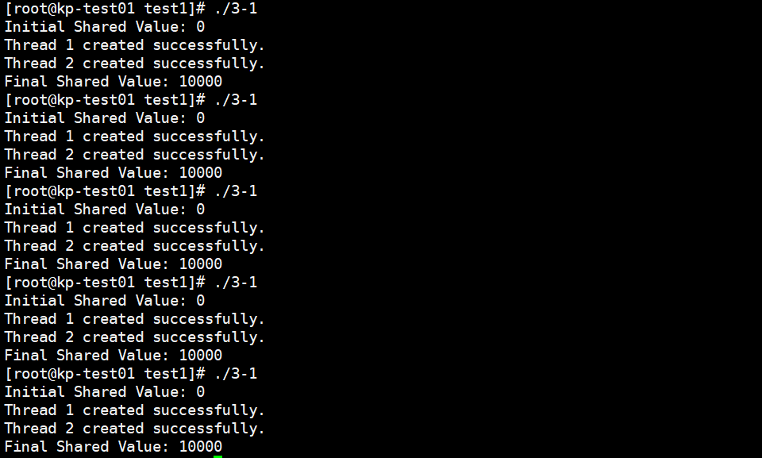

# Operating System Lab

## 1. 进程相关编程实验

### 步骤1

创建一个子进程，子进程输出自己的pid和父进程的pid，父进程输出自己的pid和子进程的pid。当pid<0时，说明创建子进程失败，当pid=0时，说明是子进程，当pid>0时，说明是父进程。

```c
#include<sys/types.h>
#include<stdio.h>
#include<unistd.h>
#include<sys/wait.h>

int main(){
    pid_t pid, pid1;
    pid = fork();
    if (pid < 0){
        fprintf(stderr, "Fork Failed");
        return 1;
    }
    else if (pid == 0){
        pid1 = getpid();
        printf("child: pid = %d  ", pid);
        printf("child: pid1 = %d  ", pid1);
    }
    else{
        pid1 = getpid();
        printf("parent: pid = %d  ", pid);
        printf("parent: pid1 = %d  ", pid1);
        wait(NULL);
    }
    return 0;
}
```

观察输出，总是先输出子进程的pid，因为有`wait(NULL)`,父进程会等带子进程结束。以第一排输出为例

```s
在父进程中:

pid: 存放fork()的返回值,也就是子进程的PID。

pid1: 存放getpid()的返回值,也就是父进程自身的PID。

在子进程中:

pid: 存放fork()的返回值0,表示当前是子进程。

pid1: 存放getpid()的返回值,也就是子进程自身的PID。
```


---

### 步骤2

删除wait函数，观察父进程和子进程的输出顺序。输出顺序变化的原因是父进程和子进程的执行顺序不确定，取决于系统的调度算法。

```c
#include<sys/types.h>
#include<stdio.h>
#include<unistd.h>
#include<sys/wait.h>

int main(){
    pid_t pid, pid1;
    pid = fork();
    if (pid < 0){
        fprintf(stderr, "Fork Failed");
        return 1;
    }
    else if (pid == 0){
        pid1 = getpid();
        printf("child: pid = %d  ", pid);
        printf("child: pid1 = %d  ", pid1);
    }
    else{
        pid1 = getpid();
        printf("parent: pid = %d  ", pid);
        printf("parent: pid1 = %d  ", pid1);
    }
    return 0;
}
```

删除`wait(NULL)`后，child和parent的输出顺序不确定。原因是父进程和子进程的执行顺序不确定，取决于系统的调度算法。


---

### 步骤3

设置了一个全局变量value=0，父进程value-=100，子进程value+=100，都输出value的值和地址。

```c
#include<sys/types.h>
#include<stdio.h>
#include<unistd.h>
#include<sys/wait.h>

int value=0;

int main(){
    pid_t pid, pid1;
    pid = fork();
    if (pid < 0){
        fprintf(stderr, "Fork Failed");
        return 1;
    }
    else if (pid == 0){
        value += 100;
        pid1 = getpid();
        printf("child: value = %d  ", value);
        printf("child: address = %d  ", &value);
    }
    else{
        value -= 100;
        pid1 = getpid();
        printf("parent: value = %d  ", value);
        printf("parent: address = %d  ", &value);
    }
    return 0;
}
```

观察父进程和子进程的输出结果。父进程和子进程的value值不同，说明父进程和子进程的数据是独立的，但value的地址相同，说明父进程和子进程的地址空间是共享的。


---

### 步骤4

在步骤三的基础上，在return前增加了value的输出，观察父进程和子进程的输出结果。

```c
#include<sys/types.h>
#include<stdio.h>
#include<unistd.h>
#include<sys/wait.h>

int value=0;

int main(){
    pid_t pid, pid1;
    pid = fork();
    if (pid < 0){
        fprintf(stderr, "Fork Failed");
        return 1;
    }
    else if (pid == 0){
        value += 100;
        pid1 = getpid();
        printf("child: value = %d  ", value);
        printf("child: address = %d  \n", &value);
    }
    else{
        value -= 100;
        pid1 = getpid();
        printf("parent: value = %d  ", value);
        printf("parent: address = %d  \n", &value);
    }
    value*=2;
    printf("before return : value = %d  ", value);
    printf("before return : address = %d  \n", &value);
    return 0;
}


```

父进程和子进程的value值不同，说明父进程和子进程的数据是独立的，但value的地址相同，说明父进程和子进程的地址空间是共享的。


---

### 步骤5

1. 用`touch system_call.c`生成一个system_call.c文件，用`gcc system_call.c -o system_call`编译生成一个system_call可执行文件。在步骤三的基础上，用execl函数调用system_call可执行文件。execl() 函数可以用于在程序中执行另一个可执行文件，并将当前进程替换为新的进程。

#### system_call.c

```c
#include<stdio.h>
#include<unistd.h>

int main(){
        pid_t pid=getpid();
        printf("process: pid = %d\n",pid);
        return 0;
}
```

#### execl函数

1. execl()参数列表如下：
    `int execl(const char *path, const char *arg0, ... /* (char *)0 */);`
    1. 第一个参数 const char *path：指定要执行的可执行文件的路径。在这里，"./system_call" 表示当前目录下的 system_call 可执行文件。
    2. 第二个参数 const char *arg0, ...：可选的参数列表，以 NULL 结束。在这里，我们将 "system_call" 作为第二个参数传递给可执行文件。
    3. 最后一个参数必须是 NULL，用于标记参数列表的结束。

```c
#include<sys/wait.h>
#include <sys/types.h>
#include <stdio.h>
#include <unistd.h>

int main()
{
  pid_t pid, pid1;

  pid = fork();

  if(pid<0)
     {
       fprintf(stderr,"Fork Failed");
       return 1;
     }
  else if (pid ==0)
  {
     pid1 = getpid();
     printf("child: pid= %d\n",pid);
     printf("child: pid1 = %d\n",pid1);
     execl("./system_call","",NULL);
  }
  else
  {
    pid1 = getpid();
    printf("parent: pid =%d\n",pid);
    printf("parent: pid1 =%d\n",pid1);
    wait(NULL);
    }
   return 0;
  }

```

以第一次输出为例，子进程的pid为2596，父进程的pid为2595，system_call的pid为2596，与子进程的pid相同。因为execl()函数会用system_call可执行文件替换当前进程，所以system_call的pid与子进程的pid相同。


#### system函数

加上`#include<stdlib.h>`,使用system()函数调用system_call可执行文件。system() 函数可以用于在程序中执行另一个可执行文件，并将当前进程替换为新的进程。
传递`system("./system_call")`给system()函数，表示在当前目录下执行system_call可执行文件。

```c
    #include<sys/types.h>
    #include<stdio.h>
    #include<unistd.h>
    #include<sys/wait.h>
    #include<stdlib.h>

    int main(){
        pid_t pid, pid1;
        pid = fork();
        if (pid < 0){
            fprintf(stderr, "Fork Failed");
            return 1;
        }
        else if (pid == 0){
            pid1 = getpid();
            printf("child: pid = %d  ", pid);
            printf("child: pid1 = %d  ", pid1);
            system("./system_call");
        }
        else{
            pid1 = getpid();
            printf("parent: pid = %d  ", pid);
            printf("parent: pid1 = %d  ", pid1);
            wait(NULL);
        }
        return 0;
    }

```

以第一次运行为例，parent的pid为3128，child的pid为3129，systemcall的pid为3130，因为system()函数会新建一个进程，所以systemcall的pid与child的pid不同。


==所以对比`execl()`和`system()`,`execl()`会取代当前进程，其后面的程序不会执行，而`system()`会新建一个进程，与原来的进程并行执行。==

## 2. 线程相关编程实验

### 步骤1

创建了两个线程，一个全局共享变量sharedVariable，一个线程对sharedVariable进行加100操作，一个线程对sharedVariable进行减100操作，分别执行100000次。最后输出sharedVariable的值。

```c
#include <stdio.h>
#include <pthread.h>

#define NUM_THREADS 2
#define NUM_ITERATIONS 100000

int sharedVariable = 0;

void *threadFunction1(void *arg) {
    printf("thread1 created success!");
    for (int i = 0; i < NUM_ITERATIONS; i++) {
        sharedVariable+=i;
    }
    pthread_exit(NULL);
}

void *threadFunction2(void *arg) {
    printf("thread2 created success!");
    for (int i = 0; i < NUM_ITERATIONS; i++) {
        sharedVariable-=i;
    }
    pthread_exit(NULL);
}

int main() {
    pthread_t threads[NUM_THREADS];

    if (pthread_create(&threads[0], NULL, threadFunction1, NULL) != 0) {
        perror("pthread_create");
        return 1;
    }

    if (pthread_create(&threads[1], NULL, threadFunction2, NULL) != 0) {
        perror("pthread_create");
        return 1;
    }
    for (int i = 0; i < NUM_THREADS; i++) {
        pthread_join(threads[i], NULL);
    }
    printf("Final sharedVariable: %d\n", sharedVariable);

    return 0;
}

```

由于两个线程没有处理共享变量的同步问题，由于两个线程对sharedVariable的操作是并发的，会同时去操作共享变量，所以最后的结果不确定。


---

### 步骤2

相较于步骤1，添加了信号量semaphore。sem_wait()函数会对信号量semaphore进行P操作，sem_post()函数会对信号量semaphore进行V操作。由于sem_wait()和sem_post()函数是原子操作，所以最后的结果为0。

```c
#include <stdio.h>
#include <pthread.h>
#include <semaphore.h>

#define NUM_THREADS 2
#define NUM_ITERATIONS 100000

int sharedVariable = 0;
sem_t semaphore;

void *threadFunction1(void *arg) {
    for (int i = 0; i < NUM_ITERATIONS; i++) {
        sem_wait(&semaphore);
        sharedVariable += 100;
        sem_post(&semaphore);
    }
    pthread_exit(NULL);
}

void *threadFunction2(void *arg) {
    for (int i = 0; i < NUM_ITERATIONS; i++) {
        sem_wait(&semaphore);
        sharedVariable -= 100;
        sem_post(&semaphore);
    }
    pthread_exit(NULL);
}

int main() {
    pthread_t threads[NUM_THREADS];

    if (sem_init(&semaphore, 0, 1) != 0) {
        perror("sem_init");
        return 1;
    }

    if (pthread_create(&threads[0], NULL, threadFunction1, NULL) != 0) {
        perror("pthread_create");
        return 1;
    } else {
        printf("Thread 1 created successfully.\n");
    }

    if (pthread_create(&threads[1], NULL, threadFunction2, NULL) != 0) {
        perror("pthread_create");
        return 1;
    } else {
        printf("Thread 2 created successfully.\n");
    }

    for (int i = 0; i < NUM_THREADS; i++) {
        pthread_join(threads[i], NULL);
    }

    printf("Final sharedVariable: %d\n", sharedVariable);

    sem_destroy(&semaphore);

    return 0;
}

```

由于sem_wait()和sem_post()函数是原子操作，每次只有一个线程能够对共享变量进行操作，两个线程对操作是相反的，所以最后的结果为0。


---

### 步骤3

创建了一个system_call2.c文件，用于输出进程的PID和线程的TID。

#### system_call2.c

```c
#include <stdio.h>
#include <pthread.h>
#include <unistd.h>

int main() {
    pid_t pid = getpid(); // 获取进程的PID
    pthread_t tid = pthread_self(); // 获取线程的TID

    printf("Process PID: %d\n", pid);
    printf("Thread TID: %lu\n", tid);

    return 0;
}
```

#### system()函数

```c
#include <stdio.h>
#include <pthread.h>
#include <semaphore.h>
#include <stdlib.h>
#include <unistd.h>

#define NUM_THREADS 2
#define NUM_ITERATIONS 100000

int sharedVariable = 0;
sem_t semaphore;

void *threadFunction1(void *arg) {
    pid_t thread_pid = getpid();
    pthread_t thread_tid = pthread_self();
    for (int i = 0; i < NUM_ITERATIONS; i++) {
        sem_wait(&semaphore);
        sharedVariable += 100;
        sem_post(&semaphore);
    }
    printf("Thread 1 - PID: %d, TID: %lu\n", thread_pid, thread_tid);
    system("./system_call2");
    pthread_exit(NULL);
}

void *threadFunction2(void *arg) {
    pid_t thread_pid = getpid();
    pthread_t thread_tid = pthread_self();
    for (int i = 0; i < NUM_ITERATIONS; i++) {
        sem_wait(&semaphore);
        sharedVariable -= 100;
        sem_post(&semaphore);
    }
    printf("Thread 1 - PID: %d, TID: %lu\n", thread_pid, thread_tid);
    system("./system_call2");
    pthread_exit(NULL);
}

int main() {
    pthread_t threads[NUM_THREADS];

    if (sem_init(&semaphore, 0, 1) != 0) {
        perror("sem_init");
        return 1;
        }

    if (pthread_create(&threads[0], NULL, threadFunction1, NULL) != 0) {
        perror("pthread_create");
        return 1;
    } else {
        printf("Thread 1 created successfully.\n");
    }

    if (pthread_create(&threads[1], NULL, threadFunction2, NULL) != 0) {
        perror("pthread_create");
        return 1;
    } else {
        printf("Thread 2 created successfully.\n");
    }

    for (int i = 0; i < NUM_THREADS; i++) {
        pthread_join(threads[i], NULL);
    }

    printf("Final sharedVariable: %d\n", sharedVariable);

    sem_destroy(&semaphore);

    return 0;
}
```

线程1和线程2以及他们调用system_call2的4个TID都不同，说明线程的TID是独立的。两个线程的PID相同，说明两个线程是同一个进程的两个线程。它们调用的system_call2的PID互不相同且与线程的PID不同，说明调用system()函数会新建一个进程。


#### execl()函数

```c
#include <stdio.h>
#include <pthread.h>
#include <semaphore.h>
#include <stdlib.h>
#include <unistd.h>

#define NUM_THREADS 2
#define NUM_ITERATIONS 100000

int sharedVariable = 0;
sem_t semaphore;

void *threadFunction1(void *arg) {
    pid_t thread_pid = getpid();
    pthread_t thread_tid = pthread_self();
    for (int i = 0; i < NUM_ITERATIONS; i++) {
        sem_wait(&semaphore);
        sharedVariable += 100;
        sem_post(&semaphore);
    }
    printf("Thread 1 - PID: %d, TID: %lu\n", thread_pid, thread_tid);
    execl("./system_call2","",NULL);
    pthread_exit(NULL);
}

void *threadFunction2(void *arg) {
    pid_t thread_pid = getpid();
    pthread_t thread_tid = pthread_self();
    for (int i = 0; i < NUM_ITERATIONS; i++) {
        sem_wait(&semaphore);
        sharedVariable -= 100;
        sem_post(&semaphore);
    }
    printf("Thread 1 - PID: %d, TID: %lu\n", thread_pid, thread_tid);
    execl("./system_call2","",NULL);
    pthread_exit(NULL);
}

int main() {
    pthread_t threads[NUM_THREADS];

    if (sem_init(&semaphore, 0, 1) != 0) {
        perror("sem_init");
        return 1;
        }

    if (pthread_create(&threads[0], NULL, threadFunction1, NULL) != 0) {
        perror("pthread_create");
        return 1;
    } else {
        printf("Thread 1 created successfully.\n");
    }

    if (pthread_create(&threads[1], NULL, threadFunction2, NULL) != 0) {
        perror("pthread_create");
        return 1;
    } else {
        printf("Thread 2 created successfully.\n");
    }

    for (int i = 0; i < NUM_THREADS; i++) {
        pthread_join(threads[i], NULL);
    }

    printf("Final sharedVariable: %d\n", sharedVariable);

    sem_destroy(&semaphore);

    return 0;
}
```

可以发现只调用成功了一次system_call2，新的进程的PID与线程的PID相同，说明调用execl()函数会取代当前进程。同时，只输出了system_call2的PID，因为线程属于同一个进程，当一个线程调用execl()函数时，会取代整个进程，所以另一个线程的代码不会执行。


## 3. 自旋锁相关编程实验

### 步骤1

```c
/**
 * spinlock.c
 * in xjtu
 * 2023.8
 */

#include <stdio.h>
#include <pthread.h>

typedef struct {
    int flag;
} spinlock_t;

// 初始化自旋锁
void spinlock_init(spinlock_t *lock) {
    lock->flag = 0;
}

// 获取自旋锁
void spinlock_lock(spinlock_t *lock) {
    while (__sync_lock_test_and_set(&lock->flag, 1)) {
        // 自旋等待
    }
}

// 释放自旋锁
void spinlock_unlock(spinlock_t *lock) {
    __sync_lock_release(&lock->flag);
}

// 共享变量
int shared_value = 0;

// 线程函数
void *thread_function(void *arg) {
    spinlock_t *lock = (spinlock_t *)arg;
    for (int i = 0; i < 5000; ++i) {
        spinlock_lock(lock);
        shared_value++;
        spinlock_unlock(lock);
    }
    return NULL;
}

int main() {
    pthread_t thread1, thread2;
    spinlock_t lock;

    // 初始化自旋锁
    spinlock_init(&lock);

    // 创建两个线程
    pthread_create(&thread1, NULL, thread_function, &lock);
    pthread_create(&thread2, NULL, thread_function, &lock);

    // 等待线程结束
    pthread_join(thread1, NULL);
    pthread_join(thread2, NULL);

    // 输出共享变量的值
    printf("Shared Value: %d\n", shared_value);

    return 0;
}

```

由于自旋锁的存在，每次只能有一个线程对共享变量进行操作，所以最后的结果为10000。
