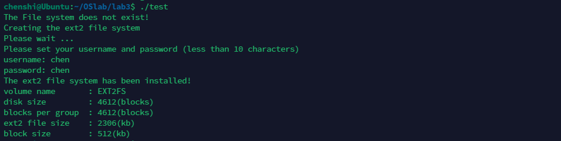
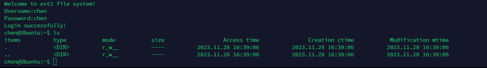
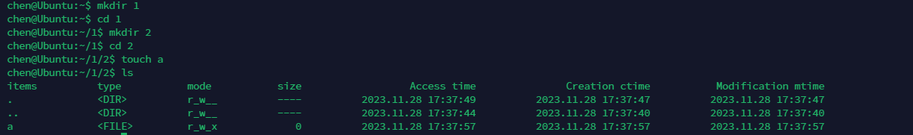
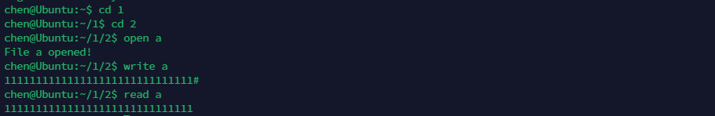
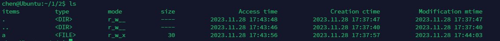
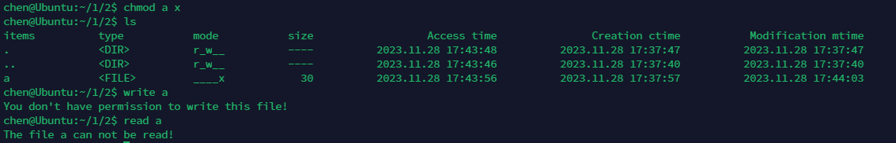
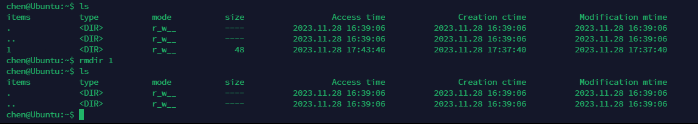
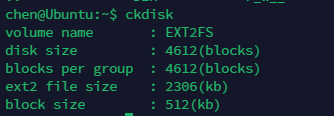

# <center>实验三--EXT2文件系统模拟</center>

## 一、实验目的

1. 为了进行简单的模拟，基于Ext2的思想和算法，设计一个类Ext2的文件系统，实现Ext2文件系统的一个功能子集。并且用现有操作系统上的文件来代替硬盘进行硬件模拟。 

## 二、实验内容

### 1. 定义类 EXT2 文件系统所需的数据结构，包括组描述符、索引结点和目录项。

1. 实验代码

    ```c
     #define VOLUME_NAME "EXT2FS"   // 卷名
     #define BLOCK_SIZE 512	       // 块大小
     #define DISK_SIZE 4612	   //磁盘总块数

     #define DISK_START 0	       // 磁盘开始地址
     #define SB_SIZE	128	           //超级块大小是128

     #define GD_SIZE	32	           // 块组描述符大小是32B
     #define GDT_START	(0+512)    // 块组描述符起始地址

     #define BLOCK_BITMAP (512+512) // 块位图起始地址
     #define INODE_BITMAP (1024+512)// inode 位图起始地址

     #define INODE_TABLE (1536+512) // 索引节点表起始地址 4*512
     #define INODE_SIZE 64	       // 每个inode的大小是64B
     #define INODE_TABLE_COUNTS	4096 // inode entry 数

     #define DATA_BLOCK (263680+512)	// 数据块起始地址 4*512+4096*64
     #define DATA_BLOCK_COUNTS	4096	// 数据块数

     #define BLOCKS_PER_GROUP	4612 // 每组中的块数

     #define USER_NAME "root" //用户名
     #define PASSWORD "123456" //密码

     struct super_block // 32 B
     {
         char sb_volume_name[16]; //文件系统名
         unsigned short sb_disk_size; //磁盘总大小
         unsigned short sb_blocks_per_group; // 每组中的块数
         unsigned short sb_size_per_block;	// 块大小
         char username[10]; //用户名
         char password[10]; //密码
     };

     struct group_desc // 32 B
     {
         char bg_volume_name[16]; //文件系统名
         unsigned short bg_block_bitmap; //块位图的起始块号
         unsigned short bg_inode_bitmap; //索引结点位图的起始块号
         unsigned short bg_inode_table; //索引结点表的起始块号
         unsigned short bg_free_blocks_count; //本组空闲块的个数
         unsigned short bg_free_inodes_count; //本组空闲索引结点的个数
         unsigned short bg_used_dirs_count; //组中分配给目录的结点数
         char bg_pad[4]; //填充(0xff)
     };
     struct inode // 64 B
     {
         unsigned short i_mode;   //文件类型及访问权限
         unsigned short i_blocks; //文件所占的数据块个数
         unsigned int i_size;    // 文件或目录大小(单位 byte)
         unsigned long i_atime;   //访问时间
         unsigned long i_ctime;   //创建时间
         unsigned long i_mtime;   //修改时间
         unsigned long i_dtime;   //删除时间
         unsigned short i_block[8]; //直接索引方式 指向数据块号
         char i_pad[8];           //填充(0xff)
     };
     struct dir_entry //16B
     {
         unsigned short inode; //索引节点号
         unsigned short rec_len; //目录项长度
         unsigned short name_len; //文件名长度
         char file_type; //文件类型(1 普通文件 2 目录.. )
         char name[9]; //文件名
     };

     static unsigned short last_alloc_inode; // 最近分配的节点号 */
    static unsigned short last_alloc_block; // 最近分配的数据块号 */
    static unsigned short current_dir;   // 当前目录的节点号 */

    static unsigned short current_dirlen; // 当前路径长度 */

    static short fopen_table[16]; // 文件打开表 */

    static struct super_block sb_block[1];	// 超级块缓冲区
    static struct group_desc gdt[1];	// 组描述符缓冲区
    static struct inode inode_area[1];  // inode缓冲区
    static unsigned char bitbuf[512]={0}; // 位图缓冲区
    static unsigned char ibuf[512]={0};
    static struct dir_entry dir[32];   // 目录项缓冲区 32*16=512
    static char Buffer[512];  // 针对数据块的缓冲区
    static char tempbuf[2*1024*1024];	// 文件写入缓冲区
    static FILE *fp;	// 虚拟磁盘指针


    extern char current_path[256];    // 当前路径名 */

    static unsigned long getCurrentTime();//得到当前时间
    static void update_super_block(void);   // 更新超级块内容
    static void reload_super_block(void);   //加载超级块内容
    static void update_group_desc(void);    //更新组描述符内容
    static void reload_group_desc(void);    //加载组描述符内容
    static void update_inode_entry(unsigned short i); //更新indoe表
    static void reload_inode_entry(unsigned short i); //加载inode表
    static void update_block_bitmap(void);  //更新块位图
    static void reload_block_bitmap(void);  //加载块位图
    static void update_inode_bitmap(void);  //更新inode位图
    static void reload_inode_bitmap(void);  //加载inode位图
    static void update_dir(unsigned short i);//更新目录
    static void reload_dir(unsigned short i);//加载目录
    static void update_block(unsigned short i);//更新数据块
    static void reload_block(unsigned short i);//加载数据库
    static int alloc_block(void);//分配数据块
    static int get_inode(void); //得到inode节点
    static unsigned short reserch_file(char tmp[9],int file_type,unsigned short *inode_num,unsigned short *block_num,unsigned short *dir_num);//查找文件
    static void dir_prepare(unsigned short tmp,unsigned short len,int type);
    static void remove_block(unsigned short del_num);//删除数据块
    static void remove_inode(unsigned short del_num);//删除inode节点
    static unsigned short search_file(unsigned short Ino);//在打开文件表中查找是否已打开文件
    static void sleep(int k);
    static void initialize_disk(void);//初始化磁盘
    ```

2. define部分：定义了一些常量，如磁盘大小、块大小、磁盘起始地址等。
3. super_block：超级块，用于存储文件系统的信息，如文件系统名、磁盘总大小、块大小，用户名和密码。
4. group_desc：块组描述符，用于存储块位图的起始块号、索引结点位图的起始块号、索引结点表的起始块号、本组空闲块的个数、本组空闲索引结点的个数、组中分配给目录的结点数。
5. inode：索引结点，用于存储文件的信息，如文件类型及访问权限、文件所占的数据块个数、文件或目录大小、访问时间、创建时间、修改时间、删除时间、直接索引方式 指向数据块号。
6. dir_entry：目录项，用于存储目录的信息，如索引节点号、目录项长度、文件名长度、文件类型、文件名。

7. 定义了一批全局变量，如最近分配的节点号、最近分配的数据块号、当前目录的节点号、当前路径长度、文件打开表、超级块缓冲区、组描述符缓冲区、inode缓冲区、位图缓冲区、目录项缓冲区、针对数据块的缓冲区、文件写入缓冲区、虚拟磁盘指针、当前路径名。
8. ==为了方便从文件中读取数据，定义了很多缓冲区，如超级块缓冲区、组描述符缓冲区、inode缓冲区、位图缓冲区、目录项缓冲区、针对数据块的缓冲区、文件写入缓冲区。==

### 2. 实现底层函数，包括分配数据块等 操作。

#### 1. 文件系统各部分的读写

1. 实验代码

    ```c
    static void update_super_block(void) //写超级块
    {
        fp=fopen("./Ext2","r+");
        fseek(fp,DISK_START,SEEK_SET);
        fwrite(sb_block,SB_SIZE,1,fp);
        fflush(fp); //立刻将缓冲区的内容输出，保证磁盘内存数据的一致性
    }

    static void reload_super_block(void) //读超级块
    {
        fseek(fp,DISK_START,SEEK_SET);
        fread(sb_block,SB_SIZE,1,fp);//读取内容到超级块缓冲区中
    }
    ```

2. 以超级块为例，通过fopen打开文件，然后通过fseek定位到超级块的位置，再通过fwrite写入超级块缓冲区的内容，最后通过fflush立刻将缓冲区的内容输出，保证磁盘内存数据的一致性。

#### 2. 分配数据块与inode节点

1. 实验代码

    ```c
    static int alloc_block(void) // 分配一个数据块,返回数据块号
    {
        unsigned short cur=last_alloc_block;
        //printf("cur: %d\n",cur);
        unsigned char con=128; // 1000 0000b
        int flag=0;
        if(gdt[0].bg_free_blocks_count==0)
        {
            printf("There is no block to be alloced!\n");
            return(0);
        }
        reload_block_bitmap();
        cur/=8;
        while(bitbuf[cur]==255)//该字节的8个bit都已有数据
        {
            if(cur==511)cur=0; //最后一个字节也已经满，从头开始寻找
            else cur++;
        }
        while(bitbuf[cur]&con) //在一个字节中找具体的某一个bit
        {
            con=con/2;
            flag++;
        }
        bitbuf[cur]=bitbuf[cur]+con;
        last_alloc_block=cur*8+flag;

        update_block_bitmap();
        gdt[0].bg_free_blocks_count--;
        update_group_desc();
        return last_alloc_block;
    }
    ```

2. 实现思路：记录最近分配的数据块号，然后从这个数据块号开始，从位图循环中寻找空闲的数据块，找到后将该数据块置为1，然后更新位图，最后更新组描述符中的空闲块个数

#### 3. 释放数据块与inode节点

1. 实验代码

    ```c
    static void remove_block(unsigned short del_num)
    {
        unsigned short tmp;
        tmp=del_num/8;
        reload_block_bitmap();
        switch(del_num%8) // 更新block位图 将具体的位置为0
        {
            case 0:bitbuf[tmp]=bitbuf[tmp]&127;break; 
            case 1:bitbuf[tmp]=bitbuf[tmp]&191;break; 
            case 2:bitbuf[tmp]=bitbuf[tmp]&223;break; 
            case 3:bitbuf[tmp]=bitbuf[tmp]&239;break; 
            case 4:bitbuf[tmp]=bitbuf[tmp]&247;break; 
            case 5:bitbuf[tmp]=bitbuf[tmp]&251;break; 
            case 6:bitbuf[tmp]=bitbuf[tmp]&253;break; 
            case 7:bitbuf[tmp]=bitbuf[tmp]&254;break; 
        }
        update_block_bitmap();
        gdt[0].bg_free_blocks_count++;
        update_group_desc();
    }
    ```

2. 实现思路：通过位图找到要释放的数据块，然后将该数据块置为0，最后更新组描述符中的空闲块个数

#### 4. 初始化磁盘和文件系统

1. 初始化磁盘，在当前目录下创建一个名为Ext2的文件，然后将其大小设置为2MB，将各部分内容设置为初始化状态，即格式化。
2. 初始化文件系统：读取Ext2文件，然后将各部分内容读取到缓冲区中。

### 3. 命令行函数

1. cd命令：切换当前目录，实现思路：通过reserch_file函数查找目录，然后将当前目录的节点号设置为该目录的节点号，最后将当前路径名设置为该目录的路径名。
2. ls命令：显示当前目录下的文件和目录，实现思路：通过reserch_file函数查找目录，然后通过reload_dir函数将目录项读取到目录项缓冲区中，最后通过遍历目录项缓冲区，将目录项的文件名输出
3. mkdir命令：创建目录，实现思路：通过reserch_file函数查找目录，然后通过alloc_block函数分配一个数据块，通过get_inode函数得到一个inode节点，然后将该目录的信息写入到该inode节点中，最后将该目录的信息写入到该数据块中。
4. touch命令：创建文件，实现思路：通过reserch_file函数查找目录，然后通过alloc_block函数分配一个数据块，通过get_inode函数得到一个inode节点，然后将该文件的信息写入到该inode节点中。
5. rm命令：删除文件或目录，实现思路：通过reserch_file函数查找文件或目录，然后通过remove_block函数释放该文件或目录的数据块，通过remove_inode函数释放该文件或目录的inode节点。
6. ==write命令：写文件，实现思路：先通过循环使用getchar函数从键盘读取字符，然后将读取到的字符写入到文件写入缓冲区中，知道读取到#为止，然后根据文件大小，判断是否需要使用一级索引或二级索引，最后将文件写入缓冲区中的内容写入到文件中。==
   为了实现读写保护，在调用write函数时，会先读取该文件对应的inode节点，取i_mode的倒数第二位，如果为1，则说明该文件可写，否则不可写。

    ```c
    void write_file_111(char tem[9])
    {
        fflush(stdin);
        unsigned short flag,i,j,k,size=0,need_blocks;
        int length1,length2,length3;//1级写入，2级写入，3级写入
        length1=length2=length3=0;
        flag=reserch_file(tem,1,&i,&j,&k);
        if (flag){
            reload_inode_entry(i);
            inode_area[0].i_mtime=getCurrentTime();
            update_inode_entry(i);
            reload_group_desc();
            if(search_file(dir[k].inode)){
                reload_inode_entry(dir[k].inode);
                while(1)
                {
                    tempbuf[size]=getchar();
                    if(tempbuf[size]=='#')
                    {
                        tempbuf[size]='\0';
                        break;
                    }
                    if(size>=gdt->bg_free_blocks_count*512)//判断文件大小是否超过最大值，超过全部不写入
                    {
                        printf("Sorry,the max size of a file is %dKB!\n",gdt->bg_free_blocks_count/2);
                        printf("Write failed!\n");
                        return;
                    }
                    size++;
                }
                if (size<=6*512){
                    length1 = strlen(tempbuf);
                }else if (size<=12*512){
                    length1 = 6*512;
                }
                if(length1>0){           
                    need_blocks=length1/512;
                    if(length1%512)
                    {
                        need_blocks++;
                    }
                    int x = 0;
                    while (x <= need_blocks)
                    {
                        inode_area[0].i_block[x]=alloc_block();
                        reload_block(inode_area[0].i_block[x]);
                        memcpy(Buffer,tempbuf+x*BLOCK_SIZE,BLOCK_SIZE);
                        update_block(inode_area[0].i_block[x]);
                        x++;
                    }
                    if(inode_area[0].i_blocks>need_blocks)//清空剩下的块
                    {
                        while (x <= 6)
                        {
                            x++;
                            remove_block(inode_area[0].i_block[x]);
                        }
                    }
                }
                if (size > 6*512 && size <= 262*512){
                    length2 = size - 6*512;
                }else if (size > 262*512){
                    length2 = 256*512;
                }
                if (length2){//采用一级索引
                    need_blocks=length2/512;
                    if(length2%512)
                    {
                        need_blocks++;
                    }
                    inode_area[0].i_block[6]=alloc_block();
                    reload_block(inode_area[0].i_block[6]);
                    char index_1[512];         //一级索引
                    memcpy(index_1,Buffer,512);
                    int x;
                    for (x = 0; x < need_blocks; x++) // x代表写入的块数
                    {
                        unsigned short block_index_temp = alloc_block();
                        unsigned short* target = (unsigned short*)(index_1 + sizeof(unsigned short) * x);
                        memcpy(target, &block_index_temp, sizeof(unsigned short));
                        reload_block(block_index_temp);
                        memcpy(Buffer,tempbuf+(x+6)*BLOCK_SIZE,BLOCK_SIZE);
                        update_block(block_index_temp);
                    }
                    if(inode_area[0].i_blocks-6>need_blocks)//清空剩下的块
                    {
                        while(x<=255){
                            unsigned short temp;
                            memcpy(&temp, &index_1[x * 2], sizeof(unsigned short));
                            remove_block(temp);
                            x++;
                        }
                    }
                    memcpy(Buffer,index_1,512);
                    update_block(inode_area[0].i_block[6]);//更新一级索引
                }
                if (size > 262*512 ){
                    length3 = size - 262*512;
                }
                if (length3 >0){
                    need_blocks=length3/512;
                    if(length3%512)
                    {
                        need_blocks++;
                    }
                    inode_area[0].i_block[7]=alloc_block();
                    unsigned short num_1 = need_blocks/256;
                    unsigned short num_2 = need_blocks%256;
                    reload_block(inode_area[0].i_block[7]);
                    char index_2[512];         //二级索引
                    memcpy(index_2,Buffer,512);
                    int x;
                    for (x = 0; x < num_1; x++) // x代表写入的块数
                    {
                        unsigned short block_index_temp = alloc_block();
                        unsigned short* target = (unsigned short*)(index_2 + sizeof(unsigned short) * x);
                        memcpy(target,&block_index_temp,sizeof(unsigned short));
                        reload_block(block_index_temp);
                        char index_1[512];         //一级索引
                        memcpy(index_1,Buffer,512);
                        int y;
                        for (y = 0; y < 256; y++) // y代表写入的块数
                        {
                            unsigned short block_index_temp = alloc_block();
                            unsigned short* target = (unsigned short*)(index_1 + sizeof(unsigned short) * y);
                            memcpy(target,&block_index_temp,sizeof(unsigned short));
                            reload_block(block_index_temp);
                            memcpy(Buffer,tempbuf+(x*256+y+262)*BLOCK_SIZE,BLOCK_SIZE);
                            update_block(block_index_temp);
                        }
                        memcpy(Buffer,index_1,512);
                        update_block(block_index_temp);
                    }
                    memcpy(Buffer,index_2,512);
                    update_block(inode_area[0].i_block[7]);//更新二级索引
                }
                inode_area[0].i_size=size;
                inode_area[0].i_blocks= size%512==0?size/512:size/512+1;
                update_inode_entry(dir[k].inode);
            }else {
                printf("The file %s has not opened!\n",tem);
            }
        }else{
            printf("The file %s does not exist!\n",tem);
        }
    }
    ```

7. ==read命令：读文件，实现思路：先通过reserch_file函数查找文件，然后根据文件大小，判断是否需要使用一级索引或二级索引，然后按数据块按字符输出。==
   为了实行读取保护，在调用读函数后，会先取该文件的inode节点，取i_mode的倒数第三位，只有在为1的时候读出

    ```c
    void read_file(char tmp[9])
    {
        unsigned short flag,i,j,k,t;
        unsigned short b1,b2,b3;
        b1=b2=b3=0;
        flag=reserch_file(tmp,1,&i,&j,&k);
        if(flag)
        {
            if(search_file(dir[k].inode)) //读文件的前提是该文件已经打开
            {
                reload_inode_entry(dir[k].inode);
                //判断是否有读的权限
                if(!(inode_area[0].i_mode&4)) // i_mode:111b:读,写,执行
                {
                    printf("The file %s can not be read!\n",tmp);
                    return;
                }
                //输出直接索引的内容
                if (inode_area[0].i_blocks<=6){
                    b1=inode_area[0].i_blocks;
                }else if (inode_area[0].i_blocks>6){
                    b1=6;
                }
                if (b1>0){
                    for(flag=0;flag<b1;flag++)
                    {
                        reload_block(inode_area[0].i_block[flag]);
                        for(t=0;t<inode_area[0].i_size-flag*512;++t)
                        {
                            printf("%c",Buffer[t]);
                        }
                    }
                }

                //输出一级索引的内容
                if(inode_area[0].i_blocks>6&&inode_area[0].i_blocks<=262)
                {
                    b2=inode_area[0].i_blocks-6;
                }else if (inode_area[0].i_blocks>262){
                    b2=256;
                }
                if (b2>0){
                    reload_block(inode_area[0].i_block[6]);
                    char index_1[512];
                    memcpy(index_1,Buffer,512);
                    for (flag = 0; flag < b2; flag++)
                    {
                        unsigned short block_num_1;
                        memcpy(&block_num_1, &index_1[flag * 2], sizeof(unsigned short));
                        reload_block(block_num_1);
                        for (t = 0; t < inode_area[0].i_size - (flag + 6) * 512; ++t)
                        {
                            printf("%c", Buffer[t]);
                        }
                    }
                }

                //输出二级索引的内容
                if(inode_area[0].i_blocks>262&&inode_area[0].i_blocks<=65818)
                {
                    b3=inode_area[0].i_blocks-262;  
                }

                if (b3>0){
                    reload_block(inode_area[0].i_block[7]);
                    char index_2[512];
                    memcpy(index_2,Buffer,512);
                    for (flag = 0; flag < b3; flag++)
                    {
                        unsigned short block_num_2;
                        memcpy(&block_num_2, &index_2[flag * 2], sizeof(unsigned short));
                        reload_block(block_num_2);
                        char index_3[512];
                        memcpy(index_3,Buffer,512);
                        for (t = 0; t < 256; t++)
                        {
                            unsigned short block_num_3;
                            memcpy(&block_num_3, &index_3[t * 2], sizeof(unsigned short));
                            reload_block(block_num_3);
                            for (int m = 0; m < inode_area[0].i_size - (flag + 262) * 512; ++m)
                            {
                                printf("%c", Buffer[m]);
                            }
                        }
                    }
                }


                if(inode_area[0].i_blocks==0)
                {
                    printf("The file %s is empty!\n",tmp);
                }
                else
                {
                    printf("\n");
                }
            }
            else
            {
                printf("The file %s has not been opened!\n",tmp);
            }
        }
        else printf("The file %s not exists!\n",tmp);
    }
   ```

8. open命令：打开文件，实现思路：先通过reserch_file函数查找文件，然后将该文件的inode节点号写入到文件打开表中
9. close命令：关闭文件，实现思路：先通过reserch_file函数查找文件，然后将该文件的inode节点号从文件打开表中删除
10. chmod命令：修改文件权限，实现思路：通过`i_mode & 0x0106 | 0babc`的方式修改文件权限.
11. help命令：显示帮助信息，实现思路：printf输出帮助信息
12. exit命令：退出文件系统，实现思路：通过exit(0)退出文件系统
13. format命令：格式化文件系统，实现思路：通过initialize_disk函数初始化磁盘，然后将各部分内容设置为初始化状态，即格式化

### 4. 完成 shell 的设计

1. 模仿Ubuntu的shell，实现思路：通过循环，不断读取用户输入的命令，然后通过strcmp函数判断用户输入的命令，然后调用相应的函数。

    ```c
    while(flag)
    {

        printf("%s$ ",current_path);
        scanf("%s",command);
        if(!strcmp(command,"cd")) //进入当前目录下
        {
            scanf("%s",temp);
            cd(temp);
        }
        else if(!strcmp(command,"mkdir"))  //创建目录
        {
            scanf("%s",temp);
            mkdir(temp,2);
        }
        else if(!strcmp(command,"touch"))    //创建文件
        {
            scanf("%s",temp);
            cat(temp,1);
        }

        else if(!strcmp(command,"rmdir"))  //删除空目录
        {
            scanf("%s",temp);
            rmdir(temp);
        }
        else if(!strcmp(command,"rm"))     //删除文件或目录，不提示
        {
            scanf("%s",temp);
            del(temp);
        }
        else if(!strcmp(command,"open"))    //打开一个文件
        {
            scanf("%s",temp);
            open_file(temp);
        }
        else if(!strcmp(command,"close"))   //关闭一个文件
        {
            scanf("%s",temp);
            close_file(temp);
        }
        else if(!strcmp(command,"read"))    //读一个文件
        {
            scanf("%s",temp);
            read_file(temp);
        }
        else if(!strcmp(command,"write"))   //写一个文件
        {
            scanf("%s",temp);
            write_file(temp);
        }
        else if(!strcmp(command,"ls"))      //显示当前目录
        {
        	ls();
        }
        else if(!strcmp(command,"reset"))    //显示帮助信息
        {
        	reset_password();
        }
        else if(!strcmp(command,"help"))    //显示帮助信息
        {
        	help();
        }
        else if(!strcmp(command,"chmod")) //修改文件权限
        {
            char mod[4];
        	scanf("%s",temp);
            scanf("%s",mod);
        	chmod(temp,mod);
        }
        else if(!strcmp(command,"format"))  //格式化硬盘
        {
            char tempch;
            printf("Format will erase all the data in the Disk\n");
            printf("Are you sure?y/n:\n");
            fflush(stdin);
            scanf(" %c",&tempch);
            if(tempch=='Y'||tempch=='y')
            {
                format();
            }
            else
            {
            	printf("Format Disk canceled\n");
            }
        }
        else if(!strcmp(command,"ckdisk"))  //检查硬盘
        {
        	check_disk();
        }
        else if(!strcmp(command,"quit"))    //退出系统
        {
        	break;
        }
        else {
            printf("No this Command,Please check!\n");
            printf("Type help to get more information\n");
            fflush(stdin);  //清空输入缓冲区
            continue;
        }
        getchar();
    }
    ```

## 三、实验结果

1. 初始化磁盘

    

    初始化磁盘后，设置了Username和Password，然后将其写入到超级块中，然后将各部分内容写入到磁盘中。

2. 登录

    

    使用正确的用户名和密码登录，登录成功。使用ls命令查看当前目录下的文件和目录，当前目录下有两个目录，分别是`.`和`..`，`.`表示当前目录，`..`表示上一级目录。
    默认权限是`r_w__`,即可读可写。其中可读指可以cd进入该目录，可写指可以在该目录下创建文件或目录。

3. 创建目录和文件，写文件

    

    

    

    由于a是无后缀的文件，所以默认为有可读可写可执行权限，写入后。使用ls命令查看当前目录下的文件和目录，可以看到a文件的大小为30Byte，权限为`rwx__`，Access Time为Open的时间，Modify Time为Write的时间，Create Time为Create的时间。

4. 验证读写保护

    

    通过chmod命令修改a文件的权限为`____x`，即不可读不可写可执行，然后使用read命令读取a文件，可以看到读取失败，因为没有读的权限。使用write命令写入a文件，可以看到写入失败。

5. 验证删除多级目录

    

    文件夹1下有文件夹为2，文件夹2下有文件a，然后使用rm命令删除文件夹1，可以看到删除成功，验证了删除多级目录的功能。

    

    使用ckdisk命令检查磁盘，可以看到磁盘信息与初始化磁盘时的信息一致，验证了删除多级目录后，磁盘信息得到了正确的更新，对应的inode节点和数据块也被释放。

## 四、实验总结

1. 通过本次实验，我对文件系统的实现有了更深的理解，对文件系统的各部分有了更深的认识，对文件系统的各部分的作用有了更深的理解。

