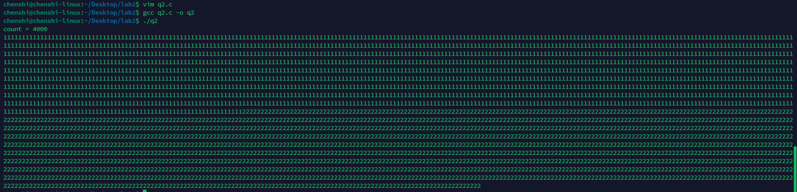

# <center>实验二 进程通信与内存管理</center>

## 2.1 进程的软中断通信

1. **实验代码**

    ```c
    #include <stdio.h>
    #include <unistd.h>
    #include <sys/wait.h>
    #include <stdlib.h>
    #include <signal.h>

    int flag = 0;
    pid_t pid1 = -1, pid2 = -1;

    void inter_handler(int signal) {
            flag++;
            printf("\n%d stop test\n\n",signal);
            if (flag==1&& printf("16 stop test\n")&& printf("17 stop test\n"))
            {
                kill(pid1, 16);
                kill(pid2, 17);
            }
        }

    void vv(){};

    void waiting() {
        alarm(5);
    }

    int main() {
        while (pid1 == -1) pid1 = fork();
        if (pid1 > 0) {
            while (pid2 == -1) pid2 = fork();
            if (pid2 > 0) {
                signal(SIGINT, inter_handler);
                signal(SIGQUIT, inter_handler);
                signal(SIGALRM, inter_handler);
                waiting();
                wait(NULL);
                wait(NULL);
                printf("\nParent process is killed!!\n");
            } else {
                signal(SIGQUIT, SIG_IGN);
                signal(SIGINT, SIG_IGN);
                signal(SIGALRM, SIG_IGN);
                signal(17,vv);
                pause();
                printf("\nChild process2 is killed by parent!!\n");
                return 0;
            }
        } else {
            signal(SIGQUIT, SIG_IGN);
            signal(SIGINT, SIG_IGN);
            signal(SIGALRM, SIG_IGN);
            signal(16,vv);
            pause();
            printf("\nChild process1 is killed by parent!!\n");
            return 0;
        }
        return 0;
    }

    ```

    **代码解析：**
    1. 函数`inter_handler`：当接收到`SIGINT`或`SIGQUIT`或`SIGALRM`信号时，分别向子进程1和子进程2发送16和17信号。flag用于判断是否是第一次接收到信号，如果是则向子进程发送信号，否则不发送信号。
    2. 函数`vv`：空函数，用于处理子进程接收到的信号。
    3. 函数`waiting`：设置5秒的定时器。5秒后向父进程发送`SIGALRM`信号。
    4. 主函数：创建两个子进程，父进程调用`waiting`函数设置定时器。为父进程接收到的信号设置处理函数`inter_handler`。为子进程接收到的信号设置处理函数`vv`。父进程等待两个子进程结束后，输出提示信息。子进程在没接到信号前通过`pause`函数挂起，接到信号后输出提示信息。
2. **实验结果**

    

    分别验证了等待5秒和输入`Ctrl+C`和`Ctrl+\`的情况，都实现了预期的效果。

## 2.2 进程的管道通信

### 有锁情况

1. **实验代码**

    ```c
    #include <unistd.h>
    #include <signal.h>
    #include <stdio.h>
    #include <stdlib.h> 
    #include <sys/wait.h>

    int pid1, pid2;
    int main()
    {
        int fd[2];
        char InPipe[8000];
        char c1 = '1', c2 = '2';
        pipe(fd);

        while ((pid1 = fork()) == -1);

        if (pid1 == 0)
        {
            close(fd[0]); // 关闭读管道，子进程 1 不需要读
            lockf(fd[1], 1, 0);
            for (int i = 0; i < 2000; i++) {
                write(fd[1], &c1, 1); // 向管道写入字符 '1'
            }
            sleep(5);
            lockf(fd[1], 0, 0);
            exit(0);
        }
        else
        {
            while ((pid2 = fork()) == -1);

            if (pid2 == 0)
            {
                close(fd[0]); // 关闭读管道，子进程 2 不需要读
                lockf(fd[1], 1, 0);
                for (int i = 0; i < 2000; i++) {
                    write(fd[1], &c2, 1); // 向管道写入字符 '2'
                }
                sleep(5);
                lockf(fd[1], 0, 0);
                exit(0);
            }
            else
            {
                close(fd[1]); // 关闭写管道，父进程不需要写

                waitpid(pid1, NULL, 0); // 等待子进程 1 结束
                waitpid(pid2, NULL, 0); // 等待子进程 2 结束

                int count = 0;
                while (read(fd[0], &InPipe[count], 1) > 0) {
                    count++;
                }
                InPipe[count] = '\0'; // 加字符串结束符
                printf("count = %d\n", count);
                printf("%s\n", InPipe);
                exit(0);
            }
        }
    }
    ```

    **代码解析：**
    1. 在main函数开始创建了一个管道，用于父子进程之间的通信。
    2. 创建两个子进程，子进程1向管道中写入2000个字符'1'，子进程2向管道中写入2000个字符'2'。
    3. 子进程在写入前会使用`lockf(fd[1], 1, 0);`函数对管道进行加锁，写入后通过`lockf(fd[1], 0, 0)`解锁。这样可以保证两个子进程写入的数据不会交叉。
    4. 父进程通过`waitpid`函数等待两个子进程结束后，从管道中读取数据并输出。

2. **实验结果**

    
    可以看到输出的`count`为4000，说明两个子进程都向管道中写入了2000个字符。输出的字符串中，字符'1'和字符'2'是分开的，说明两个子进程写入的数据没有交叉。

### 无锁情况

1. **实验代码**

    ```c
    #include <unistd.h>
    #include <signal.h>
    #include <stdio.h>
    #include <stdlib.h>
    #include <sys/wait.h>

    int pid1, pid2;

    int main() {
        int fd[2];
        char InPipe[1000];
        char c1 = '1', c2 = '2';
        pipe(fd);

        while ((pid1 = fork()) == -1);

        if (pid1 == 0) {
            close(fd[0]);
            for (int i = 0; i < 2000; i++) {
                write(fd[1], &c1, 1);
            }
            sleep(5);
            exit(0);
        }
        else {
            while ((pid2 = fork()) == -1);
            if (pid2 == 0) {
                close(fd[0]);
                for (int i = 0; i < 2000; i++) {
                    write(fd[1], &c2, 1);
                }
                sleep(5);
                exit(0);
            }
            else {
                close(fd[1]);
                waitpid(pid1, NULL, 0);
                waitpid(pid2, NULL, 0);
                int count = 0;
                while (read(fd[0], &InPipe[count], 1) > 0) {
                    count++;
                }
                InPipe[count] = '\0';
                printf("%s\n", InPipe);
                exit(0);
            }
        }
    }
    ```

    **代码解析：**
    1. 与有锁情况相比，只是去掉了加锁和解锁的代码。

2. **实验结果**

    

    可以看到输出的`count`为4000，说明两个子进程都向管道中写入了2000个字符，没有字符写入被吞。输出的字符串中，字符'1'和字符'2'是交叉的，说明两个子进程写入的数据交叉了。

## 2.3 内存的分配与回收

1. **实验代码**

    ```c
    #include <stdio.h>
    #include <stdlib.h>
    #include <string.h>
    #define PROCESS_NAME_LEN 32   /*进程名长度 */
    #define MIN_SLICE 10          /* 最小碎片的大小 */
    #define DEFAULT_MEM_SIZE 1024 /* 内存大小 */
    #define DEFAULT_MEM_START 0   /* 起始位置 */
    /* 内存分配算法 */
    #define MA_FF 1
    #define MA_BF 2
    #define MA_WF 3
    int mem_size = DEFAULT_MEM_SIZE; /* 内存大小 */
    int ma_algorithm = MA_FF;        /* 当前分配算法 */
    static int pid = 0;              /* 初始 pid */
    int flag = 0;                    /* 设置内存大小标志 */
    /* (1) 主要功能 */
    /*
    1 - Set memory size (default = 1024)
    2 - Select memory allocation algorithm
    3 - New process
    4 - Terminate a process
    5 - Display memory usage
    0 - Exit
    */

    /*(2) 主要数据结构 */
    /* 1） 内存空闲分区的描述 */
    /* 描述每一个空闲块的数据结构*/
    struct free_block_type
    {
        int size;
        int start_addr;
        struct free_block_type *next;
    };
    /* 指向内存中空闲块链表的首指针 */
    struct free_block_type*free_block;

    /*2） 描述已分配的内存块 */
    /* 每个进程分配到的内存块的描述*/
    struct allocated_block
    {
        int pid;
        int size;
        int start_addr;
        char process_name[PROCESS_NAME_LEN];
        struct allocated_block *next;
    };
    /* 进程分配内存块链表的首指针 */
    struct allocated_block*allocated_block_head = NULL;

    /*初始化空闲块，默认为一块，可以指定大小及起始地址*/
    struct free_block_type *init_free_block(int mem_size)
    {
        struct free_block_type*fb;
        fb = (struct free_block_type *)malloc(sizeof(struct free_block_type));
        if (fb == NULL)
        {
            printf("No mem\n");
            return NULL;
        }
        fb->size = mem_size;
        fb->start_addr = DEFAULT_MEM_START;
        fb->next = NULL;
        return fb;
    }

    /*显示菜单*/
    void display_menu()
    {
        printf("\n");
        printf("1 - Set memory size (default=%d)\n", DEFAULT_MEM_SIZE);
        printf("2 - Select memory allocation algorithm\n");
        printf("3 - New process\n");
        printf("4 - Terminate a process\n");
        printf("5 - Display memory usage\n");
        printf("0 - Exit\n");
    }

    /*设置内存的大小*/
    int set_mem_size()
    {
        int size;
        if (flag != 0)
        { // 防止重复设置
            printf("Cannot set memory size again\n");
            return 0;
        }
        printf("Total memory size =");
        scanf("%d", &size);
        char input;
        while ((input = getchar()) != '\n' && input != EOF)
        {
            // 读入一个字符后清空缓存区，避免\n被读入或者一次输入多个字符
        }
        if (size > 0)
        {
            mem_size = size;
            free_block->size = mem_size;
        }
        flag = 1;
        return 1;
    }

    // 所有的排序算法都采用插入排序，只需要修改比较的条件即可

    /*按 FF 算法重新整理内存空闲块链表*/
    void rearrange_FF()
    {
        if (free_block == NULL)
            return;
        struct free_block_type *current,*next, *temp;
        current = free_block;
        struct free_block_type*new_head = (struct free_block_type *)malloc(sizeof(struct free_block_type)); // 头结点dummy
        new_head->next = NULL;
        new_head->size = 0;
        new_head->start_addr = -1;
        while (current != NULL)
        {
            next = current->next;
            temp = new_head;
            while (temp->next != NULL)
            {
                if (temp->next->start_addr > current->start_addr)
                {
                    break;
                }
                temp = temp->next;
            }
            current->next = temp->next;
            temp->next = current;
            current = next;
        }
        free_block = new_head->next;
        free(new_head);
    }

    /*按 BF 算法重新整理内存空闲块链表*/
    void rearrange_BF()
    {
        if (free_block == NULL)
            return;
        struct free_block_type *current,*next, *temp;
        current = free_block;
        struct free_block_type*new_head = (struct free_block_type *)malloc(sizeof(struct free_block_type));
        new_head->next = NULL;
        new_head->size = 0;
        new_head->start_addr = -1;
        while (current != NULL)
        {
            next = current->next;
            temp = new_head;
            while (temp->next != NULL)
            {
                if (temp->next->size > current->size)
                {
                    break;
                }
                temp = temp->next;
            }
            current->next = temp->next;
            temp->next = current;
            current = next;
        }
        free_block = new_head->next;
        free(new_head);
    }

    /*按 WF 算法重新整理内存空闲块链表*/
    void rearrange_WF()
    {
        if (free_block == NULL)
            return;
        struct free_block_type *current,*next, *temp;
        current = free_block;
        struct free_block_type*new_head = (struct free_block_type *)malloc(sizeof(struct free_block_type));
        new_head->next = NULL;
        new_head->size = 10000000;
        new_head->start_addr = -1;
        while (current != NULL)
        {
            next = current->next;
            temp = new_head;
            while (temp->next != NULL)
            {
                if (temp->next->size < current->size)
                {
                    break;
                }
                temp = temp->next;
            }
            current->next = temp->next;
            temp->next = current;
            current = next;
        }
        free_block = new_head->next;
        free(new_head);
    }

    /*按指定算法重新整理内存空闲块链表*/
    void rearrange(int algorithm)
    {
        switch (algorithm)
        {
        case MA_FF:
            rearrange_FF();
            break;
        case MA_BF:
            rearrange_BF();
            break;
        case MA_WF:
            rearrange_WF();
            break;
        }
    }

    /*设置当前的分配算法 */
    void set_algorithm()
    {
        int algorithm;
        printf("\t1 - First Fit\n");
        printf("\t2 - Best Fit\n");
        printf("\t3 - Worst Fit\n");
        scanf("%d", &algorithm);
        char input;
        while ((input = getchar()) != '\n' && input != EOF)
        {
            // 读入一个字符后清空缓存区，避免\n被读入或者一次输入多个字符
        }
        if (algorithm >= 1 && algorithm <= 3)
            ma_algorithm = algorithm;
        /* 按指定算法重新排列空闲区链表*/
        rearrange(ma_algorithm);
    }

    //已分配内存空间按照起始地址排序
    void sort_allocated_block(){
        struct allocated_block *current,*next, *temp;
        current = allocated_block_head;
        struct allocated_block*new_head = (struct allocated_block *)malloc(sizeof(struct allocated_block));
        new_head->next = NULL;
        new_head->size = 0;
        new_head->start_addr = -1;
        while (current != NULL)
        {
            next = current->next;
            temp = new_head;
            while (temp->next != NULL)
            {
                if (temp->next->start_addr > current->start_addr)
                {
                    break;
                }
                temp = temp->next;
            }
            current->next = temp->next;
            temp->next = current;
            current = next;
        }
        allocated_block_head = new_head->next;
        free(new_head);
    }

    /*分配内存模块*/
    int  allocate_mem(struct allocated_block *ab)
    {
        struct free_block_type*fbt, *pre;
        int request_size = ab->size;
        fbt = pre = free_block;
        if (free_block == NULL)
        {
            return -1;
        }

        // 根据当前算法在空闲分区链表中搜索合适的空闲分区进行分配
        // 分配时需要考虑多种情况，如分割、合并、内存紧缩等
        // 1. 找到可满足空闲分区且分配后剩余空间足够大，则分割
        // 2. 找到可满足空闲分区且但分配后剩余空间比较小，则一起分配
        // 3. 找不可满足需要的空闲分区但空闲分区之和能满足需要，则采用内存紧缩技术，
        // 进行空闲分区的合并，然后再分配
        // 4. 在成功分配内存后，应保持空闲分区按照相应算法有序
        // 5. 分配成功则返回 1，否则返回 -1
        // 请自行补充实现...

        // 找到第一个满足要求的空闲分区
        while (fbt != NULL)
        {
            if (fbt->size >= request_size)
            {
                break;
            }
            pre = fbt;
            fbt = fbt->next;
        }
        // 没找到，则合并空闲分区后再找
        if (fbt == NULL)
        {
            int rest = 0;
            fbt = free_block;
            while (fbt != NULL) {
                rest += fbt->size;
                fbt = fbt->next;
            
            }
            if(rest < request_size) {
                return -1;
            }else {
                sort_allocated_block();
                struct allocated_block* abt=allocated_block_head;
                int prev=0;
                while(abt!=NULL){
                    abt->start_addr=prev;
                    prev=prev+abt->size;
                    abt=abt->next;
                }
                //释放所有空闲分区
                fbt = free_block->next;
                while (fbt != NULL)
                {
                    pre = fbt;
                    fbt = fbt->next;
                    free(pre);
                }
                free_block->size = mem_size-prev;
                free_block->start_addr = prev;
                free_block->next = NULL;
                
            }
            fbt = free_block;
        }
        // 找到了，分配
        if (fbt->size - request_size > MIN_SLICE)
        {
            ab->start_addr = fbt->start_addr;
            ab->size = request_size;
            fbt->start_addr += request_size;
            fbt->size -= request_size;
        }
        else
        {
            ab->start_addr = fbt->start_addr;
            ab->size = fbt->size;
            if (fbt == free_block)
            {
                free_block = fbt->next;
            }
            else
            {
                pre->next = fbt->next;
            }
            free(fbt);
        }
        return 1;
    }

    /*创建新的进程，主要是获取内存的申请数量*/
    int new_process()
    {
        struct allocated_block *ab;
        int size;
        int ret;
        ab = (struct allocated_block *)malloc(sizeof(struct allocated_block));
        if (!ab)
            exit(-5);
        ab->next = NULL;
        pid++;
        sprintf(ab->process_name, "PROCESS-%02d", pid);
        ab->pid = pid;
        printf("Memory for %s:", ab->process_name);
        scanf("%d", &size);
        char input;
        while ((input = getchar()) != '\n' && input != EOF)
        {
            // 读入一个字符后清空缓存区，避免\n被读入或者一次输入多个字符
        }
        if (size > 0)
            ab->size = size;
        ret = allocate_mem(ab); /* 从空闲区分配内存， ret==1 表示分配 ok*/

        /* 如果此时 allocated_block_head 尚未赋值，则赋值 */
        if ((ret == 1) && (allocated_block_head == NULL))
        {
            allocated_block_head = ab;
            return 1;
        }
        /* 分配成功，将该已分配块的描述插入已分配链表 */
        else if (ret == 1)
        {
            ab->next = allocated_block_head;
            allocated_block_head = ab;
            return 2;
        }
        else if (ret == -1)
        {
            /* 分配不成功 */
            printf("Allocation fail\n");
            free(ab);
            return -1;
        }
        return 3;
    }

    /*根据pid查找内存块*/
    struct allocated_block *find_process(int pid)
    {
        struct allocated_block*ab = allocated_block_head;
        while (ab != NULL)
        {
            if (ab->pid == pid)
                break;
            ab = ab->next;
        }
        return ab;
    }

    /*将 ab 所表示的已分配区归还，并进行可能的合并*/
    int free_mem(struct allocated_block *ab)
    {
        int algorithm = ma_algorithm;
        struct free_block_type*fbt, *pre,*work;

        // 进行可能的合并，基本策略如下
        // 1. 将新释放的结点插入到空闲分区队列末尾
        // 2. 对空闲链表按照地址有序排列
        // 3. 检查并合并相邻的空闲分区
        // 4. 将空闲链表重新按照当前算法排序
        // 请自行补充...

        //  头插法
        work = (struct free_block_type *)malloc(sizeof(struct free_block_type));
        if (work == NULL)
        {
            return -1;
        }

        work->start_addr = ab->start_addr;
        work->size = ab->size;
        work->next = free_block;
        free_block = work;

        rearrange_FF(free_block);
        fbt = free_block;
        while (fbt->next != NULL)
        {
            if (fbt->start_addr + fbt->size == fbt->next->start_addr)
            {
                struct free_block_type *temp = fbt->next;
                fbt->size += fbt->next->size;
                fbt->next = fbt->next->next;
                free(temp);
            }
            else
            {
                fbt = fbt->next;
            }
        }
        rearrange(ma_algorithm);

        return 1;
    }

    /*释放 ab 数据结构节点*/
    int dispose(struct allocated_block *free_ab)
    {
        struct allocated_block*pre, *ab;
        if (free_ab == allocated_block_head)
        { /* 如果要释放第一个节点 */
            allocated_block_head = allocated_block_head->next;
            free(free_ab);
            return 1;
        }
        pre = allocated_block_head;
        ab = allocated_block_head->next;
        while (ab != free_ab)
        {
            pre = ab;
            ab = ab->next;
        }
        pre->next = ab->next;
        free(ab);
        return 2;
    }

    /*删除进程，归还分配的存储空间，并删除描述该进程内存分配的节点*/
    void kill_process()
    {
        struct allocated_block *ab;
        int pid;
        printf("Kill Process, pid=");
        scanf("%d", &pid);
        char input;
        while ((input = getchar()) != '\n' && input != EOF)
        {
            // 读入一个字符后清空缓存区，避免\n被读入或者一次输入多个字符
        }
        ab = find_process(pid);
        if (ab != NULL)
        {
            free_mem(ab); /* 释放 ab 所表示的分配区 */
            dispose(ab);  /* 释放 ab 数据结构节点 */
        }
    }

    /*显示当前内存的使用情况，包括空闲区的情况和已经分配的情况*/
    int display_mem_usage()
    {
        struct free_block_type *fbt = free_block;
        struct allocated_block*ab = allocated_block_head;

        printf("----------------------------------------------------------\n");
        /* 显示空闲区 */
        printf("Free Memory:\n");
        printf("%20s %20s\n", "start_addr", "size");
        while (fbt != NULL)
        {
            printf("%20d %20d\n", fbt->start_addr, fbt->size);
            fbt = fbt->next;
        }

        /* 显示已分配区 */
        printf("\nUsed Memory:\n");
        printf("%10s %20s %10s %10s\n", "PID", "ProcessName", "start_addr", "size");
        while (ab != NULL)
        {
            printf("%10d %20s %10d %10d\n", ab->pid, ab->process_name, ab->start_addr, ab->size);
            ab = ab->next;
        }
        printf("----------------------------------------------------------\n");
    }

    /*退出,释放所有链表*/

    void do_exit()
    {
        struct free_block_type *fbt = free_block;
        struct allocated_block*ab = allocated_block_head;
        while (fbt != NULL)
        {
            free_block = fbt->next;
            free(fbt);
            fbt = free_block;
        }
        while (ab != NULL)
        {
            allocated_block_head = ab->next;
            free(ab);
            ab = allocated_block_head;
        }
    }

    void tab(char choice)
    {
    }

    int main()
    {
        char choice, input;
        pid = 0;
        free_block = init_free_block(mem_size); // 初始化空闲区
        while (1)
        {
            display_menu(); // 显示菜单
            choice = getchar();
            while ((input = getchar()) != '\n' && input != EOF)
            {
                // 读入一个字符后清空缓存区，避免\n被读入或者一次输入多个字符
            }
            switch (choice)
            {
            case '1':
                set_mem_size();
                break; // 设置内存大小
            case '2':
                set_algorithm();
                flag = 1;
                break; // 设置算法
            case '3':
                new_process();
                flag = 1;
                break; // 创建新进程
            case '4':
                kill_process();
                flag = 1;
                break; // 删除进程
            case '5':
                display_mem_usage();
                flag = 1;
                break; // 显示内存使用
            case '0':
                do_exit();
                exit(0);
                /*释放链表并退出*/
            default:
                break;
            }
        }
        return 0;
    }
    ```

    1. 首先调整了一下代码的格式，将函数定义和实现放在了主函数前，同时发现了两个没有定义的函数`find_pid`和`do_exit`，于是将这两个函数的定义和实现补充了
    2. FF和BF和WF算法都是使用的插入排序，只需要修改比较的条件即可，分别比较的是起始地址、空闲块大小和空闲块大小
    3. 同时在所有的读入后加入了清空缓存区的代码，避免了回车键导致的一些重复显示问题
    4. 代码实质上和数据结构课的链表一致，维护了两个链表，分别表示空闲块和已分配块，每次分配和回收都会对空闲块链表进行重新排序，保证了空闲块链表的有序性

2. **实验结果**
    1. 设置内存空间为1024，采用Best Fit算法
    

    2. 设置了五个进程，每个进程分配空间为64
    

    3. 删除进程2和进程3，展示全部进程的内存分配情况，验证了内存回收的正确性
    

    4. 采用worst fit算法，分配一块空间为64的内存，如果实现正确，起始地址应该为320，经验证，实现正确
    
    5. 采用Best Fit算法，分配一块空间为64的内存，如果实现正确，起始地址应该为64，经验证，实现正确
    
    6. 采用First Fit算法，分配一块空间为64的内存，如果实现正确，起始地址应该为128，经验证，实现正确
    
    7. 验证内存紧缩的正确性，设置内存为1000，分配五个进程各占用200，释放进程1，3
    
    再新建进程6，分配300内存，会触发内存紧缩，释放所有空闲块，重新分配内存
    