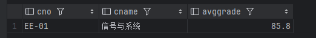
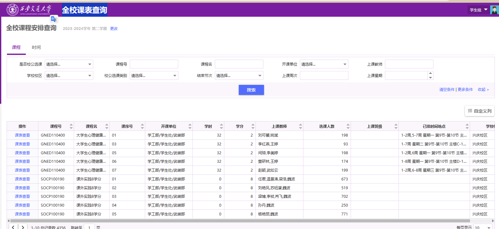

# 数据库实验

<center><font size = 4>计算机2101 陈实 2215015058</font></center>

## 实验平台

1. 操作系统：VMWare中安装的虚拟机openEuler 22.03
    
2. 数据库： openGauss 5.0
    
3. 数据库客户端：DataGrip+JDBC驱动

## 实验内容

### 第一题

 1. 创建DATABASE：MYDB

     ```sql
     CREATE DATABASE MYDB;
     ```

 2. 修改连接到MYDB

 3. 创建表格

     1. 对于学生表格S，观察可知**Sno为定长8位字符，且存在前导0，所以选择CHAR(8)类型**；Sname为变长字符，选择VARCHAR(30)类型；Sex为定长字符，选择CHAR(6)类型；Bdate为日期类型，选择DATE类型；Height为身高，选择DECIMAL(3,2)类型；Dorm为宿舍号，选择VARCHAR(20)类型。注意将Sno设置为主键。

        ```sql
        --S×××（S#，SNAME，SEX，BDATE，HEIGHT，DORM）
        CREATE TABLE S058 (
            Sno CHAR(8) NOT NULL PRIMARY KEY,
            Sname VARCHAR(30) NOT NULL,
            Sex VARCHAR(6),
            Bdate DATE,
            Height DECIMAL(3,2),
            Dorm VARCHAR(20)
        );
        ```

     2. 对于课程表格C，观察可知**Cno为定长5位字符,所以选择CHAR(5)类型**；Cname为变长字符，选择VARCHAR(100)类型；Period为学时，选择SMALLINT类型；Credit为学分，选择DECIMAL(3,1)类型；Teacher为教师名，选择VARCHAR(50)类型。将Cno设置为主键。

        ```sql
        --C×××（C#，CNAME，PERIOD，CREDIT，TEACHER）
        CREATE TABLE C058 (
            Cno CHAR(6) NOT NULL PRIMARY KEY,
            Cname VARCHAR(100) NOT NULL,
            Period SMALLINT,
            Credit DECIMAL(3,1),
            Teacher VARCHAR(50)
        );
        ```

     3. 对于选课表格SC，观察可知**Sno和Cno为外键**；Grade为成绩，范围为0-100，精确到小数点后一位，选择DECIMAL(4,1)类型。将Sno和Cno设置为联合主键，同时设置外键约束。

        ```sql
        --SC×××（S#，C#，GRADE）其中 S#、C#均为外键
        CREATE TABLE SC058 (
            Sno CHAR(8) NOT NULL,
            Cno CHAR(6) NOT NULL,
            Grade DECIMAL(4,1),
            PRIMARY KEY (Sno, Cno),
            FOREIGN KEY (Sno) REFERENCES S058(Sno),
            FOREIGN KEY (Cno) REFERENCES C058(Cno)
        );
        ```

     运行结果：
         

### 第二题

1. 插入数据

    ```sql
    INSERT INTO S058 VALUES ('01032010', '王涛', '男', '2003-4-5', 1.72, '东6舍221'),
    ('01032023', '孙文', '男', '2004-6-10', 1.80, '东6舍221'),
    ('01032001', '张晓梅', '女', '2004-11-17', 1.58, '东1舍312'),
    ('01032005', '刘静', '女', '2003-1-10', 1.63, '东1舍312'),
    ('01032112', '董蔚', '男', '2003-2-20', 1.71, '东6舍221'),
    ('03031011', '王倩', '女', '2004-12-20', 1.66, '东2舍104'),
    ('03031014', '赵思扬', '男', '2002-6-6', 1.85, '东18舍421'),
    ('03031051', '周剑', '男', '2002-5-8', 1.68, '东18舍422'),
    ('03031009', '田菲', '女', '2003-8-11', 1.60, '东2舍104'),
    ('03031033', '蔡明明', '男', '2003-3-12', 1.75, '东18舍423'),
    ('03031056', '曹子衿', '女', '2004-12-15', 1.65, '东2舍305');
    ```

    

    ```sql
    INSERT INTO C058 VALUES
    ('CS-01', '数据结构', 60, 3, '张军'),
    ('CS-02', '计算机组成原理', 80, 4, '王亚伟'),
    ('CS-04', '人工智能', 40, 2, '李蕾'),
    ('CS-05', '深度学习', 40, 2, '崔昀'),
    ('EE-01', '信号与系统', 60, 3, '张明'),
    ('EE-02', '数字逻辑电路', 100, 5, '胡海东'),
    ('EE-03', '光电子学与光子学', 40, 2, '石韬');
    ```

    

    ```sql
    INSERT INTO SC058 VALUES
    ('01032010', 'CS-01', 82.0),
    ('01032010', 'CS-02', 91.0),
    ('01032010', 'CS-04', 83.5),
    ('01032001', 'CS-01', 77.5),
    ('01032001', 'CS-02', 85.0),
    ('01032001', 'CS-04', 83.0),
    ('01032005', 'CS-01', 62.0),
    ('01032005', 'CS-02', 77.0),
    ('01032005', 'CS-04', 82.0),
    ('01032023', 'CS-01', 55.0),
    ('01032023', 'CS-02', 81.0),
    ('01032023', 'CS-04', 76.0),
    ('01032112', 'CS-01', 88.0),
    ('01032112', 'CS-02', 91.5),
    ('01032112', 'CS-04', 86.0),
    ('01032112', 'CS-05', NULL),
    ('03031033', 'EE-01', 93.0),
    ('03031033', 'EE-02', 89.0),
    ('03031009', 'EE-01', 88.0),
    ('03031009', 'EE-02', 78.5),
    ('03031011', 'EE-01', 91.0),
    ('03031011', 'EE-02', 86.0),
    ('03031051', 'EE-01', 78.0),
    ('03031051', 'EE-02', 58.0),
    ('03031014', 'EE-01', 79.0),
    ('03031014', 'EE-02', 71.0);
    
    ```

    

### 第三题

#### 第一小题

1. 查询电子工程系（EE）所开课程的课程编号、课程名称及学分数

    ```sql
    --查询电子工程系（EE）所开课程的课程编号、课程名称及学分数
    SELECT C058.Cno, C058.Cname, C058.Credit
    FROM C058
    WHERE C058.Cno LIKE 'EE%';
    ```

    

2. 查询未选修课程“CS-02”的女生学号及其已选各课程编号、成绩。

    ```sql
    --查询未选修课程“CS-02”的女生学号及其已选各课程编号、成绩。
    SELECT SC058.Sno, SC058.Cno, SC058.Grade
    FROM SC058
    WHERE SC058.Cno != 'CS-02' AND SC058.Sno IN (
        SELECT S058.Sno
        FROM S058
        WHERE S058.Sex = '女'
    ) ORDER BY SC058.Sno；
    ```

    

3. 查询 2002 年～2003 年出生学生的基本信息。

    ```sql
    --查询 2002 年～2003 年出生学生的基本信息。
    SELECT *
    FROM S058
    WHERE S058.Bdate BETWEEN '2002-01-01' AND '2003-12-31';
    ```

    

4. 查询每位学生的学号、学生姓名及其已选修课程的学分总数。

    ==本题应该考虑到部分同学没有选修任何课程，如果使用`WHERE S058.Sno = SC058.Sno AND C058.Cno = SC058.Cno`来进行连接，会导致没有选课的同学不会出现在查询结果中，所以应当使用做左连接来连接各个表。==同时使用COALESCE(SUM(C058.Credit), 0)来求和以及将NULL转化为0。

    ```sql
    --查询每位学生的学号、学生姓名及其已选修课程的学分总数。
    SELECT S058.Sno, S058.Sname, COALESCE(SUM(C058.Credit), 0) AS TotalCredits
    FROM S058
    LEFT JOIN SC058 ON S058.Sno = SC058.Sno  -- 左连接
    LEFT JOIN C058 ON SC058.Cno = C058.Cno  -- 左连接
    GROUP BY S058.Sno;
    ```
    
    

5. 查询选修课程“CS-01”的学生中成绩第二高的学生学号。

    明确成绩第二高的学生可能有多个，所以需要考虑是否需要返回多个学生的学号。找出第二高成绩，然后找出成绩等于第二高成绩的学生。

    ```sql
    --查询选修课程“CS-01”的学生中成绩第二高的学生学号。
    SELECT SC058.Sno
    FROM SC058
    WHERE SC058.Cno = 'CS-01' AND SC058.Grade = (
        SELECT MAX(SC058.Grade)
        FROM SC058
        WHERE SC058.Cno = 'CS-01' AND SC058.Grade < (
            SELECT MAX(SC058.Grade)
            FROM SC058
            WHERE SC058.Cno = 'CS-01'
        )
    );
    ```

    

6. 查询平均成绩超过“王涛“同学的学生学号、姓名和平均成绩，并按学号进行降序排列。

    ==由于王涛的姓名可能有多个，所以需要先查询出所有叫“王涛”的学生，然后让用户选择其中一个学生，再查询平均成绩超过该学生的学生。==

    下面给出一个Java程序来实现该功能。

    ```sql
    import java.sql.*;
    import java.util.Scanner;

    public class StudentGradeComparison {

        public static void main(String[] args) {
            String url = "jdbc:postgresql://127.0.0.1:7654/mydb";
            String username = "**********";     // 数据库用户名
            String password = "**********";     // 数据库密码

            // 查询所有叫“王涛”的学生
            String queryWangTao = "SELECT Sno, Sname FROM S058 WHERE Sname = '王涛'";

            try (Connection conn = DriverManager.getConnection(url, username, password);
                Statement stmt = conn.createStatement()) {

                // 执行查询，获取叫“王涛”的学生列表
                ResultSet rs = stmt.executeQuery(queryWangTao);

                System.out.println("以下是所有叫‘王涛’的学生：");
                while (rs.next()) {
                    System.out.println("学号: " + rs.getString("Sno") + ", 姓名: " + rs.getString("Sname"));
                }

                // 让用户输入学号指定学生
                Scanner scanner = new Scanner(System.in);
                System.out.print("请输入上面其中一个学生的学号: ");
                String selectedSno = scanner.nextLine();

                // 获取指定学生的平均成绩
                String queryAvgGrade = "SELECT AVG(Grade) as AvgGrade FROM SC058 WHERE Sno = '" + selectedSno + "'";
                ResultSet rsAvgGrade = stmt.executeQuery(queryAvgGrade);

                double selectedAvgGrade = 0.0;
                if (rsAvgGrade.next()) {
                    selectedAvgGrade = rsAvgGrade.getDouble("AvgGrade");
                    System.out.println("学号 " + selectedSno + " 的平均成绩是: " + selectedAvgGrade);
                }

                // 查询平均成绩超过指定学生的其他学生，并按学号降序排列
                String queryStudentsExceed = "SELECT S058.Sno, S058.Sname, AVG(SC058.Grade) as AvgGrade "
                        + "FROM SC058 INNER JOIN S058 ON SC058.Sno = S058.Sno "
                        + "GROUP BY S058.Sno, S058.Sname "
                        + "HAVING AVG(SC058.Grade) > " + selectedAvgGrade
                        + " ORDER BY S058.Sno DESC";

                ResultSet rsExceed = stmt.executeQuery(queryStudentsExceed);

                System.out.println("平均成绩超过 " + selectedSno + " 的学生：");
                while (rsExceed.next()) {
                    System.out.println("学号: " + rsExceed.getString("Sno") + ", 姓名: " + rsExceed.getString("Sname") + ", 平均成绩: " + rsExceed.getDouble("AvgGrade"));
                }

            } catch (SQLException e) {
                e.printStackTrace();
            }
        }
    }
    ```

    Java程序运行结果：

    

7. 查询选修了计算机专业全部课程（课程编号为“CS-××”）的学生姓名及已获得的学分总数。

    ```sql
    --查询选修了计算机专业全部课程（课程编号为“CS-××”）的学生姓名及已获得的学分总数。
    SELECT S058.Sname, SUM(C058.Credit) AS TotalCredits
    FROM S058
    LEFT JOIN SC058 ON S058.Sno = SC058.Sno
    LEFT JOIN C058 ON SC058.Cno = C058.Cno
    WHERE S058.Sno IN (SELECT S058.Sno
                    FROM S058
                    LEFT JOIN SC058 ON S058.Sno = SC058.Sno
                    LEFT JOIN C058 ON SC058.Cno = C058.Cno
                    WHERE C058.Cno LIKE 'CS-%'
                    GROUP BY S058.Sno
                    HAVING COUNT(distinct C058.Cno) = (SELECT COUNT(C058.Cno)
                                                        FROM C058
                                                        WHERE C058.Cno LIKE 'CS-%'))
    GROUP BY S058.Sno;
    ```

    最下层的子查询用于计算计算机专业的课程数量，然后在外层查询中使用HAVING子句来筛选选修了全部计算机专业课程的学生。最后使用SUM(C058.Credit)来计算学生的学分总数。

    本题值得注意的点：
    * 在检查学生是否选修了全部计算机专业课程时，应该使用distinct关键字来保证不会重复计算同一门课程。
    * 在计算获得的学分总数时，应该注意只有60分以上的课程才会计入学分总数。

    

8. 查询选修了 3 门以上课程（包括 3 门）的学生中平均成绩最高的同学学号及姓名。

    ```sql
    --查询选修了 3 门以上课程（包括 3 门）的学生中平均成绩最高的同学学号及姓名。
    SELECT SC058.Sno, S058.Sname
    FROM SC058
    LEFT JOIN S058 ON SC058.Sno = S058.Sno
    GROUP BY SC058.Sno, S058.Sname
    HAVING COUNT(SC058.Cno) >= 3
    ORDER BY AVG(SC058.Grade) DESC
    LIMIT 1;
    ```

    

#### 第二小题

1. 分别在 S×××和 C×××表中加入记录(‘01032005’，‘刘竞’，‘男’，‘2003-12-10’，1.75，‘东 14 舍 312’)及(‘CS-03’，“离散数学”，64，4，‘陈建明’)

    1. 在S×××表中加入记录(‘01032005’，‘刘竞’，‘男’，‘2003-12-10’，1.75，‘东 14 舍 312’)

        ```sql
        INSERT INTO S058 VALUES ('01032005', '刘竞', '男', '2003-12-10', 1.75, '东 14 舍 312');
        ```

        

        因为我们在创建表格时将Sno设置为主键，所以如果插入重复的学号会导致插入失败。

    2. 在C×××表中加入记录(‘CS-03’，“离散数学”，64，4，‘陈建明’)

        ```sql
        INSERT INTO C058 VALUES ('CS-03', '离散数学', 64, 4, '陈建明');
        ```

        CS-03作为主键没有重复，所以插入成功。

        

#### 第三小题

1. 将 S×××表中已修学分数大于 60 的学生记录删除。

    ```sql
    DELETE FROM S058
    WHERE S058.Sno IN (
        SELECT S058.Sno
        FROM S058
        LEFT JOIN SC058 ON S058.Sno = SC058.Sno
        LEFT JOIN C058 ON SC058.Cno = C058.Cno
        GROUP BY S058.Sno
        HAVING COALESCE(SUM(C058.Credit), 0) > 60
    );
    ```

    

    因为此时没有学生的学分总数大于60，所以删除操作不会影响任何记录。

#### 第四小题

1. 将“张明”老师负责的“信号与系统”课程的学时数调整为 64，同时增加一个学分。

    ```sql
    UPDATE C058
    SET Period = 64, Credit = Credit + 1
    WHERE C058.Cname = '信号与系统' AND C058.Teacher = '张明';
    ```

    

    查询此课程检查，确认修改正确

    ```sql
    SELECT * FROM C058 WHERE Cname = '信号与系统';
    ```

    

#### 第五小题

建立如下视图：

1. 居住在“东 18 舍”的男生视图，包括学号、姓名、出生日期、身高等属性。

    ```sql
    CREATE VIEW BOYS_IN_dom18 AS
    SELECT Sno, Sname, Bdate, Height
    FROM S058
    WHERE Dorm like '东18舍%' AND Sex = '男';
    ```

    


2. “张明”老师所开设课程情况的视图，包括课程编号、课程名称、平均成绩等属性。

    ```sql
    CREATE VIEW COURSES_BY_ZHANGMING AS
    SELECT C058.Cno, Cname, AVG(SC058.Grade) AS AvgGrade
    FROM C058
    LEFT JOIN SC058 ON C058.Cno = SC058.Cno
    WHERE C058.Teacher = '张明'
    GROUP BY C058.Cno, Cname
    ORDER BY C058.Cno;
    ```

    

3. 所有选修了“人工智能”课程的学生视图，包括学号、姓名、成绩等属性。

    ```sql
    CREATE VIEW STUDENTS_TAKING_AI AS
    SELECT S058.Sno, Sname, SC058.Grade
    FROM S058
    LEFT JOIN SC058 ON S058.Sno = SC058.Sno
    LEFT JOIN C058 ON SC058.Cno = C058.Cno
    WHERE C058.Cname = '人工智能';
    ```

    

### 第四题

1. Student数据来源：西安交通大学计算机学院官网：[2023年电信学部计算机科学与技术学院夏令营入营名单](http://www.cs.xjtu.edu.cn/info/1233/3149.htm)

    

    完整程序见附件1。下面简述思路：

    1. 使用requests库发送HTTP GET请求到指定URL，获取HTML内容。
    2. 使用正则表达式匹配学生名单。
    3. 将学生名单写入文件。

2. Course数据来源：西安交通大学本科教务平台：[全校课表查询](https://ehall.xjtu.edu.cn/jwapp/sys/kcbcx/*default/index.do?amp_sec_version_=1&gid_=dUE2NXAvSW5zU1g3T0FmWFg3MzNDSFVLQXJhMnBkZXVzK0wramY5YmVtRHZKeHJDNHQxNHprREFoelg1WEtQcUpucXFFV2NVTnNQK05sOFVlRWRQbnc9PQ&EMAP_LANG=zh&THEME=magenta#/qxkcb)

    

    完整程序见附件1。下面简述思路：

    1. 使用Selenium库打开本科教务平台。
    2. 输入学号和密码登录。
    3. 点击全校课表查询。
    4. 获取课程信息。
    5. 将课程信息写入文件。
    6. 数据清洗: 删除同名课程，只保留第一次出现的课程。

3. 将数据导入数据库

    1. 完整程序见附件2，下面的代码片段仅展示部分代码作为示例。
    2. 下面以插入学生数据为例，简述思路：

        1. 读取student_list.txt文件，将学生数据存储在2D数组中。
        2. 使用JDBC连接数据库。
        3. 使用预编译语句插入学生数据。
        4. 执行批量插入。
        5. 关闭连接.
    3. 具体程序给出了详细的注释说明
    
    ```java
    import java.io.BufferedReader;
    import java.io.FileReader;
    import java.io.IOException;
    import java.sql.*;
    import java.util.ArrayList;
    import java.util.Collections;
    import java.util.List;
    
    public class Database {
        public static List<String[]> readTxtTo2DArray(String filePath) throws IOException {
        }
        // 插入学生数据,根据len判断插入的数据量
        private static void insertStudentData(Connection conn, List<String[]> studentData) throws SQLException {
            // SQL插入语句模板
            String insertStudent = "INSERT INTO S058 (Sno, Sname, Sex, Bdate, Height,Dorm) VALUES (?, ?, ?, ?, ?, ?)";
            // 调用Connection的prepareStatement方法创建预编译语句对象。
            try (PreparedStatement pstmt = conn.prepareStatement(insertStudent)) {
                for (String[] row : studentData) {
                    // 设置参数 set+数据类型(参数位置, 参数值)
                    pstmt.setString(1, row[0]); // Sno
                    pstmt.setString(2, row[1]); // Sname
                    pstmt.setString(3, row[2]); // Sex
                    pstmt.setString(4, row[3]); // Bdate
                    pstmt.setDouble(5, Double.parseDouble(row[4])); // Height
                    pstmt.setString(6, row[5]); // Dorm
                    // 将预编译语句添加到批处理命令中
                    pstmt.addBatch();
                }
                pstmt.executeBatch(); // 执行批量插入
            }
        }
    
        // 插入课程数据
        //解析同上
        private static void insertCourseData(Connection conn, List<String[]> courseData) throws SQLException {
        }
    
        // 插入学生课程数据
        private static void insertStudentCourseData(Connection conn, List<String[]> studentCourseData) throws 
        }
    
        //随机删除SC表中成绩低于60分的项：筛选出成绩低于60分的学生，然后随机排序，删除前200个，主键为sno+cno
        public static void deleteSCData(Connection conn) throws SQLException {
        }
    
        //从user.txt中读取url,username,password
        public static String[] readUser() throws IOException {
        }
    
        public static void main(String[] args) {
            } catch (IOException e) {
                System.err.println("Error reading file: " + e.getMessage());
            } catch (SQLException | InterruptedException e) {
                System.err.println("Error: " + e.getMessage());
            }
        }
    
    }
    
    ```

    插入结果使用下面的SQL语句查询：

    ```sql
    SELECT COUNT(*) FROM S058;
    SELECT COUNT(*) FROM C058;
    SELECT COUNT(*) FROM SC058;
    ```

    结果依次为：
    
    
    

#### 重写前面的查询

1. 查询每位学生的学号、学生姓名及其已选修课程的学分总数。

    ```sql
    EXPLAIN SELECT S058.Sno, S058.Sname, COALESCE(SUM(C058.Credit), 0) AS TotalCredits
    FROM S058
    LEFT JOIN SC058 ON S058.Sno = SC058.Sno  -- 左连接
    LEFT JOIN C058 ON SC058.Cno = C058.Cno  -- 左连接
    GROUP BY S058.Sno;
    ```

    

    

    可以看到，开销最大的是HashAggregate，其次是Hash Left Join，最小的是Seq Scan on c058。原因是HashAggregate需要对结果进行分组，而Hash Left Join需要对两个表进行连接。

    **我们可以先计算学生的学分总数，然后再与学生表进行连接，这样可以减少连接的次数。**

    ```sql
    SELECT S058.Sno, S058.Sname, COALESCE(TotalCredits, 0) AS TotalCredits
    FROM S058
    LEFT JOIN (
        SELECT SC058.Sno, SUM(C058.Credit) AS TotalCredits
        FROM SC058
        LEFT JOIN C058 ON SC058.Cno = C058.Cno
        GROUP BY SC058.Sno
    ) AS SubQuery ON S058.Sno = SubQuery.Sno;
    ```

    
    

    

    可以看到，使用子查询的方法比原来的方法更快。

2. 查询选修课程“CS-01”的学生中成绩第二高的学生学号。

    ```sql
    EXPLAIN SELECT SC058.Sno
    FROM SC058
    WHERE SC058.Cno = 'CS-01' AND SC058.Grade = (
        SELECT MAX(SC058.Grade)
        FROM SC058
        WHERE SC058.Cno = 'CS-01' AND SC058.Grade < (
            SELECT MAX(SC058.Grade)
            FROM SC058
            WHERE SC058.Cno = 'CS-01'
        )
    );
    ```

    
    

    可以看到，最耗时的是Seq Scan on sc058，原因是需要对表进行扫描。

    下面给出一个优化的方法：使用窗口函数。此窗口函数的作用是对成绩进行排序，然后找出第二高的成绩。同分数的学生会被视为同一名次。
    这个优化的查询将计算选修课程数量和平均成绩的工作放在CTE中完成，然后在主查询中进行连接和排序，从而提高查询的效率和可读性。

    ```sql
    WITH RankedGrades AS (
    SELECT SC058.Sno, SC058.Cno, SC058.Grade,
           ROW_NUMBER() OVER (PARTITION BY SC058.Cno ORDER BY SC058.Grade DESC) AS Rank
    FROM SC058
    WHERE SC058.Cno = 'CS-08'
    )
    SELECT RankedGrades.Sno
    FROM RankedGrades
    WHERE RankedGrades.Cno = 'CS-08' AND RankedGrades.Rank = 2;
    ```

    

    可以看到，使用窗口函数的方法比原来的方法更快。

3. 查询选修了 3 门以上课程（包括 3 门）的学生中平均成绩最高的同学学
号及姓名。

    ```sql
    SELECT SC058.Sno, S058.Sname
    FROM SC058
    LEFT JOIN S058 ON SC058.Sno = S058.Sno
    GROUP BY SC058.Sno, S058.Sname
    HAVING COUNT(SC058.Cno) >= 3
    ORDER BY AVG(SC058.Grade) DESC
    LIMIT 1;
    ```

    
    

    为了优化这个查询，我们可以采取以下措施：

    减少连接次数：首先计算符合条件的学生，再进行连接，以避免不必要的连接操作。
    使用公用表表达式（CTE）：将计算部分分离出来，使主查询更简洁。

    ```sql
    WITH StudentCourseStats AS (
        SELECT SC058.Sno, COUNT(SC058.Cno) AS CourseCount, AVG(SC058.Grade) AS AvgGrade
        FROM SC058
        GROUP BY SC058.Sno
        HAVING COUNT(SC058.Cno) >= 3
    )
    SELECT S058.Sno, S058.Sname
    FROM StudentCourseStats
    JOIN S058 ON StudentCourseStats.Sno = S058.Sno
    ORDER BY StudentCourseStats.AvgGrade DESC
    LIMIT 1;
    ```

    

    可以看到，使用CTE的方法比原来的方法更快。

## 总结

1. 通过本次实验，我学会了如何使用OpenGauss数据库，以及如何使用SQL语言进行数据库操作。
2. 通过本次实验，我学会了如何使用JDBC连接数据库，以及如何使用Java程序进行数据库操作。
3. 通过本次实验，我学会了如何使用Selenium库进行网页爬虫，以及如何使用正则表达式进行数据提取。
4. 通过本次实验，我学会了如何使用使用JAVA进行多线程编程，以及如何使用多线程提高程序的效率。


## 附件

1. 第四题使用的爬虫程序：

    ```python
    import requests
    import re
    from selenium import webdriver
    from selenium.webdriver.common.by import By
    import time
    import os

    def get_html(url):
        # 发送HTTP GET请求到指定URL
        response = requests.get(url)
        # 检查请求是否成功
        if response.status_code == 200:
            return response.content.decode('utf-8')
        else:
            print(f"请求失败，状态码：{response.status_code}")
            return None

    def get_stu_list():
        # 数据来源：XJTU计算机学院夏令营优营班学生名单
        # 23年
        url = "http://www.cs.xjtu.edu.cn/info/1233/3149.htm"
        html = get_html(url)
        if html is None:
            return None
        content = re.findall(r'<span style="font-size:12.0pt;font-family:宋体;color:black">(.*?)</span></p></td>', html)
        # 22年
        url1 = "http://www.cs.xjtu.edu.cn/info/1233/2899.htm"
        html1 = get_html(url1)
        content += re.findall(r'<span style="font-size:12.0pt;font-family:宋体;color:black">(.*?)</span></p></td>', html1)
        # 20年
        url2 = "http://www.cs.xjtu.edu.cn/info/1233/2469.htm"
        html2 = get_html(url2)
        content += re.findall(
            r'<td width="105" nowrap height="27" style="border-top: none; border-left: none; border-bottom: 1px solid '
            r'black; border-right: 1px solid black; padding: 1px 1px 0px;"><p '
            r'style="text-align:center;vertical-align:middle"><span style="font-size:16px;font-family:宋体;color:black">('
            r'.*?)</span></p></td>',
            html2)
        url3 = "http://www.cs.xjtu.edu.cn/info/1233/2466.htm"
        html3 = get_html(url3)
        content += re.findall(
            r'<td nowrap height="33" style="border-top: none; border-left: none; border-bottom: 1px solid black; '
            r'border-right: 1px solid black; padding: 1px 1px 0px;"><p '
            r'style="text-align:center;vertical-align:middle"><span style="font-size:16px;font-family:宋体;color:black">('
            r'.*?)</span></p></td>',
            html3)
        # 删除三个表头
        content = content[3:]
        # 将content写入文件，如果文件存在则覆盖
        with open('student_list.txt', mode='w', encoding='utf-8') as f:
            for student in content:
                f.write(student + '\n')
        return content

    def get_course_list():
        if not os.path.exists('course_crawler.txt'):
            # 学号与密码
            NetID = '***********'
            password = '**********'
    
            # 创建WebDriver对象
            driver = webdriver.Edge()
    
            # 打开本科教务平台
            url = 'http://ehall.xjtu.edu.cn/new/index.html?browser=no'
            driver.get(url)
    
            # 点击登录
            login_button = driver.find_element(By.ID, 'ampHasNoLogin')
            login_button.click()
    
            # 输入学号和密码
            user_box = driver.find_element(By.NAME, 'username')
            password_box = driver.find_element(By.NAME, 'pwd')
            user_box.send_keys(NetID)
            password_box.send_keys(password)
    
            # 统一身份认证网关
            login_button = driver.find_element(By.CSS_SELECTOR, '.loginState > #account_login')
            driver.execute_script('arguments[0].click();', login_button)
    
            # 全校课表查询
            time.sleep(3)
            app_list = driver.find_element(By.CSS_SELECTOR, '.amp-aside-box-mini-item > .icon-liebiao1')
            driver.execute_script('arguments[0].click();', app_list)
            course_table = driver.find_element(By.CSS_SELECTOR, '.appFlag:nth-child(10) > .amp-str-cut')
            driver.execute_script('arguments[0].click();', course_table)
    
            # 切换页面
            new_window = driver.window_handles[-1]
            driver.switch_to.window(new_window)
    
            # 获取课程信息
            with open('course_crawler.txt', mode='w') as f:
                for i in range(400):
                    time.sleep(3)
                    for j in range(10):
                        cno1 = f'id("row{j}qxkcb-index-table")/TD[3]/SPAN[1]'
                        cno2 = f'id("row{j}qxkcb-index-table")/TD[5]/SPAN[1]'
                        cname = f'id("row{j}qxkcb-index-table")/TD[4]/SPAN[1]'
                        college = f'id("row{j}qxkcb-index-table")/TD[6]/SPAN[1]'
                        period = f'id("row{j}qxkcb-index-table")/TD[8]/SPAN[1]'
                        credit = f'id("row{j}qxkcb-index-table")/TD[9]/SPAN[1]'
                        teacher = f'id("row{j}qxkcb-index-table")/TD[10]/SPAN[1]'
                        f.write(driver.find_element(By.XPATH, cno1).get_attribute('title') + '; ')
                        f.write(driver.find_element(By.XPATH, cno2).get_attribute('title') + '; ')
                        f.write(driver.find_element(By.XPATH, cname).get_attribute('title') + '; ')
                        f.write(driver.find_element(By.XPATH, college).get_attribute('title') + '; ')
                        f.write(driver.find_element(By.XPATH, period).get_attribute('title') + '; ')
                        f.write(driver.find_element(By.XPATH, credit).get_attribute('title') + '; ')
                        f.write(driver.find_element(By.XPATH, teacher).get_attribute('title') + '\n')
                    next_page = driver.find_element(By.CSS_SELECTOR, '#pagerqxkcb-index-table .icon-keyboardarrowright')
                    driver.execute_script('arguments[0].click();', next_page)
    
            # 关闭浏览器
            driver.quit()
    
        # 数据清洗
        with open('course_crawler.txt', mode='r') as f:
            content = f.readlines()
        course_list = []
        for line in content:
            course = line.split('; ')
            course_list.append([course[2], course[4], course[5], course[6]])
        # 删除同名课程，只保留第一次出现的课程
        course_set = set()
        course_list_clean = []
        for course in course_list:
            if course[0] not in course_set:
                course_set.add(course[0])
                # 老师字段有多个时，只保留第一个老师，同时删除换行符
                course[3] = course[3].split(',')[0]
                course[3] = course[3].replace('\n', '')
                course_list_clean.append(course)
        # 将content写入文件，如果文件存在则覆盖
        with open('course_list.txt', mode='w', encoding='utf-8') as f:
            for course in course_list_clean:
                f.write(course[0] + '; ' + course[1] + '; ' + course[2] + '; ' + course[3] + '\n')
        return course_list_clean

    if __name__ == '__main__':
    
        students = get_stu_list()
        for i in range(10):
            print(students[i])
        course = get_course_list()
        for i in range(10):
            print(course[i])
    
    ```

2. 第四题使用的Java程序：

    ```java
    import java.io.BufferedReader;
    import java.io.FileReader;
    import java.io.IOException;
    import java.sql.*;
    import java.util.ArrayList;
    import java.util.Collections;
    import java.util.List;
    
    public class Database {
    
        // 读取txt文件，按行存储为二维数组
        public static List<String[]> readTxtTo2DArray(String filePath) throws IOException {
            //使用ArrayList来存储每行的数据
            List<String[]> data = new ArrayList<>();
            try (BufferedReader br = new BufferedReader(new FileReader(filePath))) {
                String line;
                // 逐行读取
                while ((line = br.readLine()) != null) {
                    // 以逗号为分隔符，将行拆分成数组
                    String[] values = line.split(",");
                    // 添加到二维数组
                    data.add(values);
                }
            }
            return data;
        }
    
        // 插入学生数据,根据len判断插入的数据量
        private static void insertStudentData(Connection conn, List<String[]> studentData) throws SQLException {
            // SQL插入语句模板
            String insertStudent = "INSERT INTO S058 (Sno, Sname, Sex, Bdate, Height,Dorm) VALUES (?, ?, ?, ?, ?, ?)";
            // 调用Connection的prepareStatement方法创建预编译语句对象。
            try (PreparedStatement pstmt = conn.prepareStatement(insertStudent)) {
                for (String[] row : studentData) {
                    // 设置参数 set+数据类型(参数位置, 参数值)
                    pstmt.setString(1, row[0]); // Sno
                    pstmt.setString(2, row[1]); // Sname
                    pstmt.setString(3, row[2]); // Sex
                    pstmt.setString(4, row[3]); // Bdate
                    pstmt.setDouble(5, Double.parseDouble(row[4])); // Height
                    pstmt.setString(6, row[5]); // Dorm
                    // 将预编译语句添加到批处理命令中
                    pstmt.addBatch();
                }
                pstmt.executeBatch(); // 执行批量插入
            }
        }
    
        // 插入课程数据
        //解析同上
        private static void insertCourseData(Connection conn, List<String[]> courseData) throws SQLException {
            String insertCourse = "INSERT INTO C058 (Cno, Cname, Period, Credit, Teacher) VALUES (?, ?, ?, ?, ?)";
            try (PreparedStatement pstmt = conn.prepareStatement(insertCourse)) {
                for (String[] row : courseData) {
                    pstmt.setString(1, row[0]); // Cno
                    pstmt.setString(2, row[1]); // CNAME
                    pstmt.setInt(3, Integer.parseInt(row[2])); // PERIOD
                    pstmt.setDouble(4, Double.parseDouble(row[3])); // CREDIT
                    pstmt.setString(5, row[4]); // TEACHER
                    pstmt.addBatch();
                }
                pstmt.executeBatch(); // 执行批量插入
            }
        }
    
        // 插入学生课程数据
        private static void insertStudentCourseData(Connection conn, List<String[]> studentCourseData) throws SQLException {
            String insertStudentCourse = "INSERT INTO SC058 (Sno, Cno, Grade) VALUES (?, ?, ?)";
            try (PreparedStatement pstmt = conn.prepareStatement(insertStudentCourse)) {
                for (String[] row : studentCourseData) {
                    pstmt.setString(1, row[0]); // Sno
                    pstmt.setString(2, row[1]); // Cno
                    pstmt.setDouble(3, Double.parseDouble(row[2])); // Grade
                    pstmt.addBatch();
                }
                pstmt.executeBatch(); // 执行批量插入
            }
        }
    
        //随机删除SC表中成绩低于60分的项：筛选出成绩低于60分的学生，然后随机排序，删除前200个，主键为sno+cno
        public static void deleteSCData(Connection conn) throws SQLException {
            String deleteSC = "DELETE FROM SC058 WHERE Sno = ? AND Cno = ?";
            String selectSC = "SELECT Sno, Cno FROM SC058 WHERE Grade < 60";
            try (PreparedStatement pstmt = conn.prepareStatement(deleteSC);
                PreparedStatement selectPstmt = conn.prepareStatement(selectSC)) {
                // 获取成绩低于60分的学生课程数据
                List<String[]> scData = new ArrayList<>();
                selectPstmt.execute();
                try (ResultSet rs = selectPstmt.getResultSet()) {
                    while (rs.next()) {
                        String[] row = new String[2];
                        row[0] = rs.getString(1);
                        row[1] = rs.getString(2);
                        scData.add(row);
                    }
                }
                // 随机排序
                Collections.shuffle(scData);
                // 删除前200个
                for (int i = 0; i < 200; i++) {
                    pstmt.setString(1, scData.get(i)[0]);
                    pstmt.setString(2, scData.get(i)[1]);
                    pstmt.addBatch();
                }
                pstmt.executeBatch();
            }
        }
    
        //从user.txt中读取url,username,password
        public static String[] readUser() throws IOException {
            String[] user = new String[3];
            try (BufferedReader br = new BufferedReader(new FileReader("./src/user.txt"))) {
                String line;
                int i = 0;
                while ((line = br.readLine()) != null) {
                    user[i] = line;
                    i++;
                }
            }
            return user;
        }
    
        public static void main(String[] args) {
            // 数据库连接信息
            String[] user = new String[3];
            try {
                user = readUser();
            } catch (IOException e) {
                System.err.println("Error reading user file: " + e.getMessage());
            }
            String url = user[0];  // 数据库URL
            String username = user[1];     // 数据库用户名
            String password = user[2];     // 数据库密码
    
            try (Connection conn = DriverManager.getConnection(url, username, password)) {
                // 读取数据
                List<String[]> studentData = readTxtTo2DArray("./src/S058.txt");
                List<String[]> courseData = readTxtTo2DArray("./src/C058.txt");
                List<String[]> studentCourseData = readTxtTo2DArray("./src/SC058.txt");
    
                // 创建多线程插入
                Thread thread1 = new Thread(() -> {
                    try {
                        insertStudentData(conn, studentData.subList(0, 2000));
                    } catch (SQLException e) {
                        System.err.println("Error inserting student data: " + e.getMessage());
                    }
                });
    
                Thread thread2 = new Thread(() -> {
                    try {
                        insertStudentData(conn, studentData.subList(2000, studentData.size()));
                    } catch (SQLException e) {
                        System.err.println("Error inserting student data: " + e.getMessage());
                    }
                });
    
                thread1.start();
                thread2.start();
    
                thread1.join(); // 等待线程1结束
                thread2.join(); // 等待线程2结束
    
                // 插入课程数据，双线程
                Thread thread8 = new Thread(() -> {
                    try {
                        insertCourseData(conn, courseData.subList(0, 700));
                    } catch (SQLException e) {
                        System.err.println("Error inserting course data: " + e.getMessage());
                    }
                });
                Thread thread9 = new Thread(() -> {
                    try {
                        insertCourseData(conn, courseData.subList(700, courseData.size()));
                    } catch (SQLException e) {
                        System.err.println("Error inserting course data: " + e.getMessage());
                    }
                });
    
                thread8.start();
                thread9.start();
    
                thread8.join();
                thread9.join();
    
                // 插入学生课程数据,5个线程,删除低于60分的学生数据，1个线程
                Thread thread3 = new Thread(() -> {
                    try {
                        insertStudentCourseData(conn, studentCourseData.subList(0, 50000));
                    } catch (SQLException e) {
                        System.err.println("Error inserting student course data: " + e.getMessage());
                    }
                });
                Thread thread4 = new Thread(() -> {
                    try {
                        insertStudentCourseData(conn, studentCourseData.subList(50000, 100000));
                    } catch (SQLException e) {
                        System.err.println("Error inserting student course data: " + e.getMessage());
                    }
                });
                Thread thread5 = new Thread(() -> {
                    try {
                        insertStudentCourseData(conn, studentCourseData.subList(100000, 150000));
                    } catch (SQLException e) {
                        System.err.println("Error inserting student course data: " + e.getMessage());
                    }
                });
                Thread thread6 = new Thread(() -> {
                    try {
                        insertStudentCourseData(conn, studentCourseData.subList(150000, 200000));
                    } catch (SQLException e) {
                        System.err.println("Error inserting student course data: " + e.getMessage());
                    }
                });
                Thread thread7 = new Thread(() -> {
                    try {
                        insertStudentCourseData(conn, studentCourseData.subList(200000, studentCourseData.size()));
                    } catch (SQLException e) {
                        System.err.println("Error inserting student course data: " + e.getMessage());
                    }
                });
    
                Thread thread10 = new Thread(() -> {
                    try {
                        deleteSCData(conn);
                    } catch (SQLException e) {
                        System.err.println("Error deleting student data: " + e.getMessage());
                   }
                });
    
                thread3.start();
                thread4.start();
                thread5.start();
                thread6.start();
                thread7.start();
                thread10.start();
    
                thread3.join();
                thread4.join();
                thread5.join();
                thread6.join();
                thread7.join();
                thread10.join();
    
                System.out.println("Data insertion complete.");
    
            } catch (IOException e) {
                System.err.println("Error reading file: " + e.getMessage());
            } catch (SQLException | InterruptedException e) {
                System.err.println("Error: " + e.getMessage());
            }
        }
    
    }
    
    ```