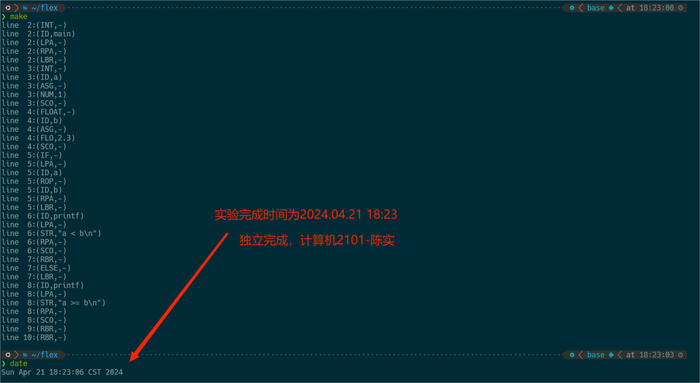

# 编译专题实验报告

<center><font size=5 >词法分析器</font></center>

<center><font size = 4>计算机2101 陈实</font></center>

<center><font size = 4>完成模式：独立完成</font></center>

## 实验平台

1. 操作系统：WSL2 Ubuntu 20.04
2. flex 版本：2.6.4
3. GCC 版本：11.4.0

## 实验目的

1. 目的：构建词法分析程序能将源语言程序作为输入，并输出词法记号串到文件中。
2. 功能：
    1. 单词设计包含主文法中所有词法单位；
    2. 一遍扫描或含预处理遍，能删除注解，并允许空白字符串作为分隔；
    3. 分析框架scanner()允许连续调用直到输入串被扫描完毕，每调用一次返回一个记号；
    4. 有联合DFA设计结果以及超前搜索功能；
    5. (可选)词法错误处理。

## 实验内容

1. flex 声明部分：

    ```c
    %option yylineno

    %{
            #include<stdio.h>
            #include<stdlib.h>
            #include<string.h>

        enum token{
            ID = 258,
            NUM = 259,
            FLO = 260,
            AAA = 261,
            ADD = 262,
            MUL = 263,
            ROP = 264,
            ASG = 265,
            LPA = 266,
            RPA = 267,
            LBK = 268,
            RBK = 269,
            LBR = 270,
            RBR = 271,
            CMA = 272,
            SCO = 273,
            INT = 274,
            FLOAT = 275,
            DOUBLE = 276,
            FOR = 277,
            IF = 278,
            ELSE = 279,
            WHILE = 280,
            RETURN = 281,
            INPUT = 282,
            PRINT = 283,
            VOID = 284,
            STRING = 285,
        };

        typedef union {
            char *str;
            int num;
            float flo;
        } YYSTYPE;

    %}
    ```

    1. 定义了词法记号的枚举类型，包括了主文法中的所有词法单位；
    2. 定义了 YYSTYPE 联合体，用于存储词法记号的值。
    3. 引入了头文件，声明了一些函数。
    4. 使用了 `%option yylineno` 选项，使得 flex 会在词法分析时记录行号。
    5. 使用了 `%{ ... %}` 语法，将 C 代码插入到生成的词法分析器中。

2. flex 正则式部分：

    ```c
    STR \"(\\.|[^\\"])*\"
    ID [a-z][a-z0-9]*
    NUM [+-]?[0-9]+
    FLO [+-]?([0-9]*\.[0-9]+|[0-9]+\.[0-9]*)
    AAA \+\+
    ADD "+"
    MUL "*"
    ROP ("=="|"<"|"<=")
    ASG "="
    LPA "("
    RPA ")"
    LBK "["
    RBK "]"
    LBR "{"
    RBR "}"
    CMA ","
    SCO ";"
    INT int
    FLOAT float
    DOUBLE double
    FOR for
    IF if
    ELSE else
    WHILE while
    RETURN return
    INPUT input
    PRINT print
    VOID void
    STRING string
    SINGLE_COMMENT \/\/[^\n]*
    MULTI_COMMENT \/\*([^*]|\*+[^/])*\*+\/
    ```

    1. 定义了正则式，用于识别源语言中的各种词法单位。
    2. 应该注意到，keyword会同时匹配到ID和keyword，因此需要在规则中进行判断
    3. 列举几个重要的正则式：
        1. ID：匹配一个以小写字母开头，后面跟着小写字母或数字的字符串。
        2. STR：匹配一个以双引号开头，双引号结尾的字符串。
        3. SINGLE_COMMENT：匹配一个以 `//` 开头的单行注释。
        4. MULTI_COMMENT：匹配一个以 `/*` 开头，`*/` 结尾的多行注释，`([^*]|\*+[^/])*` 详解：
           * (\[\^*])：表示单个非星号的字符。这意味着任何不包含星号的字符都可以匹配。
           * (*\+[\^/])：表示一个或多个星号后跟一个非斜杠的字符。这意味着，如果星号存在，必须有至少一个跟随的非斜杠字符。
           * ([\^\*]|\*+[\^/])：这个部分结合了两者的逻辑或。这意味着它可以匹配非星号的字符，或者一个或多个星号后跟非斜杠的字符。
           * ([\^]|\*+[\^/])：外面的星号表示上述模式可以重复零次或多次。这意味着这个正则表达式可以匹配任意长度的字符序列，前提是符合以上两个子部分的规则。

3. flex 规则部分：

    ```c
    {SINGLE_COMMENT} {}
    {MULTI_COMMENT} {}
    {STR} {printf("line %2d:(STR,%s)\n",yylineno,yytext);return STRING;}
    {INT} {printf("line %2d:(INT,-)\n",yylineno);return INT;}
    {FLOAT} {printf("line %2d:(FLOAT,-)\n",yylineno);return FLOAT;}
    {DOUBLE} {printf("line %2d:(DOUBLE,-)\n",yylineno);return DOUBLE;}
    {FOR} {printf("line %2d:(FOR,-)\n",yylineno);return FOR;}
    {IF} {printf("line %2d:(IF,-)\n",yylineno);return IF;}
    {ELSE} {printf("line %2d:(ELSE,-)\n",yylineno);return ELSE;}
    {WHILE} {printf("line %2d:(WHILE,-)\n",yylineno);return WHILE;}
    {RETURN} {printf("line %2d:(RETURN,-)\n",yylineno);return RETURN;}
    {INPUT} {printf("line %2d:(INPUT,-)\n",yylineno);return INPUT;}
    {PRINT} {printf("line %2d:(PRINT,-)\n",yylineno);return PRINT;}
    {VOID} {printf("line %2d:(VOID,-)\n",yylineno);return VOID;}
    {STRING} {printf("line %2d:(STRING,-)\n",yylineno);return STRING;}
    {ID} {printf("line %2d:(ID,%s)\n",yylineno,yytext);return ID;}
    {NUM} {printf("line %2d:(NUM,%s)\n",yylineno,yytext);return NUM;}
    {FLO} {printf("line %2d:(FLO,%s)\n",yylineno,yytext);return FLO;}
    {AAA} {printf("line %2d:(AAA,-)\n",yylineno);return AAA;}
    {ADD} {printf("line %2d:(ADD,-)\n",yylineno);return ADD;}
    {MUL} {printf("line %2d:(MUL,-)\n",yylineno);return MUL;}
    {ROP} {printf("line %2d:(ROP,-)\n",yylineno);return ROP;}
    {ASG} {printf("line %2d:(ASG,-)\n",yylineno);return ASG;}
    {LPA} {printf("line %2d:(LPA,-)\n",yylineno);return LPA;}
    {RPA} {printf("line %2d:(RPA,-)\n",yylineno);return RPA;}
    {LBK} {printf("line %2d:(LBK,-)\n",yylineno);return LBK;}
    {RBK} {printf("line %2d:(RBK,-)\n",yylineno);return RBK;}
    {LBR} {printf("line %2d:(LBR,-)\n",yylineno);return LBR;}
    {RBR} {printf("line %2d:(RBR,-)\n",yylineno);return RBR;}
    {CMA} {printf("line %2d:(CMA,-)\n",yylineno);return CMA;}
    {SCO} {printf("line %2d:(SCO,-)\n",yylineno);return SCO;}
    [ \t] {}
    \n {}

    ```

    1. 定义了规则，用于识别源语言中的各种词法单位。==当匹配到一个词法单位时，操作系统会执行对应的代码块，并返回对应的词法记号。==
    2. 正则匹配有多义性，flex对此有两个优先级规则：
        1. 匹配长度最长的最优先
        2. 当匹配长度相同时，按照规则的顺序匹配
    3. ==对于关键字，如 `int`，`float` 等，需要在规则，将其匹配规则放在ID之前，否则会被匹配为ID。==
    4. 为了实现处理的时候忽略空白字符，需要在规则中加入 `[ \t]` 和 `\n` 规则。同时将其置为空操作。
    5. 对于注释，需要在规则中加入对应的规则，将其置为空操作。

4. 主函数部分：

    ```c
    void yyerror(char *s) {
        fprintf(stderr, "%s\n", s);
    }

    void redirect_output_to_file(const char *filename) {
        FILE *file = freopen(filename, "w", stdout);
        if (file == NULL) {
            fprintf(stderr, "无法打开文件 %s\n", filename);
            exit(1);
        }
    }

    int main() {
        redirect_output_to_file("output.txt");
        while (yylex() != 0);
        return 0;
    }
    ```

    1. 定义了 `yyerror` 函数，用于处理词法错误。
    2. 定义了 `redirect_output_to_file` 函数，用于将输出重定向到文件：`output.txt`。
    3. 在 `main` 函数中，调用 `redirect_output_to_file` 函数，将输出重定向到文件，然后循环调用 `yylex` 函数，直到返回值为 0。
    4. 返回值为 0 时，表示词法分析结束，退出程序。
    5. 由于 `yylex` 函数会返回词法记号，因此在循环中，每次调用 `yylex` 函数，都会输出一个词法记号到文件中。
    6. 由于 `yylex` 函数返回值为 0 时，表示词法分析结束，因此循环结束，退出程序。

5. Makefile 文件：

    ```makefile
    ALL: lex.exe
    lex.exe: lex.yy.c
            @gcc -o $@ lex.yy.c -ll
            @./$@ < test.txt
            @rm -rf lex.yy.c lex.exe
            @cat output.txt

    lex.yy.c: lex.l
            @flex lex.l

    clean:
            @rm -rf lex.yy.c lex.exe output.txt
            @ls

    .PHONY: clean
    ```

    1. 定义了 `ALL` 目标，依赖于 `lex.exe` 目标。
    2. 定义了 `lex.exe` 目标，依赖于 `lex.yy.c` 文件。
    3. 在 `lex.exe` 目标中，使用 `gcc` 命令编译 `lex.yy.c` 文件，生成可执行文件 `lex.exe`，然后运行 `lex.exe`，将 `test.txt` 文件作为输入，将输出重定向到 `output.txt` 文件，最后删除 `lex.yy.c` 文件和 `lex.exe` 文件，输出 `output.txt` 文件。

## 实验结果

1. 测试文件：`test.txt`

    ```c
    //This is a test file
    int main() {
        int a = 1;
        float b = 2.3;
        if (a < b) {
            printf("a < b\n");
        } else {
            printf("a >= b\n");
        }
    }
    ```

2. 在命令行输入 `make` 命令，编译运行程序。

    

    ```txt
    line  2:(INT,-)
    line  2:(ID,main)
    line  2:(LPA,-)
    line  2:(RPA,-)
    line  2:(LBR,-)
    line  3:(INT,-)
    line  3:(ID,a)
    line  3:(ASG,-)
    line  3:(NUM,1)
    line  3:(SCO,-)
    line  4:(FLOAT,-)
    line  4:(ID,b)
    line  4:(ASG,-)
    line  4:(FLO,2.3)
    line  4:(SCO,-)
    line  5:(IF,-)
    line  5:(LPA,-)
    line  5:(ID,a)
    line  5:(ROP,-)
    line  5:(ID,b)
    line  5:(RPA,-)
    line  5:(LBR,-)
    line  6:(ID,printf)
    line  6:(LPA,-)
    line  6:(STR,"a < b\n")
    line  6:(RPA,-)
    line  6:(SCO,-)
    line  7:(RBR,-)
    line  7:(ELSE,-)
    line  7:(LBR,-)
    line  8:(ID,printf)
    line  8:(LPA,-)
    line  8:(STR,"a >= b\n")
    line  8:(RPA,-)
    line  8:(SCO,-)
    line  9:(RBR,-)
    line 10:(RBR,-)
    ```

3. 实验结果分析

    1. 能正确识别源语言中的各种词法单位。
    2. 能正确区分关键字和标识符。
    3. 能正确过滤注释。
    4. 能正确识别字符串。

## 实验总结

### 遇到的问题

1. 在编写正则式时，没有考虑到关键字和标识符的问题，导致关键字被匹配为ID。
   解决方法：将关键字的正则式放在ID之前。

2. Float的正则式写错，导致无法识别浮点数。
   解决方法：修改正则式。

3. 命令操作繁琐，需要手动编译运行。
   解决方法：编写Makefile文件，简化操作。

### 实验心得

1. 通过本次实验，我学会了使用 flex 工具编写词法分析器。
2. 了解了 flex 的基本用法，包括声明部分、正则式部分、规则部分。
3. 学会了使用 flex 编写正则式，识别源语言中的各种词法单位。
4. 学会了使用 Makefile 文件，简化编译运行操作。
5. 通过本次实验，我对词法分析有了更深入的了解，对编译原理有了更深刻的认识。

## 附录

1. 实验代码 lex.l

    ```c
    %option yylineno

    %{
            #include<stdio.h>
            #include<stdlib.h>
            #include<string.h>

        enum token{
            ID = 258,
            NUM = 259,
            FLO = 260,
            AAA = 261,
            ADD = 262,
            MUL = 263,
            ROP = 264,
            ASG = 265,
            LPA = 266,
            RPA = 267,
            LBK = 268,
            RBK = 269,
            LBR = 270,
            RBR = 271,
            CMA = 272,
            SCO = 273,
            INT = 274,
            FLOAT = 275,
            DOUBLE = 276,
            FOR = 277,
            IF = 278,
            ELSE = 279,
            WHILE = 280,
            RETURN = 281,
            INPUT = 282,
            PRINT = 283,
            VOID = 284,
            STRING = 285,
        };

        typedef union {
            char *str;
            int num;
            float flo;
        } YYSTYPE;

    %}

    YYSTYPE yylval;

    STR \"(\\.|[^\\"])*\"
    ID [a-z][a-z0-9]*
    NUM [+-]?[0-9]+
    FLO [+-]?([0-9]*\.[0-9]+|[0-9]+\.[0-9]*)
    AAA \+\+
    ADD "+"
    MUL "*"
    ROP ("=="|"<"|"<=")
    ASG "="
    LPA "("
    RPA ")"
    LBK "["
    RBK "]"
    LBR "{"
    RBR "}"
    CMA ","
    SCO ";"
    INT int
    FLOAT float
    DOUBLE double
    FOR for
    IF if
    ELSE else
    WHILE while
    RETURN return
    INPUT input
    PRINT print
    VOID void
    STRING string
    SINGLE_COMMENT \/\/[^\n]*
    MULTI_COMMENT \/\*([^*]|\*+[^/])*\*+\/

    %%
    {SINGLE_COMMENT} {}
    {MULTI_COMMENT} {}
    {STR} {printf("line %2d:(STR,%s)\n",yylineno,yytext);return STRING;}
    {INT} {printf("line %2d:(INT,-)\n",yylineno);return INT;}
    {FLOAT} {printf("line %2d:(FLOAT,-)\n",yylineno);return FLOAT;}
    {DOUBLE} {printf("line %2d:(DOUBLE,-)\n",yylineno);return DOUBLE;}
    {FOR} {printf("line %2d:(FOR,-)\n",yylineno);return FOR;}
    {IF} {printf("line %2d:(IF,-)\n",yylineno);return IF;}
    {ELSE} {printf("line %2d:(ELSE,-)\n",yylineno);return ELSE;}
    {WHILE} {printf("line %2d:(WHILE,-)\n",yylineno);return WHILE;}
    {RETURN} {printf("line %2d:(RETURN,-)\n",yylineno);return RETURN;}
    {INPUT} {printf("line %2d:(INPUT,-)\n",yylineno);return INPUT;}
    {PRINT} {printf("line %2d:(PRINT,-)\n",yylineno);return PRINT;}
    {VOID} {printf("line %2d:(VOID,-)\n",yylineno);return VOID;}
    {STRING} {printf("line %2d:(STRING,-)\n",yylineno);return STRING;}
    {ID} {printf("line %2d:(ID,%s)\n",yylineno,yytext);return ID;}
    {NUM} {printf("line %2d:(NUM,%s)\n",yylineno,yytext);return NUM;}
    {FLO} {printf("line %2d:(FLO,%s)\n",yylineno,yytext);return FLO;}
    {AAA} {printf("line %2d:(AAA,-)\n",yylineno);return AAA;}
    {ADD} {printf("line %2d:(ADD,-)\n",yylineno);return ADD;}
    {MUL} {printf("line %2d:(MUL,-)\n",yylineno);return MUL;}
    {ROP} {printf("line %2d:(ROP,-)\n",yylineno);return ROP;}
    {ASG} {printf("line %2d:(ASG,-)\n",yylineno);return ASG;}
    {LPA} {printf("line %2d:(LPA,-)\n",yylineno);return LPA;}
    {RPA} {printf("line %2d:(RPA,-)\n",yylineno);return RPA;}
    {LBK} {printf("line %2d:(LBK,-)\n",yylineno);return LBK;}
    {RBK} {printf("line %2d:(RBK,-)\n",yylineno);return RBK;}
    {LBR} {printf("line %2d:(LBR,-)\n",yylineno);return LBR;}
    {RBR} {printf("line %2d:(RBR,-)\n",yylineno);return RBR;}
    {CMA} {printf("line %2d:(CMA,-)\n",yylineno);return CMA;}
    {SCO} {printf("line %2d:(SCO,-)\n",yylineno);return SCO;}
    [ \t] {}
    \n {}

    %%

    void yyerror(char *s) {
        fprintf(stderr, "%s\n", s);
    }

    void redirect_output_to_file(const char *filename) {
        FILE *file = freopen(filename, "w", stdout);
        if (file == NULL) {
            fprintf(stderr, "无法打开文件 %s\n", filename);
            exit(1);
        }
    }

    int main() {
        redirect_output_to_file("output.txt");
        while (yylex() != 0);
        return 0;
    }
    int yywrap()
    {
            return 1;
    }
    ```

2. Makefile 文件: Makefile

    ```makefile
    ALL: lex.exe
    lex.exe: lex.yy.c
            @gcc -o $@ lex.yy.c -ll
            @./$@ < test.txt
            @rm -rf lex.yy.c lex.exe
            @cat output.txt

    lex.yy.c: lex.l
            @flex lex.l

    clean:
            @rm -rf lex.yy.c lex.exe output.txt
            @ls

    .PHONY: clean
    ```

3. 测试文件 test.txt

    ```c
    //This is a test file
    int main() {
        int a = 1;
        float b = 2.3;
        if (a < b) {
            printf("a < b\n");
        } else {
            printf("a >= b\n");
        }
    }
    ```


