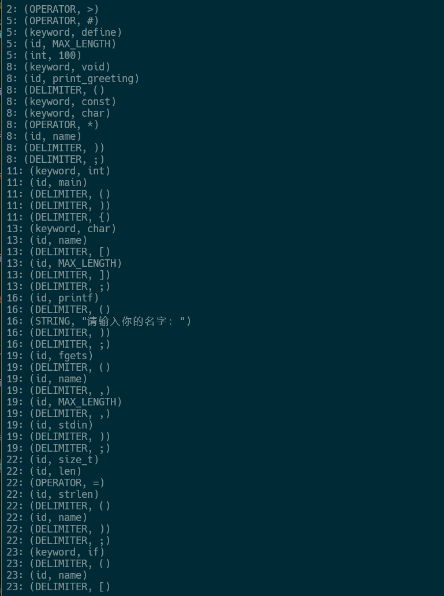
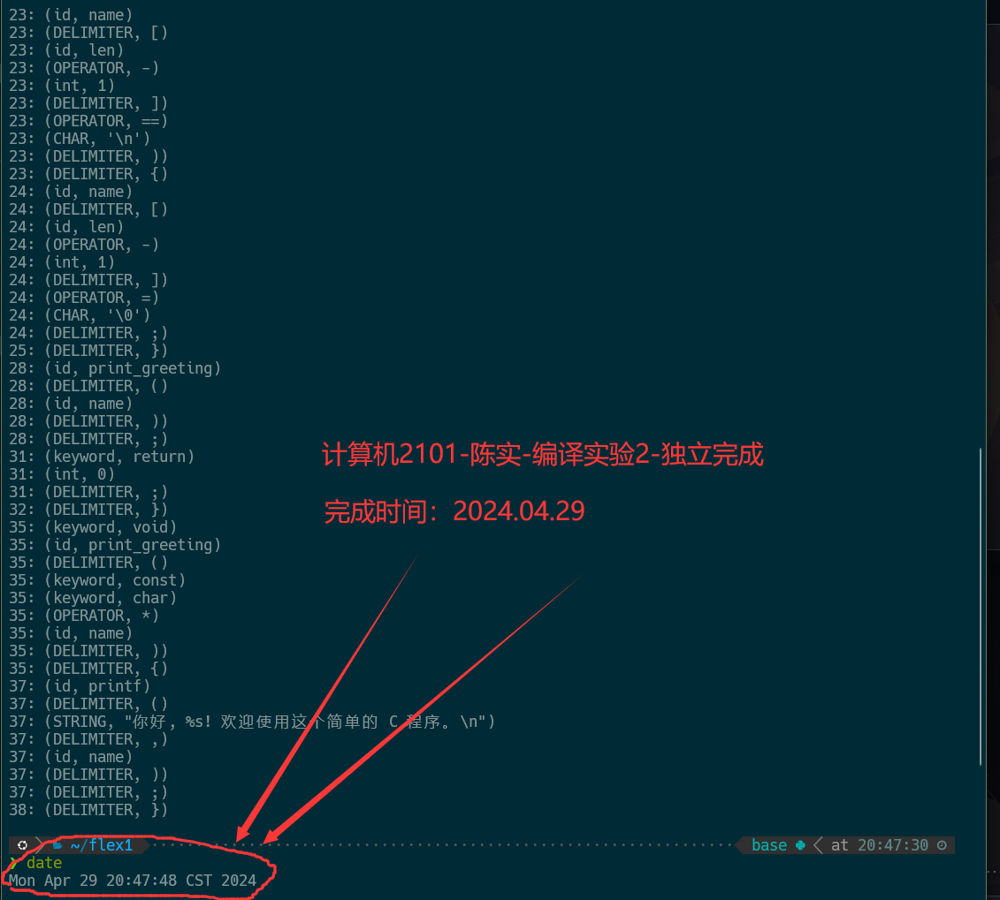
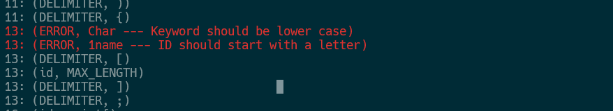

# 编译专题实验报告

<center><font size=5 >词法分析器</font></center>

<center><font size = 4>计算机2101 陈实</font></center>

<center><font size = 4>完成模式：独立完成</font></center>

## 实验平台

1. 操作系统：WSL2 Ubuntu 20.04
2. 编程语言：C++
3. g++版本：13.1.0

## 实验目的

1. 目的：构建词法分析程序能将源语言程序作为输入，并输出词法记号串到文件中。
2. 功能：
    1. 单词设计包含主文法中所有词法单位；
    2. 一遍扫描或含预处理遍，能删除注解，并允许空白字符串作为分隔；
    3. 分析框架scanner()允许连续调用直到输入串被扫描完毕，每调用一次返回一个记号；
    4. 有联合DFA设计结果以及超前搜索功能；
    5. (可选)词法错误处理。

## 实验内容

1. include和全局变量声明

    ```cpp
    #include <algorithm> // 包含 std::transform
    #include <cctype> // 包含 std::tolower
    #include <fstream>
    #include <iostream>
    #include <map>
    #include <stdio.h>
    #include <string>
    #include <unistd.h>
    #include <vector>

    using namespace std;
    int state;   //当前状态指示
    char C;    //当前读入字符
    string nowstr;  //当前读入的字符串
    char *buffer;  //文件缓冲区
    int forwar = -1;    //向前指针
    int rows = 1;   //文件行数
    int sum_char = 0;  //文件总字符数
    
    vector<string> keyword = {"auto", "break", "case", "char", "const", "continue", "default",
                            "do", "double", "else", "enum", "extern", "float", "for", "goto",
                            "if", "int", "long", "register", "return", "short", "signed",
                            "sizeof", "static", "struct", "switch", "typedef", "union",
                            "unsigned", "void", "volatile", "while", "define","include"}; //关键字表
    
    std::multimap<string,string> item;  //符号表(type,value)
    ```

    1. `state`：当前状态指示, 用于指示当前状态
    2. `C`：当前读入字符
    3. `nowstr`：当前读入的字符串
    4. `buffer`：文件缓冲区
    5. `forwar`：向前指针
    6. `rows`：文件行数
    7. `sum_char`：文件总字符数
    8. `keyword`：关键字表
    9. `item`：符号表(type,value), 用于存储识别出的符号

2. 功能函数：

    ```cpp
    void get_char() {
        forwar=forwar+1;
        C = buffer[forwar];
    }
    //从buf中读一个字符到C中，向前指针移动。

    void cat() {
        nowstr.push_back(C);
    }
    //将字符C连接到nowstr字符串后面
    
    std::string toLower(const std::string& str) {
        // 创建一个副本以避免修改原始字符串
        std::string lowerStr = str;
    
        // 使用 std::transform 和 std::tolower 将字符串转换为全小写
        std::transform(lowerStr.begin(), lowerStr.end(), lowerStr.begin(), ::tolower);
    
        return lowerStr; // 返回转换后的字符串
    }
    
    std::string toUper(const std::string& str) {
        // 创建一个副本以避免修改原始字符串
        std::string upperStr = str;
    
        // 使用 std::transform 和 std::tolower 将字符串转换为全小写
        std::transform(upperStr.begin(), upperStr.end(), upperStr.begin(), ::toupper);
    
        return upperStr; // 返回转换后的字符串
    }
    
    bool is_letter(char ch) {
        if (isalpha(ch) || ch=='_')
            return true;
        else
            return false;
    }
    //判断ch是否为字母或下划线

    int iskeyword() {
        for (int i = 0; i < keyword.size(); i++){
            if (nowstr == keyword[i]) {
                return 1;
            }
            if (toLower(nowstr) == keyword[i]) {
                return 2;
            }
        }
        return 0;
    }
    //判断nowstr中是否为关键字, 1表示匹配正确，2表示匹配正确但大小写不同，0表示不匹配
    
    bool iseven() {
        int num = 0;
        int i = nowstr.size() - 2;
        while (nowstr[i] == '\\') {
            num++;
            i--;
        }
        if (num % 2 == 0)
            return true;
        return false;
    }
    //判断nowstr中是否为偶数个\结尾
    ```

    1. `get_char()`：从buf中读一个字符到C中，向前指针移动。
    2. `cat()`：将字符C连接到nowstr字符串后面
    3. `toLower()`：将字符串转换为全小写
    4. `toUper()`：将字符串转换为全大写
    5. `is_letter()`：判断ch是否为字母或下划线
    6. `iskeyword()`：判断nowstr中是否为关键字, 1表示匹配正确，2表示匹配正确但大小写不同，0表示不匹配
    7. `iseven()`：判断nowstr中是否为偶数个\结尾

    8. toLower()用于将字符串转换为全小写，用于判断是否是大小写错误的关键字
    9. ==iseven()用于判断是否为偶数个\结尾，作用的情况是在遇到`"`时，如果是偶数个\结尾，则说明是字符串结束, 否则说明是转义字符, 需要继续读取==
    10. iskeyword()用于判断是否为关键字，如果是关键字，则返回1，如果是大小写错误的关键字，则返回2，否则返回0

3. scanner函数：

    ```cpp
    void scanner(){
        bool isEnd = false;
        while(!isEnd){
            get_char();
            if (C == '\n'){
                rows++;
            }
            if (C == EOF){
                isEnd = true;
            }
            switch (state) {
                case 0: //初始状态
                    if (is_letter(C)){
                        state =1;   //id or keyword
                        cat();
                    }
                    else if (isdigit(C)){
                        state = 2; //num or wrong id
                        cat();
                    }
                    else if (C=='0'){
                        state=28;
                        cat();
                    }
                    else{
                        switch (C) {
                            case '<': state = 8; break;
                            case '>': state = 9; break;
                            case'?':
                                insert_item("OPERATOR", "?");
                                break;
                            case ':':
                                insert_item("OPERATOR", ":");
                                break;
                            case '/': state = 11; break;
                            case '=': state = 12; break;
                            case '+': state = 13; break;
                            case '-': state = 14; break;
                            case '*': state = 15; break;
                            case '%': state = 16; break;
                            case '(':
                                insert_item("DELIMITER", "(");
                                break;
                            case ')':
                                insert_item("DELIMITER", ")");
                                break;
                            case ',':
                                insert_item("DELIMITER", ",");
                                break;
                            case ';':
                                insert_item("DELIMITER", ";");
                                break;
                            case '{':
                                insert_item("DELIMITER", "{");
                                break;
                            case '}':
                                insert_item("DELIMITER", "}");
                                break;
                            case '[':
                                insert_item("DELIMITER", "[");
                                break;
                            case ']':
                                insert_item("DELIMITER", "]");
                                break;
                            case '^': state = 17; break;
                            case '|': state = 18; break;
                            case '~': state = 19; break;
                            case '!': state = 20; break;
                            case '&': state = 21; break;
                            case '"': state = 22; cat(); break;
                            case '\'':state = 23; cat(); break;
                            case '.': state = 24; break;
                            case '#': insert_item("OPERATOR", "#"); break;
                            case ' ':
                            case '\n':
                            case' ':
                            case EOF : break; //跳过空白符
                            default: cout << "error:第" << rows << "行出现非法字符" << C << endl;
                                break;
                        }
                    }
                    break;
                case 1:         //id or keyword
                    if (is_letter(C) || isdigit(C)) {
                        cat();
                        state = 1;
                    }
                    else {
                        forwar--;
                        state = 0;
                        if (C == '\n') {
                            rows--;
                        }
                        int flag = iskeyword();
                        if (flag == 1) {
                            insert_item("keyword", nowstr);
                        } else if (flag == 2) {
                            insert_item("ERROR", nowstr+" --- Keyword should be lower case");
                        } else {
                            insert_item("id", nowstr);
                        }
                        nowstr.clear();
                    }
                    break;
                case 2:
                    if (isdigit(C)) {
                        cat();
                        state = 2;
                    }
                    else if (C == '.') {
                        cat();
                        state = 3;
                    }
                    else if (C == 'E' || C == 'e') {
                        cat();
                        state = 5;
                    }
                    //wrong id
                    else if (is_letter(C)) {
                        cat();
                        state = 31;
                    }
                    else {
                        forwar--;
                        state = 0;
                        if (C == '\n') {
                            rows--;
                        }
                        insert_item("int", nowstr);
                        nowstr.clear();
                    }
                    break;
                case 3:     // .
                    if (isdigit(C)) {
                        cat();
                        state = 4;
                    }
                    else {
                        forwar--;
                        state = 0;
                        if (C == '\n') {
                            rows--;
                        }
                        nowstr.push_back('0');
                        insert_item("float", nowstr);
                        nowstr.clear();
                    }
                    break;
    
                case 4:     // .num
                    if (isdigit(C)) {
                        cat();
                        state = 4;
                    }
                    else if (C == 'E' || C == 'e') {
                        cat();
                        state = 5;
                    }
                    else {
                        forwar--;
                        state = 0;
                        if (C == '\n') {
                            rows--;
                        }
                        insert_item("float", nowstr);
                        nowstr.clear();
                    }
                    break;
    
                case 5:     // .numE
                    if (C == '+' || C == '-') {
                        cat();
                        state = 6;
                    }
                    else if (isdigit(C)) {
                        cat();
                        state = 7;
                    }
                    else {
                        forwar--;
                        state = 0;
                        if (C == '\n') {
                            rows--;
                        }
                        insert_item("ERROR", nowstr + " --- Missing digit");
                        nowstr.clear();
                    }
                    break;
    
                case 6:     // .numE+ or .numE-
                    if (isdigit(C)) {
                        cat();
                        state = 7;
                    }
                    else {
                        forwar--;
                        state = 0;
                        if (C == '\n') {
                            rows--;
                        }
                        insert_item("ERROR", nowstr + " --- Missing digit");
                        nowstr.clear();
                    }
                    break;
    
                case 7:     // .numE+num
                    if (isdigit(C)) {
                        cat();
                        state = 7;
                    }
                    else {
                        forwar--;
                        state = 0;
                        if (C == '\n') {
                            rows--;
                        }
                        insert_item("float", nowstr);
                        nowstr.clear();
                    }
                    break;
    
                case 8:
                    if (C == '=') {
                        insert_item("OPERATOR", "<=");
                    }
                    else if (C == '<') {
                        insert_item("OPERATOR", "<<");
                    }
                    else {
                        forwar--;
                        insert_item("OPERATOR", "<");
                        if (C == '\n') {
                            rows--;
                        }
                    }
                    state = 0;
                    break;
    
                case 9:
                    if (C == '=') {
                        insert_item("OPERATOR", ">=");
                    }
                    else if (C == '>') {
                        insert_item("OPERATOR", ">>");
                    }
                    else {
                        forwar--;
                        insert_item("OPERATOR", ">");
                        if (C == '\n') {
                            rows--;
                        }
                    }
                    state = 0;
                    break;
    
                case 11:
                    switch (C) {
                        case '/': //单行注释
                            state = 27;
                            break;
                        case '*':   //多行注释
                            state = 26;
                            break;
                        default:
                            forwar--;
                            insert_item("OPERATOR", "/");
                            state = 0;
                            if (C == '\n') {
                                rows--;
                            }
                            break;
                    }
                    break;
    
                case 12:    // =
                    if (C == '=') {
                        insert_item("OPERATOR", "==");
                    }
                    else {
                        forwar--;
                        insert_item("OPERATOR", "=");
                        if (C == '\n') {
                            rows--;
                        }
                    }
                    state = 0;
                    break;
    
                case 13:    // +
                    if (C == '+') {
                        insert_item("OPERATOR", "++");
                    }
                    else if (C == '=') {
                        insert_item("OPERATOR", "+=");
                    }
                    else if (isdigit(C)) {
                        cat();
                        state = 2;
                    }
                    else {
                        forwar--;
                        insert_item("OPERATOR", "+");
                        if (C == '\n') {
                            rows--;
                        }
                    }
                    state = 0;
                    break;
    
                case 14:    // -
                    if (C == '-') {
                        insert_item("OPERATOR", "--");
                    }
                    else if (C == '=') {
                        insert_item("OPERATOR", "-=");
                    }
                    else if (C == '>') {
                        insert_item("OPERATOR", "->");
                    }
                    else if (isdigit(C)) {
                        cat();
                        state = 2;
                    }
                    else {
                        forwar--;
                        insert_item("OPERATOR", "-");
                        if (C == '\n') {
                            rows--;
                        }
                    }
                    state = 0;
                    break;
    
                case 15:    // *
                    if (C == '=') {
                        insert_item("OPERATOR", "*=");
                    }
                    else {
                        forwar--;
                        insert_item("OPERATOR", "*");
                        if (C == '\n') {
                            rows--;
                        }
                    }
                    state = 0;
                    break;
    
                case 16:    // %
                    if (C == '=') {
                        insert_item("OPERATOR", "%=");
                    }
                    else {
                        forwar--;
                        insert_item("OPERATOR", "%");
                        if (C == '\n') {
                            rows--;
                        }
                    }
                    state = 0;
                    break;
    
                case 17:    // ^
                    if (C == '=') {
                        insert_item("OPERATOR", "^=");
                    }
                    else {
                        forwar--;
                        insert_item("OPERATOR", "^");
                        if (C == '\n') {
                            rows--;
                        }
                    }
                    state = 0;
                    break;
    
                case 18:    // |
                    if (C == '|') {
                        insert_item("OPERATOR", "||");
                    }
                    else if (C == '=') {
                        insert_item("OPERATOR", "|=");
                    }
                    else {
                        forwar--;
                        insert_item("OPERATOR", "|");
                        if (C == '\n') {
                            rows--;
                        }
                    }
                    state = 0;
                    break;
    
                case 19:    // ~
                    if (C == '=') {
                        insert_item("OPERATOR", "~=");
                    }
                    else {
                        forwar--;
                        
                        insert_item("OPERATOR", "~");
                        if (C == '\n') {
                            rows--;
                        }
                    }
                    state = 0;
                    break;
    
                case 20:    // !
                    if (C == '=') {
                        insert_item("OPERATOR", "!=");
                    }
                    else {
                        forwar--;
                        
                        insert_item("OPERATOR", "!");
                        if (C == '\n') {
                            rows--;
                        }
                    }
                    state = 0;
                    break;
    
                case 21:    // &
                    if (C == '&') {
                        insert_item("OPERATOR", "&&");
                    }
                    else if (C == '=') {
                        insert_item("OPERATOR", "&=");
                    }
                    else {
                        forwar--;
                        
                        insert_item("OPERATOR", "&");
                        if (C == '\n') {
                            rows--;
                        }
                    }
                    state = 0;
                    break;
    
                case 22:    // "
                    if (C == '\"') {
                        cat();
                        if (iseven()) {
                            insert_item("STRING", nowstr);
                            nowstr.clear();
                            state = 0;
                        }
                        else {
                            state = 22;
                        }
                    }
                    else if (C == EOF) {
                        insert_item("ERROR", nowstr + " --- String should end with \"");
                        nowstr.clear();
                        state = 0;
                    }
                    else {
                        cat();
                        state = 22;
                    }
                    break;
    
                case 23:    // '
                    if (C == '\'') {
                        cat();
                        //判断是否是转义字符
                        if (nowstr.size() == 4 && nowstr[1] == '\\') {
                            insert_item("CHAR", nowstr);
                        }
                        //单独处理'\''这种情况
                        else if (nowstr[0]='\'' && nowstr[1]=='\\' && nowstr[2]=='\'') {
                            get_char();
                            if (C == '\'') {
                                cat();
                                insert_item("CHAR", nowstr);
                            }
                            else {
                                forwar--;
                                
                            }
                        }
                        else if (nowstr.size() == 3) {
                            insert_item("CHAR", nowstr);
                        }
                        else {
                            insert_item("ERROR", nowstr + " --- Char should be one character");
                        }
                        nowstr.clear();
                        state = 0;
                    }
                    else if (C == EOF) {
                        insert_item("ERROR", nowstr + " --- Char should end with \'");
                        nowstr.clear();
                        state = 0;
                    }
                    else {
                        cat();
                        state = 23;
                    }
                    break;

                case 24:    // .
                    if (isdigit(C)) {
                        cat();
                        state = 4;
                    }
                    else {
                        forwar--;
                        
                        insert_item("OPERATOR", ".");
                        if (C == '\n') {
                            rows--;
                        }
                        state = 0;
                    }
                    break;
    
                case 26:    // /*
                    if (C == '*') {
                        state = 25;
                    }
                    break;
    
                case 25:    // /*...*
                    if (C == '*') {
                        state = 25;
                    }
                    else if (C == '/') {
                        state = 0;
                    }
                    else if (C == EOF) {
                        insert_item("ERROR", nowstr + " --- Multi-line comment should end with */");
                        nowstr.clear();
                        state = 0;
                    }
                    break;
    
                case 27:    // //
                    if (C == '\n' || C == EOF) {
                        state = 0;
                    }
                    break;
    
                case 28:    // 0
                    if (C == 'x' || C == 'X') {
                        cat();
                        state = 29;
                    }
                    else if (isdigit(C)) {
                        cat();
                        state = 2;
                    }
                    else if (C == '.') {
                        cat();
                        state = 3;
                    }
                    else {
                        forwar--;
                        
                        insert_item("int", nowstr);
                        nowstr.clear();
                        state = 0;
                    }
                    break;
    
                case 29:    // 0x
                    if (isdigit(C) || (C >= 'a' && C <= 'f') || (C >= 'A' && C <= 'F')) {
                        cat();
                        state = 30;
                    }
                    else {
                        forwar--;
                        
                        insert_item("ERROR", nowstr + " --- Hexadecimal number should have at least one digit");
                        nowstr.clear();
                        state = 0;
                    }
                    break;
    
                case 30:    // 0x...
                    if (isdigit(C) || (C >= 'a' && C <= 'f') || (C >= 'A' && C <= 'F')) {
                        cat();
                        state = 30;
                    }
                    else {
                        forwar--;
                        
                        insert_item("int", nowstr);
                        nowstr.clear();
                        state = 0;
                    }
                    break;

                case 31:    //wrong id with num at first
                    if (is_letter(C) || isdigit(C)) {
                        cat();
                        state = 31;
                    }
                    else {
                        forwar--;
                        
                        insert_item("ERROR", nowstr + " --- ID should start with a letter");
                        nowstr.clear();
                        state = 0;
                    }
                    break;
                default:
                    break;
            }
        }
    }
    ```

    1. `scanner()`函数用于识别输入的字符，根据状态机的状态进行识别
    2. scanner识别的类型如下：
        1. `id`：标识符
        2. `keyword`：关键字
        3. `int`：整数
        4. `float`：浮点数
        5. `STRING`：字符串
        6. `CHAR`：字符
        7. `OPERATOR`：操作符
        8. `DELIMITER`：分隔符
        9. `ERROR`：错误
    3. ==scanner()函数中的状态机设计如下：==
        1. `state=0`：初始状态
        2. `state=1`：id or keyword
        3. `state=2`：num or wrong id
        4. `state=3`：.
        5. `state=4`：.num
        6. `state=5`：.numE
        7. `state=6`：.numE+ or .numE-
        8. `state=7`：.numE+num
        9. `state=8`：<
        10. `state=9`：>
        11. `state=11`：/
        12. `state=12`：=
        13. `state=13`：+
        14. `state=14`：-
        15. `state=15`：*
        16. `state=16`：%
        17. `state=17`：^
        18. `state=18`：|
        19. `state=19`：~
        20. `state=20`：!
        21. `state=21`：&
        22. `state=22`："
        23. `state=23`：'
        24. `state=24`：.
        25. `state=26`：/*
        26. `state=27`：//
        27. `state=28`：0
        28. `state=29`：0x
        29. `state=30`：0x...
        30. `state=31`：wrong id with num at first

4. insert_item和read_file函数：

    ```cpp
    //根据传入的type和value，将其插入符号表
    void insert_item(string type, string value) {
        item.insert(pair<string,string>(type,value));
        sleep(0.5);
        if (type == "ERROR") {
            cout << "\033[31m"  // 31对应红色
                << rows << ": (" << type << ", " << value << ")"
                << "\033[0m" << endl;
        }
        else {
            cout << rows << ": (" << type << ", " << value << ")" << endl;
        }
    }

    //根据文件名，读取文件内容到buffer中
    void read_file(const char *filename) {
        FILE *fp = fopen(filename, "r");  // 用二进制模式打开
        if (fp == NULL) {
            cout << "文件打开失败" << endl;
            exit(0);
        }
        fseek(fp, 0, SEEK_END);
        sum_char = ftell(fp);
        fseek(fp, 0, SEEK_SET);
        buffer = new char[sum_char+1];
        fread(buffer, 1, sum_char, fp);
        fclose(fp);
        //Buffer末尾加上EOF
        buffer[sum_char] = EOF;
    }
    ```

    1. `insert_item()`：根据传入的type和value，将其插入符号表，并输出，如果是错误，则输出为红色
    2. `read_file()`：根据文件名，读取文件内容到buffer中

5. 主函数：

    ```cpp
    int main(int argc, char **argv) {
        if (argc < 3) {  // 检查是否提供了足够的命令行参数
            std::cerr << "请提供输入和输出文件名作为参数。" << std::endl;
            return 1;
        }
    
        const char *input_filename = argv[1];  // 获取输入文件名
        const char *output_filename = argv[2];  // 获取输出文件名
    
        freopen(output_filename, "w", stdout);  // 将输出重定向到指定的输出文件
        read_file(input_filename);  // 读取指定输入文件
        scanner();  // 扫描内容
        delete[] buffer;  // 释放分配的内存
    
        return 0;
    }
    ```

    1. 主函数用于读取输入文件，将输出重定向到指定的输出文件，然后调用scanner()函数进行扫描
    2. 主函数从命令行参数中获取输入文件名和输出文件名

## 实验结果

1. test1.txt

    ```c
    #include <stdio.h>  // 包含标准输入输出头文件
    #include <string.h> // 包含字符串操作头文件

    // 定义最大字符串长度
    #define MAX_LENGTH 100

    // 函数声明
    void print_greeting(const char *name);

    // 主函数，程序从这里开始执行
    int main() {
        // 定义一个字符数组以存储输入的名字
        char name[MAX_LENGTH];

        // 打印提示信息
        printf("请输入你的名字：");

        // 从标准输入获取名字，最多读取 MAX_LENGTH 个字符
        fgets(name, MAX_LENGTH, stdin);

        // 删除换行符
        size_t len = strlen(name);
        if (name[len - 1] == '\n') {
            name[len - 1] = '\0';
        }

        // 打印问候语
        print_greeting(name);

        // 程序结束
        return 0;
    }

    // 定义一个函数，用于打印问候语
    void print_greeting(const char *name) {
        // 打印问候语，使用传入的名字
        printf("你好, %s! 欢迎使用这个简单的 C 程序。\n", name);
    }
    ```

    该程序词法正确，输出如下：
    
    

    ```txt
    1: (OPERATOR, #)
    1: (keyword, include)
    1: (OPERATOR, <)
    1: (id, stdio)
    1: (OPERATOR, .)
    1: (id, h)
    1: (OPERATOR, >)
    2: (OPERATOR, #)
    2: (keyword, include)
    2: (OPERATOR, <)
    2: (id, string)
    2: (OPERATOR, .)
    2: (id, h)
    2: (OPERATOR, >)
    5: (OPERATOR, #)
    5: (keyword, define)
    5: (id, MAX_LENGTH)
    5: (int, 100)
    8: (keyword, void)
    8: (id, print_greeting)
    8: (DELIMITER, ()
    8: (keyword, const)
    8: (keyword, char)
    8: (OPERATOR, *)
    8: (id, name)
    8: (DELIMITER, ))
    8: (DELIMITER, ;)
    11: (keyword, int)
    11: (id, main)
    11: (DELIMITER, ()
    11: (DELIMITER, ))
    11: (DELIMITER, {)
    13: (keyword, char)
    13: (id, name)
    13: (DELIMITER, [)
    13: (id, MAX_LENGTH)
    13: (DELIMITER, ])
    13: (DELIMITER, ;)
    16: (id, printf)
    16: (DELIMITER, ()
    16: (STRING, "请输入你的名字：")
    16: (DELIMITER, ))
    16: (DELIMITER, ;)
    19: (id, fgets)
    19: (DELIMITER, ()
    19: (id, name)
    19: (DELIMITER, ,)
    19: (id, MAX_LENGTH)
    19: (DELIMITER, ,)
    19: (id, stdin)
    19: (DELIMITER, ))
    19: (DELIMITER, ;)
    22: (id, size_t)
    22: (id, len)
    22: (OPERATOR, =)
    22: (id, strlen)
    22: (DELIMITER, ()
    22: (id, name)
    22: (DELIMITER, ))
    22: (DELIMITER, ;)
    23: (keyword, if)
    23: (DELIMITER, ()
    23: (id, name)
    23: (DELIMITER, [)
    23: (id, len)
    23: (OPERATOR, -)
    23: (int, 1)
    23: (DELIMITER, ])
    23: (OPERATOR, ==)
    23: (CHAR, '\n')
    23: (DELIMITER, ))
    23: (DELIMITER, {)
    24: (id, name)
    24: (DELIMITER, [)
    24: (id, len)
    24: (OPERATOR, -)
    24: (int, 1)
    24: (DELIMITER, ])
    24: (OPERATOR, =)
    24: (CHAR, '\0')
    24: (DELIMITER, ;)
    25: (DELIMITER, })
    28: (id, print_greeting)
    28: (DELIMITER, ()
    28: (id, name)
    28: (DELIMITER, ))
    28: (DELIMITER, ;)
    31: (keyword, return)
    31: (int, 0)
    31: (DELIMITER, ;)
    32: (DELIMITER, })
    35: (keyword, void)
    35: (id, print_greeting)
    35: (DELIMITER, ()
    35: (keyword, const)
    35: (keyword, char)
    35: (OPERATOR, *)
    35: (id, name)
    35: (DELIMITER, ))
    35: (DELIMITER, {)
    37: (id, printf)
    37: (DELIMITER, ()
    37: (STRING, "你好, %s! 欢迎使用这个简单的 C 程序。\n")
    37: (DELIMITER, ,)
    37: (id, name)
    37: (DELIMITER, ))
    37: (DELIMITER, ;)
    38: (DELIMITER, })
    ```

    可以看到，识别出了各种类型的符号，包括关键字、标识符、操作符、分隔符、字符串、字符等，能够正确识别出各种类型的符号

2. test2.txt

    下面修改了test1.txt中的一些内容，使得其出现了一些错误，如下：

    ```c
    Char 1name[MAX_LENGTH];
    ```

    预期能识别画出Keyword大小写错误和ID首字母错误。

    实际输出如下：

    

    可以看到，识别出了大小写错误的关键字和ID首字母错误，并且输出为红色

    ```txt
    1: (OPERATOR, #)
    1: (keyword, include)
    1: (OPERATOR, <)
    1: (id, stdio)
    1: (OPERATOR, .)
    1: (id, h)
    1: (OPERATOR, >)
    2: (OPERATOR, #)
    2: (keyword, include)
    2: (OPERATOR, <)
    2: (id, string)
    2: (OPERATOR, .)
    2: (id, h)
    2: (OPERATOR, >)
    5: (OPERATOR, #)
    5: (keyword, define)
    5: (id, MAX_LENGTH)
    5: (int, 100)
    8: (keyword, void)
    8: (id, print_greeting)
    8: (DELIMITER, ()
    8: (keyword, const)
    8: (keyword, char)
    8: (OPERATOR, *)
    8: (id, name)
    8: (DELIMITER, ))
    8: (DELIMITER, ;)
    11: (keyword, int)
    11: (id, main)
    11: (DELIMITER, ()
    11: (DELIMITER, ))
    11: (DELIMITER, {)
    13: (ERROR, Char --- Keyword should be lower case)
    13: (ERROR, 1name --- ID should start with a letter)
    13: (DELIMITER, [)
    13: (id, MAX_LENGTH)
    13: (DELIMITER, ])
    13: (DELIMITER, ;)
    16: (id, printf)
    16: (DELIMITER, ()
    16: (STRING, "请输入你的名字：")
    16: (DELIMITER, ))
    16: (DELIMITER, ;)
    19: (id, fgets)
    19: (DELIMITER, ()
    19: (id, name)
    19: (DELIMITER, ,)
    19: (id, MAX_LENGTH)
    19: (DELIMITER, ,)
    19: (id, stdin)
    19: (DELIMITER, ))
    19: (DELIMITER, ;)
    22: (id, size_t)
    22: (id, len)
    22: (OPERATOR, =)
    22: (id, strlen)
    22: (DELIMITER, ()
    22: (id, name)
    22: (DELIMITER, ))
    22: (DELIMITER, ;)
    23: (keyword, if)
    23: (DELIMITER, ()
    23: (id, name)
    23: (DELIMITER, [)
    23: (id, len)
    23: (OPERATOR, -)
    23: (int, 1)
    23: (DELIMITER, ])
    23: (OPERATOR, ==)
    23: (CHAR, '\n')
    23: (DELIMITER, ))
    23: (DELIMITER, {)
    24: (id, name)
    24: (DELIMITER, [)
    24: (id, len)
    24: (OPERATOR, -)
    24: (int, 1)
    24: (DELIMITER, ])
    24: (OPERATOR, =)
    24: (CHAR, '\0')
    24: (DELIMITER, ;)
    25: (DELIMITER, })
    28: (id, print_greeting)
    28: (DELIMITER, ()
    28: (id, name)
    28: (DELIMITER, ))
    28: (DELIMITER, ;)
    31: (keyword, return)
    31: (int, 0)
    31: (DELIMITER, ;)
    32: (DELIMITER, })
    35: (keyword, void)
    35: (id, print_greeting)
    35: (DELIMITER, ()
    35: (keyword, const)
    35: (keyword, char)
    35: (OPERATOR, *)
    35: (id, name)
    35: (DELIMITER, ))
    35: (DELIMITER, {)
    37: (id, printf)
    37: (DELIMITER, ()
    37: (STRING, "你好, %s! 欢迎使用这个简单的 C 程序。\n")
    37: (DELIMITER, ,)
    37: (id, name)
    37: (DELIMITER, ))
    37: (DELIMITER, ;)
    38: (DELIMITER, })
    ```

## 实验总结

1. 通过本次实验，我学会了如何设计一个简单的词法分析器，能使用C++语言识别出各种类型的符号，包括关键字、标识符、操作符、分隔符、字符串、字符等
2. 通过本次实验，我学会了如何使用状态机设计词法分析器，通过状态机的状态转移来识别各种类型的符号
3. 通过本次实验，我学会了如何使用C++语言读取文件内容，并将输出重定向到指定的输出文件
4. 通过本次实验，我学会了如何实现超前搜索，用于识别++、--等符号
5. 通过本次实验，我学会了如何修改输出颜色，使得错误输出为红色
