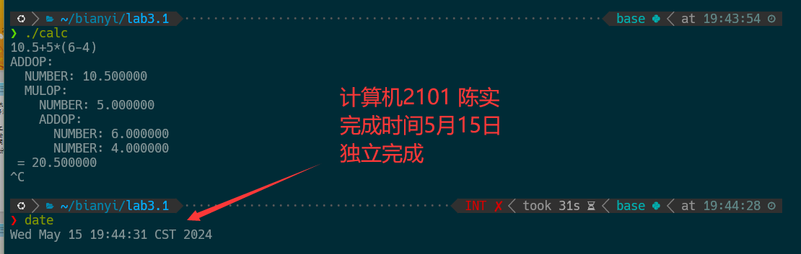
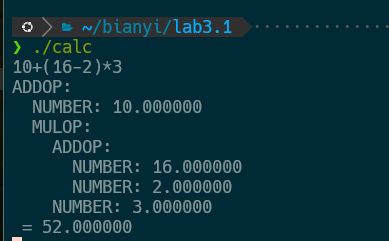
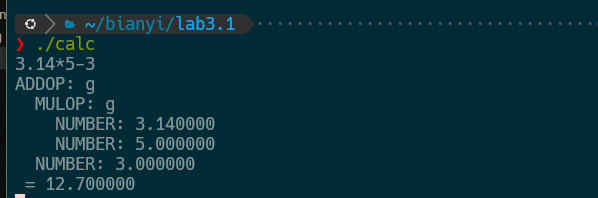

# 编译专题实验报告

<center><font size=5 >实验三：语法分析</font></center>

<center><font size = 4>计算机2101 陈实</font></center>

<center><font size = 4>完成模式：独立完成</font></center>

## 实验平台

1. 操作系统：WSL2 Ubuntu 20.04
2. 辅助工具：LEX 、 BISON

## 实验目的

1. 完成计算器
    * 支持加减乘除、括号、“-”、关系运算等exper操作；
    * 考虑小数
    * 考虑算符结合和优先级；

2. 输出抽象语法树AST

    

## 实验内容

1. lex文件

    ```lex
    %option noyywrap

    %{

    #include "calc.tab.h"
    %}

    %%
    \( { return LPAREN; }
    \) { return RPAREN; }
    "+"|"-" { yylval.op = yytext[0]; return ADDOP; }
    "*"|"/" { yylval.op = yytext[0]; return MULOP; }
    "|"|"&" { yylval.op = yytext[0]; return LOGOP; }
    "%" {yylval.op = yytext[0]; return MODOP; }
    [0-9]+|[0-9]+\.[0-9]*|[0-9]*\.[0-9]+ { yylval.num = atof(yytext); return NUMBER; }
    " "|\t {  }
    \r\n|\n|\r { return RET; }
    %%%
    ```

    1. 定义了括号、加减乘除、逻辑运算符、取余、数字、空格、换行符等词法单元；
    2. 增加了stdlib.h的包含，以便使用atof函数将字符串转换为浮点数；
    3. 每个正则表达式对应一个返回值（如LPAREN, RPAREN, ADDOP等），这些返回值在calc.tab.h中定义；
    4. 处理空格和制表符时忽略它们，不产生任何动作；
    5. 处理换行符时返回RET，表明一行结束。

2. Bison文件

    ```yacc
    /* calc.y */
    %{
    #include <stdio.h>
    #include <stdlib.h>
    #include <string.h>
    #include "ast.h"

    int yylex(void);
    void yyerror(const char *s);

    %}

    %token RET
    %token <num> NUMBER
    %token <op> ADDOP MULOP LPAREN RPAREN LOGOP MODOP
    %type <node> top line expr term factor

    %start top

    %union {
        char   op;
        double num;
        struct ASTNode *node;
    }

    %%

    top
    : top line {}
    | {}

    line
    : expr RET
    {
        printAST($1, 0);
        printf(" = %f\n", $1->data.num);
        freeAST($1);
    }

    expr
    : term
    {
        $$ = $1;
    }
    | expr ADDOP term
    {
        $$ = createNode("ADDOP", 0, $2, $1, $3);
        $$->data.num = ($2 == '+') ? $1->data.num + $3->data.num : $1->data.num - $3->data.num;
    }
    | expr LOGOP term
    {
        $$ = createNode("LOGOP", 0, $2, $1, $3);
        $$->data.num = ($2 == '|') ? $1->data.num || $3->data.num : $1->data.num && $3->data.num;
    }
    | expr MODOP term
    {
        $$ = createNode("MODOP", 0, '%', $1, $3);
        $$->data.num = (int)$1->data.num % (int)$3->data.num;
    }

    term
    : factor
    {
        $$ = $1;
    }
    | term MULOP factor
    {
        $$ = createNode("MULOP", 0, $2, $1, $3);
        $$->data.num = ($2 == '*') ? $1->data.num * $3->data.num : $1->data.num / $3->data.num;
    }

    factor
    : LPAREN expr RPAREN
    {
        $$ = $2;
    }
    | ADDOP factor
    {
        $$ = createNode("NEGATE", 0, $1, NULL, $2);
        $$->data.num = ($1 == '-') ? -$2->data.num : $2->data.num;
    }
    | NUMBER
    {
        $$ = createNode("NUMBER", $1, 0, NULL, NULL);
    }

    %%

    ASTNode *createNode(char *type, double num, char op, ASTNode *left, ASTNode *right) {
        ASTNode *node = (ASTNode *)malloc(sizeof(ASTNode));
        node->type = strdup(type);
        if (strcmp(type, "NUMBER") == 0) {
            node->data.num = num;
        } else {
            node->data.op = op;
        }
        node->left = left;
        node->right = right;
        return node;
    }

    void printAST(ASTNode *node, int level) {
        if (!node) return;
        for (int i = 0; i < level; i++) printf("  ");
        if (strcmp(node->type, "NUMBER") == 0) {
            printf("%s: %f\n", node->type, node->data.num);
        } else {
            printf("%s: %c\n", node->type, node->data.op);
        }
        printAST(node->left, level + 1);
        printAST(node->right, level + 1);
    }

    void freeAST(ASTNode *node) {
        if (!node) return;
        free(node->type);
        freeAST(node->left);
        freeAST(node->right);
        free(node);
    }

    void yyerror(const char *s)
    {
        fprintf(stderr, "%s\n", s);
    }

    int main()
    {
        yyparse();
        return 0;
    }
    ```

    1. 引入所需头文件：

        * 引入了stdio.h、stdlib.h、string.h和自定义的ast.h，以支持输入输出、内存管理和字符串操作。
        * 声明了词法分析函数yylex和错误处理函数yyerror。
  
    2. 定义词法单元和语法单元的类型：

        * 词法单元包括：RET（回车）、NUMBER（数字）、ADDOP（加减操作符）、MULOP（乘除操作符）、LPAREN（左括号）、RPAREN（右括号）、LOGOP（逻辑操作符）和MODOP（取余操作符）。
        * 定义了语法单元的类型（top、line、expr、term、factor），这些语法单元将使用抽象语法树节点（ASTNode）来表示。
    3. 定义起始规则和联合体：

        * top被定义为起始规则。
        * 定义了%union来表示符号值的不同类型，包括字符（操作符）、双精度浮点数（数字）和抽象语法树节点（ASTNode）。

    4. 语法规则及其动作：

        * top规则：表示多个line的组合或为空，形成了程序的顶层结构。
        * line规则：每行由一个表达式加换行符组成，处理表达式并输出结果，同时打印并释放抽象语法树。
        * expr规则：定义了表达式的结构，可以是一个term、ADDOP运算、LOGOP运算或MODOP运算。相应的动作创建AST节点并计算结果。
        * term规则：定义了项的结构，可以是一个factor或MULOP运算，动作创建AST节点并计算结果。
        * factor规则：定义了因子的结构，可以是括号中的表达式、带符号的因子或数字，动作创建AST节点并处理数值。
  
    5. 辅助函数：

        * createNode：创建一个AST节点，初始化类型、数据和子节点。
        * printAST：递归打印AST，用于调试和输出树的结构。
        * freeAST：递归释放AST节点的内存，防止内存泄漏。
        * yyerror：错误处理函数，打印错误信息。
        * main函数：启动解析过程。

3. makefile文件

    ```makefile
    calc: calc.y calc.l ast.h
        bison -d calc.y
        flex calc.l
        gcc -o $@ calc.tab.c lex.yy.c -lfl -lm

    clean:
        rm -f calc.tab.* lex.yy.c calc
    ```

    1. 使用bison和flex生成对应的C文件，然后编译链接生成可执行文件calc。
    2. clean规则用于清理生成的文件。

## 实验结果

1. 10+(16-2)*3
   

2. 3.14*2.718+1.618
   

## 实验总结

1. 通过本次实验，我学会了使用Bison和Flex工具来实现语法分析，实现了一个简单的计算器，支持加减乘除、括号、小数、逻辑运算和取余等操作。
2. 通过实现抽象语法树AST，我更好地理解了语法分析的过程，掌握了如何将表达式转换为树形结构，并实现计算和输出。
3. 通过调试和测试，我发现了一些问题，如优先级和结合性的处理、负号的处理等，通过修改代码和调整规则，最终实现了正确的计算和输出。