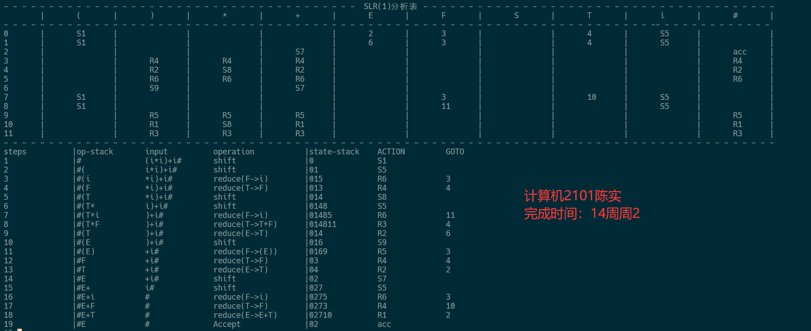

# 编译专题实验报告

<center><font size=5 >语法分析</font></center>

<center><font size = 4>计算机2101 陈实</font></center>

<center><font size = 4>完成模式：独立完成</font></center>

## 实验平台

1. 操作系统：WSL2 Ubuntu 20.04
2. 编程语言：C++
3. g++版本：13.1.0

## 实验目的

1. 目的：根据某文法写出SLR(1)分析表。
2. 构造SLR(1)分析表的步骤：
    1.写出拓广文法
    2.画出项目集规范族
    3.求该非终结符的FOLLOW集
    4.判断是否是SLR(1)文法
    5.构造SLR(1)分析表
    参考资料：提供的代码slrs.cpp。

3. 实现：根据提供的slr-add.cpp，可输入自定义文法的SLR(1)分析表

## 实验内容

1. 补全maketable函数，构造SLR(1)分析表

    ```cpp
        void make_table() {
        //初始化Goto表：
        //memset(Goto, -1, sizeof(Goto)); 将 Goto 表中的所有值初始化为 -1。
        memset(Goto, -1, sizeof(Goto));
        int m = collection.size();
        //遍历状态集和符号集，对于每个非终结符，检查是否存在转换，若存在则填充 Goto 表。
        for (int i = 0; i < m; ++i) {
            for (int t = 0; t < V.size(); ++t) {
                char ch = V[t];
                if (isupper(ch)) {
                    if (go[i][ch] != -1) {
                        Goto[i][ch] = go[i][ch];
                    }
                }
            }
        }
        //对于终结符和特殊符号 #，根据 go 表中的值填充 shift 操作。
        //检查规约项目，若是接受状态则设置 accept，否则根据 follow 集合填充 reduce 操作。
        for (int i = 0; i < m; ++i) {
            for (int t = 0; t < V.size(); ++t) {
                char ch = V[t];
                if (!isupper(ch) || ch == '#') {
                    if (go[i][ch] != -1) {
                        action[i][ch] = Content(0, go[i][ch]);
                        stringstream ss;
                        ss<<'S'<<go[i][ch];
                        action[i][ch].out=ss.str();
                    }
                }
            }
            for (int j = 0; j < collection[i].element.size(); ++j) {
                WF &item = collection[i].element[j];
                string str = item.right;
                int len = str.length();
                if (str[len - 1] == CH) {
                    int rule = item.back;
                    if (rule==0) {
                        action[i]['#'] = Content(2, 0);
                        action[i]['#'].out = "acc";
                    } else {
                        for (auto c : follow[item.left]) {
                            action[i][c] = Content(1, rule);
                            stringstream aa;
                            aa<<'R'<<rule;
                            action[i][c].out = aa.str();
                        }
                    }
                }
            }
        }
    cout << "- - - - - - - - - - - - - - - - - - - - - - - - - - - - - - - - - - - - - - -  SLR(1)分析表 - - - - - - - - - - - - - - - - - - - - - - - - - - - - - - - - - - - - - - -" << endl;
    cout << "\t|";
    for (int i = 0; i < V.size(); ++i) {
        cout << "\t" << V[i] << "\t|";
    }
    cout << endl;
    cout << "- - - - - - - - - - - - - - - - - - - - - - - - - - - - - - - - - - - - - - - - - - - - - - - - - - - - - - - - - - - - - - - - - - - - - - - -- - - - - - - - - - - - -" << endl;

    for (int i = 0; i < m; ++i) {
        cout << i << "\t|";
        for (int j = 0; j < V.size(); ++j) {

            char ch = V[j];
            if (!isupper(ch) || ch == '#') {
                if (action[i][ch].type == -1) {
                    cout << "\t\t|";
                } else {
                    cout << "\t" << action[i][ch].out << "\t|";
                }
            } else {
                if (Goto[i][ch] == -1) {
                    cout << "\t\t|";
                } else {
                    cout << "\t" << Goto[i][ch] << "\t|";
                }
            }
        }
        cout << endl;
    }
    cout << "- - - - - - - - - - - - - - - - - - - - - - - - - - - - - - - - - - - - - - - - - - - - - - - - - - - - - - - - - - - - - - - - - - - - - - - - - - - - - - - - - - - - -" << endl;

    }
    ```

    1. 初始化Goto表：
        memset(Goto, -1, sizeof(Goto)); 将 Goto 表中的所有值初始化为 -1。
    2. 遍历状态集和符号集，对于每个非终结符，检查是否存在转换，若存在则填充 Goto 表。
    3. 对于终结符和特殊符号 #，根据 go 表中的值填充 shift 操作。
    4. 检查规约项目，若是接受状态则设置 accept，否则根据 follow 集合填充 reduce 操作。
    5. 输出SLR(1)分析表。

## 实验结果

1. 输入文法：

    ```txt
S->E
E->E+T
E->T
T->T*F
T->F
F->(E)
F->i
    ```

    

2. 选做：输入文法：

    ```txt
    B->ErE
    B->E
    S->E
    S->S,E
    E->i
    E->d
    E->d[S]
    E->d(S)
    E->E+E
    E->E*E
    ```

    不能规约，有冲突

## 实验总结

1. 本次实验主要是根据提供的代码slr-add.cpp，实现了SLR(1)分析表的构造。我在实验中遇到了一些问题，但通过查阅资料和与同学讨论，最终解决了问题。
2. 本次实验的目的是根据某文法写出SLR(1)分析表，通过实验，我对SLR(1)分析表的构造有了更深入的了解。
3. 本次实验的难点在于构造SLR(1)分析表，需要对项目集规范族、FOLLOW集等概念有一定的了解，需要仔细思考和分析。