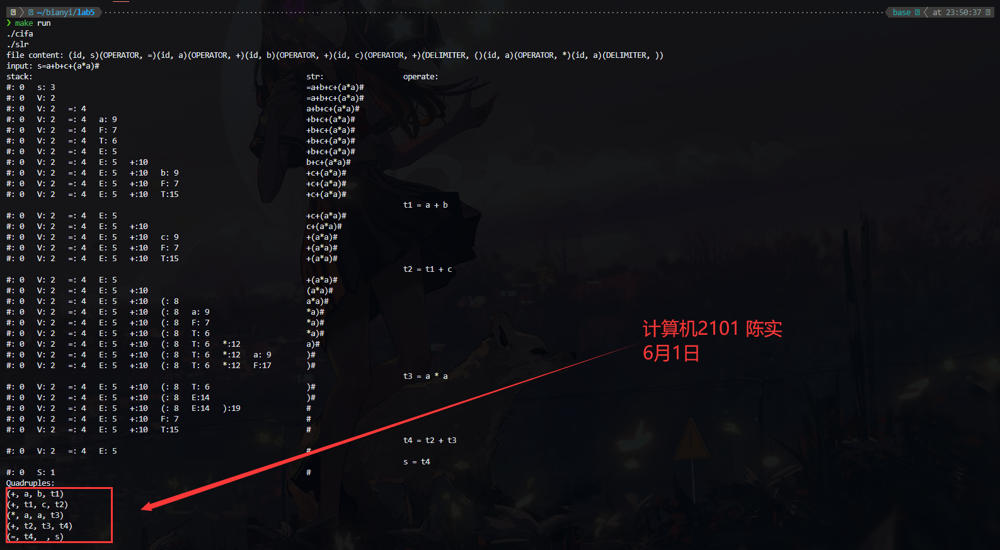
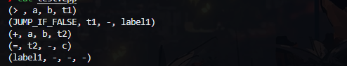

# 编译专题实验报告

<center><font size=5 >语义分析</font></center>

<center><font size = 4>计算机2101 陈实</font></center>

<center><font size = 4>完成模式：独立完成</font></center>

## 实验平台

1. 操作系统：WSL2 Ubuntu 20.04
2. 编程语言：C++
3. g++版本：13.1.0

## 实验目的

1. 目的：构建语法制导的语义分析程序能在语法分析的同时生成符号表和中间语言代码，并输出结果到文件中。
2. 功能：
    SLR(1)制导的语义分析框架实现；
    中间语言代码形式: 四元式；

## 实验内容

1. cifa.cpp: 词法分析程序，生成token序列；

    ```cpp
    #include <algorithm> // 包含 std::transform
    #include <cctype> // 包含 std::tolower
    #include <fstream>
    #include <iostream>
    #include <map>
    #include <stdio.h>
    #include <string>
    #include <unistd.h>
    #include <vector>

    using namespace std;
    int state;			//当前状态指示
    char C;				//当前读入字符
    string nowstr;		//当前读入的字符串
    char *buffer;		//文件缓冲区
    int forwar = -1;  		//向前指针
    int rows = 1;			//文件行数
    int sum_char = 0;		//文件总字符数
    vector<string> keyword = {"auto", "break", "case", "char", "const", "continue", "default",
                            "do", "double", "else", "enum", "extern", "float", "for", "goto",
                            "if", "int", "long", "register", "return", "short", "signed",
                            "sizeof", "static", "struct", "switch", "typedef", "union",
                            "unsigned", "void", "volatile", "while", "define","include"};	//关键字表
    ```
    
    完整代码见附录1. cifa.cpp。
    
    cifa.cpp由第二次实验修改而来，主要功能是词法分析，生成token序列。从文件`input.txt`中读取内容，识别出关键字、标识符、常数、运算符、界符等，并输出到文件`outputofcifa.txt`中。作为后面语法分析的输入。
    
    输入：
    
    ```txt
    s=a+b+c+(a*a )
    ```
    
    输出：
    
    ```txt
    (id, s)(OPERATOR, =)(id, a)(OPERATOR, +)(id, b)(OPERATOR, +)(id, c)(OPERATOR, +)(DELIMITER, ()(id, a)(OPERATOR, *)(id, a)(DELIMITER, ))
    ```

2. slr.cpp:

    ```cpp
    #include<stdio.h>
    #include<string.h>
    #include<stdlib.h>
    #include<iostream>
    #define MAX_LEN 1000
    using namespace std;
    struct stack {
        char s[MAX_LEN];
        int i[MAX_LEN];
        int point[MAX_LEN];
        int top;
    }; // 分析栈数据结构
    
    struct quadruple {
        char op[MAX_LEN];
        char arg1[MAX_LEN];
        char arg2[MAX_LEN];
        char result[MAX_LEN];
    }; // 四元式数据结构
    
    struct quadruple quad[MAX_LEN]; // 存储四元式
    int quadTop = 0; // 四元式栈顶
    
    // 1.S→V=E  2.E→E+T  3.E→E-T  4.E→T  5.T→T*F  6.T→T/F  7.T→F  8.F→(E) 9.F→i  10.V→i
    // 表中大于0对应移进，小于0则对应先归约后移进，0为不存在的状态
    //          GOTO           |    ACTION
    //i, =, +, -, *, /, (, ), #, S, E, T, F, V
    int table[20][14] ={{ 3, 0, 0, 0, 0, 0, 0, 0, 0, 1, 0, 0, 0, 2},// 0
                        { 0, 0, 0, 0, 0, 0, 0, 0,-11,0,0, 0, 0, 0},// 1
                        { 0, 4, 0, 0, 0, 0, 0, 0, 0, 0, 0, 0, 0, 0},// 2
                        {-10,-10,-10,-10,-10,-10,-10,-10,-10, 0, 0, 0, 0, 0},//3
                        { 9, 0, 0, 0, 0, 0, 8, 0, 0, 0, 5, 6, 7, 0},// 4
                        {-1,-1,10,11,-1,-1,-1,-1,-1, 0, 0, 0, 0, 0},// 5
                        {-4,-4,-4,-4,12,13,-4,-4,-4, 0, 0, 0, 0, 0},// 6
                        {-7,-7,-7,-7,-7,-7,-7,-7,-7, 0, 0, 0, 0, 0},// 7
                        { 9, 0, 0, 0, 0, 0, 8, 0, 0, 0,14, 6, 7, 0},// 8
                        {-9,-9,-9,-9,-9,-9,-9,-9,-9, 0, 0, 0, 0, 0},// 9
                        { 9, 0, 0, 0, 0, 0, 8, 0, 0, 0, 0,15, 7, 0},//10
                        { 9, 0, 0, 0, 0, 0, 8, 0, 0, 0, 0,16, 7, 0},//11
                        { 9, 0, 0, 0, 0, 0, 8, 0, 0, 0, 0, 0,17, 0},//12
                        { 9, 0, 0, 0, 0, 0, 8, 0, 0, 0, 0, 0,18, 0},//13
                        { 0, 0,10,11, 0, 0, 0,19, 0, 0, 0, 0, 0, 0},//14
                        {-2,-2,-2,-2,12,13,-2,-2,-2, 0, 0, 0, 0, 0},//15
                        {-3,-3,-3,-3,12,13,-3,-3,-3, 0, 0, 0, 0, 0},//16
                        {-5,-5,-5,-5,-5,-5,-5,-5,-5, 0, 0, 0, 0, 0},//17
                        {-6,-6,-6,-6,-6,-6,-6,-6,-6, 0, 0, 0, 0, 0},//18
                        {-8,-8,-8,-8,-8,-8,-8,-8,-8, 0, 0, 0, 0, 0}};//19
    
    int getindex(char ch) {
        switch(ch) {
            case 'i': return 0;
            case '=': return 1;
            case '+': return 2;
            case '-': return 3;
            case '*': return 4;
            case '/': return 5;
            case '(': return 6;
            case ')': return 7;
            case '#': return 8;
            case 'S': return 9;
            case 'E': return 10;
            case 'T': return 11;
            case 'F': return 12;
            case 'V': return 13;
            default: return -1;
        }
    }
    
    void printSLR(char *str, struct stack *stk, int now) { // 打印分析状态
        for(int i = 0; i <= stk->top; i++) {
            printf("%c:%2d   ", stk->s[i], stk->i[i]); // 栈状态
        }
        for(int i = 0; i <= 60 - stk->top*7; i++) {
            printf(" ");
        }
        for(int i = now; i < strlen(str); i++) {
            printf("%c", str[i]); // 串状态
        }
        printf("\n");
    }
    
    void printQuad() { // 打印四元式
        printf("Quadruples:\n");
        for(int i = 1; i <= quadTop; i++) {
            printf("(%s, %s, %s, %s)\n", quad[i].op, quad[i].arg1, quad[i].arg2, quad[i].result);
        }
    }
    
    int SLR(char *str, struct stack *stk) { // SLR1分析函数
        quadTop = 0;
        int i = 0;
        int next;
        printf("stack:                                                              str:                  operate:\n");
        while(i < strlen(str)) {
            if(stk->top < 0) return 0; // 分析栈不可能为空
            int y; // 列坐标
            if (str[i] >= 'a' && str[i] <= 'z') y = getindex('i'); // 终结符i
            else y = getindex(str[i]);
            if(y == -1 || table[stk->i[stk->top]][y] == 0) { // 表中不存在的状态，分析报错
                return 0;
            }
            if(table[stk->i[stk->top]][y] > 0) { // 移进操作
                next = table[stk->i[stk->top]][y];
                stk->top++;
                stk->s[stk->top] = str[i];
                stk->i[stk->top] = next;
                stk->point[stk->top] = i;
                i++;
                printSLR(str, stk, i);
            }
            else if(table[stk->i[stk->top]][y] < 0) { // 归约操作
                int tmp = -table[stk->i[stk->top]][y]; // 查GOTO表
                if(tmp == 4 || tmp == 7 || tmp == 9 || tmp == 10) {
                    stk->top--; // 要归约1位
                }
                else if(tmp == 2 || tmp == 3 || tmp == 5 || tmp == 6){
                    // 生成四元式
                    quadTop++;
                    if(tmp == 2) strcpy(quad[quadTop].op, "+");
                    else if(tmp == 3) strcpy(quad[quadTop].op, "-");
                    else if(tmp == 5) strcpy(quad[quadTop].op, "*");
                    else strcpy(quad[quadTop].op, "/");
                    if(stk->point[stk->top - 2] < 0) sprintf(quad[quadTop].arg1, "t%d", -stk->point[stk->top - 2]);
                    else {
                        char arg1[2] = {str[stk->point[stk->top - 2]], '\0'};
                        strcpy(quad[quadTop].arg1, arg1);
                    }
                    if(stk->point[stk->top] < 0) sprintf(quad[quadTop].arg2, "t%d", -stk->point[stk->top]);
                    else {
                        char arg2[2] = {str[stk->point[stk->top]], '\0'};
                        strcpy(quad[quadTop].arg2, arg2);
                    }
                    for(int j = 0; j < 90; j++) printf(" ");
                    printf("t%d = %s %s %s\n", quadTop, quad[quadTop].arg1, quad[quadTop].op, quad[quadTop].arg2); // 打印语义动作
                    sprintf(quad[quadTop].result, "t%d", quadTop);
                    stk->top -= 3; // 归约3位
                    stk->point[stk->top + 1] = -quadTop; // 记录归约产生的中间变量
                }
                else if(tmp == 8) {
                    stk->top -= 3; // 归约3位
                    stk->point[stk->top + 1] = stk->point[stk->top + 2]; // 消除括号规约
                }
                else if(tmp == 1){
                    quadTop++;
                    strcpy(quad[quadTop].op, "=");
                    if(stk->point[stk->top] < 0) sprintf(quad[quadTop].arg1, "t%d", abs(stk->point[stk->top]));
                    else {
                        char arg1[2] = {str[stk->point[stk->top]], '\0'};
                        strcpy(quad[quadTop].arg1, arg1);
                    }
                    sprintf(quad[quadTop].arg2, " ");
                    char res[2] = {str[stk->point[stk->top - 2]], '\0'};
                    strcpy(quad[quadTop].result, res);
                    for(int i = 0; i < 90; i++) printf(" ");
                    printf("%s = %s\n", quad[quadTop].result, quad[quadTop].arg1);
                    stk->top -= 3; // 归约V=E
                }
                else stk->top -= 3;
                if(tmp == 1) {
                    y = getindex('S');
                    next = table[stk->i[stk->top]][y]; // 查ACTION表
                    stk->top++;
                    stk->s[stk->top] = 'S';
                    stk->i[stk->top] = next; // 归约要修改栈顶
                }
                else if(tmp == 2 || tmp ==3 || tmp == 4) {
                    y = getindex('E');
                    next = table[stk->i[stk->top]][y];
                    stk->top++;
                    stk->s[stk->top] = 'E';
                    stk->i[stk->top] = next;
                }
                else if(tmp == 5 || tmp == 6 || tmp == 7) {
                    y = getindex('T');
                    next = table[stk->i[stk->top]][y];
                    stk->top++;
                    stk->s[stk->top] = 'T';
                    stk->i[stk->top] = next;
                }
                else if(tmp == 8 || tmp == 9) {
                    y = getindex('F');
                    next = table[stk->i[stk->top]][y];
                    stk->top++;
                    stk->s[stk->top] = 'F';
                    stk->i[stk->top] = next;
                }
                else if(tmp == 10) {
                    y = getindex('V');
                    next = table[stk->i[stk->top]][y];
                    stk->top++;
                    stk->s[stk->top] = 'V';
                    stk->i[stk->top] = next;
                }
                else if(tmp == 11) {
                    return 1;
                }
                printSLR(str, stk, i);
            }
        }
        return 0;
    }
    
    int main() {
        char txt[MAX_LEN] = "outputofcifa.txt";
        
        FILE *fp = fopen(txt, "r");
        if(fp == NULL) {
            perror("Error opening file");
            return 1;
        }
        
        char buf[MAX_LEN] = "";
        char input[MAX_LEN] = "";
        fgets(buf, MAX_LEN, fp);
        fclose(fp);
        cout <<"file content: "<< buf << endl;
        int j = 0, k = 0;
        // buf:(id, s)(OPERATOR, =)(id, a)(OPERATOR, +)(id, b)(OPERATOR, +)(id, c)(OPERATOR, +)(DELIMITER, ()(id, a)(OPERATOR, *)(id, a)(DELIMITER, ))
        while (k<strlen(buf)){
            
            if (buf[k] == '(') {
                while (buf[k]!=',') {
                    k++;
                }
                k = k + 2;
                input[j] = buf[k];
                j++;
            } else {
                k++;
            }
        }
        input[j++] = '#'; // 在串尾添加结束符
        input[j++] = '\0'; // 确保输入串结束
        cout << "input: "<<input << endl;
        struct stack *stk = (struct stack *)malloc(sizeof(struct stack));
        if(stk == NULL) {
            perror("Error allocating memory for stack");
            return 1;
        }
        stk->s[0] = '#';
        stk->i[0] = 0;
        stk->point[0] = -1;
        stk->top = 0; // 初始化分析栈
    
        if(!SLR(input, stk)) {
            printf("Gramma illegal\n");
        } else {
            printQuad(); // 打印四元式
        }
    
        free(stk); // 释放栈内存
        
        return 0;
    }
    
    ```

    1. slr.cpp是一个SLR(1)分析程序，用于语法分析，生成四元式。输入为词法分析生成的token序列，输出为四元式序列。Action和Goto表源自第四次实验。
    2. 思路：
       1. 读取文件`outputofcifa.txt`中的内容，将其转换为输入串；
       2. 初始化分析栈，开始SLR分析；
       3. 通过Action和Goto表，进行移进和归约操作；
       4. 生成四元式；
       5. 输出四元式序列。
       6. 四元式的格式为(op, arg1, arg2, result)。
       7. 当遇到某些规约的时候，例如 E->E+T，会生成四元式 t = E + T。

## 实验结果

1. 输入：

    ```txt
    s=a+b+c+(a*a )
    ```

    

2. ==选做实验==：

    1. 输入：

        ```txt
        if (a > b) {
            c = a + b
        }
        ```

    输出：

    

## 实验总结

1. 本次实验需要构建语法制导的语义分析程序，能在语法分析的同时生成符号表和中间语言代码，并输出结果到文件中。通过实验，我对语义分析有了更深入的了解。

2. 本次实验需要结合实验2实现的词法分析程序来识别token序列，需要实验4实现的SLR(1)分析表来进行语法分析获取action和goto表。让我对整个编译原理的流程有了更深入的了解。


## 附录

1. cifa.cpp: 词法分析程序，生成token序列；

    ```cpp
    #include <algorithm> // 包含 std::transform
    #include <cctype> // 包含 std::tolower
    #include <fstream>
    #include <iostream>
    #include <map>
    #include <stdio.h>
    #include <string>
    #include <unistd.h>
    #include <vector>

    using namespace std;
    int state;			//当前状态指示
    char C;				//当前读入字符
    string nowstr;		//当前读入的字符串
    char *buffer;		//文件缓冲区
    int forwar = -1;  		//向前指针
    int rows = 1;			//文件行数
    int sum_char = 0;		//文件总字符数

    vector<string> keyword = {"auto", "break", "case", "char", "const", "continue", "default",
                            "do", "double", "else", "enum", "extern", "float", "for", "goto",
                            "if", "int", "long", "register", "return", "short", "signed",
                            "sizeof", "static", "struct", "switch", "typedef", "union",
                            "unsigned", "void", "volatile", "while", "define","include"};	//关键字表
    std::multimap<string,string> item;  //符号表(type,value)
    //typelist: KEYWORD, ID, INT, FLOAT, CHAR, STRING, OPERATOR, DELIMITER, ERROR
    void get_char() {
        forwar=forwar+1;
        C = buffer[forwar];
    }
    //从buf中读一个字符到C中，向前指针移动。
    void cat() {
        nowstr.push_back(C);
    }
    //将字符C连接到nowstr字符串后面
    std::string toLower(const std::string& str) {
        // 创建一个副本以避免修改原始字符串
        std::string lowerStr = str;

        // 使用 std::transform 和 std::tolower 将字符串转换为全小写
        std::transform(lowerStr.begin(), lowerStr.end(), lowerStr.begin(), ::tolower);

        return lowerStr; // 返回转换后的字符串
    }
    std::string toUper(const std::string& str) {
        // 创建一个副本以避免修改原始字符串
        std::string upperStr = str;

        // 使用 std::transform 和 std::tolower 将字符串转换为全小写
        std::transform(upperStr.begin(), upperStr.end(), upperStr.begin(), ::toupper);

        return upperStr; // 返回转换后的字符串
    }

    bool is_letter(char ch) {
        if (isalpha(ch) || ch=='_')
            return true;
        else
            return false;
    }
    //判断ch是否为字母或下划线

    int iskeyword() {
        for (int i = 0; i < keyword.size(); i++){
            if (nowstr == keyword[i]) {
                return 1;
            }
            if (toLower(nowstr) == keyword[i]) {
                return 2;
            }
        }
        return 0;
    }
    //判断nowstr中是否为关键字, 1表示匹配正确，2表示匹配正确但大小写不同，0表示不匹配

    bool iseven() {
        int num = 0;
        int i = nowstr.size() - 2;
        while (nowstr[i] == '\\') {
            num++;
            i--;
        }
        if (num % 2 == 0)
            return true;
        return false;
    }

    //根据传入的type和value，将其插入符号表
    void insert_item(string type, string value) {
        item.insert(pair<string,string>(type,value));
        sleep(0.5);
        if (type == "ERROR") {
            cout << "\033[31m"  // 31对应红色
                << rows << ": (" << type << ", " << value << ")"
                << "\033[0m" << endl;
        }
        else {
            cout << "(" << type << ", " << value << ")";
        }
    }

    //根据文件名，读取文件内容到buffer中
    void read_file(const char *filename) {
        FILE *fp = fopen(filename, "r");  // 用二进制模式打开
        if (fp == NULL) {
            cout << "文件打开失败" << endl;
            exit(0);
        }
        fseek(fp, 0, SEEK_END);
        sum_char = ftell(fp);
        fseek(fp, 0, SEEK_SET);
        buffer = new char[sum_char+1];
        fread(buffer, 1, sum_char, fp);
        fclose(fp);
        //Buffer末尾加上EOF
        buffer[sum_char] = EOF;
    }

    void scanner(){
        bool isEnd = false;
        while(!isEnd){
            get_char();
            if (C == '\n'){
                rows++;
            }
            if (C == EOF){
                isEnd = true;
            }
            switch (state) {
                case 0: //初始状态
                    if (is_letter(C)){
                        state =1;   //id or keyword
                        cat();
                    }
                    else if (isdigit(C)){
                        state = 2; //num or wrong id
                        cat();
                    }
                    else if (C=='0'){
                        state=28;
                        cat();
                    }
                    else{
                        switch (C) {
                            case '<': state = 8; break;
                            case '>': state = 9; break;
                            case'?':
                                insert_item("OPERATOR", "?");
                                break;
                            case ':':
                                insert_item("OPERATOR", ":");
                                break;
                            case '/': state = 11; break;
                            case '=': state = 12; break;
                            case '+': state = 13; break;
                            case '-': state = 14; break;
                            case '*': state = 15; break;
                            case '%': state = 16; break;
                            case '(':
                                insert_item("DELIMITER", "(");
                                break;
                            case ')':
                                insert_item("DELIMITER", ")");
                                break;
                            case ',':
                                insert_item("DELIMITER", ",");
                                break;
                            case ';':
                                insert_item("DELIMITER", ";");
                                break;
                            case '{':
                                insert_item("DELIMITER", "{");
                                break;
                            case '}':
                                insert_item("DELIMITER", "}");
                                break;
                            case '[':
                                insert_item("DELIMITER", "[");
                                break;
                            case ']':
                                insert_item("DELIMITER", "]");
                                break;
                            case '^': state = 17; break;
                            case '|': state = 18; break;
                            case '~': state = 19; break;
                            case '!': state = 20; break;
                            case '&': state = 21; break;
                            case '"': state = 22; cat(); break;
                            case '\'':state = 23; cat(); break;
                            case '.': state = 24; break;
                            case '#': insert_item("OPERATOR", "#"); break;
                            case ' ':
                            case '\n':
                            case'	':
                            case EOF : break; //跳过空白符
                            default: cout << "error:第" << rows << "行出现非法字符" << C << endl;
                                break;
                        }
                    }
                    break;
                case 1:         //id or keyword
                    if (is_letter(C) || isdigit(C)) {
                        cat();
                        state = 1;
                    }
                    else {
                        forwar--;
                        state = 0;
                        if (C == '\n') {
                            rows--;
                        }
                        int flag = iskeyword();
                        if (flag == 1) {
                            insert_item("keyword", nowstr);
                        } else if (flag == 2) {
                            insert_item("ERROR", nowstr+" --- Keyword should be lower case");
                        } else {
                            insert_item("id", nowstr);
                        }
                        nowstr.clear();
                    }
                    break;
                case 2:
                    if (isdigit(C)) {
                        cat();
                        state = 2;
                    }
                    else if (C == '.') {
                        cat();
                        state = 3;
                    }
                    else if (C == 'E' || C == 'e') {
                        cat();
                        state = 5;
                    }
                    //wrong id
                    else if (is_letter(C)) {
                        cat();
                        state = 31;
                    }
                    else {
                        forwar--;
                        state = 0;
                        if (C == '\n') {
                            rows--;
                        }
                        insert_item("int", nowstr);
                        nowstr.clear();
                    }
                    break;
                case 3:     // .
                    if (isdigit(C)) {
                        cat();
                        state = 4;
                    }
                    else {
                        forwar--;
                        state = 0;
                        if (C == '\n') {
                            rows--;
                        }
                        nowstr.push_back('0');
                        insert_item("float", nowstr);
                        nowstr.clear();
                    }
                    break;

                case 4:     // .num
                    if (isdigit(C)) {
                        cat();
                        state = 4;
                    }
                    else if (C == 'E' || C == 'e') {
                        cat();
                        state = 5;
                    }
                    else {
                        forwar--;
                        state = 0;
                        if (C == '\n') {
                            rows--;
                        }
                        insert_item("float", nowstr);
                        nowstr.clear();
                    }
                    break;

                case 5:     // .numE
                    if (C == '+' || C == '-') {
                        cat();
                        state = 6;
                    }
                    else if (isdigit(C)) {
                        cat();
                        state = 7;
                    }
                    else {
                        forwar--;
                        state = 0;
                        if (C == '\n') {
                            rows--;
                        }
                        insert_item("ERROR", nowstr + " --- Missing digit");
                        nowstr.clear();
                    }
                    break;

                case 6:     // .numE+ or .numE-
                    if (isdigit(C)) {
                        cat();
                        state = 7;
                    }
                    else {
                        forwar--;
                        state = 0;
                        if (C == '\n') {
                            rows--;
                        }
                        insert_item("ERROR", nowstr + " --- Missing digit");
                        nowstr.clear();
                    }
                    break;

                case 7:     // .numE+num
                    if (isdigit(C)) {
                        cat();
                        state = 7;
                    }
                    else {
                        forwar--;
                        state = 0;
                        if (C == '\n') {
                            rows--;
                        }
                        insert_item("float", nowstr);
                        nowstr.clear();
                    }
                    break;

                case 8:
                    if (C == '=') {
                        insert_item("OPERATOR", "<=");
                    }
                    else if (C == '<') {
                        insert_item("OPERATOR", "<<");
                    }
                    else {
                        forwar--;
                        insert_item("OPERATOR", "<");
                        if (C == '\n') {
                            rows--;
                        }
                    }
                    state = 0;
                    break;

                case 9:
                    if (C == '=') {
                        insert_item("OPERATOR", ">=");
                    }
                    else if (C == '>') {
                        insert_item("OPERATOR", ">>");
                    }
                    else {
                        forwar--;
                        insert_item("OPERATOR", ">");
                        if (C == '\n') {
                            rows--;
                        }
                    }
                    state = 0;
                    break;

                case 11:
                    switch (C) {
                        case '/': //单行注释
                            state = 27;
                            break;
                        case '*':   //多行注释
                            state = 26;
                            break;
                        default:
                            forwar--;
                            insert_item("OPERATOR", "/");
                            state = 0;
                            if (C == '\n') {
                                rows--;
                            }
                            break;
                    }
                    break;

                case 12:    // =
                    if (C == '=') {
                        insert_item("OPERATOR", "==");
                    }
                    else {
                        forwar--;
                        insert_item("OPERATOR", "=");
                        if (C == '\n') {
                            rows--;
                        }
                    }
                    state = 0;
                    break;

                case 13:    // +
                    if (C == '+') {
                        insert_item("OPERATOR", "++");
                    }
                    else if (C == '=') {
                        insert_item("OPERATOR", "+=");
                    }
                    else if (isdigit(C)) {
                        cat();
                        state = 2;
                    }
                    else {
                        forwar--;
                        insert_item("OPERATOR", "+");
                        if (C == '\n') {
                            rows--;
                        }
                    }
                    state = 0;
                    break;

                case 14:    // -
                    if (C == '-') {
                        insert_item("OPERATOR", "--");
                    }
                    else if (C == '=') {
                        insert_item("OPERATOR", "-=");
                    }
                    else if (C == '>') {
                        insert_item("OPERATOR", "->");
                    }
                    else if (isdigit(C)) {
                        cat();
                        state = 2;
                    }
                    else {
                        forwar--;
                        insert_item("OPERATOR", "-");
                        if (C == '\n') {
                            rows--;
                        }
                    }
                    state = 0;
                    break;

                case 15:    // *
                    if (C == '=') {
                        insert_item("OPERATOR", "*=");
                    }
                    else {
                        forwar--;
                        insert_item("OPERATOR", "*");
                        if (C == '\n') {
                            rows--;
                        }
                    }
                    state = 0;
                    break;

                case 16:    // %
                    if (C == '=') {
                        insert_item("OPERATOR", "%=");
                    }
                    else {
                        forwar--;
                        insert_item("OPERATOR", "%");
                        if (C == '\n') {
                            rows--;
                        }
                    }
                    state = 0;
                    break;

                case 17:    // ^
                    if (C == '=') {
                        insert_item("OPERATOR", "^=");
                    }
                    else {
                        forwar--;
                        insert_item("OPERATOR", "^");
                        if (C == '\n') {
                            rows--;
                        }
                    }
                    state = 0;
                    break;

                case 18:    // |
                    if (C == '|') {
                        insert_item("OPERATOR", "||");
                    }
                    else if (C == '=') {
                        insert_item("OPERATOR", "|=");
                    }
                    else {
                        forwar--;
                        insert_item("OPERATOR", "|");
                        if (C == '\n') {
                            rows--;
                        }
                    }
                    state = 0;
                    break;

                case 19:    // ~
                    if (C == '=') {
                        insert_item("OPERATOR", "~=");
                    }
                    else {
                        forwar--;

                        insert_item("OPERATOR", "~");
                        if (C == '\n') {
                            rows--;
                        }
                    }
                    state = 0;
                    break;

                case 20:    // !
                    if (C == '=') {
                        insert_item("OPERATOR", "!=");
                    }
                    else {
                        forwar--;

                        insert_item("OPERATOR", "!");
                        if (C == '\n') {
                            rows--;
                        }
                    }
                    state = 0;
                    break;

                case 21:    // &
                    if (C == '&') {
                        insert_item("OPERATOR", "&&");
                    }
                    else if (C == '=') {
                        insert_item("OPERATOR", "&=");
                    }
                    else {
                        forwar--;

                        insert_item("OPERATOR", "&");
                        if (C == '\n') {
                            rows--;
                        }
                    }
                    state = 0;
                    break;

                case 22:    // "
                    if (C == '\"') {
                        cat();
                        if (iseven()) {
                            insert_item("STRING", nowstr);
                            nowstr.clear();
                            state = 0;
                        }
                        else {
                            state = 22;
                        }
                    }
                    else if (C == EOF) {
                        insert_item("ERROR", nowstr + " --- String should end with \"");
                        nowstr.clear();
                        state = 0;
                    }
                    else {
                        cat();
                        state = 22;
                    }
                    break;

                case 23:    // '
                    if (C == '\'') {
                        cat();
                        //判断是否是转义字符
                        if (nowstr.size() == 4 && nowstr[1] == '\\') {
                            insert_item("CHAR", nowstr);
                        }
                        //单独处理'\''这种情况
                        else if (nowstr[0]='\'' && nowstr[1]=='\\' && nowstr[2]=='\'') {
                            get_char();
                            if (C == '\'') {
                                cat();
                                insert_item("CHAR", nowstr);
                            }
                            else {
                                forwar--;

                            }
                        }
                        else if (nowstr.size() == 3) {
                            insert_item("CHAR", nowstr);
                        }
                        else {
                            insert_item("ERROR", nowstr + " --- Char should be one character");
                        }
                        nowstr.clear();
                        state = 0;
                    }
                    else if (C == EOF) {
                        insert_item("ERROR", nowstr + " --- Char should end with \'");
                        nowstr.clear();
                        state = 0;
                    }
                    else {
                        cat();
                        state = 23;
                    }
                    break;

                case 24:    // .
                    if (isdigit(C)) {
                        cat();
                        state = 4;
                    }
                    else {
                        forwar--;

                        insert_item("OPERATOR", ".");
                        if (C == '\n') {
                            rows--;
                        }
                        state = 0;
                    }
                    break;

                case 26:    // /*
                    if (C == '*') {
                        state = 25;
                    }
                    break;

                case 25:    // /*...*
                    if (C == '*') {
                        state = 25;
                    }
                    else if (C == '/') {
                        state = 0;
                    }
                    else if (C == EOF) {
                        insert_item("ERROR", nowstr + " --- Multi-line comment should end with */");
                        nowstr.clear();
                        state = 0;
                    }
                    break;

                case 27:    // //
                    if (C == '\n' || C == EOF) {
                        state = 0;
                    }
                    break;

                case 28:    // 0
                    if (C == 'x' || C == 'X') {
                        cat();
                        state = 29;
                    }
                    else if (isdigit(C)) {
                        cat();
                        state = 2;
                    }
                    else if (C == '.') {
                        cat();
                        state = 3;
                    }
                    else {
                        forwar--;

                        insert_item("int", nowstr);
                        nowstr.clear();
                        state = 0;
                    }
                    break;

                case 29:    // 0x
                    if (isdigit(C) || (C >= 'a' && C <= 'f') || (C >= 'A' && C <= 'F')) {
                        cat();
                        state = 30;
                    }
                    else {
                        forwar--;

                        insert_item("ERROR", nowstr + " --- Hexadecimal number should have at least one digit");
                        nowstr.clear();
                        state = 0;
                    }
                    break;

                case 30:    // 0x...
                    if (isdigit(C) || (C >= 'a' && C <= 'f') || (C >= 'A' && C <= 'F')) {
                        cat();
                        state = 30;
                    }
                    else {
                        forwar--;

                        insert_item("int", nowstr);
                        nowstr.clear();
                        state = 0;
                    }
                    break;

                case 31:    //wrong id with num at first
                    if (is_letter(C) || isdigit(C)) {
                        cat();
                        state = 31;
                    }
                    else {
                        forwar--;

                        insert_item("ERROR", nowstr + " --- ID should start with a letter");
                        nowstr.clear();
                        state = 0;
                    }
                    break;
                default:
                    break;
            }
        }
    }

    int main() {
        const char *input_filename = "input.txt";  // 默认输入文件名
        const char *output_filename = "outputofcifa.txt"; 

        freopen(output_filename, "w", stdout);  // 将输出重定向到指定的输出文件
        read_file(input_filename);  // 读取指定输入文件
        scanner();  // 扫描内容
        delete[] buffer;  // 释放分配的内存

        return 0;
    }
    ```

2. slr.cpp

    ```cpp
    #include<stdio.h>
    #include<string.h>
    #include<stdlib.h>
    #include<iostream>
    #define MAX_LEN 1000
    using namespace std;
    struct stack {
        char s[MAX_LEN];
        int i[MAX_LEN];
        int point[MAX_LEN];
        int top;
    }; // 分析栈数据结构

    struct quadruple {
        char op[MAX_LEN];
        char arg1[MAX_LEN];
        char arg2[MAX_LEN];
        char result[MAX_LEN];
    }; // 四元式数据结构

    struct quadruple quad[MAX_LEN]; // 存储四元式
    int quadTop = 0; // 四元式栈顶

    // 1.S→V=E  2.E→E+T  3.E→E-T  4.E→T  5.T→T*F  6.T→T/F  7.T→F  8.F→(E) 9.F→i  10.V→i
    // 表中大于0对应移进，小于0则对应先归约后移进，0为不存在的状态
    //          GOTO           |    ACTION
    //i, =, +, -, *, /, (, ), #, S, E, T, F, V
    int table[20][14] ={{ 3, 0, 0, 0, 0, 0, 0, 0, 0, 1, 0, 0, 0, 2},// 0
                        { 0, 0, 0, 0, 0, 0, 0, 0,-11,0,0, 0, 0, 0},// 1
                        { 0, 4, 0, 0, 0, 0, 0, 0, 0, 0, 0, 0, 0, 0},// 2
                        {-10,-10,-10,-10,-10,-10,-10,-10,-10, 0, 0, 0, 0, 0},//3
                        { 9, 0, 0, 0, 0, 0, 8, 0, 0, 0, 5, 6, 7, 0},// 4
                        {-1,-1,10,11,-1,-1,-1,-1,-1, 0, 0, 0, 0, 0},// 5
                        {-4,-4,-4,-4,12,13,-4,-4,-4, 0, 0, 0, 0, 0},// 6
                        {-7,-7,-7,-7,-7,-7,-7,-7,-7, 0, 0, 0, 0, 0},// 7
                        { 9, 0, 0, 0, 0, 0, 8, 0, 0, 0,14, 6, 7, 0},// 8
                        {-9,-9,-9,-9,-9,-9,-9,-9,-9, 0, 0, 0, 0, 0},// 9
                        { 9, 0, 0, 0, 0, 0, 8, 0, 0, 0, 0,15, 7, 0},//10
                        { 9, 0, 0, 0, 0, 0, 8, 0, 0, 0, 0,16, 7, 0},//11
                        { 9, 0, 0, 0, 0, 0, 8, 0, 0, 0, 0, 0,17, 0},//12
                        { 9, 0, 0, 0, 0, 0, 8, 0, 0, 0, 0, 0,18, 0},//13
                        { 0, 0,10,11, 0, 0, 0,19, 0, 0, 0, 0, 0, 0},//14
                        {-2,-2,-2,-2,12,13,-2,-2,-2, 0, 0, 0, 0, 0},//15
                        {-3,-3,-3,-3,12,13,-3,-3,-3, 0, 0, 0, 0, 0},//16
                        {-5,-5,-5,-5,-5,-5,-5,-5,-5, 0, 0, 0, 0, 0},//17
                        {-6,-6,-6,-6,-6,-6,-6,-6,-6, 0, 0, 0, 0, 0},//18
                        {-8,-8,-8,-8,-8,-8,-8,-8,-8, 0, 0, 0, 0, 0}};//19

    int getindex(char ch) {
        switch(ch) {
            case 'i': return 0;
            case '=': return 1;
            case '+': return 2;
            case '-': return 3;
            case '*': return 4;
            case '/': return 5;
            case '(': return 6;
            case ')': return 7;
            case '#': return 8;
            case 'S': return 9;
            case 'E': return 10;
            case 'T': return 11;
            case 'F': return 12;
            case 'V': return 13;
            default: return -1;
        }
    }

    void printSLR(char *str, struct stack *stk, int now) { // 打印分析状态
        for(int i = 0; i <= stk->top; i++) {
            printf("%c:%2d   ", stk->s[i], stk->i[i]); // 栈状态
        }
        for(int i = 0; i <= 60 - stk->top*7; i++) {
            printf(" ");
        }
        for(int i = now; i < strlen(str); i++) {
            printf("%c", str[i]); // 串状态
        }
        printf("\n");
    }

    void printQuad() { // 打印四元式
        printf("Quadruples:\n");
        for(int i = 1; i <= quadTop; i++) {
            printf("(%s, %s, %s, %s)\n", quad[i].op, quad[i].arg1, quad[i].arg2, quad[i].result);
        }
    }

    int SLR(char *str, struct stack *stk) { // SLR1分析函数
        quadTop = 0;
        int i = 0;
        int next;
        printf("stack:                                                              str:                  operate:\n");
        while(i < strlen(str)) {
            if(stk->top < 0) return 0; // 分析栈不可能为空
            int y; // 列坐标
            if (str[i] >= 'a' && str[i] <= 'z') y = getindex('i'); // 终结符i
            else y = getindex(str[i]);
            if(y == -1 || table[stk->i[stk->top]][y] == 0) { // 表中不存在的状态，分析报错
                return 0;
            }
            if(table[stk->i[stk->top]][y] > 0) { // 移进操作
                next = table[stk->i[stk->top]][y];
                stk->top++;
                stk->s[stk->top] = str[i];
                stk->i[stk->top] = next;
                stk->point[stk->top] = i;
                i++;
                printSLR(str, stk, i);
            }
            else if(table[stk->i[stk->top]][y] < 0) { // 归约操作
                int tmp = -table[stk->i[stk->top]][y]; // 查GOTO表
                if(tmp == 4 || tmp == 7 || tmp == 9 || tmp == 10) {
                    stk->top--; // 要归约1位
                }
                else if(tmp == 2 || tmp == 3 || tmp == 5 || tmp == 6){
                    // 生成四元式
                    quadTop++;
                    if(tmp == 2) strcpy(quad[quadTop].op, "+");
                    else if(tmp == 3) strcpy(quad[quadTop].op, "-");
                    else if(tmp == 5) strcpy(quad[quadTop].op, "*");
                    else strcpy(quad[quadTop].op, "/");
                    if(stk->point[stk->top - 2] < 0) sprintf(quad[quadTop].arg1, "t%d", -stk->point[stk->top - 2]);
                    else {
                        char arg1[2] = {str[stk->point[stk->top - 2]], '\0'};
                        strcpy(quad[quadTop].arg1, arg1);
                    }
                    if(stk->point[stk->top] < 0) sprintf(quad[quadTop].arg2, "t%d", -stk->point[stk->top]);
                    else {
                        char arg2[2] = {str[stk->point[stk->top]], '\0'};
                        strcpy(quad[quadTop].arg2, arg2);
                    }
                    for(int j = 0; j < 90; j++) printf(" ");
                    printf("t%d = %s %s %s\n", quadTop, quad[quadTop].arg1, quad[quadTop].op, quad[quadTop].arg2); // 打印语义动作
                    sprintf(quad[quadTop].result, "t%d", quadTop);
                    stk->top -= 3; // 归约3位
                    stk->point[stk->top + 1] = -quadTop; // 记录归约产生的中间变量
                }
                else if(tmp == 8) {
                    stk->top -= 3; // 归约3位
                    stk->point[stk->top + 1] = stk->point[stk->top + 2]; // 消除括号规约
                }
                else if(tmp == 1){
                    quadTop++;
                    strcpy(quad[quadTop].op, "=");
                    if(stk->point[stk->top] < 0) sprintf(quad[quadTop].arg1, "t%d", abs(stk->point[stk->top]));
                    else {
                        char arg1[2] = {str[stk->point[stk->top]], '\0'};
                        strcpy(quad[quadTop].arg1, arg1);
                    }
                    sprintf(quad[quadTop].arg2, " ");
                    char res[2] = {str[stk->point[stk->top - 2]], '\0'};
                    strcpy(quad[quadTop].result, res);
                    for(int i = 0; i < 90; i++) printf(" ");
                    printf("%s = %s\n", quad[quadTop].result, quad[quadTop].arg1);
                    stk->top -= 3; // 归约V=E
                }
                else stk->top -= 3;
                if(tmp == 1) {
                    y = getindex('S');
                    next = table[stk->i[stk->top]][y]; // 查ACTION表
                    stk->top++;
                    stk->s[stk->top] = 'S';
                    stk->i[stk->top] = next; // 归约要修改栈顶
                }
                else if(tmp == 2 || tmp ==3 || tmp == 4) {
                    y = getindex('E');
                    next = table[stk->i[stk->top]][y];
                    stk->top++;
                    stk->s[stk->top] = 'E';
                    stk->i[stk->top] = next;
                }
                else if(tmp == 5 || tmp == 6 || tmp == 7) {
                    y = getindex('T');
                    next = table[stk->i[stk->top]][y];
                    stk->top++;
                    stk->s[stk->top] = 'T';
                    stk->i[stk->top] = next;
                }
                else if(tmp == 8 || tmp == 9) {
                    y = getindex('F');
                    next = table[stk->i[stk->top]][y];
                    stk->top++;
                    stk->s[stk->top] = 'F';
                    stk->i[stk->top] = next;
                }
                else if(tmp == 10) {
                    y = getindex('V');
                    next = table[stk->i[stk->top]][y];
                    stk->top++;
                    stk->s[stk->top] = 'V';
                    stk->i[stk->top] = next;
                }
                else if(tmp == 11) {
                    return 1;
                }
                printSLR(str, stk, i);
            }
        }
        return 0;
    }

    int main() {
        char txt[MAX_LEN] = "outputofcifa.txt";
        
        FILE *fp = fopen(txt, "r");
        if(fp == NULL) {
            perror("Error opening file");
            return 1;
        }
        char buf[MAX_LEN] = "";
        char input[MAX_LEN] = "";
        fgets(buf, MAX_LEN, fp);
        fclose(fp);
        cout <<"file content: "<< buf << endl;
        int j = 0, k = 0;
        // buf:(id, s)(OPERATOR, =)(id, a)(OPERATOR, +)(id, b)(OPERATOR, +)(id, c)(OPERATOR, +)(DELIMITER, ()(id, a)(OPERATOR, *)(id, a)(DELIMITER, ))
        while (k<strlen(buf)){
            
            if (buf[k] == '(') {
                while (buf[k]!=',') {
                    k++;
                }
                k = k + 2;
                input[j] = buf[k];
                j++;
            } else {
                k++;
            }
        }
        input[j++] = '#'; // 在串尾添加结束符
        input[j++] = '\0'; // 确保输入串结束
        cout << "input: "<<input << endl;
        struct stack *stk = (struct stack *)malloc(sizeof(struct stack));
        if(stk == NULL) {
            perror("Error allocating memory for stack");
            return 1;
        }
        stk->s[0] = '#';
        stk->i[0] = 0;
        stk->point[0] = -1;
        stk->top = 0; // 初始化分析栈

        if(!SLR(input, stk)) {
            printf("Gramma illegal\n");
        } else {
            printQuad(); // 打印四元式
        }

        free(stk); // 释放栈内存
        
        return 0;
    }
    ```

3. Makefile

    ```makefile
    # 定义编译器
    CXX = g++
    
    # 定义目标文件
    TARGETS = cifa slr
    
    # 定义源文件
    SOURCES = cifa.cpp slr.cpp
    
    # 定义编译选项
    CXXFLAGS = -Wall -g
    
    # 默认目标
    all: $(TARGETS)
    
    # 规则：编译cifa
    cifa: cifa.cpp
        $(CXX) $(CXXFLAGS) -o cifa cifa.cpp
    
    # 规则：编译slr
    slr: slr.cpp
        $(CXX) $(CXXFLAGS) -o slr slr.cpp
    
    # 运行目标：先运行cifa再运行slr
    run: all
        ./cifa
        ./slr
    
    # 清理目标：删除生成的可执行文件
    clean:
        rm -f $(TARGETS)
    
    # 声明伪目标
    .PHONY: all run clean
    ```