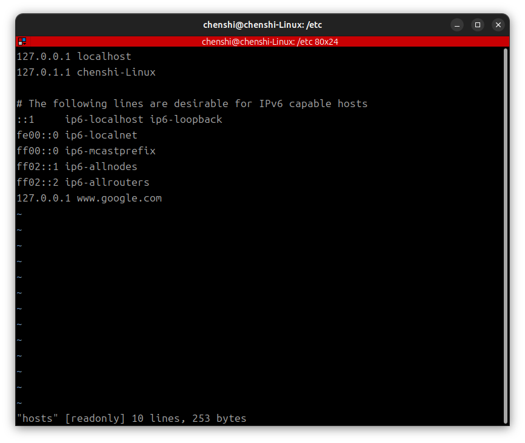
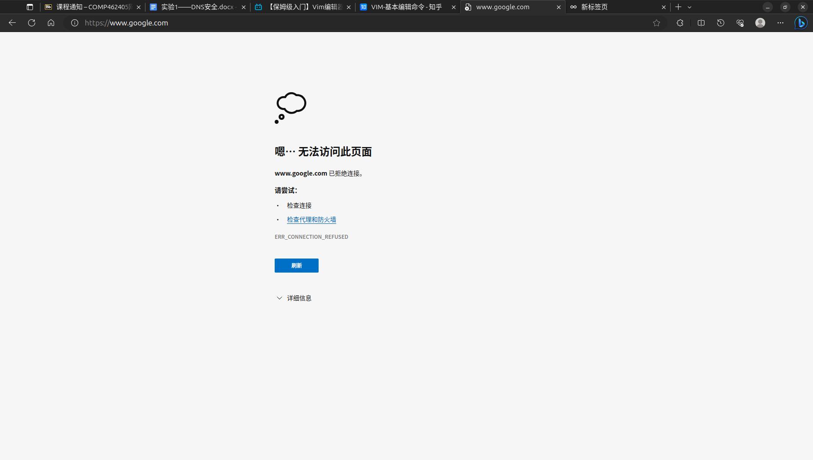

# 网络与信息安全课内实验1——Host文件与DNS投毒

## 1. 实验环境

1. Server: Ubuntu 18.04.6 LTS 虚拟机，安装DNS服务器bind9

2. Attacker：Ubuntu 23.10 虚拟机，与server处于同一网段（局域网）

## 2. 实验原理

### 1. HOST文件和DNS服务器的作用

HOST文件和DNS服务器都是用来实现域名解析的，HOST文件是一个本地的文本文件，用来存储IP地址和域名的映射关系，当用户访问一个域名时，==系统会首先查找HOST文件==，如果找到了对应的IP地址，就会直接访问该IP地址，如果没有找到，就会向DNS服务器发出请求，DNS服务器会返回对应的IP地址，然后用户就可以访问该IP地址了。

### 2. DNS投毒的原理

DNS服务器会缓存域名和IP地址的映射关系，当用户访问一个域名时，==DNS服务器会首先查找缓存==，如果找到了对应的IP地址，就会直接返回该IP地址，如果没有找到，就会向上级DNS服务器发出请求，上级DNS服务器会返回对应的IP地址，然后DNS服务器会将该映射关系缓存起来，然后再返回给用户。DNS投毒就是通过修改DNS服务器的缓存，将域名和错误的IP地址映射起来，当用户访问该域名时，DNS服务器会返回错误的IP地址，用户就无法访问该域名了。

## 3. 实验过程

### 修改HOST文件

1. 添加语句 `127.0.0.1 www.google.com`，保存退出。
    

2. 在浏览器中访问`www.google.com`，可以看到无法访问该网站。
     

### 使用 dig 工具查看网站域名解析过程

1. 使用dig名称解析`www.baidu.com`,`www.baidu.com`的A记录（IPv4地址）返回了两个IP地址：
    a. 110.242.68.4，TTL为600秒
    b. 110.242.68.3，TTL为600秒
这表示 `www.baidu.com` 在DNS中有两个IPv4地址，可以用于访问百度的网站.


2. 使用 dig +trace 命令，查看`www.bilibili.com`完整的解析过程：
    1. 首先，查询从本地DNS服务器（`127.2.0.17`）开始。
    2. 本地DNS服务器向根DNS服务器发送查询请求，根DNS服务器负责根域（.）的域名解析。
    3. 根DNS服务器返回了13个根DNS服务器的NS（Name Server）记录，这些服务器分别由字母标识，例如 `a.root-servers.net`、`b.root-servers.net`等。
    4. 本地DNS服务器选择其中一个根DNS服务器（在这里是 `h.root-servers.net`）并发送查询请求。
    5. 根DNS服务器返回了域名 `www.bilibili.com` 的NS记录，这些记录指向下一级的DNS服务器。
    6. 本地DNS服务器选择其中一个下一级DNS服务器（`a.w.bilicdn1.com`）并发送查询请求。
    7. 下一级DNS服务器返回了域名 `www.bilibili.com`` 的A记录，这些A记录包含了多个IP地址。
    8. 最终，获得了 `www.bilibili.com` 的多个IP地址，这些IP地址可以用于访问Bilibili的网站。


### 3.DNS 投毒实验

1. 配置客户端--安装bind9

    ```bash
    sudo apt-get install bind9
    ```

2. 配置客户端--修改配置文件如下
    

3. 获取客户端的IP地址

    ```bash
    ip address
    ```

    获得的IP地址为`192.168.153.133`
    

4. 配置客户端,目的是使自己的DNS服务IP地址变为设置好的bind9 server的地址。
命令行`sudo gedit /etc/resolv.conf`，将nameserver修改为server的ip地址`192.168.153.133`。


5. 运行投毒程序

    ```bash
    sudo python3 程序.py
    ```

    投毒成功
    

    将`1606120.example.com`的IP地址修改为`1.1.1.1`

6. 在客户端上使用dig命令查看`1606120.example.com`的IP地址，可以看到已经被修改为`1.1.1.1`了.


### 4.dig +trace解析另一个域名

1. 解析`leetcode.cn`

```bash
dig +trace leetcode.cn
```

输出结果如下：

```console
chenshi@chenshi-Linux:~$ dig +trace leetcode.cn

; <<>> DiG 9.18.18-0ubuntu2-Ubuntu <<>> +trace leetcode.cn
;; global options: +cmd
.			987	IN	NS	e.root-servers.net.
.			987	IN	NS	a.root-servers.net.
.			987	IN	NS	f.root-servers.net.
.			987	IN	NS	k.root-servers.net.
.			987	IN	NS	b.root-servers.net.
.			987	IN	NS	l.root-servers.net.
.			987	IN	NS	i.root-servers.net.
.			987	IN	NS	d.root-servers.net.
.			987	IN	NS	c.root-servers.net.
.			987	IN	NS	j.root-servers.net.
.			987	IN	NS	h.root-servers.net.
.			987	IN	NS	g.root-servers.net.
.			987	IN	NS	m.root-servers.net.
;; Received 228 bytes from 127.2.0.17#53(127.2.0.17) in 36 ms

;; communications error to 199.7.83.42#53: timed out
leetcode.cn.		60	IN	CNAME	9tbynm2u.dayugslb.com.
9tbynm2u.dayugslb.com.	60	IN	A	212.64.63.124
;; Received 80 bytes from 199.7.83.42#53(l.root-servers.net) in 28 ms
```

1. 本地DNS服务器首先向根DNS服务器发送查询请求，根DNS服务器返回根域的NS记录。

2. 本地DNS服务器选择其中一个根DNS服务器（这里是 `e.root-servers`.net）并发送查询请求。

3. 根DNS服务器返回了`.cn` 域的NS记录，指向下一级的gtld-servers。

4. 本地DNS服务器选择其中一个gtld-servers并发送查询请求。

5. gtld-servers返回了 `leetcode.cn` 的CNAME记录，该记录指向 `9tbynm2u.dayugslb.com`。

6. 本地DNS服务器获得了 `9tbynm2u.dayugslb.com` 的A记录，其中包含IP地址`212.64.63.124`.

### 阅读 `程序.py`

- 导入必要的模块，包括用于构建和发送网络数据包的`scapy`，以及其他标准库模块。

- 定义`ipv4_addr_check`函数，用于检查IPv4地址的有效性。

- 定义`Get_target_IP_list`函数，用于获取给定域名的上级权威DNS服务器的IP地址列表。

- 定义`fake_q`函数，用于模拟DNS查询请求。

- 定义`DNS_QR`函数，用于发送DNS查询请求并获取响应。

- 定义`DNS_sending`函数，用于伪造DNS响应包并发送。

- 定义`start_poison`函数，似乎是攻击的主要逻辑，它获取目标域名的上级权威DNS服务器IP地址，然后在一个循环中，构造随机域名并发送DNS查询请求，同时发送伪造的DNS响应包，以尝试进行DNS缓存投毒攻击。

## 4. 实验中遇到的困难，解决方式

1. 作为大三的学生刚学到计算机网络，对于网络的知识还不是很熟悉，对于实验的原理和过程不是很了解，需要查阅大量的资料，才能完成实验。
2. 在助教老师未发布配置好的Server虚拟机镜像之前，需要自己配置Server虚拟机，配置过程中遇到了很多问题，例如无法访问外网、无法安装软件，自己安装的虚拟机版本过高(23.10 版本)导致配置bind9的时候有问题，最后重新安装了18.04.6 LTS版本的虚拟机才解决了问题。
3. `dig +trace 网址`的输出与老师教程中的不匹配，需要自己查阅资料，才能理解输出的含义。

## 5. 实验总结

1. 通过本次实验，我了解了HOST文件和DNS服务器的作用，以及DNS投毒的原理。
2. 通过本次实验，我学会了使用dig命令查看域名解析过程，以及使用dig +trace命令查看完整的域名解析过程。
3. 通过本次实验，我学会了使用bind9搭建DNS服务器，以及使用scapy库构造和发送网络数据包。
4. 通过本次实验，我学会了使用Python编程语言，编写网络攻击程序。
5. 通过本次实验，我学会了DNS缓存投毒攻击的原理和实现方法。
