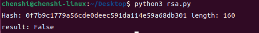

# 网络与信息安全课内实验三--对称、非对称加解密

## 实验目的

1. 加深对非对称，对称加解密算法、散列函数的理解。
2. 了解常用加密工具包以及相关库函数的使用。
3. 了解ssl协议

## 实验平台

1. ubuntu虚拟机 22.04.3，python3.10.12

## 实验步骤

### 1. 对称加解密--AES算法

1. **加密原理**：==**AES算法是一种对称加密算法，加密和解密使用相同的秘钥，加密和解密使用相同的向量iv，加密和解密使用相同的模式，才能解密成功**。本次实验使用是是CBC模式，它的思路是在此前的基础上，**将前一个密文块与当前明文块进行异或运算**，然后再进行加密。这样增加了加密的随机性，使得相同的明文块在不同加密过程中产生不同的密文块，增加了安全性。==

2. **安装pycryptodome**

    ```shell
    pip install pycryptodome
    ```

3. **实验代码**

    ```python
    from Crypto.Cipher import AES
    from binascii import b2a_hex, a2b_hex


    # 如果text不足16位的倍数就用空格补足为16位
    def add_to_16(text):
        if len(text.encode('utf-8')) % 16:
            add = 16 - (len(text.encode('utf-8')) % 16)
        else:
            add = 0
        text = text + ('\0' * add)
        return text.encode('utf-8')


    # 加密函数
    def encrypt(text,key):
        key = key.encode('utf-8')
        mode = AES.MODE_CBC
        iv = b'qqqqqqqqqqqqqqqq'
        text = add_to_16(text)
        cryptos = AES.new(key, mode, iv)
        cipher_text = cryptos.encrypt(text)
        #因为AES加密后的字符串不一定是ascii字符集的，输出保存可能存在问题，所以这里转为16进制字符串
        return b2a_hex(cipher_text)


    # 解密后，去掉补足的空格用strip() 去掉
    def decrypt(text,key):
        key = key.encode('utf-8')
        iv = b'qqqqqqqqqqqqqqqq'
        mode = AES.MODE_CBC
        cryptos = AES.new(key, mode, iv)
        plain_text = cryptos.decrypt(a2b_hex(text))
        return bytes.decode(plain_text).rstrip('\0')


    if __name__ == '__main__':
        str1 = "I am so handsome..."
        e = encrypt(str1,'0123456789101112')  # 加密
        d = decrypt(e,'0123456789101112')  # 解密
        print("原文:",str1)
        print("加密:", e)
        print("解密:", d)
    ```

    **代码解析**：

    1. add_to_16()函数：如果text不足16位的倍数就用空格补足为16位，补足前要转化为utf-8编码，因为中文字符占用两个字节，而英文字符占用一个字节
    2. encrypt()函数：加密函数，包含三个参数，第一个参数为要加密的字符串，第二个参数为密钥。采用CBC模式，==向量iv的目的是：使相同的明文在不同加密过程中产生不同的密文，增加了安全性==
    3. decrypt()函数：解密函数，包含两个参数，第一个参数为要解密的字符串，第二个参数为密钥。
    4. ==解密要求加密和解密使用相同的秘钥和向量iv，否则解密失败==

4. **运行结果**

    

### 2. 非对称加解密--RSA算法

1. **加密原理**：==**根据数论，寻求两个大素数比较简单，而将它们的乘积进行因式分解却极其困难，因此可以将乘积公开作为加密密钥**==。
2. 实验代码

    ```python
    from Crypto import Random
    from Crypto.Hash import SHA
    from Crypto.Cipher import PKCS1_v1_5 as Cipher_pkcs1_v1_5
    from Crypto.Signature import PKCS1_v1_5 as Signature_pkcs1_v1_5
    from Crypto.PublicKey import RSA

    # 伪随机数生成器
    random_generator = Random.new().read
    # rsa算法生成实例
    rsa = RSA.generate(1024, random_generator)
    
    # master的秘钥对的生成
    private_pem = rsa.exportKey()
    
    with open('master-private.pem', 'wb') as f:
    f.write(private_pem)
    
    public_pem = rsa.publickey().exportKey()
    with open('master-public.pem', 'wb') as f:
    f.write(public_pem)


    #%%
    import base64
    message = b"hello, this is a plian text"
    with open('master-public.pem') as f:
        key = f.read()
        rsakey = RSA.importKey(key)
        cipher = Cipher_pkcs1_v1_5.new(rsakey)
        cipher_text = base64.b64encode(cipher.encrypt(message))
        print ('加密后:',cipher_text)


    with open('master-private.pem') as f:
        key = f.read()
        rsakey = RSA.importKey(key)
        cipher = Cipher_pkcs1_v1_5.new(rsakey)
        text = cipher.decrypt(base64.b64decode(cipher_text), random_generator)
        print ('解密的原文:',text)
    ```

    **代码解析**

    1. 用伪随机生成的随机数来生成一对1024为的公私钥，加密使用公钥，解密使用私钥
    2. 生成的公私钥保存在master-public.pem和master-private.pem文件中
    3. 加密后使用base64编码，因为加密后的字符串不一定是ascii字符集的，输出保存可能存在问题，所以这里转为base64编码

3. **运行结果**
   

### 数字签名--RSA算法

1. 原理：发送方使用私钥对消息进行签名，接收方使用公钥对签名进行验证，如果验证成功，则说明消息确实是发送方发送的，没有被篡改过。

2. 实验代码

    ```python
    from Crypto import Random
    from Crypto.Hash import SHA
    from Crypto.Cipher import PKCS1_v1_5 as Cipher_pkcs1_v1_5
    from Crypto.Signature import PKCS1_v1_5 as Signature_pkcs1_v1_5
    from Crypto.PublicKey import RSA

    # 伪随机数生成器
    random_generator = Random.new().read
    # rsa算法生成实例
    rsa = RSA.generate(1024, random_generator)
    
    # master的秘钥对的生成
    private_pem = rsa.exportKey()
    
    with open('master-private.pem', 'wb') as f:
    f.write(private_pem)
    
    public_pem = rsa.publickey().exportKey()
    with open('master-public.pem', 'wb') as f:
    f.write(public_pem)

    #%%
    n = b'This is a test message'
    h = SHA.new() 
    h.update(n)
    print('Hash:',h.hexdigest(),'length:',len(h.hexdigest())*4) 

    sign_txt = 'sign.txt'

    with open('master-private.pem') as f:
        key = f.read()
        private_key = RSA.importKey(key)
        hash_obj = SHA.new(n)
        signer = Signature_pkcs1_v1_5.new(private_key)
        d = base64.b64encode(signer.sign(hash_obj))

    f = open(sign_txt,'wb') 
    f.write(d) 
    f.close()

    with open('master-private.pem') as f:
        key = f.read()
        public_key = RSA.importKey(key) 
        sign_file = open(sign_txt,'r') 
        sign = base64.b64decode(sign_file.read()) 
        h = SHA.new(n)
        verifier = Signature_pkcs1_v1_5.new(public_key)
        print('result:', verifier.verify(h,sign))
    ```

    **代码解析**

    1. 计算目标消息的hash值，通过私钥对hash值进行签名，保存在sign.txt文件中
    2. 读取sign.txt文件中的签名，通过公钥对签名进行验证，如果验证成功，则说明消息确实是发送方发送的，没有被篡改过。
3. **运行结果**

    

    输出的是目标消息的hash值，长度为160位，验证结果为True，说明消息确实是发送方发送的，没有被篡改过。

### TLS协议

1. 原理介绍：TLS：(Transport Layer Security，传输层安全协议)，用于两个应用程序之间提供保密性和数据完整性。该协议由两层组成：TLS记录协议和TLS握手协议。
2. 访问`https://www.bilibili.com`，在wireshark中使用dns过滤器，查找bilibili字符。
    
    查找到了bilibili的ip地址为**218.60.18.18**

3. 使用**ip.addr==218.60.18.18 && tls**过滤器,查找到了bilibili的ssl握手过程
    
    1. client向sever发送**client hello**报文，
    2. server向client发送**server hello，certificate，server key exchange，server hello done**报文。
    3. client向server发送**client key exchange，change cipher spec，encrypted handshake message**报文。

4. client hello报文包含了客户端支持的协议版本，一个客户端生成的随机数，以及客户端支持的加密方法。server hello报文包含了服务器选择的协议版本，一个服务器生成的随机数，以及服务器选择的加密方法。certificate报文包含了服务器的证书。server key exchange报文包含了服务器的公钥。client key exchange报文包含了客户端的公钥。change cipher spec报文通知对方，下一条报文的加密方法。encrypted handshake message报文包含了握手过程中的所有消息，这些消息使用前面协商的加密方法加密。
5. 完成了握手过程后，client向server发送http请求，server向client发送http响应，这些报文都是使用前面协商的加密方法加密的。

## 实验思考题

1. 为什么要使用iv向量？

    iv向量的目的是：使相同的明文在不同加密过程中产生不同的密文，增加了安全性

2. RSA【公钥加密，私钥解密】和【私钥加密，公钥解密】算法一样吗？为什么？

    一致，因为公钥和私钥是一对，公钥加密，私钥解密，私钥加密，公钥解密，都是使用的同一对密钥。但是两种方式的应用场景不同，公钥加密，私钥解密，适用于加密通信，是为了确保发送方发出去的信息不会被第三方窃取，私钥加密，公钥解密，适用于数字签名，是为了确保接收方收到的信息确实是发送方发出的，没有被篡改过。

3. 书写数字签名的注释，每行都干了些什么？并任意举一个例子使得result=False。

    ```python
    # 导入相关库
    from Crypto import Random
    from Crypto.Hash import SHA
    from Crypto.Cipher import PKCS1_v1_5 as Cipher_pkcs1_v1_5
    from Crypto.Signature import PKCS1_v1_5 as Signature_pkcs1_v1_5
    from Crypto.PublicKey import RSA

    # 伪随机数生成器
    random_generator = Random.new().read
    # rsa算法生成实例
    rsa = RSA.generate(1024, random_generator)
    
    # master的秘钥对的生成
    private_pem = rsa.exportKey()
    
    # 将私钥保存在master-private.pem文件中
    with open('master-private.pem', 'wb') as f:
    f.write(private_pem)
    
    # 将公钥保存在master-public.pem文件中
    public_pem = rsa.publickey().exportKey()
    with open('master-public.pem', 'wb') as f:
    f.write(public_pem)

    #%%
    # 目标消息
    n = b'This is a test message'
    # 新建一个hash对象
    h = SHA.new()
    # 更新hash对象为目标消息的hash值 
    h.update(n)
    # 打印目标消息的hash值和长度
    print('Hash:',h.hexdigest(),'length:',len(h.hexdigest())*4) 

    # 签名文件
    sign_txt = 'sign.txt'

    # 读取私钥
    with open('master-private.pem') as f:
        # 读取私钥
        key = f.read()
        # 导入私钥
        private_key = RSA.importKey(key)
        # 新建一个hash对象为目标消息的hash值
        hash_obj = SHA.new(n)
        # 新建一个签名对象
        signer = Signature_pkcs1_v1_5.new(private_key)
        # 对目标消息的hash值进行签名
        d = base64.b64encode(signer.sign(hash_obj))

    # 将签名保存在sign.txt文件中
    f = open(sign_txt,'wb') 
    f.write(d) 
    f.close()
    
    # 打开名为 'master-private.pem' 的文件，该文件应该包含私钥信息
    with open('master-private.pem') as f:
        # 读取私钥信息
        key = f.read()
        # 使用 RSA 模块的 importKey 方法导入私钥
        public_key = RSA.importKey(key)
        # 打开名为 'sign_txt' 的文件，该文件包含签名信息
        sign_file = open(sign_txt,'r')
        # 从文件中读取签名信息并使用 base64 解码
        sign = base64.b64decode(sign_file.read())
        # 创建 SHA.new 对象，用于计算消息的摘要
        h = SHA.new(n)
        # 创建 Signature_pkcs1_v1_5 对象，用于验证签名
        verifier = Signature_pkcs1_v1_5.new(public_key)
        # 打印验证结果，如果签名有效则返回 True，否则返回 False
        print('result:', verifier.verify(h, sign))
    ```

    运行一次程序后，修改sign.txt文件中的签名，删除最后5个字符，再删去源代码中生成签名的代码，再次运行程序，结果如下：
    
    可以看到，result=False，说明签名无效，消息被篡改过。

4. 详细分析ssl 协议通信握手过程。
   1. client向sever发送**client hello**报文，
   2. server向client发送**server hello，certificate，server key exchange，server hello done**报文。
   3. client向server发送**client key exchange，change cipher spec，encrypted handshake message**报文。

   4. client hello报文包含了客户端支持的协议版本，一个客户端生成的随机数，以及客户端支持的加密方法。server hello报文包含了服务器选择的协议版本，一个服务器生成的随机数，以及服务器选择的加密方法。certificate报文包含了服务器的证书。server key exchange报文包含了服务器的公钥。client key exchange报文包含了客户端的公钥。change cipher spec报文通知对方，下一条报文的加密方法。encrypted handshake message报文包含了握手过程中的所有消息，这些消息使用前面协商的加密方法加密。
   5. 完成了握手过程后，client向server发送http请求，server向client发送http响应，这些报文都是使用前面协商的加密方法加密的。

## 实验中遇到的问题与心得体会

1. 在用wireshark抓包时，不知道怎么抓取指定域名的报文，后来查找相关资料，结合上次实验的经验，使用dns过滤器，查找到了bilibili的ip地址，再用ip过滤器，就可以抓取到bilibili的报文了。
2. RSA算法的学习使我明白了SSH协议的原理，SSH协议是基于RSA算法的，例如我们要向github提交代码，需要使用SSH协议，生成一个公私钥对，将公钥添加到github上，github通过次此公钥对我们的身份进行验证，如果验证成功，就可以提交代码了。