# 网络与信息安全课内实验四--WEB安全实验

## 实验目的

1. 搭建安全靶场，熟悉常见的WEB安全漏洞

2. 了解并掌握相关工具寻找漏洞及注入点

3. 掌握漏洞的保护方式

## 实验平台

1. client端 ubuntu虚拟机 22.04.3
2. server端 ubuntu虚拟机 22.04.3

## 实验步骤

### 1. 搭建安全靶场

1. 卸载原有的apache2,安装XAMPP，安装DVW

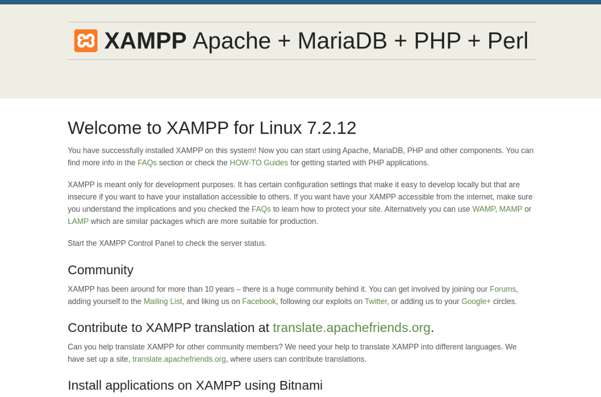
2. 将DVW的文件夹放入/opt/lampp/htdocs/下，启动XAMPP
3. 在浏览器中输入localhost/DVWA/login.php，进入DVWA的登录界面
4. 输入用户名admin，密码password，进入DVWA的主界面
5. 点击Create/Reset Database，创建数据库
6. 点击DVWA Security，将Security设置为low
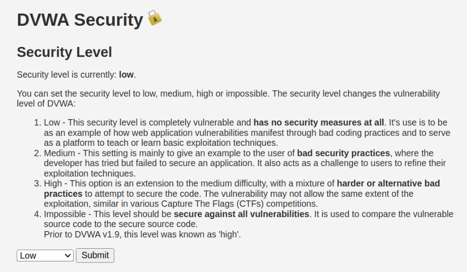

### 2. Brute Force 暴力破解

1. 安装Burp Suite
2. 为了方便我们使用Burp Suite来抓包改包，将浏览器的代理设置为如下图所示
   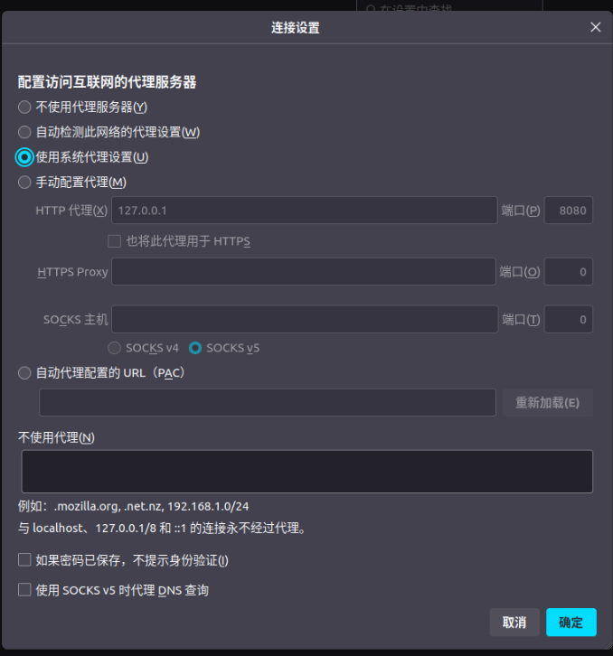
3. 启动Burp Suite，点击Proxy，点击Intercept is on，如此后Burp Suite会拦截所有源自127.0.0.1的请求
4. 在浏览器中输入localhost/DVWA/login.php，点击forward，进入DVWA的登录界面，

截获的报文如下
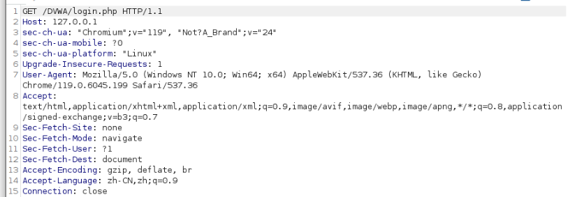

5. 输入用户名admin，密码password，点击Login，进入DVWA的主界面，截获的报文如下
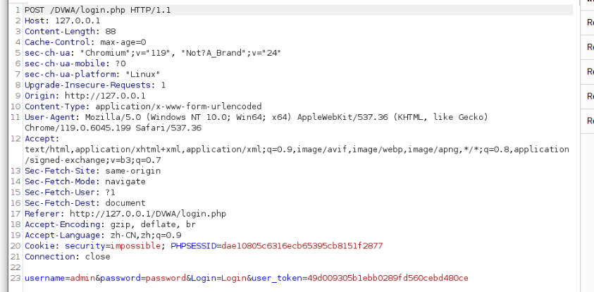

    可以看到，我们的用户名和密码都被明文传输，这是十分不安全的，我们可以通过Burp Suite来修改报文，将用户名和密码改为我们想要的用户名和密码。

6. 在DVWA的主界面，点击Brute Force，进入Brute Force的界面，点击View Source，==查看源代码，可以看到，DVWA的用户名是admin==，我们可以通过Brute Force来暴力破解用户名和密码。
    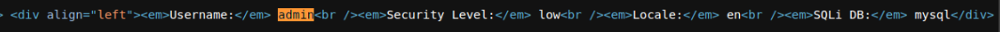
7. 输入用户名admin，随机输入一个密码，点击Login，截获的报文如下

    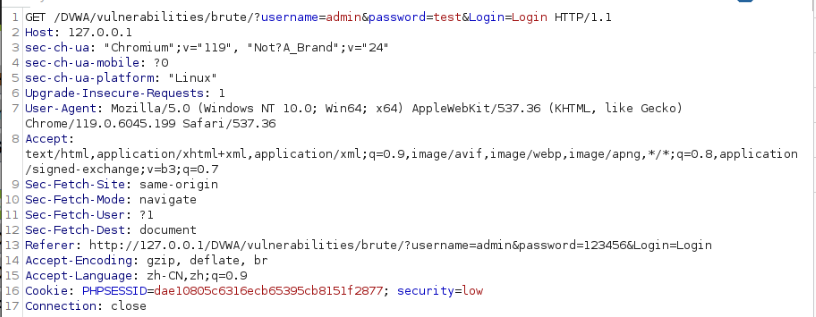

    可以看到，我们的输入的用户名和密码都被明文传输，附在了报文的状态行中。

8. 将截获的报文发送到Intruder，标记密码字段
   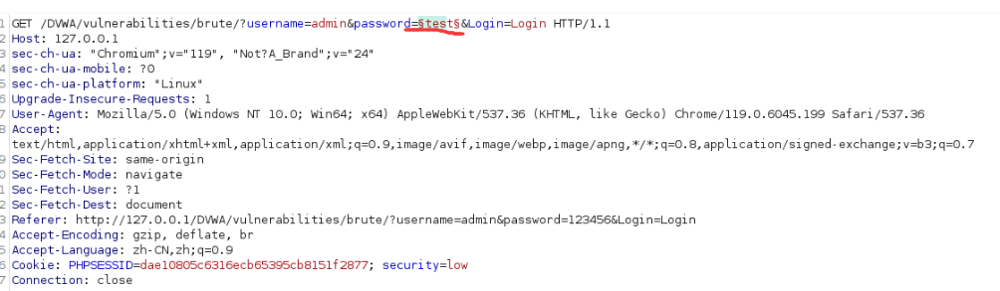
9. 在Payloads中设置Payload Settings[Simple List]，添加密码字典，设置一些常见的密码如下
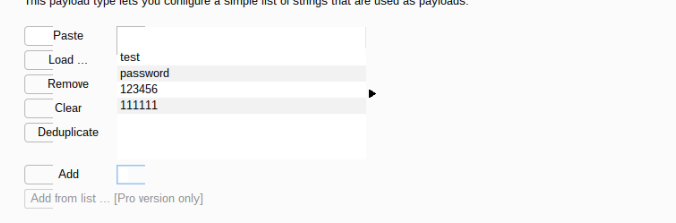
10. 点击Start Attack，开始暴力破解
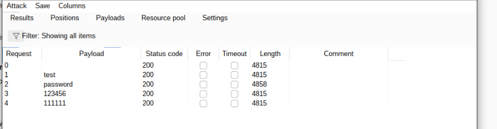
11. 可以看到，当密码为password时，返回的字段长度与其他密码不同，说明密码为password，输入用户名admin，密码password，点击Login，成功登录
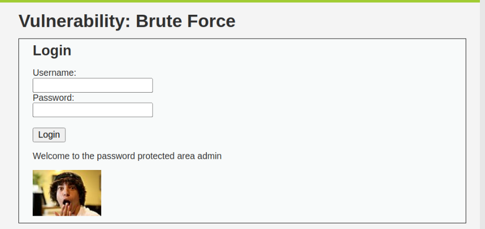

### 3. SQL Injection SQL注入

1. 原理简介：SQL注入是另一种很常见的攻击方式，主要的攻击方式是通过把SQL命令插入到Web表单或页面请求的查询字符串，最终达到欺骗服务器执行恶意的SQL命令
2. 举个简单的例子，输入的用户名被拼接到SQL语句中，如果用户名被拼接到SQL语句中，那么我们可以通过输入一些特殊的字符来改变SQL语句的含义，从而达到欺骗服务器执行恶意的SQL命令的目的。
如下图所示，我们输入的用户名被拼接到SQL语句中，如果我们输入的用户名为admin' or '1'='1，那么SQL语句就变成了select \* from users where user='admin' or '1'='1'，select \* from users where user='admin' or '1'='1'的含义是查询users表中的所有数据，因为'1'='1'是恒成立的，所以这条SQL语句的含义就变成了查询users表中的所有数据，这样我们就可以通过输入admin' or '1'='1来绕过登录，登录成功。

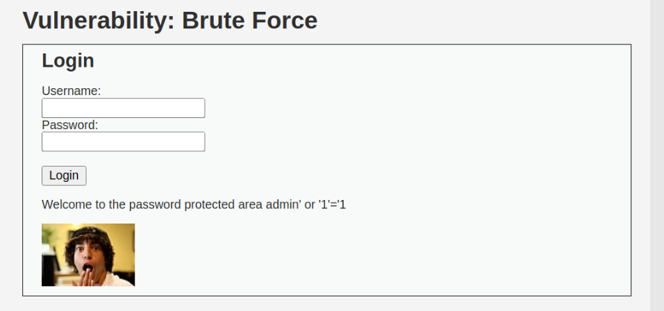

### 4. ARP Spoofing ARP欺骗

1. 原理简介：ARP欺骗是一种通过伪造ARP协议的地址解析表来实现的网络攻击方式，ARP协议是一种用于解析目标IP地址的MAC地址的协议，ARP欺骗的原理是攻击者发送伪造的ARP协议包，将自己的MAC地址伪装成目标IP地址的MAC地址，从而达到欺骗目标主机的目的。

#### 实验步骤

1. 在攻击端上安装ettercap和driftnet

    ```shell
    sudo apt-get install ettercap-common
    sudo apt-get install driftnet
    ```

2. 查询两台虚拟机的IP与网关，两台虚拟机在同一网段，攻击端的IP地址为`192.168.153.135`，受害端的IP地址为`192.168.153.137`,两台虚拟机的网关地址相同为`192.168.153.2`
3. 使用下面的命令行查询网卡，名称为`ens33`

    ```shell
    ifconfig -a
    ```

    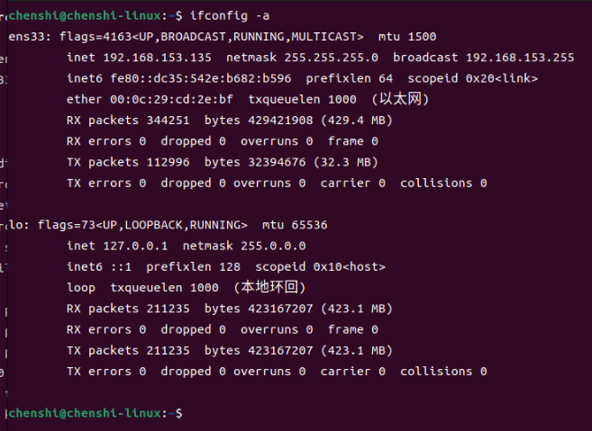

4. 信息汇总：

    | 虚拟机名称 | IP地址         | MAC地址               | 
    | ---------- | -------------- | ---------------------|
    | 攻击端     |192.168.153.135 | 00:0c:29\:cd:2e:bf     |
    | 受害端     |192.168.153.137 | 00:0c:29\:f1:bd:10     |
    | 网关       |192.168.153.2   | 00:50:56\:e5:15:70     |

5. 通过运行以下命令来启用 IP 转发：

    ```shell
    cat /proc/sys/net/ipv4/ip_forward
    echo “1”> /proc/sys/net/ipv4/ip_forward
    ```

6. 使用ettercap来进行ARP欺骗，运行以下命令

    ```shell
    sudo ettercap -Tqi ens33 -M arp:remote ////
    ```

    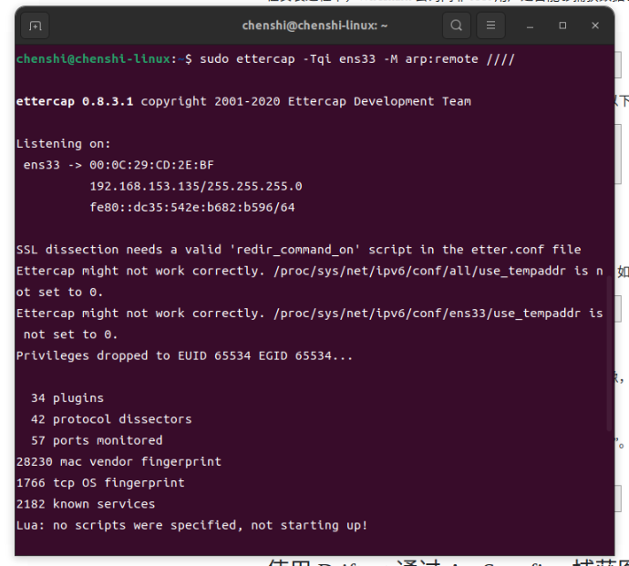

7. 查询受害端的ARP表，可以看到，受害端的ARP表中的网关的MAC地址被修改为了攻击端的MAC地址，如下图所示。
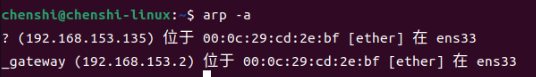

8. 在受害端代开西安交通大学的官网，可以看到，driftnet截获了受害端的获得的图片，如下图所示。


9. 攻击端向受害端发送ARP欺骗包，

    ```txt
    Frame 8149: 42 bytes on wire (336 bits), 42 bytes captured (336 bits) on interface ens33, id 0
    Ethernet II, Src: VMware_cd:2e:bf (00:0c:29:cd:2e:bf), Dst: VMware_f1:bd:10 (00:0c:29:f1:bd:10)
    Address Resolution Protocol (reply)
        Hardware type: Ethernet (1)
        Protocol type: IPv4 (0x0800)
        Hardware size: 6
        Protocol size: 4
        Opcode: reply (2)
        Sender MAC address: VMware_cd:2e:bf (00:0c:29:cd:2e:bf)
        Sender IP address: 192.168.153.2
        Target MAC address: VMware_f1:bd:10 (00:0c:29:f1:bd:10)
        Target IP address: 192.168.153.137
    [Duplicate IP address detected for 192.168.153.2 (00:0c:29:cd:2e:bf) - also in use by 00:50:56:e5:15:70 (frame 8148)]
        [Frame showing earlier use of IP address: 8148]
            [Expert Info (Warning/Sequence): Duplicate IP address configured (192.168.153.2)]
                [Duplicate IP address configured (192.168.153.2)]
                [Severity level: Warning]
                [Group: Sequence]
        [Seconds since earlier frame seen: 0]
    [Duplicate IP address detected for 192.168.153.137 (00:0c:29:f1:bd:10) - also in use by 00:0c:29:cd:2e:bf (frame 8148)]
        [Frame showing earlier use of IP address: 8148]
            [Expert Info (Warning/Sequence): Duplicate IP address configured (192.168.153.137)]
                [Duplicate IP address configured (192.168.153.137)]
                [Severity level: Warning]
                [Group: Sequence]
        [Seconds since earlier frame seen: 0]

    ```

2.  解析ARP包：

    1. Frame 8149: 42 bytes on wire (336 bits), 42 bytes captured (336 bits) on interface ens33, id 0：这一行表示这个ARP包的长度为42字节，即336位，是一个ARP响应包
    2. Ethernet II, Src: VMware_cd:2e:bf (00:0c:29\:cd\:2e:bf), Dst: VMware_f1:bd:10 (00:0c:29:f1:bd:10)：这一行表示这个ARP包的源MAC地址为00:0c:29\:cd\:2e:bf，目的MAC地址为00:0c:29:f1:bd:10分别为攻击端和受害端的MAC地址，即攻击端向受害端发送ARP欺骗包
    3. Address Resolution Protocol (reply)：这一行表示这个ARP包是一个ARP响应包
    4. Hardware type: Ethernet (1)：这一行表示这个ARP包的硬件类型为以太网
    5. Protocol type: IPv4 (0x0800)：这一行表示这个ARP包的协议类型为IPv4
    6. Hardware size: 6：这一行表示这个ARP包的硬件地址长度为6
    7. Protocol size: 4：这一行表示这个ARP包的协议地址长度为4
    8. Opcode: reply (2)：这一行表示这个ARP包的操作码为2，即ARP响应包
    9. Sender MAC address: VMware_cd:2e:bf (00:0c:29\:cd\:2e:bf)：这一行表示这个ARP包的源MAC地址为00:0c:29\:cd\:2e:bf，即攻击端的MAC地址
    10. Sender IP address: 192.168.153.2，==这例本来应该是攻击端的IP地址，但是由于攻击端向受害端发送ARP欺骗包，所以攻击端的IP地址被伪装成了网关的IP地址，这样受害端就会将攻击端的MAC地址当作网关的MAC地址，从而将攻击端的MAC地址写入ARP表中，这样攻击端就可以截获受害端的数据包==。
    11. Target MAC address: VMware_f1:bd:10 (00:0c:29:f1:bd:10)
        Target IP address: 192.168.153.137，为受害端的MAC地址和IP地址
    12. [Duplicate IP address detected for 192.168.153.2 (00:0c:29\:cd\:2e:bf) - also in use by 00:50:56:e5:15:70 (frame 8148)]，这是一个警告信息，表示网关的IP地址此前在帧8148中已经与MAC地址00:50:56:e5:15:70绑定过了，现在又与MAC地址00:0c:29\:cd\:2e:bf绑定了。==因为网关自己也在向受害端发送ARP包，所以网关的IP地址被绑定了两次，这也是下面动态ARP检测的原理，我们可以利用这个警告信息来检测ARP欺骗==。

## 漏洞的防御方法

### 1. Brute Force 暴力破解

1. 通过使用SSL/TLS来加密传输的数据，防止数据被窃取
2. 限制用户登录的次数，防止暴力破解
3. 要求用户输入复杂的密码，提高密码的复杂度，防止暴力破解

### 2. SQL Injection SQL注入

1. 对用户输入的数据进行过滤，防止用户输入一些特殊的字符，从而改变SQL语句的含义

### 3. ARP Spoofing ARP欺骗

1. DAI（Dynamic ARP Inspection）- 动态ARP检测，原理可以用两句话简单概括：
   1. 交换机记录每个接口对应的IP地址和MAC，即port<->mac<->ip，生成DAI检测表；
   2. 交换机检测每个接口发送过来的ARP回应包，根据DAI表判断是否违规，若违规则丢弃此数据包并对接口进行惩罚。
2. 我们知道，PC3是在交换机的Port3、MAC地址是MAC3，IP地址是IP3，所以本地DAI表项内容是\<port3-mac3-ip3\>。当交换机从接口Port3收到ARP回应包，内容却是IP2和MAC3映射，即\<port3-mac3-ip2\>。
经判断，这个包就是虚假的欺骗包，交换机马上丢弃这个包，并且可以对接口做惩罚（不同设备的惩罚方式有所不同，可以直接将接口"软关闭"，直接将攻击者断网；也可以"静默处理"，仅丢弃欺骗包，其他通信正常）

## 实验中遇到的问题与心得体会

### 问题

1. Apache2的删除不干净，导致XAMPP无法启动
2. Burp Suite软件安装有问题，按键和文字显示不完全
3. ARP包的数量多，要筛选出攻击端向受害端发送的ARP包，需要花费一定的时间
4. 对SQL语句不太熟悉，不知道如何构造恶意的SQL语句

### 心得体会

1. 通过这次实验，我对WEB安全有了更深的了解，知道了WEB安全的一些常见的漏洞，如SQL注入、XSS、CSRF、SSRF、命令注入、文件上传漏洞等，知道了如何利用这些漏洞来攻击服务器，也知道了如何防御这些漏洞。
2. 通过这次实验，我对ARP协议有了更深的了解，知道了ARP协议的工作原理，知道了ARP欺骗的原理，知道了ARP欺骗的防御方法。
3. 通过这次实验，我对SQL语句有了更深的了解，知道了SQL语句的构成，知道了如何构造恶意的SQL语句，知道了如何防御SQL注入。