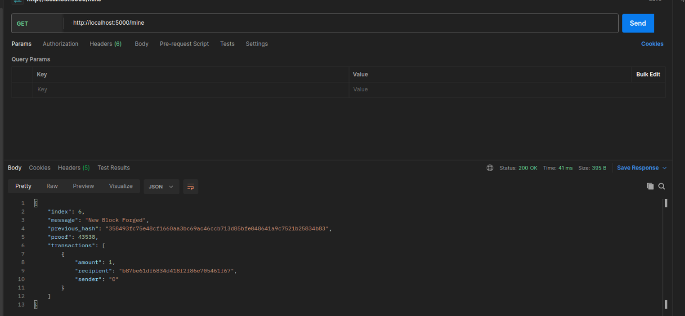

# 网络与信息安全课内实验五——区块链

## 实验目的

1. 了解区块链是个什么东西。
2. 搭建一个自己的区块链。

## 实验平台

1. ubuntu虚拟机 22.04.3，python3.10.12

## 实验步骤

### 1. 什么是区块链

1. 区块链是一个分布式数据库，它的特点是：

   1. 无需第三方的参与，就可以完成数据的存储和传递。
   2. 数据是以区块的形式存储，每个区块都有一个时间戳，每个区块都有一个指向前一个区块的指针，这样就形成了一个链表。
   3. 区块链的数据是不可篡改的，因为每个区块都有一个哈希值，这个哈希值是由区块中的数据和前一个区块的哈希值计算得到的，如果有人篡改了某个区块中的数据，那么这个区块的哈希值就会发生变化，这样就会影响到后面所有的区块，这样就会被发现。

2. 区块链是基于哈希的，哈希算法的特点是：

   1. 输入的数据不同，输出的哈希值也不同。
   2. 输入的数据相同，输出的哈希值也相同。
   3. 无法从哈希值反推出输入的数据。

3. 区块链的应用非常广泛，以下是一些主要的应用领域：

   1. 金融：区块链最初是为比特币而创建的，因此，它在金融领域有着广泛的应用，如跨境支付、智能合约、证券交易等。
   2. 供应链管理：区块链可以提供完整的产品历史记录，从生产到销售，每一步都可以在区块链上记录和验证，提高供应链的透明度。
   3. 版权保护：区块链可以用于数字版权保护，创作者可以将作品信息存储在区块链上，保护其版权。
   4. 医疗保健：区块链可以用于患者的医疗记录管理，保证数据的安全和隐私。
   5. 身份验证：区块链可以用于身份验证，提供安全、无法篡改的身份信息。

### 2. 搭建一个区块链

#### 1. 环境准备

   1. 安装python3.10.12

      ```shell
      sudo apt install python3.10.12
      ```

   2. 安装pip3

      ```shell
      sudo apt install python3-pip
      ```

   3. 安装flask

      ```shell
      pip3 install flask
      ```

   4. 安装requests

      ```shell
      pip3 install requests
      ```

   5. 安装Postman

      ```shell
      sudo snap install postman
      ```

#### 2. 区块链的结构

1. 区块链

    ```python
    block = {
        'index': 1,
        'timestamp': 1506057125.900785,
        'transactions': [
            {
                'sender': "8527147fe1f5426f9dd545de4b27ee00",
                'recipient': "a77f5cdfa2934df3954a5c7c7da5df1f",
                'amount': 5,
            }
        ],
        'proof': 324984774000,
        'previous_hash': "2cf24dba5fb0a30e26e83b2ac5b9e29e1b161e5c1fa7425e73043362938b9824"
    }
    ```

2. ==index：区块的索引，表示区块在区块链中的位置。作用是方便区块的查找。==
3. ==timestamp：时间戳，表示区块的创建时间。这个时间戳有助于确定区块的创建顺序，并在需要时验证时间相关的操作。==
4. ==transactions：交易信息，表示区块中的交易信息。用于存储我们希望添加到区块中的数据。在比特币中，交易信息包括发送方、接收方、金额等。==
5. ==proof：工作量证明，表示区块的工作量证明。这个工作证明在本次实验中是一个数，要求是与前一个的工作量证明拼接后的字符串的哈希值以4个0开头。==
6. ==previous_hash：前一个区块的哈希值，增加篡改区块的难度，修改一个区块会影响到后面所有的区块，提高了区块链的安全性。==

#### 3. 工作量证明

1. 工作量证明的目的是为了保证区块链的安全性，防止有人篡改区块链中的数据。

2. 工作量证明的过程是：

    1. 有一个数x，要求这个数x与前一个区块的工作量证明y拼接后的字符串的哈希值以4个0开头。
    2. 为了找到这个数x，需要不断的尝试，直到找到为止。

3. 工作量证明的代码如下：

    ```python
    def proof_of_work(self, last_proof):
        proof = 0
        while self.valid_proof(last_proof, proof) is False:
            proof += 1
        return proof

    @staticmethod
    def valid_proof(last_proof, proof):
        guess = f'{last_proof}{proof}'.encode()
        guess_hash = hashlib.sha256(guess).hexdigest()
        return guess_hash[:4] == "0000"
    ```

4. 代码解析

    1. valid_proof：验证工作量证明是否有效。
        1. guess：拼接后的字符串。
        2. guess_hash：拼接后的字符串的哈希值。
        3. guess_hash[:4] == "0000"：判断哈希值是否以4个0开头。
    2. proof_of_work：找到工作量证明。
        1. proof：工作量证明。
        2. while self.valid_proof(last_proof, proof) is False:：如果工作量证明无效，就继续尝试。
        3. return proof：返回工作量证明。

5. 问题分析: proof_of_work写的有一点问题，请说明它有什么问题，可能导致什么结构，并进行修正。

    见文末问题回答。

#### 4. Blockchain 作为 API 接口

1. 代码

    ```python
    # Instantiate our Node
    app = Flask(__name__)

    # Generate a globally unique address for this node
    node_identifier = str(uuid4()).replace('-', '')

    # Instantiate the Blockchain
    blockchain = Blockchain()


    @app.route('/mine', methods=['GET'])
    def mine():
        # We run the proof of work algorithm to get the next proof...
        last_block = blockchain.last_block
        last_proof = last_block['proof']
        proof = blockchain.proof_of_work(last_proof)

        # We must receive a reward for finding the proof.
        # The sender is "0" to signify that this node has mined a new coin.
        blockchain.new_transaction(
            sender="0",
            recipient=node_identifier,
            amount=1,
        )

        # Forge the new Block by adding it to the chain
        previous_hash = blockchain.hash(last_block)
        block = blockchain.new_block(proof, previous_hash)

        response = {
            'message': "New Block Forged",
            'index': block['index'],
            'transactions': block['transactions'],
            'proof': block['proof'],
            'previous_hash': block['previous_hash'],
        }
        return jsonify(response), 200
    
    @app.route('/transactions/new', methods=['POST'])
    def new_transaction():
        values = request.get_json()

        # Check that the required fields are in the POST'ed data
        required = ['sender', 'recipient', 'amount']
        if not all(k in values for k in required):
            return 'Missing values', 400

        # Create a new Transaction
        index = blockchain.new_transaction(values['sender'], values['recipient'], values['amount'])

        response = {'message': f'Transaction will be added to Block {index}'}
        return jsonify(response), 201

    @app.route('/chain', methods=['GET'])
    def full_chain():
        response = {
            'chain': blockchain.chain,
            'length': len(blockchain.chain),
        }
        return jsonify(response), 200

    if __name__ == '__main__':
        app.run(host='0.0.0.0', port=5000)
        
    ```

2. app = Flask(__name__)：创建一个Flask实例。
3. node_identifier = str(uuid4()).replace('-', '')：创建一个全局唯一的节点标识。
4. blockchain = Blockchain()：创建一个区块链。
5. @app.route('/mine', methods=['GET'])：创建一个路由，用于挖矿。
6. mine()：挖矿函数。
     1. last_block = blockchain.last_block：获取最后一个区块。
     2. last_proof = last_block['proof']：获取最后一个区块的工作量证明。
     3. proof = blockchain.proof_of_work(last_proof)：找到下一个工作量证明。
     4. blockchain.new_transaction：创建一个新的交易，用于给矿工发放奖励。
     5. previous_hash = blockchain.hash(last_block)：计算前一个区块的哈希值。
     6. block = blockchain.new_block(proof, previous_hash)：创建一个新的区块。
     7. response：返回信息。
        1. message: "New Block Forged"：返回字符串信息。
        2. index: block['index']：返回区块的索引。
        3. transactions: block['transactions']：返回区块中的交易信息。
        4. proof: block['proof']：返回区块的工作量证明。
        5. previous_hash: block['previous_hash']：返回前一个区块的哈希值。
     8. return jsonify(response), 200：返回信息。
7. @app.route('/transactions/new', methods=['POST'])：创建一个路由，用于创建新的交易。
8. new_transaction()：创建新的交易。
     1. values = request.get_json()：获取请求中的数据。
     2. required = ['sender', 'recipient', 'amount']：检查数据是否完整。
     3. blockchain.new_transaction：创建新的交易。
     4. response={'message': f'Transaction will be added to Block {index}'}：返回信息。
     5. return jsonify(response), 201：返回信息。
9. @app.route('/chain', methods=['GET']): 创建一个路由，用于返回整个区块链。
10. full_chain()：返回整个区块链。
     1. response：返回信息。
         1. 'chain': blockchain.chain: 返回区块链。
         2. 'length': len(blockchain.chain): 返回区块链的长度。
     2. return jsonify(response), 200：返回信息。

#### 5. 运行区块链

1. 运行区块链

    ```shell
    sudo python3 blockchain.py
    ```

    

2. 使用Postman测试区块链

    1. 通过请求 `http://localhost:5000/mine` （ GET ）来进行挖矿

        

    2. 创建一个交易请求，请求 `http://localhost:5000/transactions/new` ，修改方法为POST，点击Body，选择raw，选择JSON，输入数据，点击Send。

        

    3. 请求 `http://localhost:5000/chain` （ GET ）来查看整个区块链

        

#### 6. 一致性算法

1. 一致性算法的目的是为了保证区块链在不同节点间的一致性，我们将制定最长的有效链条是最权威的规则
2. 添加方法`register_node`

    ```python
    def register_node(self, address):
        """
        Add a new node to the list of nodes
        :param address: <str> Address of node. Eg. 'http://192.168.0.5:5000'
        :return: None
        """

        parsed_url = urlparse(address)
        self.nodes.add(parsed_url.netloc)
    ```

    1. parsed_url = urlparse(address)：urlparse()函数将url分解为6个部分，分别是scheme、netloc、path、params、query、fragment。
    2. self.nodes.add(parsed_url.netloc):将netloc部分添加到节点列表中。
3. 共识算法

    ```python
    def valid_chain(self, chain):
        """
        Determine if a given blockchain is valid
        :param chain: <list> A blockchain
        :return: <bool> True if valid, False if not
        """

        last_block = chain[0]
        current_index = 1

        while current_index < len(chain):
            block = chain[current_index]
            print(f'{last_block}')
            print(f'{block}')
            print("\n-----------\n")
            # Check that the hash of the block is correct
            if block['previous_hash'] != self.hash(last_block):
                return False

            # Check that the Proof of Work is correct
            if not self.valid_proof(last_block['proof'], block['proof']):
                return False

            last_block = block
            current_index += 1

        return True

    def resolve_conflicts(self):
        """
        This is our Consensus Algorithm, it resolves conflicts
        by replacing our chain with the longest one in the network.
        :return: <bool> True if our chain was replaced, False if not
        """

        neighbours = self.nodes
        new_chain = None

        # We're only looking for chains longer than ours
        max_length = len(self.chain)

        # Grab and verify the chains from all the nodes in our network
        for node in neighbours:
            response = requests.get(f'http://{node}/chain')

            if response.status_code == 200:
                length = response.json()['length']
                chain = response.json()['chain']

                # Check if the length is longer and the chain is valid
                if length > max_length and self.valid_chain(chain):
                    max_length = length
                    new_chain = chain

        # Replace our chain if we discovered a new, valid chain longer than ours
        if new_chain:
            self.chain = new_chain
            return True

        return False
    ```

    1. valid_chain：验证区块链是否有效。
        1. last_block = chain[0]：获取第一个区块。
        2. current_index = 1：设置当前索引为1。
        3. while current_index < len(chain):：循环遍历区块链。
        4. block = chain[current_index]：获取当前区块。
        5. if block['previous_hash'] != self.hash(last_block):：判断前一个区块的哈希值是否等于当前区块中的哈希值。
        6. if not self.valid_proof(last_block['proof'], block['proof']):：判断工作量证明是否有效。
        7. last_block = block：将当前区块设置为前一个区块。
        8. current_index += 1：当前索引加1。
        9. return True：返回True。
    2. resolve_conflicts：共识算法。
        1. neighbours = self.nodes：获取节点列表。
        2. max_length = len(self.chain)：获取当前区块链的长度。
        3. for node in neighbours:：遍历节点列表。
        4. response = requests.get(f'http://{node}/chain')：获取节点的区块链。
        5. if response.status_code == 200:：判断请求是否成功。
        6. length = response.json()['length']：获取区块链的长度。
        7. chain = response.json()['chain']：获取区块链。
        8. if length > max_length and self.valid_chain(chain):：判断区块链是否有效。
        9. self.chain = new_chain：将区块链设置为最长的有效区块链。
        10. return True：返回True。

4. 测试

    1. 启动两个节点分别为5000和5001

        
        

    2. 两个节点之间互相注册
        1. `http://localhost:5000/nodes/register` ，修改方法为POST，点击Body，选择raw，选择JSON，输入数据`{"nodes": ["http://127.0.0.1:5001"]}`，点击Send。

            

        2. `http://localhost:5001/nodes/register` ，修改方法为POST，点击Body，选择raw，选择JSON，输入数据`{"nodes": ["http://127.0.0.1:5000"]}`，点击Send。

            

    3. 在5000端口挖矿，请求 `http://localhost:5000/mine` （ GET ）来进行挖矿。

        

    4. 在5000查看区块链，请求 `http://localhost:5000/chain` （ GET ）来查看整个区块链。可以看到长度为6

        

    5. 在5001查看区块链，请求 `http://localhost:5001/chain` （ GET ）来查看整个区块链。可以看到长度为1

        

    6. 在5001端口更新区块链，请求 `http://localhost:5001/nodes/resolve` （ GET ）来更新区块链。更新后，长度为6

        

## 实验中遇到的问题与心得体会

### 问题回答

1. 写出一个block中index、timestamp（时间）、transactions（交易）、proof（工作量证明）、previous_hash各自的用处。

   1. ==index：区块的索引，表示区块在区块链中的位置。作用是方便区块的查找。==
   2. ==timestamp：时间戳，表示区块的创建时间。这个时间戳有助于确定区块的创建顺序，并在需要时验证时间相关的操作。==
   3. ==transactions：交易信息，表示区块中的交易信息。用于存储我们希望添加到区块中的数据。在比特币中，交易信息包括发送方、接收方、金额等。==
   4. ==proof：工作量证明，表示区块的工作量证明。这个工作证明在本次实验中是一个数，要求是与前一个的工作量证明拼接后的字符串的哈希值以4个0开头。==
   5. ==previous_hash：前一个区块的哈希值，增加篡改区块的难度，修改一个区块会影响到后面所有的区块，提高了区块链的安全性。==

2. 这篇文章中的proof_of_work写的有一点问题，请说明它有什么问题，可能导致什么结果，并进行修正，附在实验报告中。

    在生成当前块的proof时，拼接的字符串是last_proof和proof，而不是前一个块的hash和proof。因为如果是拼接last_proof，只是生成了一个只与创世块的proof有关的一系列字符串，与块内容无关，修改块的内容无法被发现。

    ```python
    def proof_of_work(self, last_hash):
        proof = 0
        while self.valid_proof(last_hash, proof) is False:
            proof += 1
        return proof

    @staticmethod
    def valid_proof(last_hash, proof):
        guess = f'{last_hash}{proof}'.encode()
        guess_hash = hashlib.sha256(guess).hexdigest()
        return guess_hash[:4] == "0000"
    ```

3. 本次实验为模拟实验，请指出一点未提到的与实际情况不同的地方

    1. 实际情况中，计算工作量证明时，检验的0的个数是动态的，以保证挖矿的难度不变。
    2. 实际情况中，由于工作量证明的难度很大，因此，挖矿的时间很长，所以交易是先添加到交易池中，等某个矿工挖矿成功后再添加到区块中。一个区块中可以包含2400笔交易，如果交易池中的交易数量超过2400，那么就会选择交易费最高的2400笔交易。
    3. 实际情况中，比特币交易是通过公钥和私钥进行的，公钥相当于银行账号，私钥相当于银行卡密码，公钥可以公开，私钥不能公开，私钥用于签名，公钥用于验证签名。

4. 写出你对区块链的理解或者感受（100字）

    区块链是一个去中心化的技术，它是基于hash的，形成了一个互相关联的有序块链，一旦有人篡改了某个区块，就会影响到后面所有的区块。同时防篡改是通过工作量证明来实现的，工作量证明的过程是通过不断的尝试，直到找到为止，这样就会消耗大量的计算资源，一直有新的区块加入，一旦有人篡改了某个区块，就需要重新计算后面所有的区块，这样就会消耗大量的计算资源，除非有人能够掌控51%的计算资源，否则就无法篡改区块链中的数据。因此，区块链是一个非常安全的技术。区块链的应用前景非常广阔，可以应用于金融、供应链管理、版权保护、医疗保健、身份验证等领域。