# <center>实验一 组合逻辑设计</center>

## 一、实验目的

1. 掌握Verilog语言和Vivado、Logisim开发平台的使用；
2. 掌握基础组合逻辑电路的设计和测试方法。

## 二、实验内容（用Logisim或Vivado实现）

1. 基础门电路（多输入门电路、复用器等）的设计和测试；
2. 基础功能模块（编码器、译码器等）的设计与测试。

## 三、实验要求

1. 掌握Vivado与Logisim开发工具的使用，掌握以上电路的设计和测试方法；
2. 记录设计和调试过程（Verilog代码/电路图/表达式/真值表，Vivado仿真结果，Logisim验证结果等）；
3. 分析Vivado仿真波形/Logism验证结果，注重输入输出之间的对应关系。

## 四、实验过程及分析

### 1. 多输入门电路

1. ==design 代码==
    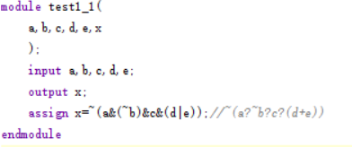
    设置5个输入量`a,b,c,d,e`,1个输出量`x`,将输出`x`按照表达式`~(a⋅~b⋅c⋅(d+e))`设置为`x=~(a&(~b)&c&(d|e));`
    <br><br>
2. ==simulator 代码==
   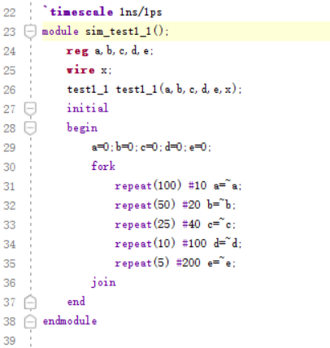
   实例化design代码，利用fork并行块，设置5个输入信号初始为0，分别10，20，40，100，200ns取反一次
    <br><br>
3. ==RTL 图==
    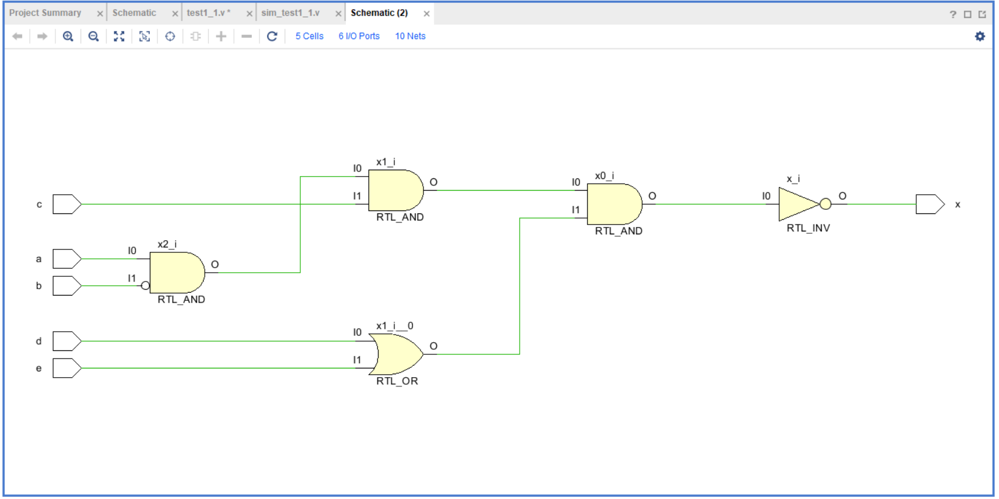
    用两个与非门实现`(a⋅~b⋅c)`,一个或非门实现`(d+e)`，再通过一个与非门和非门实现`~(a⋅~b⋅c⋅(d+e))`
    <br><br>
4. ==simulation图==
   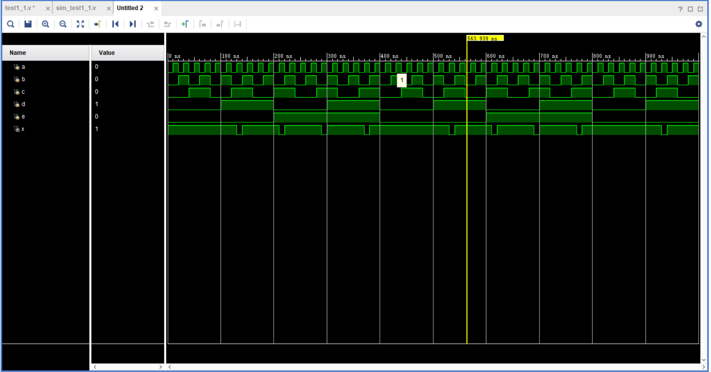
    5个输入信号初始为0，分别10，20，40，100，200ns取反一次，当`a=1,b=0,c=1,d+e>=1`时，输出信号x为高电平，与逻辑表达式匹配
    <br><br>

### 2. 复用器

1. ==design 代码==
    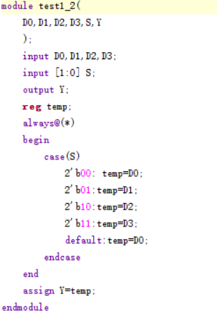
    段Verilog代码表示一个2:1多路选择器。根据输入信号S的值，它选择其中一个数据输入（D0、D1、D2、D3），将其传递到输出Y。如果S的值不匹配任何情况，将默认选择D0。这个多路选择器的操作通过case语句和一个临时寄存器temp实现，最后将temp的值分配给输出Y。
    <br><br>
2. ==simulator 代码==
   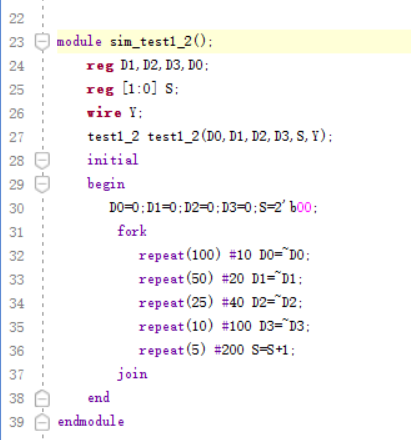
    实例化design代码，利用fork并行块，设置4个输入信号（D0、D1、D2、D3）初始为0，分别10，20，40，100ns取反一次,设置S每200ns自加1
    <br><br>
3. ==RTL 图==
    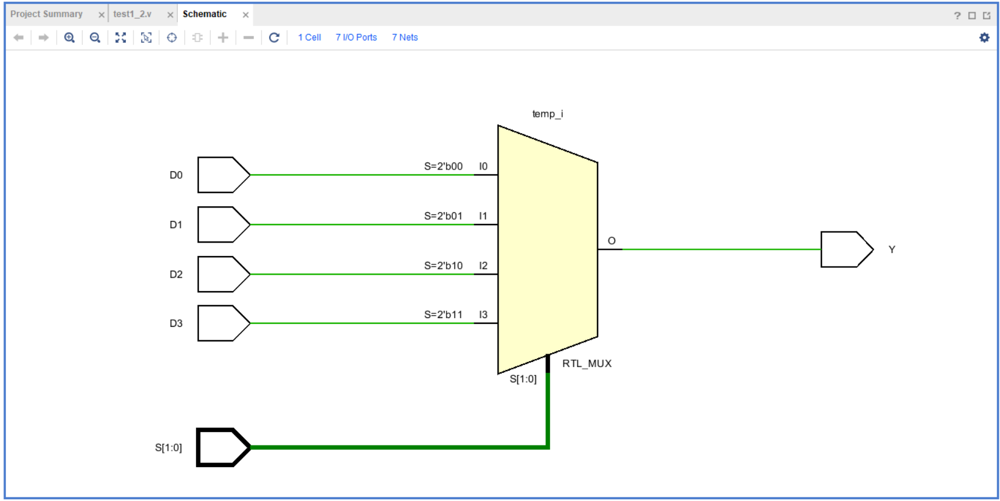
    仿真电路图为一个多路复用器，输入信号为（D0、D1、D2、D3），S为选择信号，按照下面的代码选择输出

    ```c
    case(S)
            2'b00: temp=D0;
            2'b01:temp=D1;
            2'b10:temp=D2;
            2'b11:temp=D3;
    ```

    <br><br>
4. ==simulation图==
   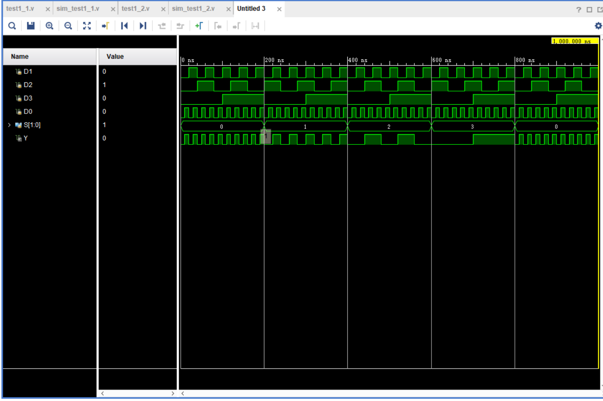
   当S为`00,01,10,11`时，波形分别与`D0,D1,D2,D3`相同，与设计相符合，说明设计正确。
    <br><br>

### 3. 优先编码器

1. ==design 代码==
    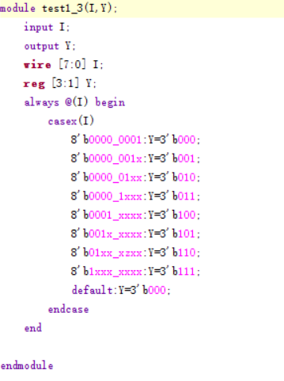
    设置了一个8位的输入信号 `I` 和一个3位的输出信号 `Y`。该模块使用 `casex` 语句来匹配输入信号 `I` 的非0的最高位，并根据匹配结果将输出信号 `Y` 设置为对应的值。
    <br><br>
    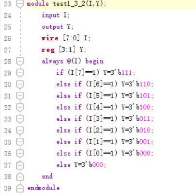
    设置了一个8位的输入信号 `I` 和一个3位的输出信号 `Y`。该模块使用 `if` 语句，按顺序从高位到低位检测是否为一,一旦检测到一，将输出信号`Y`为对应值。
    <br><br>
2. ==simulator 代码==
    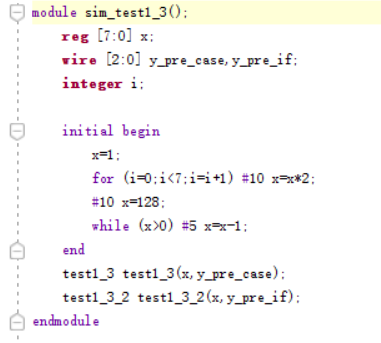
    设置输入信号从1开始，每10ns`*2`,到128后，每5秒减1，分别实例化design1(casex方法)和design2(if方法)。
    <br><br>
3. ==RTL 图==
    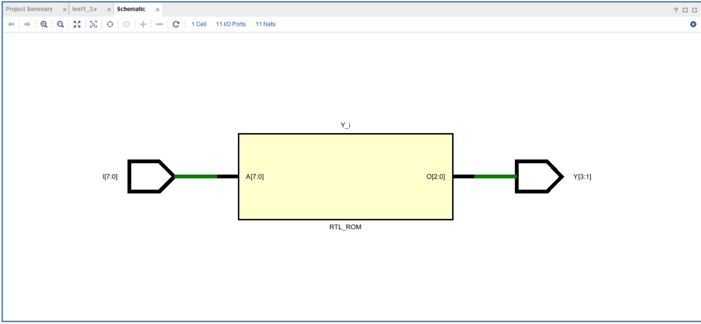
    一个8位的输入信号 `I` 经过一个编码器，形成一个3位的输出信号 `Y`
    <br><br>
4. ==simulation图==
    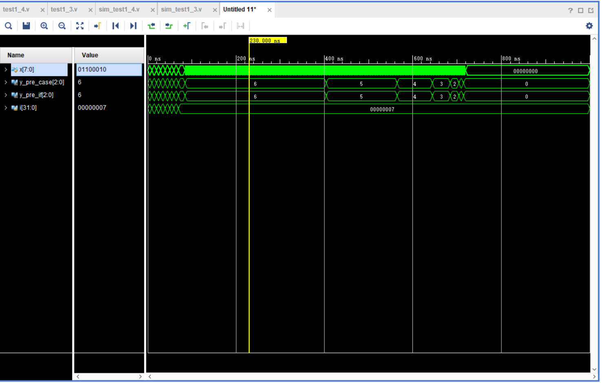
    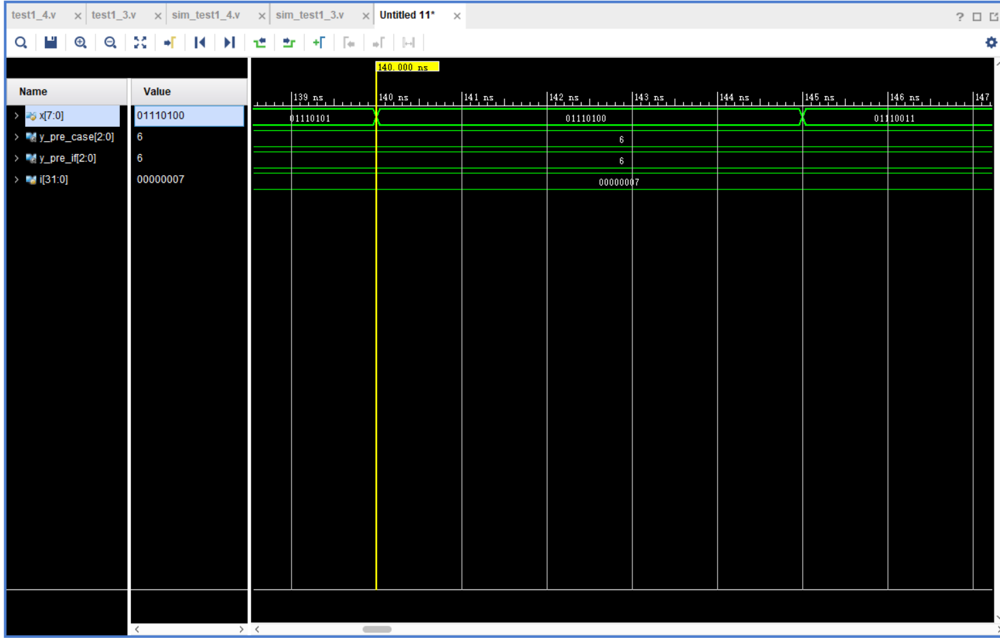
    当输入信号非0的最高位为`i`时，输出信号`y_pre_casex` 和 `y_pre_if` 相同且为`i`，与真值表匹配。
    <br><br>

### 4. 3-8译码器

1. ==design 代码==
    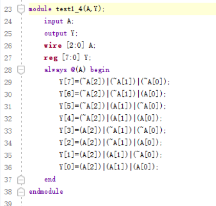
    设置3位输入A和8位输入Y，按照逻辑表达式，分别设置Y的每一位
    <br><br>
2. ==simulator 代码==
    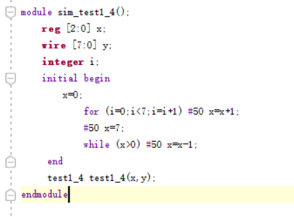
    设置3位输入信号x，从`0`开始每50ns加一，到`7`后，每50ns减`1`到`0`,用于验证从`000`到`111`，能否正确转化为对应的8位输出。
    <br><br>

3. ==RTL 图==
    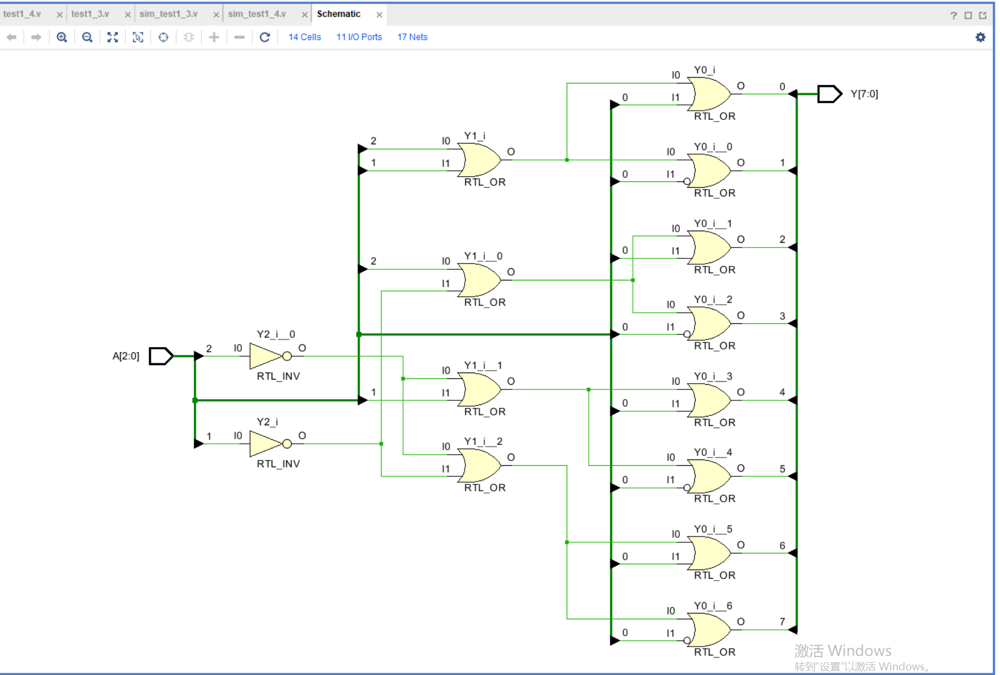
    通过表达式可以发现操作主要是与和非，RTL显示的也是用与非门来是实现design功能
    <br><br>
4. ==simulation图==
   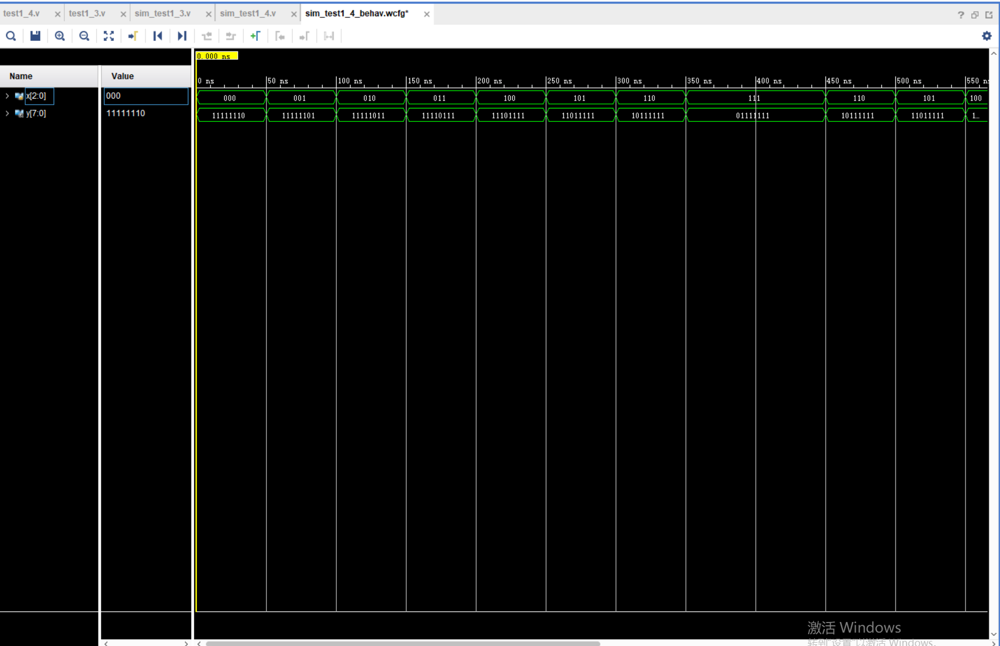
    当输入信号从`000b`到`111b`，对应的十进制为`0`到`7`，输出信号对应的第i位为`0`,其他为都为`1`，与真值表匹配。

## 五 调试和心得体会

1. 相较于上学期的数电实验，这次比较系统的学习了verilog的语法，例如：
   1. `always@(敏感信号)`，敏感信号可为`*`，会自动匹配所有输入信号
   2. `fork`,生成同步块
   3. `#i`,暂停`i`ns,相当于`sleep(i)`
   4. `casex(s)`,可以实现用x作为通配符，提供了更方便的操作
2. 此外，本学期的实验的挑战性增加了，因为有些实验没有提供代码，需要我们自行设计和实现数字电路。这锻炼了我们的创造力和问题解决能力，因为我们需要独立思考如何实现特定的功能，然后将其转化为Verilog代码。这种挑战性的实验让我更深入地理解了计算机组成原理，尤其是如何将理论知识应用于实际项目中。
