# <center>实验二 时序逻辑设计</center>

## 一、实验目的

1. 掌握Verilog语言和Vivado、Logisim开发平台的使用；
2. 掌握基础时序逻辑电路的设计和测试方法。

## 二、实验内容（使用Logisim或Vivado实现）

1. 锁存器、触发器的设计与测试
2. 寄存器、计数器的设计与测试
3. 状态机的设计与测试

## 三、实验要求

1. 掌握Vivado或Logisim开发工具的使用，掌握以上电路的设计和测试方法；
2. 记录设计和调试过程（Verilog代码/电路图/表达式/真值表，Vivado仿真结果，Logisim验证结果等）；
3. 分析Vivado仿真波形/Logism验证结果，注重输入输出之间的对应关系。

## 四、实验过程及分析

### 1. D锁存器

1. design 代码

   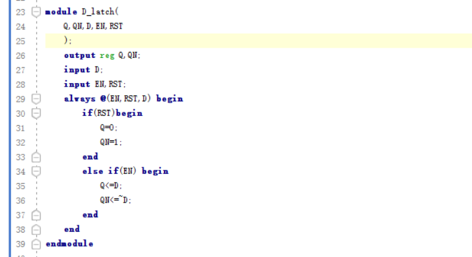

   设置了三个输入信号`D`,`EN`,`RST`,两个输出信号`Q`,`QN`,当`EN=1`时，`Q=D`,当`EN=0`时，`Q`保持不变，当`RST=1`时，`Q=0`

2. simulator 代码

   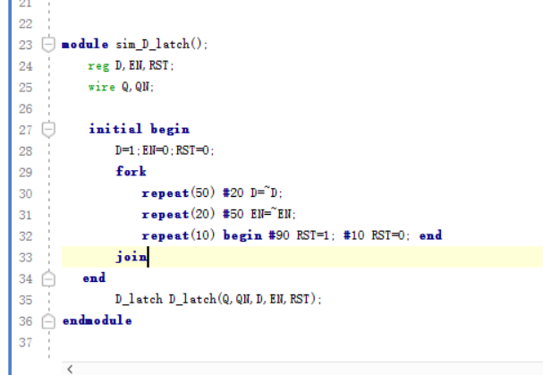

   实例化design代码，利用fork并行块，设置`D`初始为1，每20ns取反一次，`EN`初始为0，每50ns取反一次，`RST`初始为0，每90ns设置为1，持续10ns。

3. RTL 图

    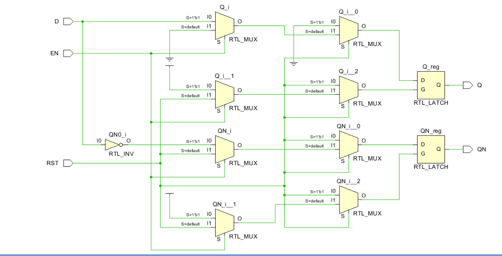
    采用了多个多路选择器和两个锁存器来实现D锁存器。

4. simulation图

   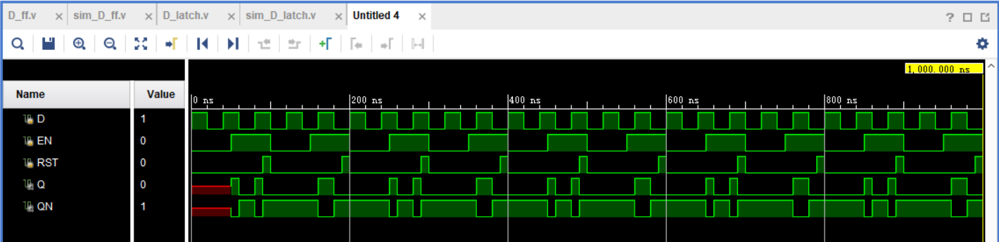

   `D`初始为1，每20ns取反一次，`EN`初始为0，每50ns取反一次，`RST`初始为0，每90ns设置为1，持续10ns。从仿真图可以看出，当`EN=1`时，`Q=D`,当`EN=0`时，`Q`保持不变，当`RST=1`时，`Q=0`。实现了D锁存器的功能。

### D触发器

1. design 代码

   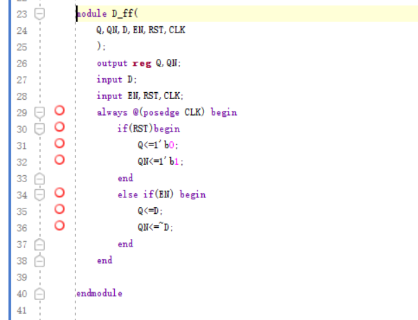

   设置了四个输入信号`D`,`EN`,`CLK`,`RST`,两个输出信号`Q`,`QN`,当`CLK`处于上升沿时（即按固定时间间隔检测），检测`RST`,当`RST=1`时，`Q=0`，当`RST=0`时，检测`EN`,当`EN=1`时，`Q=D`,当`EN=0`时，`Q`保持不变。

2. simulator 代码

   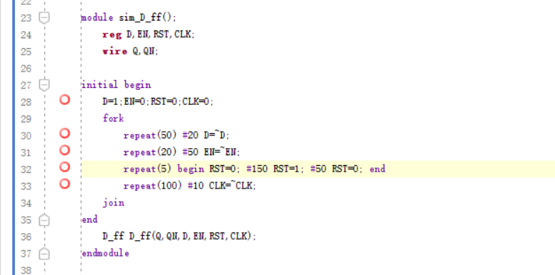

   实例化design代码，利用fork并行块，设置`D`初始为1，每20ns取反一次，`EN`初始为0，每50ns取反一次，`RST`初始为0，每150ns设置为1，持续50ns，`CLK`初始为0，每10ns取反一次。

3. RTL 图

   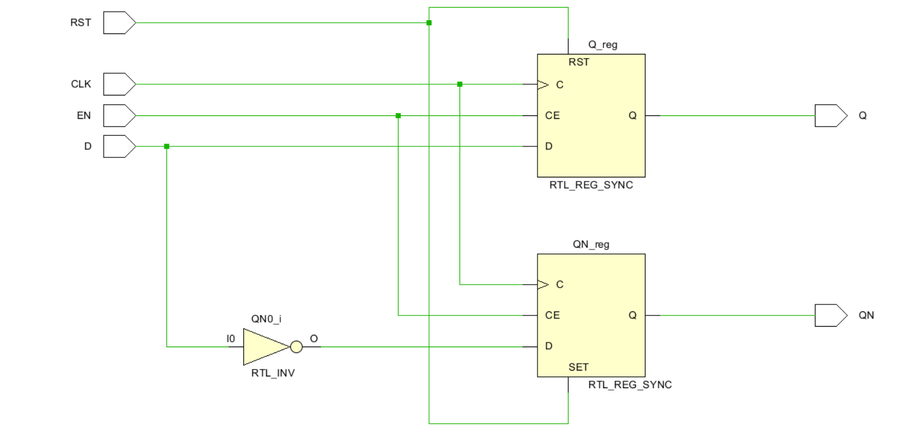

4. simulation图

   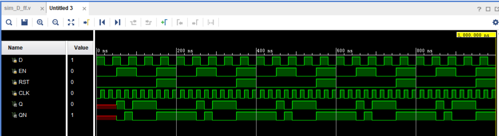

   `D`初始为1，每20ns取反一次，`EN`初始为0，每50ns取反一次，`RST`初始为0，每150ns设置为1，持续50ns，`CLK`初始为0，每10ns取反一次。从仿真图可以看出，当`CLK`处于上升沿时，检测`RST`,当`RST=1`时，`Q=0`，当`RST=0`时，检测`EN`,当`EN=1`时，`Q=D`,当`EN=0`时，`Q`保持不变,和我们期望的输出一致，实现了D触发器的功能。

### 寄存器

1. design 代码

   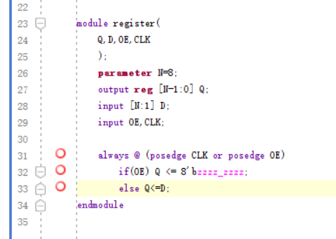

   设置了三个输入变量`D`,`OE`,`CLK`,其中`D`为8位输入，一个8位输出变量`Q`,当`CLK`或者`OE`处于上升沿的时候（即按时间检测或检测到高阻信号时），先检测`OE`,当`OE=1`时，`Q`为高阻态，当`OE=0`时，将`D`的值赋给`Q`。

2. simulator 代码

   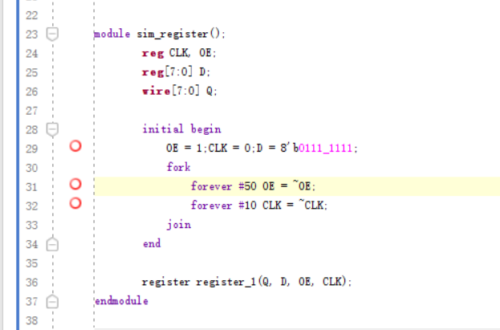

   实例化design代码，将D初始设置为`8'b0111_1111`,利用fork并行块，OE初始设置为1，每50ns取反一次，CLK初始设置为0，每10ns取反一次。

3. RTL 图

   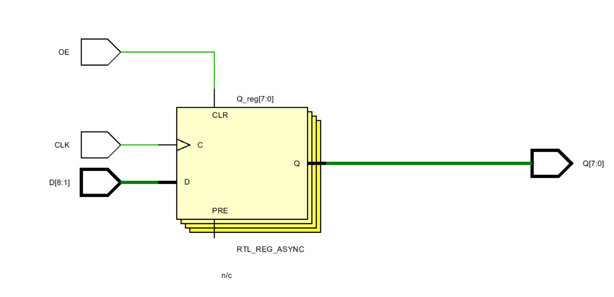

   RTL图为一个寄存器，输入端为CLK，OE和八位输入D，输出端为八位输出Q。

4. simulation图
    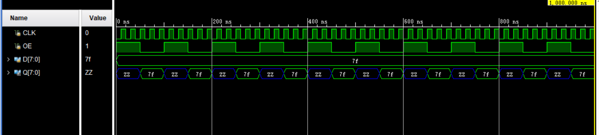

   观察simulation图，当D全程为`7f`,即二进制的`0111_1111`，OE为1时，Q为高阻态，当OE为0时，Q为`7f`，即二进制的`0111_1111`，和设计预期输出匹配，实现了寄存器的功能。

### 移位寄存器

1. design 代码

   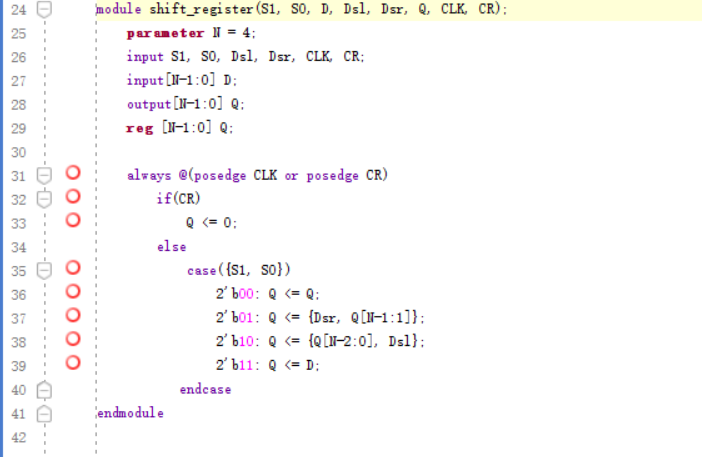

   设置了七个输入信号`S1`,`S0`,`Dsl`,`Dsr`,`CLK`,`CR`,4位信号D，一个4位输出信号Q。当`CLK`或`CR`处于上升沿时（即按时间检测或者检测到清零信号），先检测`CR`,当`CR=1`时，`Q`为`0000`,当`CR=0`时，检测`S1`,`S0`,当`S1=0`,`S0=0`时，`Q`为`Q`,保持，当`S1=0`,`S0=1`时，`Q`为`D`右移一位，当`S1=1`,`S0=0`时，`Q`为`D`左移一位，当`S1=1`,`S0=1`时，`Q`为`D`。

2. simulator 代码

   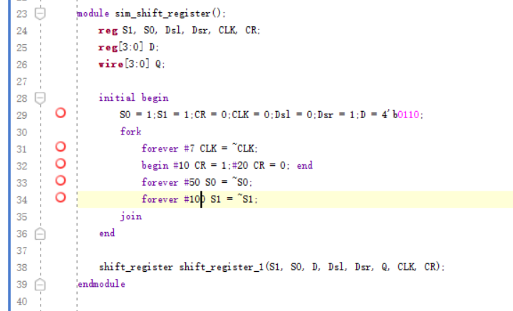

   实例化design代码，将D初始设置为`4'b0110`,利用fork并行块，`CLK`初始设置为0，每7ns取反一次，`CR`初始设置为0，按10ns为0和20ns为1循环，`S0`初始化为1，每50ns取反一次，`S1`初始化为1，每100ns取反一次。

3. RTL 图

   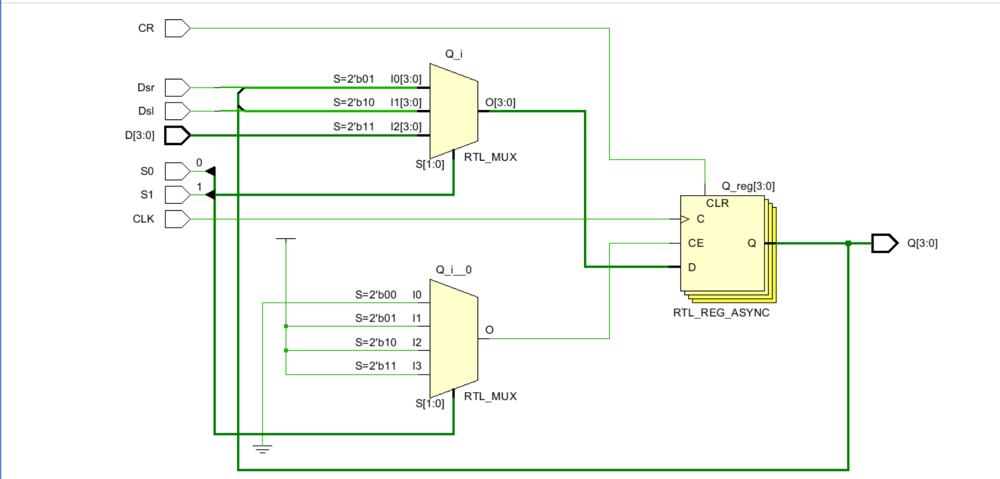

   RTL图为一个移位寄存器，输入端为CLK，CR，S1，S0和四位输入D，输出端为四位输出Q。利用了两个多路选择器和一个异步触发器来实现。

4. simulation 图

   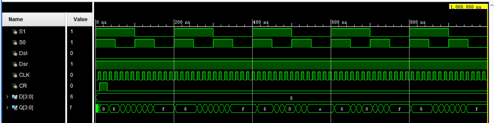

   观察simulation图，当D全程为`6`,即二进制的`0110`，CR为0时，Q为`6`,当CR为1时，Q为`0000`,当S1为0，S0为1时，Q为`3`,即二进制的`0011`,当S1为1，S0为0时，Q为`c`,即二进制的`1100`,当S1为1，S0为1时，Q为`6`,即二进制的`0110`，和设计预期输出匹配，实现了移位寄存器的功能。

### 计数器 58位进制计数器

1. design 代码

   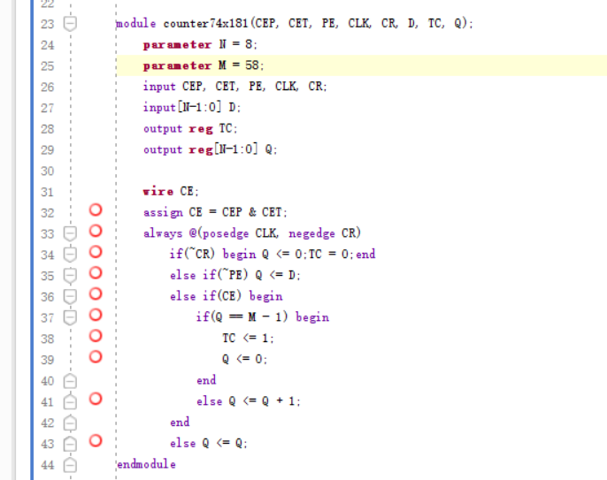

   设置了5个一位输入`CEP`,`CET`,`PE`,`CLK`,`cR`,和一个8位输入`Q`,一个一位输出`CO`,一个8位输出`Q`,设置参数M为58,记CE为`CEP`与`CET`,当检测到CLK处于上升沿时或CR处于下降沿（即按时间检测或检测到清零信号），先检测CR,当CR=0时，`Q`为`0000_0000`,`TC=0`,否则当PE=0时，Q置为D，再之后检测CE，当CE=1时，`Q`加一，当`Q=M-1`时,触发进位，`TC=1`，当CE=0时，`Q`保持不变。

2. simulator 代码

   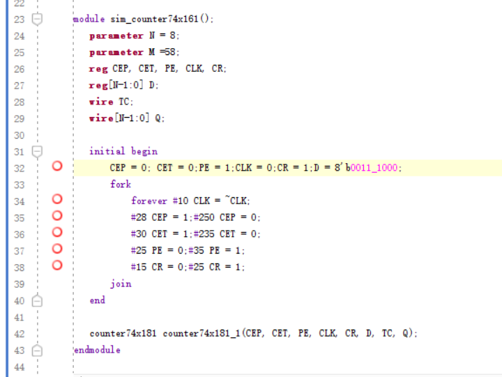

   实例化design代码，为了方便观察到进位，将D初始设置为`8'b0011_1000`,利用fork并行块，`CLK`初始设置为0，每10ns取反一次，`CEP`初始为0，28ns后为1，到250ns时设置为0，`CET`初始为0，30ns设置为1，235ns时为0，`PE`初始化为1，25ns后位0，35秒时为1，`CR`初始化为1，15ns后为0，25ns时为1。

3. RTL 图

   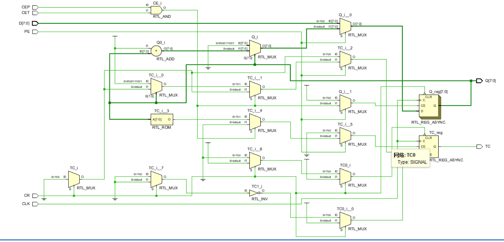

   RTL图比较复杂，利用了多个多路选择器和异步触发器来实现。

4. simulation 图

   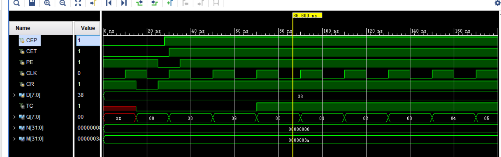

   观察输出Q，simulation图中为16进制，当输出Q=39H，即十进制的57时，触发进位，输出TC=1，Q=00H，即十进制的0，和设计预期输出匹配，实现了计数器的功能。

### 状态机1

1. design 代码

   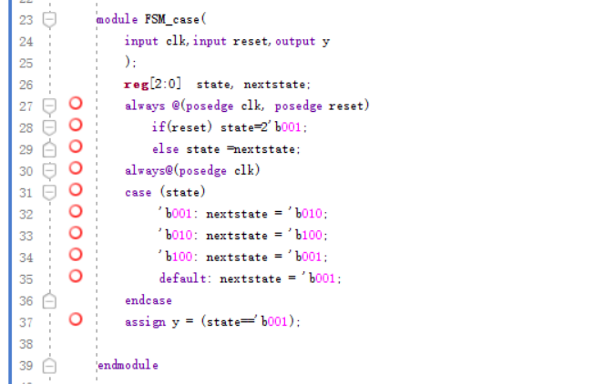

   设置了两个输入信号`clk`,`reset`,一个输出信号`y`,检测`clk`,`reset`的上升沿，检测到`reset`,将状态重置为`2'b001`,其他时候按照下面的图来修改状态

   ```mermaid
   graph LR
   A[3'b001]-->B[3'b010]-->C[3'b100]-->A
   ```

   当状态量为`3'b001`时，将输出置为1.

2. simulator 代码

   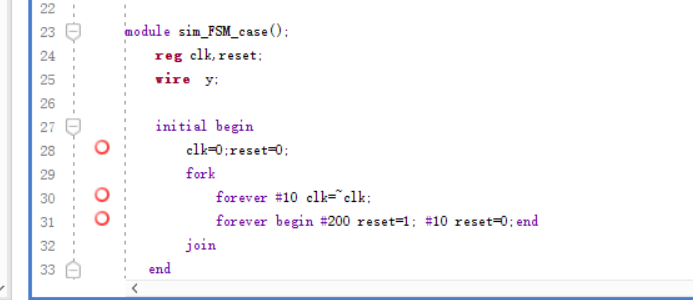

   实例化design代码，利用并行块，设置clk，reset初值为0，clk每10ns取反一次，reset每200ns，设置为1并保持10ns。

3. RTL 图

   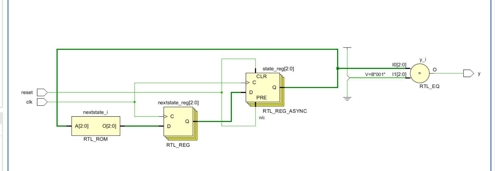

4. simulation 图

   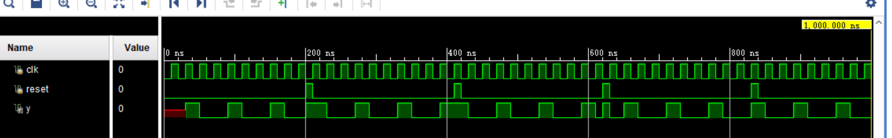

   观察simulation图，clk周期为20ns，reset周期为210ns，可以发现在没有reset信号时，y的周期为60ns，即clk周期的3倍，遇到reset信号时，立即将y置为1.满足了设计要求，每循环3个时钟后，产生一个周期的高电平信号。

### 状态机2

1. design 代码

   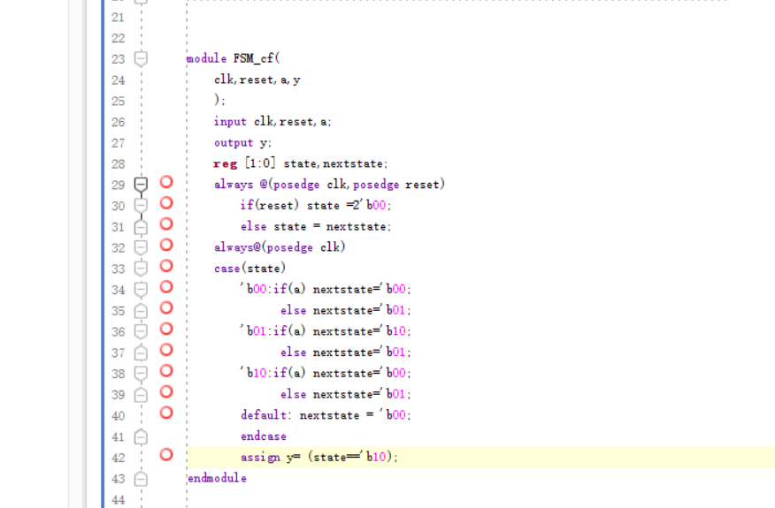

   设置了3个状态`00`,`01`,`10`,分别为代表
      1. 2'b00: 初始状态，等待检测到0。
      2. 2'b01: 检测到0后，等待检测到1。
      3. 2'b10: 检测到01后，等待下一个序列。
   转化关系作图如下

   ```mermaid
   graph LR
   A[2'b00]-->|1|A
   A-->|0|B[2'b01]
   B-->|1|C[2'b10]
   B-->|0|B
   C-->|1|A
   C-->|0|B
   ```

2. simulator 代码
   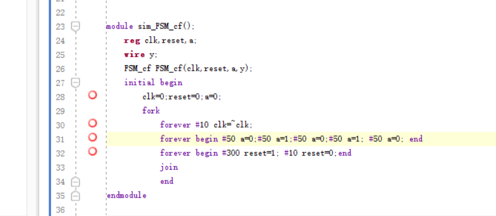

   实例化design代码，设置clk周期为20ns，a的输入顺序为`00101`，间隔为50ns
3. RTL 图
   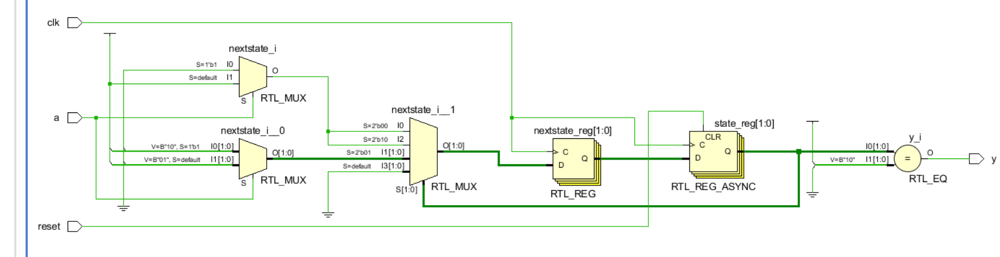
4. simulation 图
   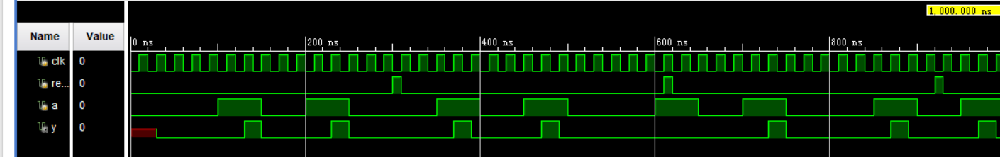

   观察clk，周期为20ns，输入信号a的输入顺序为`00101`,每位位持续50ns，当a输入了`01`,y会被设置为1，持续1个clk周期。和我们设置的状态转化相符合。

## 五、调试和心得体会

1. 通过本次实验，我学习了怎么设置clk信号作为时间信号，以及找检测到clk上升沿的时候，执行检测任务。
2. 学习了新的语法，在case选择的时候，拼接两个信号以简化case选择

   ```verilog
   case({s1,s2})
   ```

3. 通过实验实现了上学期数电课上所学的状态转化，学会moore和mealy两种类型的在实现上的差异。