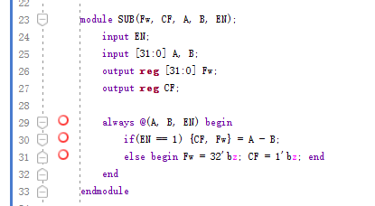

# 
实验三 算术逻辑单元设计

## 一、实验目的

1. 掌握Verilog语言和Vivado、Logisim开发平台的使用；
2. 掌握算术逻辑单元的设计和测试方法。

## 二、实验内容

1. 运算模块的设计与测试
2. 算术逻辑单元设计与测试

## 三、实验要求

1. 掌握Vivado或Logisim开发工具的使用，掌握以上电路的设计和测试方法；
2. 记录设计和调试过程（Verilog代码/电路图/表达式/真值表，Vivado仿真结果，Logisim验证结果等）；
3. 分析Vivado仿真波形/Logism验证结果，注重输入输出之间的对应关系。

## 四、实验过程及分析

### 1. AUL_8

1. **design 代码**

    

    设置了两个32位的输入`A`、`B`，一个4位的输入控制信号`OP`，一个32位的输出`F`，一个进位标识符输出`CF`,将`4'b0000`到`4'b0111`映射为`parameter ALU_AND`到`parameter ALU_SLL`，然后使用case语句，处理 **与**，**或**，**按位异或**，**或非**.直接进行计算，然后将结果赋值给`F`，最后将进位标识符赋值给`CF`。对于**算数加法**、**算数减法**、**比较**、**逻辑左移**，先通过实例化**3-8译码器**，将`OP`信号转化为8位使能信号，接着实例化**ADD**、**SUB**、**STL**、**SLL**，这四个模块会在有使能信号的时候进行计算，最后将结果赋值给`F`，其他时候会设置高阻态，阻止输出。

2. **simulation 代码**

    设置了`A`、`B`、`OP`、`F`、`CF`的信号，实例化`ALU_8`，将`OP`信号初始设置为`4'b0000`，然后对`A`、`B`分别赋值为24和16.通过forever语句将OP信号每隔50ns加1，当达到7的时候重设置为0。

3. **RTL 图**

    

    通过`ALU_8`的RTL图可以看出，`ALU_8`由`AND`、`OR`、`XOR`、`INV`、`ROM`、`NOR`、`ADD`、`SUB`、`STL`、`SLL`、`Decoder38`组成，其中`Decoder38`的输入为`OP`，输出为`ADD`、`SUB`、`STL`、`SLL`的使能信号，最后通过`MUX`选择输出。

4. **仿真波形**

    

    OP信号每隔50ns的加一，到达7的时候重置为0，A设置为`24`,B设置为`16`可以看出，当OP为0的时候，输出为A与B的与，当OP为1的时候，输出为A与B的或，当OP为2的时候，输出为A与B的异或，当OP为3的时候，输出为A与B的或非，当OP为4的时候，输出为A与B的算数加法，当OP为5的时候，输出为A与B的算数减法，当OP为6的时候，输出为A与B的比较，当OP为7的时候，输出为A与B的逻辑左移。

### 2. Decoder38模块

1. **design代码**

    
    设置了一个3位输入选择信号`OP`,一个8位的使能信号`EN`,通过case语句，根据二进制的`OP`，将`EN`的对应位置为1，其他位置为0，用于选择AU_8的后4种功能

2. **RTL 图**

    

    通过`Decoder38`的RTL图可以看出，`Decoder38`由一个`RTL_ROM`实现，`RTL_ROM`的输入为`OP`，和`EN`，输出为8位的使能信号。

### 3. ADD模块

1. **design 代码**

    

    设置了两个32位的输入`A`、`B`，一个一位的使能输入信号`EN`,一个32位的输出`Fw`，一个进位标识符输出`CF`，当`EN`为1的时候，通过`{CP,Fw}`将`CP`和`Fw`进行拼接，接收`A+B`的结果,避免了用if语句去判断是否需要进位，使得代码更加简洁。当使能信号为0的时候，将输出设置为高阻态，阻止输出。

2. **RTL 图**

    

    通过`ADD`的RTL图可以看出，`ADD`由`MUX`、`ADD`、`LATCH`组成，加法器`ADD`其会将俩个32位输入加后为33位，通过俩个锁存器来分别输出进位标识符和结果。

### 4. SUB模块

1. **design 代码**

    

    设置了两个32位的输入`A`、`B`，一个一位的使能输入信号`EN`,一个32位的输出`Fw`，一个进位标识符输出`CF`，当`EN`为1的时候，通过`{CP,Fw}`将`CP`和`Fw`进行拼接，接收`A-B`的结果,避免了用if语句去判断是否需要进位，使得代码更加简洁。当使能信号为0的时候，将输出设置为高阻态，阻止输出。

2. **RTL 图**

    

    通过`SUB`的RTL图可以看出，`SUB`由`SUB`、`TRISTATE`组成，减法其会将俩个32位输入减后为33位，通过两个`TRISTATE`，分别输出进位标识符和结果。

### 5. STL模块

1. **design 代码**

    

    设置了两个32位的输入`A`、`B`，一个一位的使能输入信号`EN`,一个32位的输出`Fw`，当`EN`为1的时候，将`Fw`值设置为`A<B`的结果。当使能信号为0的时候，将输出设置为高阻态，阻止输出。

2. **RTL 图**

    

    通过`STL`的RTL图可以看出，`STL`由`LT`、`TRISTATE`组成，`LT`会将`A`与`B`进行比较，然后将结果赋值给`Fw`，通过`TRISTATE`输出`Fw`。

### 6. SLL模块

1. **design 代码**

    

    设置了两个32位的输入`A`、`B`，一个一位的使能输入信号`EN`,一个32位的输出`Fw`，当`EN`为1的时候，将`Fw`值设置为`B`左移`A`位的结果。当使能信号为0的时候，将输出设置为高阻态，阻止输出。

2. **RTL 图**

    

    通过`SLL`的RTL图可以看出，`SLL`由`LSHIFT`、`TRISTATE`组成，`LSHIFT`会将`B`左移`A`位，然后将结果赋值给`Fw`，通过`TRISTATE`输出`Fw`。

## 五、调试和心得体会

1. 本次实验主要是对算术逻辑单元的设计，主要是对`ALU_8`的设计，通过`Decoder38`将`OP`信号转化为8位使能信号，然后实例化`ADD`、`SUB`、`STL`、`SLL`，这四个模块会在有使能信号的时候进行计算，最后将结果赋值给`F`，其他时候会设置高阻态，阻止输出。

2. 本次实验强化了模块化设计的思想，将一个大的模块分成多个小的模块，然后再将小的模块组合起来，这样可以使得代码更加简洁，更加容易理解。

3. 本次实验介绍了如何通过将模块输出设置为高阻态，阻止输出，这样可以减少代码量，使得代码更加简洁。