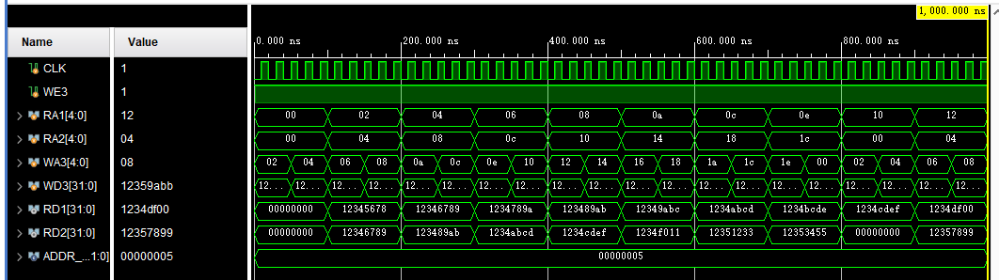

# 实验四 存储器阵列设计

## 一、实验目的

1. 掌握Verilog语言和Vivado、Logisim开发平台的使用；
2. 掌握存储器和寄存器组的设计和测试方法。

## 二、实验内容

1. 存储器设计与测试
2. 寄存器组设计与测试

## 三、实验要求

1. 掌握Vivado或Logisim开发工具的使用，掌握以上电路的设计和测试方法；
2. 记录设计和调试过程（Verilog代码/电路图/表达式/真值表，Vivado仿真结果，Logisim验证结果等）；
3. 分析Vivado仿真波形/Logism验证结果，注重输入输出之间的对应关系。

## 四、实验过程及分析

### 1. 4K×32bit存储器

1. **design代码**

    本次实验是先实现一个1K×32bit的存储器，再将其扩展为4K×32bit的存储器。所以先实现1K×32bit的存储器。

    

    按地址取数据，一个地址对应16bit数据，地址范围为0~1023，所以地址需要10位，数据为16bit，所以数据需要16位。设置了一个类似以2维数组的形式的存储器（通过设置为寄存器实现），地址为行，数据为列，每次取出一个地址对应的数据。设置可三个控制信号**RST，R_W，CS**，分别为复位，读写，片选信号。当**RST**为1时，存储器清零，当**R_W**为1时，存储器写入数据，当**CS**为1时，存储器输出数据。默认下设置为高阻态，存储器处于高阻态，不读不写。
     
    **然后通过字位扩展，将1K×16bit的存储器扩展为4K×32bit的存储器。**

    

    要用1K×16bit的存储器实现4K×32bit的存储器，字扩展需要需要2片，位扩展需要4片，所以一共需要实例化8片1K×16bit的存储器。字扩展时，因为为32bit，所以数据线的有32根，高地址片和地址片分别连接地址线的前一半和后一半。位扩展时，有四片需要进行片选，占用地址线的两位，所以此模块的地址线为12位，前两位被经过2-4译码器产生片选信号，8片的存储器都连接剩余的10位地址线。

    

    2-4译码器，根据两位输入产生四位输出，输出为四个片选信号，每次只有一个片选信号为1，其他为0。当输入为00时，输出为0001，当输入为01时，输出为0010，当输入为10时，输出为0100，当输入为11时，输出为1000。

2. **RTL图**
    1. 1K×16bit存储器部分

        

        1k×16bit存储器部分的RTL图，可以看到，存储器的地址线为10位，数据线为16位，有三个控制信号，**RST，R_W，CS**，分别为复位，读写，片选信号。当**RST**为1时，存储器清零，当**R_W**为1时，存储器写入数据，当**CS**为1时，存储器输出数据。默认下设置为高阻态，存储器处于高阻态，不读不写。

    2. 4K×32bit存储器

        

        4kx32bit存储器的RTL图，可以看到，存储器由8个1kx16bit存储器和一个2-4译码器组成。12位地址的前两位经过2-4译码器产生片选信号，8片的存储器都连接剩余的10位地址线。对于数据线，RTL图中没有具体展示，应当为高位数据线和低位数据线分别连接高地址片和地址片的数据线。

    3. 2-4译码器

    

    2-4译码器，根据两位输入产生四位输出。

3. **Simulation 代码**

    

    仿真代码，仿真时，Data根据R_W来判断是写入还是读出，当R_W为1时，Data为读数据，当R_W为0时，Data为写数据。仿真时，设置初始地址为`12'b10101010101010`，由于开始的时候存储器没有数据，所以开始的将Rst设置为1，将默认数据写入存储器，每500ns重置一次。R_w初始为0，每100ns取反一次，每100ns地址加1。

4. **仿真结果**

    

    当R_W为0时，存储器写入数据，Data为高阻态，。当R_W为1时，存储器读出数据，Data为从存储器取出的数据。

### 2. 指令存储器

1. **design代码**

    

    指令存储器，指令为32位，所以设置存储器的字长为32位，地址为6位，可存储64个指令。初始从一个文件中读入最多64条指令，根据输入的地址，输出对应的指令。

2. **RTL图**

    

    根据输入的6位地址，输出对应的32位指令。

3. **Simulation 代码**

    

    仿真代码，仿真时，设置初始地址为`6'b000000`，每50ns地址加1，即取下一条指令。

4. **仿真结果**

    
    
    每50ns取出一条指令，按照simulation代码，对照我们设置的指令集，确定我们每次取出的指令是正确的。

### 3. 寄存器文件

1. **design代码**

    

    该模块具有一个时钟输入（CLK），一个写使能信号（WE3），两个读地址输入（RA1和RA2），一个写地址输入（WA3），以及一个32位宽的写数据输入（WD3）。在每个时钟上升沿，如果写使能信号为1，模块将从写数据输入中取得数据并将其写入指定的寄存器地址。同时，两个读端口会根据读地址选择相应寄存器的内容输出。这个模块的参数包括寄存器地址大小（ADDR_SIZE），默认为5位。

2. **RTL图**

    

3. **Simulation 代码**

    

    这Verilog测试文件旨在验证32位寄存器文件模块的功能性和性能。模块包含一个时钟输入（CLK）、一个写使能信号（WE3）、两个读地址输入（RA1和RA2）、一个写地址输入（WA3）以及一个32位宽的写数据输入（WD3）。在仿真过程中，时钟以及写使能信号在不同的时间单位内变化，模拟了实际工作环境中的异步输入。读地址1和读地址2以不同步长递增，测试了模块对多个读操作的处理能力。写数据递增和写地址递增的操作增加了对写入和寻址逻辑的综合性测试。这一系列复杂的变化条件旨在全面评估寄存器文件模块的鲁棒性和正确性。

4. **仿真结果**

    

    仿真结果，可以看到，每个时钟上升沿，如果写使能信号为1，模块将从写数据输入中取得数据并将其写入指定的寄存器地址。同时，两个读端口会根据读地址选择相应寄存器的内容输出。验证实现正确。

## 五、调试和心得体会

1. 本次实验主要是对存储器和寄存器组的设计和测试方法的学习，通过实验，我对存储器和寄存器组的设计和测试方法有了一定的了解，对Verilog语言和Vivado、Logisim开发平台的使用也有了一定的了解。

2. 复习了存储器的字位扩展的相关知识，以及在硬件中具体是怎么实现的。
3. 指令存储器的设计，通过读取文件的方式，将指令存储在存储器中，然后通过地址来取出指令，这样可以方便的修改指令，而不用修改代码。