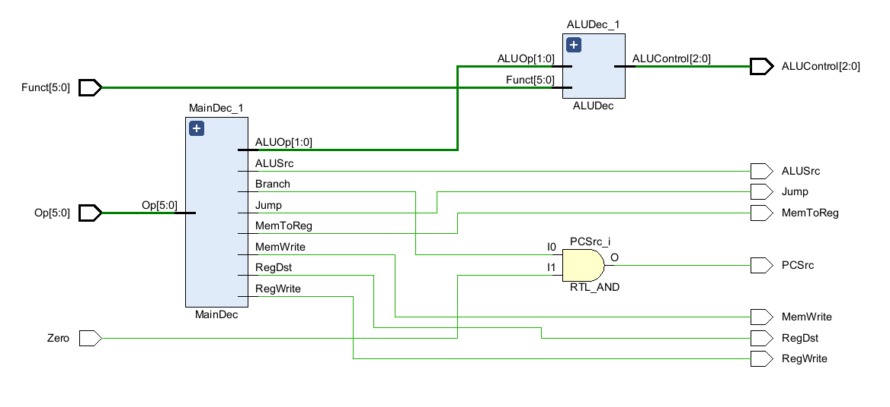

# 实验五 数据通路与控制单元设计

## 一、实验目的

1. 掌握Verilog语言和Vivado、Logisim开发平台的使用；
2. 掌握数据通路与控制单元的设计和测试方法。

## 二、实验内容

1. 数据通路的设计；
2. 控制单元的设计。

## 三、实验要求

1. 掌握Vivado或Logisim开发工具的使用，掌握以上电路的设计和测试方法；
2. 记录设计和调试过程（Verilog代码/电路图/表达式/真值表，Vivado仿真结果，Logisim验证结果等）；
3. 分析Vivado仿真波形/Logism验证结果，注重输入输出之间的对应关系。

## 四、实验过程及分析

### 1. 主译码器

1. **design 代码**

    

    `input [5:0] Op`：这是一个6位的输入端口，用于接收指令的操作码。

    `output MemToReg, MemWrite, Branch, ALUSrc, RegDst, RegWrite, Jump, [1:0] ALUOp`：这些是8个输出端口，分别用于控制CPU的不同功能。例如，`MemToReg` 控制数据写回寄存器的来源，`MemWrite` 控制内存写入，`Branch` 控制分支操作，`ALUSrc` 控制ALU的输入选择，`RegDst` 控制寄存器目标选择，`RegWrite` 控制寄存器写入，`Jump` 控制跳转，`ALUOp` 是用于ALU操作的控制信号。将这些输出组合为一个控制信号`control`，用于控制CPU的不同功能。
     
    6'b000000: 对应寄存器类型指令，设置控制信号为9'b110000010。
    6'b100011: 对应Load Word（LW）指令，设置控制信号为9'b101001000。
    6'b101011: 对应Store Word（SW）指令，设置控制信号为9'b001010000。
    6'b000100: 对应Branch Equal（BEQ）指令，设置控制信号为9'b000100001。
    6'b001000: 对应Add Immediate（ADDI）指令，设置控制信号为9'b101000000。
    6'b000010: 对应Jump（J）指令，设置控制信号为9'b000000100。
    默认情况下，如果操作码不匹配已知类型，所有控制信号将被设为9'bxxxxxxxxx，表示非法操作码。

2. **RTL 仿真**

    

    一个6位的输入信号OP，经过一个RTL_ROM，输出了一个9位的控制信号control。然后分解成8个输出信号，分别控制CPU的不同功能。

### 2. ALU译码器

1. **design 代码**

    

    input [5:0] Funct：这是一个6位的输入端口，用于接收特定指令的功能字段。
    input [1:0] ALUOp：这是一个2位的输入端口，用于接收ALU操作的控制信号。
    output reg [2:0] ALUControl：这是一个3位的寄存器，用于存储ALU的控制信号。

    ALU译码器通过对输入的Funct和ALUOp进行译码，输出ALU的控制信号。

     case(ALUOp)：这个case语句首先根据ALU操作码（ALUOp）进行选择。

     2'b00: ALUControl <= 3'b010;：当ALU操作码为2'b00时，表示进行加法操作，将ALUControl寄存器的值设为3'b010，即ALU执行加法。
     2'b01: ALUControl <= 3'b110;：当ALU操作码为2'b01时，表示进行减法操作，将ALUControl寄存器的值设为3'b110，即ALU执行减法。

     default: case(Funct)：如果ALU操作码不匹配任何已知类型，则进入内部的功能字段（Funct）的case语句。

     6'b100000: ALUControl <= 3'b010;：当功能字段为6'b100000时，表示进行ADD（加法）操作，将ALUControl寄存器的值设为3'b010，即ALU执行加法。
     6'b100010: ALUControl <= 3'b110;：当功能字段为6'b100010时，表示进行SUB（减法）操作，将ALUControl寄存器的值设为3'b110，即ALU执行减法。
     6'b100100: ALUControl <= 3'b000;：当功能字段为6'b100100时，表示进行AND（与运算）操作，将ALUControl寄存器的值设为3'b000，即ALU执行与运算。
     6'b100101: ALUControl <= 3'b001;：当功能字段为6'b100101时，表示进行OR（或运算）操作，将ALUControl寄存器的值设为3'b001，即ALU执行或运算。
     6'b101010: ALUControl <= 3'b111;：当功能字段为6'b101010时，表示进行SLT（有符号小于）操作，将ALUControl寄存器的值设为3'b111，即ALU执行有符号小于比较。
     default: ALUControl <= 3'bxxx;：如果功能字段不匹配任何已知类型，则将ALUControl寄存器的值设为3'bxxx，表示未知操作。

2. **RTL 仿真**

    

    一个6位的输入信号Funct，经过一个RTL_ROM的输出信号和一个2位的输入信号ALUOp，经过一个RTL_MUX，输出了一个3位的控制信号ALUControl。

### 3. 控制单元

1. **design 代码**

    

    这Verilog代码定义了一个控制单元模块（Controller），用于协调CPU在执行不同指令时的各种操作。该模块接收指令的操作码（Op）、功能字段（Funct）以及零信号（Zero），并生成包括内存写入使能、ALU控制信号、分支操作使能、寄存器目标选择等在内的多个控制信号。这通过实例化两个子模块实现，分别是MainDec和ALUDec，它们分别处理操作码和功能字段，产生相应的控制信号。最终，根据内部计算得到的分支信号和零信号的逻辑与运算，确定PC的来源选择信号（PCSrc）。整体而言，该模块协调各个子模块，确保CPU在不同指令下能够正确执行各种操作。

2. **RTL 仿真**

    

    输入为Op、Funct和Zero，作为输入信号，传给MainDec和ALUDec俩个模块，输出为MemToReg、MemWrite、Branch、ALUSrc、RegDst、RegWrite、Jump、ALUOp和PCSrc，作为输出信号。

3. **simulation 代码**

    
    

    循环修改Op、Funct和Zero的值，测试各种情况下的输出信号。

4. **simulation 结果**

    

    结果验证，在不同的输入信号下，输出信号符合预期。

## 五、调试和心得体会

1. 对计算机的指令集有了更深的理解，对于Op、Funct字段的含义有了更深的理解。
2. 对于Verilog语言的使用更加熟练，对于Vivado的使用更加熟练。
3. 对于CPU的数据通路和控制单元的设计有了更深的理解。
4. 对MIPS指令集的指令格式有了更深的理解。