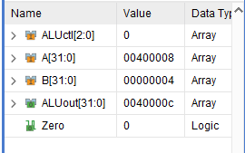

# <center>实验六 CPU综合设计</center>

## 一、实验目的

1. 掌握复杂系统设计方法。
2. 深刻理解计算机系统硬件原理。

## 二、实验内容

1. 设计一个基于MIPS指令集的CPU，支持以下指令：{add, sub, addi,  lw, sw, beq, j, nop}；
2. CPU需要包含寄存器组、RAM模块、ALU模块、指令译码模块；
3. 该CPU能运行基本的汇编指令；（D~C+）
以下为可选内容：
4. 实现多周期CPU（B-~B+）；
5. 实现以下高级功能之一（A-~A+）：
    1. 实现5级流水线CPU；
    2. 实现超标量；
    3. 实现4路组相联缓存；
6. 可基于RISC V 、ARM指令集实现。
如发现代码为抄袭代码，成绩一律按不及格处理。

## 三、实验要求

编写相应测试程序，完成所有指令测试。

## 四、实验代码及结果

## 主要模块简述

1. CU模块
    
    
    
    解析：
    1. 模块声明：
        1. 输入：State（当前状态）、FuncCode（功能码）、OP（操作码）。
        2. 输出：PCWr、PCWrCond、IorD、MemRd、MemWr、IRWr、MemtoReg、ALUSrcA、RegWr、RegDst等信号。NextState是下一个状态的输出。
    2. 状态转移逻辑：根据当前状态和操作码/功能码确定下一个状态。
    3. 时钟周期控制：根据当前状态设置控制信号，以控制不同的时钟周期的行为。
    4. 状态转移和时钟周期控制的详细说明：

        状态0是初始状态，下一个状态是1。
        状态1表示取指译码，根据操作码进一步判断下一个状态。
        状态2表示加载存储器地址，根据操作码判断是lw还是sw，设置相应的下一个状态。
        状态3和状态5表示lw和sw的子状态，根据具体情况设置下一个状态。
        状态6和状态7表示R-type指令（如add、sub）的子状态，分别计算运算结果和将结果写回寄存器组。
        状态8表示bep指令的子状态，进行相减比较。
        状态9表示jump指令的子状态，直接跳转。
        状态10表示addi指令的子状态，计算相加结果。
        状态11表示addi指令的写回寄存器组子状态。

    5. 信号控制：

        控制信号根据状态设置，包括PCWr、PCWrCond、IorD、MemRd、MemWr、IRWr、MemtoReg、ALUSrcA、RegWr、RegDst等。
        这些信号在每个时钟周期控制CPU的不同阶段的操作。

2. ALU模块

    

    该模块根据输入的 ALUop 和 FuncCode 生成相应的 ALU 控制信号（Out），以指导 ALU 进行特定的运算操作。 ALUop 为 00 时表示进行加法操作，为 01 时表示进行减法操作，为 10 时表示执行 R-type 操作，根据 FuncCode 进一步选择具体的操作。这个模块通常与 ALU 模块结合使用，以完成指令的运算功能。

3. Register File模块

   

    这段Verilog代码实现了一个32位的寄存器文件模块（Register File），包括读写地址、写数据、写使能、时钟信号以及复位信号等输入。其中，初始时将第一个寄存器的值初始化为0，根据读取地址将对应的寄存器数据输出，并在时钟上升沿时，若写使能信号有效，则将写入数据写入指定的寄存器地址。此外，当复位信号触发时，所有寄存器的值被重置为0。

4. PC模块

    

    该模块实现了一个32位的PC模块，包括读写地址、写数据、写使能、时钟信号以及复位信号等输入。其中，初始时将PC的值初始化为0，根据读取地址将对应的PC数据输出，并在时钟上升沿时，若写使能信号有效，则将写入数据写入指定的PC地址。此外，当复位信号触发时，PC的值被重置为0。指令存储在内存中地址为0x00400000的位置，因此PC的初始值为0x00400000。

5. RTL仿真

    

### 指令测试

1. 指令：

    ```assembly
    lw，r[4]=mem[3]=3
    lw,   r[1]=mem[1]=1
    sub, r[2]=r[4]-r[1]=2
    ```

2. 具体以sub, r[2]=r[4]-r[1]=2句来分析

3. 指令周期0
    
    
    在此指令周期执行取指令操作
    
    上图为mem模块和IR模块，
    mem：input的addr为0x00400008，即PC的值，output的data为指令的值，即sub指令的值：0x00811022
    IR：input的data为mem模块的output的data，即sub指令的值：0x00811022，output会在下一个时钟周期输出，即指令周期1输出。
    
    同时ALU模块进行加法操作，将PC的值加4，即0x0040000c，作为下一条指令的地址**默认**值，如果下一条指令是跳转指令，会通过一个多路选择器修改PC的值。

4. 指令周期1

    在此指令周期执行译码操作
    
    FuncCode为0x22，即sub指令的功能码，根据FuncCode和OP，可以确定下一个状态为6，即执行运算操作。
    
    上图为MDR模块，input的data为mem模块的output的data，即sub指令的值：

5. 指令周期6

    在此指令周期执行取数和运算操作

    

    上图为RegFile模块，两个寄存器已经将数据读出，分别为r[4]和r[1]，即3和1

        

    上图为ALU模块，将r[4]和r[1]相减，得到r[2]的值，即2

6. 指令周期7

    该指令周期执行写回操作

    
    

    上图为RegFile模块，将r[2]的值写入r[2]寄存器中，即2

## 五、调试和心得体会

1. 本次实验的难点在于对CPU的整体结构的理解，以及对每个模块的功能的理解，以及各个模块之间的联系。
2. 在实验过程中，我遇到了一些问题，例如在理解CPU的整体结构和各个模块的功能时，我感到有些困难。我通过查阅相关资料，反复阅读实验指导书，以及和同学、老师的讨论，逐渐理解了这些概念和原理。在实际操作过程中，我也遇到了一些问题，例如在编写代码时，我发现有些部分的逻辑不够清晰，导致我无法得到预期的结果。我通过反复检查代码，找出了问题所在，并进行了修正。

3. 通过这次实验，我深入理解了CPU的结构和工作原理，以及各个模块的功能和相互之间的联系。我也学到了如何通过调试来找出和解决问题。这些都是非常宝贵的经验。
4.  对于这个实验，我认为可以在实验指导书中提供更多的示例和解释，以帮助我们更好地理解和掌握这些知识。
5.  总的来说，这次实验虽然有些难度，但是我从中学到了很多。我会继续努力，提高自己的理论知识和实践能力。