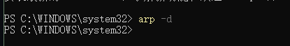
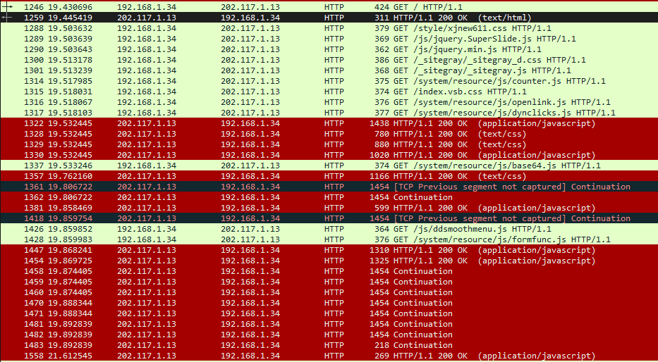
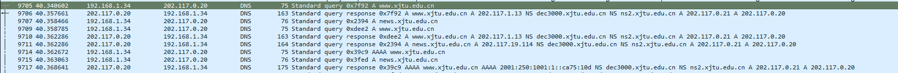
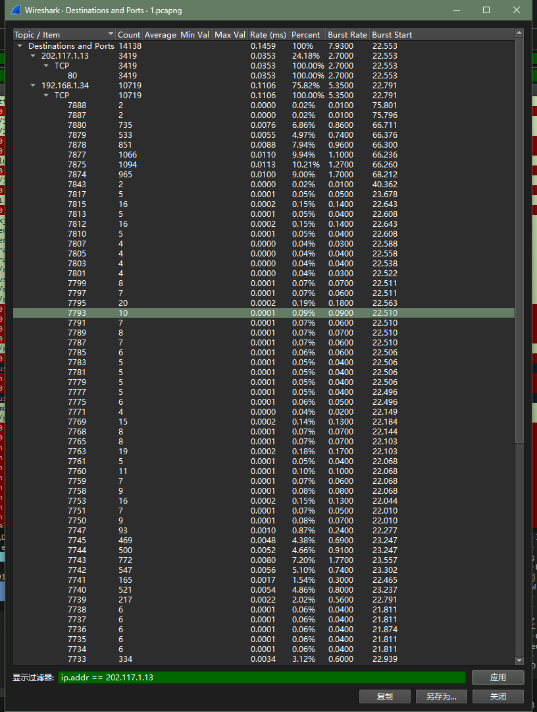
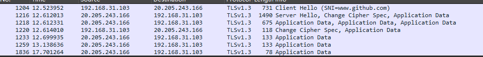
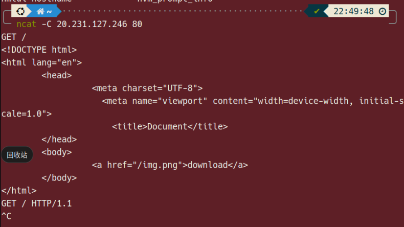
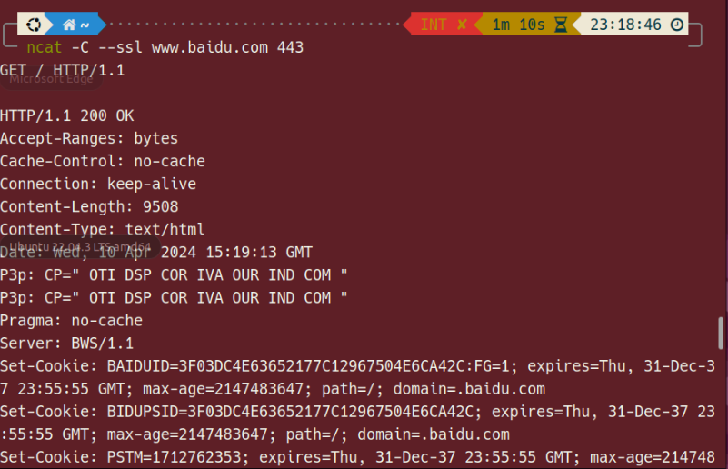
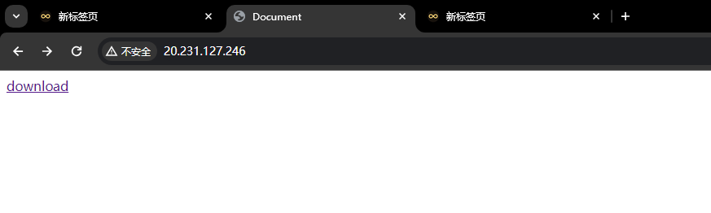
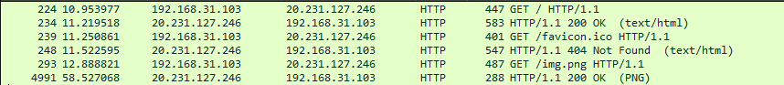
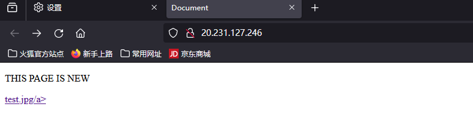

# 实验四、应用层协议分析实验报告

<center>组号：3-1</center>

<center>姓名：陈实  学号：2215015058  班级：计算机2101 </center>

<center>姓名：罗凯  学号：2204313382  班级：计算机2101 </center>

## 一、实验目的

分析应用层协议（如FTP，HTTP）的工作过程，理解应用层与传输层及下层协议的关系。

## 二、 实验内容

（1）每组同学利用现有实验室网络及云服务器搭建内网、外网环境；
（2）用Wireshark截获HTTP报文，分析报文结构及浏览器和服务器的交互过程；分析HTTP协议的缓存机制。分析应用层协议跟TCP/DNS等协议的交互关系。
（3）用Wireshark截获FTP的报文，分析FTP协议的连接；分析被动模式，普通模式的区别；分析NAT对FTP的影响。使用netcat工具模拟FTP的客户端。
注：HTTP和FTP两个协议二选一。

## 三、 实验环境与分组

每2名同学一组，以现有校园网络环境及云服务器搭建内网、外网网络。

## 四、实验组网

以各组现有网络实际情况为准，标注内网、公网地址。


## 五、实验过程及结果分析

### (一)清空缓存后的ARP，DNS和HTTP协议分析

* **步骤1：在计算机终端上运行Wireshark截获所有的报文。**
* **步骤2：清空ARP，DNS和HTTP浏览器的缓存：**

  * 浏览器缓存的清除以Chrome浏览器为例，地址栏中输入chrome://settings/，找到高级选项中的“隐私设置和安全性”，清除浏览数据。
  * 执行“ipconfig /flushdns”清除本地DNS缓存。
    *执行“arp –d”命令清空arp缓存。
  * 注：如果arp命令无法运行，可使用以下命令代替：
        netsh interface IP show neighbors
        netsh interface IP delete arpcache

    

* **步骤3：在浏览器中访问3个网址，比如www\.xjtu\.edu\.cn, www\.github\.com, www\.unb\.br**
* **步骤4：执行完之后，Wireshark停止报文截获，分析截获的报文。**
      观察几个协议的配合使用，注意访问的延迟情况。特别分析HTTP的请求和应答。

  * 以访问www.xjtu.edu.cn为例：
        

    ==第一个http请求报文==：

    ```txt
    Hypertext Transfer Protocol
    GET / HTTP/1.1\r\n
        [Expert Info (Chat/Sequence): GET / HTTP/1.1\r\n]
        Request Method: GET
        Request URI: /
        Request Version: HTTP/1.1
    Host: www.xjtu.edu.cn\r\n
    User-Agent: Mozilla/5.0 (Windows NT 10.0; Win64; x64; rv:124.0) Gecko/20100101 Firefox/124.0\r\n
    Accept: text/html,application/xhtml+xml,application/xml;q=0.9,image/avif,image/webp,*/*;q=0.8\r\n
    Accept-Encoding: gzip, deflate\r\n
    Accept-Language: zh-CN,zh;q=0.8,zh-TW;q=0.7,zh-HK;q=0.5,en-US;q=0.3,en;q=0.2\r\n
    Upgrade-Insecure-Requests: 1\r\n
    \r\n
    [Full request URI: http://www.xjtu.edu.cn/]
    [HTTP request 1/1]
    [Response in frame: 1259]
    ```

    * 请求方法：GET 表示获取请求
    * 请求URI：/ 表示请求的资源为根目录
    * 请求版本：HTTP/1.1 表示使用的HTTP协议版本为1.1
    * Host：www\.xjtu\.edu\.cn 表示请求的主机域名
    * User-Agent：Mozilla/5.0 (Windows NT 10.0; Win64; x64; rv:124.0) Gecko/20100101 Firefox/124.0 表示请求使用的浏览器是Firefox
    * Accept：text/html,application/xhtml+xml,application/xml;q=0.9,image/avif,image/webp,*/*;q=0.8 表示浏览器接受的数据类型包含html、xhtml、xml等
    * Accept-Encoding：gzip, deflate 表示浏览器接受的数据压缩格式
    * Accept-Language：zh-CN,zh;q=0.8,zh-TW;q=0.7,zh-HK;q=0.5,en-US;q=0.3,en;q=0.2 表示浏览器接受的语言类型，优先级依次为中文简体、中文、中文繁体、中文香港、英文美国、英文
    * Upgrade-Insecure-Requests：1 表示浏览器支持升级到HTTPS

    ==第一个http响应报文==：

    ```txt
    Hypertext Transfer Protocol
    HTTP/1.1 200 OK\r\n
    Date: Sun, 07 Apr 2024 01:33:54 GMT\r\n
    Server: *********\r\n
    X-Frame-Options: SAMEORIGIN\r\n
    X-XSS-Protection: 1; mode=block\r\n
    X-Content-Type-Options: nosniff\r\n
    Referer-Policy: no-referer-when-downgrade\r\n
    X-Download-Options: noopen\r\n
    X-Permitted-Cross-Domain-Policies: master-only\r\n
     [truncated]Content-Security-Policy: default-src 'self' data: blob: *.conac.cn  *.xjtu.edu.cn *.gov.cn *.jiathis.com *.baidu.com *.bshare.cn *.eol.cn *.qq.com *.kaipuyun.cn *.bdimg.com *.wx.qq.com *.people.com.cn *.weibo.com *.m1905.cn 'un
    Last-Modified: Sun, 07 Apr 2024 01:26:38 GMT\r\n
    Accept-Ranges: bytes\r\n
    Cache-Control: max-age=600\r\n
    Expires: Sun, 07 Apr 2024 01:43:54 GMT\r\n
    Vary: Accept-Encoding\r\n
    Content-Encoding: gzip\r\n
    ETag: "ea3d-61577948faf80-gzip"\r\n
    Content-Length: 13399\r\n
    Content-Type: text/html\r\n
    Content-Language: zh-CN\r\n
    \r\n
    [HTTP response 1/1]
    [Time since request: 0.014723000 seconds]
    [Request in frame: 1246]
    [Request URI: http://www.xjtu.edu.cn/]
    Content-encoded entity body (gzip): 13399 bytes -> 59965 bytes
    File Data: 59965 bytes
    ```

  * HTTP版本：HTTP/1.1 表示使用的HTTP协议版本为1.1
  * 状态码：200 OK 表示请求成功
  * Date：Sun, 07 Apr 2024 01:33:54 GMT 表示响应的时间
  * Server：********* 表示服务器的类型
  * X-Frame-Options：SAMEORIGIN 表示允许页面在相同域名下的页面中嵌套
  * X-XSS-Protection：1; mode=block 表示浏览器开启XSS保护
  * X-Content-Type-Options：nosniff 表示浏览器不会对响应的内容类型进行嗅探
  * Referer-Policy：no-referer-when-downgrade 表示浏览器在从HTTPS页面跳转到HTTP页面时不会发送Referer头部
  * X-Download-Options：noopen 表示浏览器不会打开下载的文件，而是直接下载
  * X-Permitted-Cross-Domain-Policies：master-only 表示跨域策略只允许master文件
  * Content-Security-Policy：default-src 'self' data: blob: *.conac.cn*.xjtu.edu.cn *.gov.cn*.jiathis.com *.baidu.com*.bshare.cn *.eol.cn*.qq.com *.kaipuyun.cn*.bdimg.com *.wx.qq.com*.people.com.cn *.weibo.com*.m1905.cn 'un 表示内容安全策略
  * Last-Modified：Sun, 07 Apr 2024 01:26:38 GMT 表示资源最后修改时间
  * Accept-Ranges：bytes 表示服务器支持断点续传
  * Cache-Control：max-age=600 表示资源的缓存时间为600秒，==具体含义为在600秒内不会再次请求服务器==
  * Expires：Sun, 07 Apr 2024 01:43:54 GMT 表示资源的过期时间，==即响应的时间加上缓存时间==
  * Vary：Accept-Encoding 表示服务器根据请求头中的Accept-Encoding头部来判断是否返回压缩后的内容
  * content-Encoding：gzip 表示服务器返回的内容使用gzip压缩
  * ETag：表示资源的唯一标识
  * Content-Length：13399 表示响应的内容长度
  * Content-Type：text/html 表示响应的内容类型为html
  * Content-Language：zh-CN 表示响应的内容语言为中文
  * Content-encoded entity body (gzip)：13399 bytes -> 59965 bytes 表示压缩前的内容长度为13399字节，压缩后的内容长度为59965字节
  * File Data：59965 bytes 表示响应的内容长度为59965字节
  
  ==从响应报文中可以看到，服务器返回的内容是经过gzip压缩的html文件，内容长度为59965字节，缓存时间为600秒，过期时间为Sun, 07 Apr 2024 01:43:54 GMT==

  * **延迟**：
    根据TCP三次握手的过程可得RTT为：0.003331s
    
    第一个HTTP请求报文到第一个HTTP响应报文的时间为：0.014723s
    
    余下http延迟间隔在0.02~0.1s之间
  * **有几次DNS解析；**
    有3次DNS解析，两次为A记录解析，一次为AAAA记录解析，A表示IPv4地址，AAAA表示IPv6地址
    

  * 用了几个连接（建立连接时，本地的端口不同，HTTP服务常用端口是80，HTTPS服务常用端口是443）；
    用了90个连接，本地端口不同，远程端口相同，远程端口为80
        
    虽然使用了Http1.1且Connection字段设置为keep-alive，但为了提高并发性能，浏览器会同时打开多个连接，以减少请求的延迟
  * 取了几个对象（GET的对象，如：HTML，CSS，JS，图片等）；
    取了186个对象，包括html、css、js、图片等

  * 有没有Cookie及其工作过程（Set-Cookie、Cookie、304 Not Modified相关数据包）等；
    Set-Cookie：

    ```txt
    Set-Cookie: JSESSIONID=6D4755F2E6BABB2EB20D2179E215ADB8; Path=/; HttpOnly\r\n
    ```

    表示服务器设置了一个名为JSESSIONID的cookie，值为6D4755F2E6BABB2EB20D2179E215ADB8，路径为/，只能通过http协议访问
    Cookie：

    ```txt
    Cookie: JSESSIONID=6D4755F2E6BABB2EB20D2179E215ADB8\r\n
    Cookie pair: JSESSIONID=6D4755F2E6BABB2EB20D2179E215ADB8
    ```

    表示浏览器发送了一个名为JSESSIONID的cookie，值为6D4755F2E6BABB2EB20D2179E215ADB8

HTTPS的加密内容不好分析，可观察TLS加密传输的建立过程，传输端口等。

==以www.github.com为例==

* TLS握手过程：

  

  * 客户端发送Client Hello报文，包含支持的TLS版本、加密套件、压缩方法等
  * 服务器发送Server Hello, Change Cipher Spec, Application Data报文，包含选择的TLS版本，切换到加密通信，应用数据
  * 客户端发送Change Cipher Spec, Application Data报文，切换到加密通信，应用数据
  
  TSL加密的原理是通过非对称加密算法，客户端和服务器各自生成一对公钥和私钥，客户端将公钥发送给服务器，服务器用公钥加密数据，客户端用私钥解密数据，反之亦然。

* HTTPS使用的远程端口为443，本机建立了3个连接，本地端口分别为9150、9151、9152
* github.com的RTT约为0.18s，远大于xjtu.edu.cn的RTT，可能是由于github.com的服务器在国外，网络延迟较大

### (二)带缓存的ARP，DNS和HTTP协议分析

照着1.7.1中的步骤1-4再次执行一遍，但不执行步骤2。观察缓存的使用和带来的好处。


* 在重新访问www.xjtu.edu.cn时，可以发现没有对www.xjtu.edu.cn进行DNS解析，而是直接使用了缓存的DNS解析结果，减少了DNS解析的时间，提高了访问速度。
* 在重新访问www.xjtu.edu.cn时，http报文数为2，远小于清空缓存后的，说明浏览器使用了缓存，减少了请求的次数，提高了访问速度。

* http请求报文

    ```txt
    Hypertext Transfer Protocol
    GET /system/resource/code/datainput.jsp?owner=1151962237&e=1&w=1920&h=1080&treeid=1001&refer=&pagename=L2luZGV4LmpzcA%3D%3D&newsid=-1 HTTP/1.1\r\n
    Host: www.xjtu.edu.cn\r\n
    User-Agent: Mozilla/5.0 (Windows NT 10.0; Win64; x64) AppleWebKit/537.36 (KHTML, like Gecko) Chrome/123.0.0.0 Safari/537.36\r\n
    Accept: image/avif,image/webp,image/apng,image/svg+xml,image/*,*/*;q=0.8\r\n
    Accept-Encoding: gzip, deflate\r\n
    Accept-Language: zh-CN,zh;q=0.9,en-US;q=0.8,en;q=0.7\r\n
    Cookie: JSESSIONID=172C4BE446F2C33B68E40631C44FF2FA\r\n
    Referer: http://www.xjtu.edu.cn/\r\n
    \r\n
    [Full request URI: http://www.xjtu.edu.cn/system/resource/code/datainput.jsp?owner=1151962237&e=1&w=1920&h=1080&treeid=1001&refer=&pagename=L2luZGV4LmpzcA%3D%3D&newsid=-1]
    [HTTP request 1/1]
    [Response in frame: 186]
    ```

  * 这一次只请求了一个资源，请求的资源为http:\/\/www\.xjtu.edu.cn/system/resource/code/datainput.jsp?owner=1151962237&e=1&w=1920&h=1080&treeid=1001&refer=&pagename=L2luZGV4LmpzcA%3D%3D&newsid=-1，
  * 请求中包含了Cookie：JSESSIONID，使得服务器能够识别用户
  
### （三）使用ncat工具访问HTTP服务

参考1.7.1中的步骤1-4和分析结果，在命令窗口执行ncat -C xxx.xxx.xxx.xxx 80，ncat连接上HTTP服务器后，根据协议输入合适的请求。其中xxx.xxx.xxx.xxx 为服务器地址。

使用命令行

```shell
ncat -C 20.231.127.246 80
```

连接到HTTP服务器，输入HTTP请求报文

```txt
GET / HTTP/1.1
```

获取HTTP响应报文


## 六、 互动讨论主题

1. HTTP协议的缓存，DNS的缓存；缓存对网络访问速度的影响。
   * HTTP缓存是指Web服务器和客户端之间的一种机制，用于存储先前获取的资源的副本，并在需要时重用这些资源，以减少网络流量和加快页面加载速度。通过使用缓存，客户端可以在需要时直接从本地获取资源，而不必每次都向服务器发起请求。

   * HTTP缓存通常分为两种类型：浏览器缓存和代理服务器缓存。

        * 浏览器缓存：浏览器会将之前获取的资源存储在本地缓存中，以便在用户再次访问相同的资源时能够快速加载。浏览器缓存可以通过设置HTTP响应头来控制缓存的行为，如Cache-Control和Expires。

           * Cache-Control：该头部指示请求（或响应）应该遵循怎样的缓存机制。常见的指令包括：
           * public：资源可以被任何中间缓存（如代理服务器）缓存。
           * private：资源仅可被终端用户的浏览器缓存，不应该被代理服务器缓存。
           * max-age=\<seconds>：指定资源在被认为过期前可以被缓存多久，单位是秒。
           * no-cache：表示缓存必须在使用缓存前重新验证。
           * no-store：表示绝对不缓存该资源。
           * Expires：指定资源的到期时间，是一个绝对时间，而不是相对于当前时间的持续时间。
        * 代理服务器缓存：除了终端用户的浏览器之外，代理服务器（例如CDN或公司内部代理服务器）也可以缓存HTTP资源，以减轻原始服务器的负载并加快资源加载速度。代理服务器缓存通常由服务器端设置，通过类似Cache-Control和Expires的头部来控制。

   * HTTP缓存可以通过以下几种方式进行更新或控制：

        * 强制缓存：在强制缓存生效期间，浏览器直接从本地缓存中获取资源，不发送请求到服务器，以减少网络延迟。这可以通过Cache-Control中的max-age或Expires头部来实现。

       * 协商缓存：在协商缓存中，浏览器会向服务器发送请求，但服务器会告知浏览器是否需要更新资源。这可以通过Last-Modified和ETag头部来实现。如果资源没有更新，服务器会返回304 Not Modified状态码，告知浏览器使用本地缓存。
   * DNS缓存是指将DNS查询结果存储在本地缓存中，以便在将来的查询中快速获取。DNS缓存可以减少DNS查询的次数，提高域名解析的速度。DNS缓存通常由操作系统或浏览器维护，可以通过清除DNS缓存来强制刷新DNS查询结果。

2. NAT对FTP传输的影响，比较HTTP与FTP的特点；

    NAT对FTP的影响主要是由于FTP使用两个TCP连接（控制连接和数据连接），在NAT环境中可能导致数据连接建立失败。为了解决这个问题，FTP可以使用被动模式。与此相比，HTTP是基于单一连接的协议，适用于传输网页和相关资源，通常使用端口80。FTP则用于文件传输，支持丰富的文件管理功能，使用端口21和20（或随机端口）。

## 七、 进阶自设计

1、用nmap的ncat来模拟https客户端，访问1-2个网站。

使用命令行

    ```shell
    ncat -C --ssl www.baidu.com 443
    ```



2、在云服务器上搭建Apache2（或其他WEB服务器），并测试修改HTML或图片文件，看客户端能否及时访问到更新的内容。注意抓包分析。

==修改前==




访问该网页，发送了3个HTTP请求，分别请求了/, /favicon.ico, /image.png, 其中/favicon.ico是浏览器自动请求的，/和/image.png是用户请求的。/和/image.png存在，返回200 OK，/favicon.ico不存在，返回404 Not Found。

==刷新网页==
发送了1个HTTP请求，请求了/。由于网页内容没有改变，服务器返回304 Not Modified。直接从缓存中获取。


==修改后==

服务器命令行运行下面的命令，重启Apache2

```shell
systemctl restart apache2
```

浏览器刷新网页，可以看到网页内容已经更新



因为在http请求中设置了：

```txt
If-Modified-Since: Wed, 10 Apr 2024 16:00:14 GMT\r\n
```

服务修改的时间在此时间之后，所以服务器重新发送了资源。