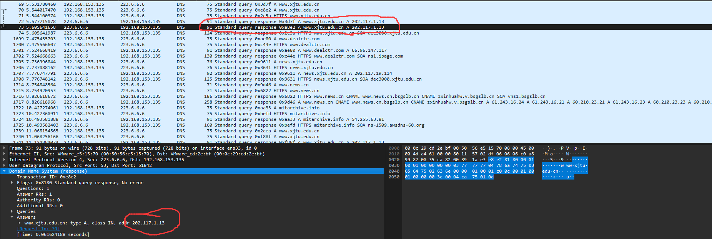
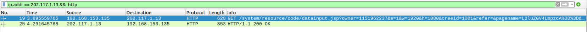
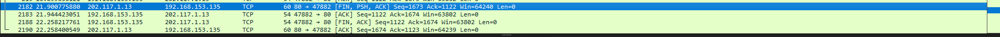

# <center>计网大作业</center>

## 实验目的

1. 利用wireshark软件分析HTTP及其下层协议（TCP协议）
2. 了解网络中数据封装的概念
3. 掌握HTTP及TCP协议的工作过程。 

## 实验平台

1. Ubuntu 虚拟机 22.04
2. wireshark 3.4.0

## 实验内容

### 抓包

1. 开启wireshark抓包，打开`http://www.xjtu.edu.com`，浏览网页然后关闭，停止抓包。
2. 利用dns过滤器，查看dns查询的过程，查找xjtu字段，查看dns查询的详细信息。
   
3. 查找到www.xjtu.edu.cn的ip地址为`202.117.1.13`

### HTTP报文

1. 利用**ip.addr == 202.117.1.13 && http**过滤器，查看http请求的详细信息。
    
2. HTTP第一条报文

     ```txt
     Hypertext Transfer Protocol
    GET / HTTP/1.1\r\n
    Host: www.xjtu.edu.cn\r\n
    Connection: keep-alive\r\n
    Upgrade-Insecure-Requests: 1\r\n
    User-Agent: Mozilla/5.0 (X11; Linux x86_64) AppleWebKit/537.36 (KHTML, like Gecko) Chrome/120.0.0.0 Safari/537.36 Edg/120.0.0.0\r\n
    Accept: text/html,application/xhtml+xml,application/xml;q=0.9,image/webp,image/apng,*/*;q=0.8,application/signed-exchange;v=b3;q=0.7\r\n
    Accept-Encoding: gzip, deflate\r\n
    Accept-Language: zh-CN,zh;q=0.9,en;q=0.8,en-GB;q=0.7,en-US;q=0.6\r\n
    If-None-Match: "eda2-60bac80982900-gzip"\r\n
    If-Modified-Since: Mon, 04 Dec 2023 10:23:00 GMT\r\n
    \r\n
    [Full request URI: http://www.xjtu.edu.cn/]
    [HTTP request 1/14]
    [Response in frame: 83]
    [Next request in frame: 85]
     ```

    1. 请求方法：==GET，表示获取资源。==
    2. 请求URI：/，请求的资源路径为根目录。
    3. HTTP版本：HTTP/1.1。
    4. Host：`www.xjtu.edu.cn`，表示请求的主机为`www.xjtu.edu.cn`。
    5. Connection：keep-alive，表示请求完成后，连接保持，可以继续使用该连接发送请求。
    6. User-Agent：Mozilla/5.0 (X11; Linux x86_64) AppleWebKit/537.36 (KHTML, like Gecko) Chrome/120.0.0.0 Safari/537.36 Edg/120.0.0.0，表示用户使用的是Linux系统上的Chrome浏览器，实际使用是Edge浏览器，但Edge使用的是Chromium内核，所以显示的是Chrome。
    7. Accept：text/html,application/xhtml+xml,application/xml;q=0.9,image/webp,image/apng,/;q=0.8,application/signed-exchange;v=b3;q=0.7，表示浏览器可以接受的资源类型。
    8. Accept-Encoding：gzip, deflate，表示浏览器可以接受的压缩方式。
    9. Accept-Language：zh-CN,zh;q=0.9,en;q=0.8,en-GB;q=0.7,en-US;q=0.6，表示浏览器可以接受的语言为中文，英文，英式英语，美式英语，参数q表示权重，越大越优先。
    10. If-None-Match: "eda2-60bac80982900-gzip"，表示如果资源的ETag与给定的匹配，则返回304 Not Modified。
    11. If-Modified-Since: Mon, 04 Dec 2023 10:23:00 GMT，表示如果资源自指定的日期以来已经修改，则返回请求的内容，否则返回304 Not Modified。

3. HTTP第二条报文

    ```txt
    Hypertext Transfer Protocol
        HTTP/1.1 200 OK\r\n
        Date: Tue, 19 Dec 2023 13:45:51 GMT\r\n
        Server: *********\r\n
        X-Frame-Options: SAMEORIGIN\r\n
        X-XSS-Protection: 1; mode=block\r\n
        X-Content-Type-Options: nosniff\r\n
        Referer-Policy: no-referer-when-downgrade\r\n
        X-Download-Options: noopen\r\n
        X-Permitted-Cross-Domain-Policies: master-only\r\n
        [truncated]Content-Security-Policy: default-src 'self' data: blob: *.conac.cn  *.xjtu.edu.cn *.gov.cn *.jiathis.com *.baidu.com *.bshare.cn *.eol.cn *.qq.com *.kaipuyun.cn *.bdimg.com *.wx.qq.com *.people.com.cn *.weibo.com *.m1905.cn 'un
        Last-Modified: Tue, 19 Dec 2023 09:51:52 GMT\r\n
        Accept-Ranges: bytes\r\n
        Cache-Control: max-age=600\r\n
        Expires: Tue, 19 Dec 2023 13:55:51 GMT\r\n
        Vary: Accept-Encoding\r\n
        Content-Encoding: gzip\r\n
        ETag: "ebfa-60cd9d0df5e00-gzip"\r\n
        Content-Length: 13607\r\n
        Keep-Alive: timeout=5, max=100\r\n
        Connection: Keep-Alive\r\n
        Content-Type: text/html\r\n
        Content-Language: zh-CN\r\n
        \r\n
        [HTTP response 1/14]
        [Time since request: 0.009227481 seconds]
        [Request in frame: 79]
        [Next request in frame: 85]
        [Next response in frame: 89]
        [Request URI: http://www.xjtu.edu.cn/]
        Content-encoded entity body (gzip): 13607 bytes -> 60410 bytes
        File Data: 60410 bytes
    ```

    1. HTTP版本：HTTP/1.1，表示使用的是HTTP协议的1.1版本。

    2. 状态码：==200 OK，表示服务器成功处理了客户端的请求。==

    3. Date: Tue, 19 Dec 2023 13:45:51 GMT，表示响应的生成时间是GMT时间的Tue, 19 Dec 2023 13:45:51。

    4. Server: *********，表示服务器的信息，可能包含服务器的软件或标识信息。

    5. X-Frame-Options: SAMEORIGIN，该字段为HTTP头中的一部分，用于防止点击劫持攻击，SAMEORIGIN表示只允许在相同域名下的页面嵌入。

    6. X-XSS-Protection: 1; mode=block，用于启用浏览器的XSS保护机制，1表示启用，mode=block表示发现XSS攻击时，浏览器将阻止页面的渲染。

    7. X-Content-Type-Options: nosniff，表示浏览器应该不会对响应的内容类型进行嗅探，使用服务器声明的内容类型。

    8. Referer-Policy: no-referer-when-downgrade，指定了在降级（例如从HTTPS到HTTP）情况下是否发送Referer头，这里表示在降级时不发送Referer。

    9. X-Download-Options: noopen，用于防止IE浏览器执行可执行文件下载，以增强安全性。

    10. X-Permitted-Cross-Domain-Policies: master-only，用于定义Flash应用程序的跨域策略文件的位置，这里表示只允许在同一域中找到跨域策略文件。

    11. Content-Security-Policy: default-src 'self' data: blob: *.conac.cn *.xjtu.edu.cn *.gov.cn *.jiathis.com ... 'unsafe-inline' 'unsafe-eval'，定义了浏览器允许加载的资源来源，以及是否允许使用某些不安全的功能，如内联脚本和eval。

    12. Last-Modified: Tue, 19 Dec 2023 09:51:52 GMT，表示资源最后修改的时间。

    13. Accept-Ranges: bytes，表示服务器支持按字节范围请求。

    14. Cache-Control: max-age=600，表示浏览器可以将该响应缓存最长时间为600秒。

    15. Expires: Tue, 19 Dec 2023 13:55:51 GMT，表示响应的过期时间。

    16. Vary: Accept-Encoding，表示服务器使用的变量，用于决定缓存响应的条件。

    17. Content-Encoding: gzip，表示响应使用gzip进行了压缩。

    18. ETag: "ebfa-60cd9d0df5e00-gzip"，表示资源的实体标签，用于标识资源的版本。

    19. Content-Length: 13607，表示响应体的长度。

    20. Keep-Alive: timeout=5, max=100，表示连接的Keep-Alive参数，timeout表示连接在空闲状态下的超时时间，max表示最大允许的请求次数。

    21. Connection: Keep-Alive，表示连接将被保持活动。

    22. Content-Type: text/html，表示响应体的内容类型为HTML文本。

    23. Content-Language: zh-CN，表示响应体的语言为中文。

4. **http协议的工作过程：**

    1. 建立连接：
    客户端通过与服务器建立TCP连接（通常是在默认的80端口上）来开始HTTP通信。

    2. 发送请求：
    客户端通过TCP连接向服务器发送HTTP请求。请求包含HTTP方法（GET、POST等）和请求的资源路径。

    3. 处理请求：
    服务器收到请求后，解析请求，确定请求的资源，并根据请求执行相应的操作。这可能包括读取文件、查询数据库或生成动态内容。
    4. 服务器响应：
    服务器通过TCP连接向客户端发送HTTP响应。响应包括一个状态码，表示请求的处理结果（例如，200表示成功，404表示未找到）以及相应的内容。
    5. 传输数据：
    如果响应中包含实体内容（如HTML页面、图像或其他资源），服务器将这些数据通过TCP连接传输到客户端。
    6. 关闭连接：
    当服务器完成响应后，它可以选择在TCP连接上保持连接以进行其他请求，或者在完成响应后关闭连接。对于非持久连接，每个请求/响应周期都会打开和关闭一个新的连接。
    7. 客户端渲染：
    客户端接收到服务器的响应后，根据响应的内容类型进行相应的处理。例如，Web浏览器可能会渲染HTML页面，加载和显示图像，执行JavaScript脚本等。
    8. 用户交互：
    用户与渲染的页面进行交互，可能会触发新的HTTP请求（例如，通过点击链接或提交表单），从而开始新的HTTP请求/响应周期。

### TCP三次握手

1. ==**TCP三次握手的过程：**==

    1. **客户端发送SYN报文，设置序列号为x，表示请求建立连接**
    2. **服务器发送SYN+ACK报文，设置序列号为y，确认号为x+1，表示确认请求，并发送自己的SYN报文，表示请求建立连接**
    3. **客户端发送ACK报文，设置序列号为x+1，确认号为有+1，表示确认请求**

    4. 经过以上三步，TCP连接建立，双方都可以发送数据。

2. TCP握手第一条报文

    ```txt
    Transmission Control Protocol, Src Port: 54110, Dst Port: 80, Seq: 0, Len: 0
        Source Port: 54110
        Destination Port: 80
        [Stream index: 3]
        [Conversation completeness: Complete, WITH_DATA (31)]
        [TCP Segment Len: 0]
        Sequence Number: 0    (relative sequence number)
        Sequence Number (raw): 896786936
        [Next Sequence Number: 1    (relative sequence number)]
        Acknowledgment Number: 0
        Acknowledgment number (raw): 0
        1010 .... = Header Length: 40 bytes (10)
        Flags: 0x002 (SYN)
        Window: 64240
        [Calculated window size: 64240]
        Checksum: 0x25e1 [unverified]
        [Checksum Status: Unverified]
        Urgent Pointer: 0
        Options: (20 bytes), Maximum segment size, SACK permitted, Timestamps, No-Operation (NOP), Window scale
        [Timestamps]

    ```

    1. 源端口：54110，表示该TCP报文的源端口号是54110。
    2. 目的端口：80，==80端口为HTTP端口==，表示该TCP报文的目的端口是80。
    3. Stream index: 3，用来识别不同的 TCP 传输流的编号。
    4. Conversation completeness: Complete, WITH_DATA (31)，表示该报文是完整的，并且在这个TCP通信会话中，有31个包含数据的数据包。
    TCP Segment Len: 0，表示该报文的长度为0，因为该报文只包含TCP头部，没有数据。
    5. Sequence Number: 0 (relative sequence number)，==表示该报文的相对序列号为0。==
    6. Sequence Number (raw): 896786936，表示该报文的原始序列号为896786936。
    7. Next Sequence Number: 1 (relative sequence number)，表示下一个报文的相对序列号为1。
    8. Acknowledgment Number: 0，表示该报文的确认号为0。
    9. Acknowledgment number (raw): 0，表示该报文的原始确认号为0。
    10. Flags: 0x002 (SYN)，==表示该报文的标志位为SYN，说明这是一个SYN报文，用于建立TCP连接。==
    11. Window: 64240，表示接收方还能接收的数据量，即窗口大小。
    12. Calculated window size: 64240，计算出的窗口大小，与上面的窗口大小相同。
    13. Checksum: 0x25e1 [unverified]，校验和，用于验证数据包的完整性，这里显示为未验证。
    14. Checksum Status: Unverified，校验和的状态，未验证。
    15. Urgent Pointer: 0，紧急指针，用于指示数据包中的紧急数据，这里为0表示没有紧急数据。
    16. Options: (20 bytes)，选项字段，包含了额外的TCP参数。
    17. Maximum segment size：最大分段大小，表示发送方和接收方支持的最大分段大小。
    18. SACK permitted：SACK（Selective Acknowledgment）允许，表示支持选择性确认。
    19. Timestamps：时间戳选项，用于计算数据包的传输延迟。
    20. No-Operation (NOP)：无操作选项，没有特定功能。
    21. Window scale：窗口缩放选项，用于调整窗口大小的缩放因子。

3. TCP握手第二条报文

    ```txt
   Transmission Control Protocol, Src Port: 80, Dst Port: 54110, Seq: 0, Ack: 1, Len: 0
        Source Port: 80
        Destination Port: 54110
        [Stream index: 3]
        [Conversation completeness: Complete, WITH_DATA (31)]
        [TCP Segment Len: 0]
        Sequence Number: 0    (relative sequence number)
        Sequence Number (raw): 1722577826
        [Next Sequence Number: 1    (relative sequence number)]
        Acknowledgment Number: 1    (relative ack number)
        Acknowledgment number (raw): 896786937
        0110 .... = Header Length: 24 bytes (6)
        Flags: 0x012 (SYN, ACK)
        Window: 64240
        [Calculated window size: 64240]
        Checksum: 0xb208 [unverified]
        [Checksum Status: Unverified]
        Urgent Pointer: 0
        Options: (4 bytes), Maximum segment size
        [Timestamps]
        [SEQ/ACK analysis]
    ```

    1. Source Port: 80，表示该TCP报文的源端口号是80，表明该报文是由端口80发起的。
    2. Destination Port: 54110，表示该TCP报文的目的端口是54110，指示该报文要发送给端口54110。
    3. [Stream index: 3]，与前面提到的Stream index对应，用于标识在TCP通信中的流索引。
    4. [Conversation completeness: Complete, WITH_DATA (31)]，表示该报文是完整的，且在整个TCP通信会话中，有31个包含数据的数据包。
    5. [TCP Segment Len: 0]，表示该报文的长度为0，因为该报文只包含TCP头部，没有实际的数据负载。
    6. Sequence Number: 0 (relative sequence number)，表示该TCP报文的相对序列号为0。
    7. Sequence Number (raw): 1722577826，表示该报文的原始序列号为1722577826。
    8. Next Sequence Number: 1 (relative sequence number)，表示下一个报文的相对序列号为1。
    9. Acknowledgment Number: 1 (relative ack number)，表示该报文的相对确认号为1。
    10. Acknowledgment number (raw): 896786937，表示该报文的原始确认号为896786937。
    11. Flags: 0x012 (SYN, ACK)，表示该报文的标志位为SYN和ACK，说明这是一个同时携带确认和请求连接的报文。
    12. Window: 64240，表示接收方还能接收的数据量，即窗口大小。
    13. Calculated window size: 64240，计算出的窗口大小，与上面的窗口大小相同。
    14. Checksum: 0xb208 [unverified]，校验和，用于验证数据包的完整性，这里显示为未验证。
    15. Checksum Status: Unverified，校验和的状态，未验证。
    16. Urgent Pointer: 0，紧急指针，用于指示数据包中的紧急数据，这里为0表示没有紧急数据。
    17. Options: (4 bytes)，选项字段，包含了额外的TCP参数，这里显示为最大分段大小。

4. TCP握手第三条报文

    ```txt
    Transmission Control Protocol, Src Port: 54110, Dst Port: 80, Seq: 1, Ack: 1, Len: 0
        Source Port: 54110
        Destination Port: 80
        [Stream index: 3]
        [Conversation completeness: Complete, WITH_DATA (31)]
        [TCP Segment Len: 0]
        Sequence Number: 1    (relative sequence number)
        Sequence Number (raw): 896786937
        [Next Sequence Number: 1    (relative sequence number)]
        Acknowledgment Number: 1    (relative ack number)
        Acknowledgment number (raw): 1722577827
        0101 .... = Header Length: 20 bytes (5)
        Flags: 0x010 (ACK)
        Window: 64240
        [Calculated window size: 64240]
        [Window size scaling factor: -2 (no window scaling used)]
        Checksum: 0x25cd [unverified]
        [Checksum Status: Unverified]
        Urgent Pointer: 0
        [Timestamps]
        [SEQ/ACK analysis]

    ```

    序列号为1，确认号为1，标志位为ACK，表示该报文是一个ACK报文。序列号为1是因为已经发送的报文的最后一个字段的序列号为0，而连续的报文序号是连续的，所以序列号为0+1=1。确认号为1时因为已经收到了序列号为0的报文，所以确认号为1。

### TCP四次挥手

==由于第一次抓包的时候没有抓取到关闭连接的过程，所以这里重新抓包。==
==对应附件`http--2215015058-1`的抓包文件。==



1. server端发送FIN置1的报文

    ```txt
    Transmission Control Protocol, Src Port: 80, Dst Port: 47882, Seq: 1673, Ack: 1122, Len: 0
        Source Port: 80
        Destination Port: 47882
        [Stream index: 16]
        [Conversation completeness: Complete, WITH_DATA (31)]
        [TCP Segment Len: 0]
        Sequence Number: 1673    (relative sequence number)
        Sequence Number (raw): 2041149390
        [Next Sequence Number: 1674    (relative sequence number)]
        Acknowledgment Number: 1122    (relative ack number)
        Acknowledgment number (raw): 38153150
        0101 .... = Header Length: 20 bytes (5)
        Flags: 0x019 (FIN, PSH, ACK)
        Window: 64240
        [Calculated window size: 64240]
        [Window size scaling factor: -2 (no window scaling used)]
        Checksum: 0xb451 [unverified]
        [Checksum Status: Unverified]
        Urgent Pointer: 0
        [Timestamps]

    ```

    1. 源端口：80，表示该TCP报文的源端口号是80，==即是服务器端发起的挥手。==
    2. 该报文的标志位为FIN，PSH，ACK，表示该报文是一个FIN报文，表示用户端不再发送数据，但是还可以接收数据。PSH表示该报文是一个推送报文，表示接收方应该立即将数据交给应用层。ACK表示该报文是一个ACK报文，表示确认收到了序列号为1122的报文。
    3. 序号为1673，表示该报文的序列号为1673，表示该报文是第1673个报文。
    4. 确认号为1166，表示该报文的确认号为1166，表示该报文确认收到了序列号为1166的报文。
    5. 该报文的长度为0，表示该报文没有数据。
2. 用户端发送ACK置1的报文

    ```txt
    Transmission Control Protocol, Src Port: 47882, Dst Port: 80, Seq: 1122, Ack: 1674, Len: 0
        Source Port: 47882
        Destination Port: 80
        [Stream index: 16]
        [Conversation completeness: Complete, WITH_DATA (31)]
        [TCP Segment Len: 0]
        Sequence Number: 1122    (relative sequence number)
        Sequence Number (raw): 38153150
        [Next Sequence Number: 1122    (relative sequence number)]
        Acknowledgment Number: 1674    (relative ack number)
        Acknowledgment number (raw): 2041149391
        0101 .... = Header Length: 20 bytes (5)
        Flags: 0x010 (ACK)
        Window: 63802
        [Calculated window size: 63802]
        [Window size scaling factor: -2 (no window scaling used)]
        Checksum: 0x25cd [unverified]
        [Checksum Status: Unverified]
        Urgent Pointer: 0
        [Timestamps]
        [SEQ/ACK analysis]
    ```

    1. source port: 47882，表示该TCP报文的源端口号是47882，即是用户端发送
    2. 该报文的标志位为ACK，表示该报文是一个ACK报文，表示确认收到了序列号为1674的报文。即对此前的FIN报文的确认。

3. 用户端发送FIN置1的报文

    ```txt
    Transmission Control Protocol, Src Port: 47882, Dst Port: 80, Seq: 1122, Ack: 1674, Len: 0
        Source Port: 47882
        Destination Port: 80
        [Stream index: 16]
        [Conversation completeness: Complete, WITH_DATA (31)]
        [TCP Segment Len: 0]
        Sequence Number: 1122    (relative sequence number)
        Sequence Number (raw): 38153150
        [Next Sequence Number: 1123    (relative sequence number)]
        Acknowledgment Number: 1674    (relative ack number)
        Acknowledgment number (raw): 2041149391
        0101 .... = Header Length: 20 bytes (5)
        Flags: 0x011 (FIN, ACK)
        Window: 63802
        [Calculated window size: 63802]
        [Window size scaling factor: -2 (no window scaling used)]
        Checksum: 0x25cd [unverified]
        [Checksum Status: Unverified]
        Urgent Pointer: 0
        [Timestamps]
    ```

    1. source port: 47882，表示该TCP报文的源端口号是47882，即是用户端发送
    2. 该报文的标志位为FIN，ACK，表示该报文是一个FIN报文，表示服务器端不再发送数据，但是还可以接收数据。ACK表示该报文是一个ACK报文，表示确认收到了序列号为1674的报文。这和第二次挥手的确认是一样的，提高了可靠性。

4. server端发送ACK置1的报文

    ```txt
    Transmission Control Protocol, Src Port: 80, Dst Port: 47882, Seq: 1674, Ack: 1123, Len: 0
        Source Port: 80
        Destination Port: 47882
        [Stream index: 16]
        [Conversation completeness: Complete, WITH_DATA (31)]
        [TCP Segment Len: 0]
        Sequence Number: 1674    (relative sequence number)
        Sequence Number (raw): 2041149391
        [Next Sequence Number: 1674    (relative sequence number)]
        Acknowledgment Number: 1123    (relative ack number)
        Acknowledgment number (raw): 38153151
        0101 .... = Header Length: 20 bytes (5)
        Flags: 0x010 (ACK)
        Window: 64239
        [Calculated window size: 64239]
        [Window size scaling factor: -2 (no window scaling used)]
        Checksum: 0xb459 [unverified]
        [Checksum Status: Unverified]
        Urgent Pointer: 0
        [Timestamps]
        [SEQ/ACK analysis]
    ```

    1. 源端口：80，表示该TCP报文的源端口号是80，

    2. 该报文的标志位为ACK，表示该报文是一个ACK报文，表示确认收到了序列号为1123的报文。即对此前的FIN报文的确认。

5. ==**所以TCP四次挥手的过程是这样的：**==

    1. **挥手发起端发送FIN置1的报文，表示挥手发起端不再发送数据**
    2. **挥手接收端发送ACK置1的报文，表示确认收到了挥手发起端发送的FIN置1的报文**
    3. **挥手接收端发送FIN置1的报文，表示挥手接收端不再发送数据**
    4. **挥手发起端发送ACK置1的报文，表示确认收到了挥手接收端发送的FIN置1的报文**

    5. 经过以上四步，TCP连接关闭。双方都不再发送数据。

## 实验总结

### 问题与解决

1. 抓包数据特别多，怎么找到`www.xjtu.edu.cn`的数据包？

    1. 使用dns过滤器，查找dns查询的过程，查找xjtu字段，查看dns查询的详细信息。
    2. 查找到www.xjtu.edu.cn的ip地址为`202.117.1.13`
    3. 使用`ip.addr`过滤器，

2. 打开一个网页，建立的TCP连接不止一个。

    1. 一个网页可能包含多个资源，可能会建立多个TCP连接。
    2. 可以通过端口号来区分不同的TCP连接。或者根据stream index来区分不同的TCP连接。

## 实验心得

1. 通过本次实验，我在实践中加深了对HTTP协议和TCP协议的理解，对于HTTP协议的请求报文和响应报文有了更深入的了解，对于TCP协议的三次握手和四次挥手有了更深入的了解。
2. 通过本次实验，我学会了使用wireshark抓包，学会了使用wireshark的过滤器，学会了使用wireshark的统计功能。
3. 通过实验，我对网页的加载过程有了更深入的了解
   1. 首先是DNS查询，通过DNS服务器查询到域名对应的IP地址。
   2. 然后是TCP连接的建立，通过三次握手建立TCP连接。
   3. 然后是HTTP请求，通过HTTP协议发送请求报文。
   4. 然后是HTTP响应，通过HTTP协议发送响应报文。
   5. 最后是TCP连接的关闭，通过四次挥手关闭TCP连接。