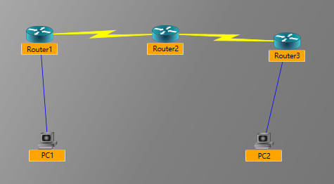
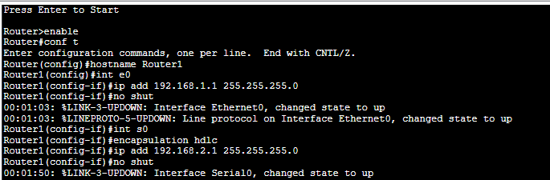
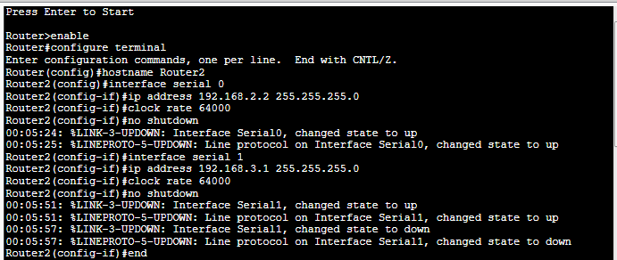
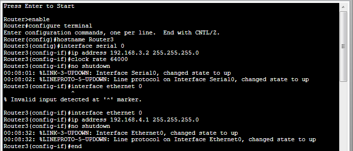
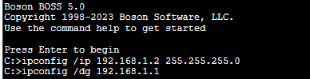
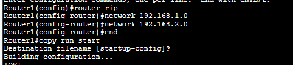
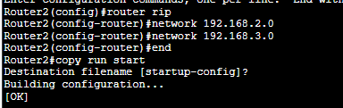
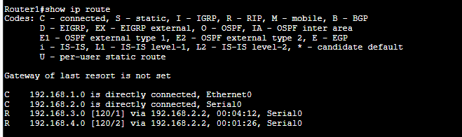
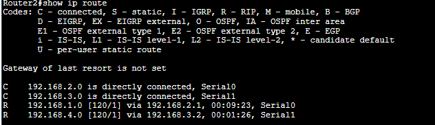
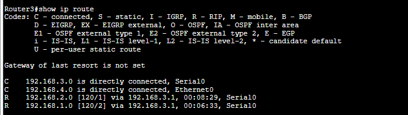

<<<<<<< HEAD
# 路由器基本配置大作业

## 实验平台

1. Windows 11 下的 Boson Netsim 10

## 实验目的

1. 掌握路由器的基本知识
2. 掌握路由器端口的配置
3. 掌握路由协议的基本配置
4. 熟悉使用Boson Netsim模拟器

## 实验内容

1. 使用IOS命令配置路由器
2. 掌握握静态路由和动态路由（RIP、OSPF）的配置方法 

## 实验要求

1. 本实验要求自行构建一个网络拓扑，要求包括3个以上路由器（路由器采用串行连接），用于连接两个以太网，每个以太网至少包括1台主机；
2. 完成路由器、主机等设备的配置；使用RIP或OSPF来维护路由器的路由表。 
3. 实验配置完成后，两台主机要能够相互ping通
4. 实验报告要包括网络拓扑、配置以及结果

## 实验步骤

1. 构建网络拓扑

    

    其中，路由器型号为Cisco 2514。各设备接口的IP地址如下：

    | 设备 | 接口 | IP地址 |
    | --- | --- | --- |
    | Router1 | Ethernet0 |192.168.1.1/24|
    | Router1 | Serial0 |192.168.2.1/24|
    | Router2 | Serial0 |192.168.2.2/24|
    | Router2 | Serial1 |192.168.3.1/24|
    | Router3 | Serial0 |192.168.3.2/24|
    | Router3 | Ethernet0 |192.168.4.1/24|
    | PC1 | Ethernet0 |192.168.1.2/24|
    | PC2 | Ethernet0 |192.168.4.2/24|

2. 配置路由器

    1. Router1

        ```osi
         enable
         configure terminal
         hostname Router1

         interface ethernet 0
         ip address 192.168.1.1 255.255.255.0
         no shutdown

         interface serial 0
         ip address 192.168.2.1 255.255.255.0
         clock rate 64000
         no shutdown

         end
        ```

        
    2. Router2

        ```osi
         enable
         configure terminal
         hostname Router2

         interface serial 0
         ip address 192.168.2.2 255.255.255.0
         clock rate 64000
         no shutdown


         interface serial 1
         ip address 192.168.3.1 255.255.255.0
         clock rate 64000
         no shutdown

         end
        ```

        
    3. Router3

        ```osi
         enable
         configure terminal
         hostname Router3

         interface serial 0
         ip address 192.168.3.2 255.255.255.0
         clock rate 64000
         no shutdown

         interface ethernet 0
         ip address 192.168.4.1 255.255.255.0
         no shutdown

         end
        ```
        

3. 命令解析（以Router1为例）

    1. `enable`：进入特权模式
    2. `configure terminal`：进入全局配置模式
    3. `hostname Router1`：设置路由器名称
    4. `interface ethernet 0`：进入以太网0接口配置模式
    5. `ip address 192.168.1.1 255.255.255.0`：设置以太网0接口的IP地址
    6. `no shutdown`：开启以太网0接口
    7. `interface serial 0`：进入串行0接口配置模式
    8. `ip address 192.168.2.1 255.255.255.0`：设置串行0接口的IP地址
    9. `clock rate 64000`：设置时钟速率
    10. `no shutdown`：开启串行0接口
    11. `end`：退出全局配置模式

4. 配置PC

    1. PC1

        ```text
        ipconfig /ip 192.168.1.2 255.255.255.0
        ipconfig /dg 192.168.1.1
        ```

        
    2. PC2

        ```text
        ipconfig /ip 192.168.4.2 255.255.255.0
        ipconfig /dg 192.168.4.1
        ```

        
5. 命令解析

    1. `ipconfig /ip 192.168.1.2 255.255.255.0`：设置IP地址
    2. `ipconfig /dg 192.168.1.1`：设置默认网关

6. 配置路由协议

    1. Router1

        ```osi
        enable
        configure terminal
        router rip
        network 192.168.1.0
        network 192.168.2.0
        end
        run copy start
        ```

        

    2. Router2

        ```osi
        enable
        configure terminal
        router rip
        network 192.168.1.0
        network 192.168.2.0
        end
        run copy start
        ```

        
    3. Router3

        ```osi
        enable
        configure terminal
        router rip
        network 192.168.1.0
        network 192.168.2.0
        end
        run copy start
        ```

        
        

7. 命令解析

    1. `router rip`：进入RIP路由协议配置模式
    2. `network 192.168.1.0`：将192.168.1.0/24网段加入RIP路由协议
    3. `network 192.168.2.0`：将192.168.2.0/24网段加入RIP路由协议
    4. `end`：退出RIP路由协议配置模式
    5. `run copy start`：将当前配置保存到NVRAM中

8. 验证，查看各个路由器的路由表

    
    
    

    可以看到，各个路由器的路由表中都有到达其他网段的路由。说明RIP路由协议配置成功。

9. 验证，PC1和PC2能否相互ping通

    PC1 ping PC2
    

    PC2 ping PC1
    

    可以看到，PC1和PC2能够相互ping通。说明RIP路由协议配置成功。

## 实验总结

1. 本次实验主要是通过配置路由器，实现了PC1和PC2的互相通信。在配置路由器的过程中，我学会了如何配置路由器的端口，如何配置路由协议，如何查看路由表，如何查看路由器的配置等等。通过本次实验，我对路由器的配置有了更深的理解。

2. 本次实验中，我使用的是RIP路由协议。RIP路由协议是一种距离矢量路由协议，它的工作原理是：路由器通过广播自己的路由表，将自己所知道的路由信息告诉其他路由器，其他路由器收到路由信息后，将其加入到自己的路由表中。RIP路由协议的优点是：实现简单，占用带宽小。缺点是：收敛速度慢，不适合大型网络。

=======
# 路由器基本配置大作业

## 实验平台

1. Windows 11 下的 Boson Netsim 10

## 实验目的

1. 掌握路由器的基本知识
2. 掌握路由器端口的配置
3. 掌握路由协议的基本配置
4. 熟悉使用Boson Netsim模拟器

## 实验内容

1. 使用IOS命令配置路由器
2. 掌握握静态路由和动态路由（RIP、OSPF）的配置方法 

## 实验要求

1. 本实验要求自行构建一个网络拓扑，要求包括3个以上路由器（路由器采用串行连接），用于连接两个以太网，每个以太网至少包括1台主机；
2. 完成路由器、主机等设备的配置；使用RIP或OSPF来维护路由器的路由表。 
3. 实验配置完成后，两台主机要能够相互ping通
4. 实验报告要包括网络拓扑、配置以及结果

## 实验步骤

1. 构建网络拓扑

    

    其中，路由器型号为Cisco 2514。各设备接口的IP地址如下：

    | 设备 | 接口 | IP地址 |
    | --- | --- | --- |
    | Router1 | Ethernet0 |192.168.1.1/24|
    | Router1 | Serial0 |192.168.2.1/24|
    | Router2 | Serial0 |192.168.2.2/24|
    | Router2 | Serial1 |192.168.3.1/24|
    | Router3 | Serial0 |192.168.3.2/24|
    | Router3 | Ethernet0 |192.168.4.1/24|
    | PC1 | Ethernet0 |192.168.1.2/24|
    | PC2 | Ethernet0 |192.168.4.2/24|

2. 配置路由器

    1. Router1

        ```osi
         enable
         configure terminal
         hostname Router1

         interface ethernet 0
         ip address 192.168.1.1 255.255.255.0
         no shutdown

         interface serial 0
         ip address 192.168.2.1 255.255.255.0
         clock rate 64000
         no shutdown

         end
        ```

        
    2. Router2

        ```osi
         enable
         configure terminal
         hostname Router2

         interface serial 0
         ip address 192.168.2.2 255.255.255.0
         clock rate 64000
         no shutdown


         interface serial 1
         ip address 192.168.3.1 255.255.255.0
         clock rate 64000
         no shutdown

         end
        ```

        
    3. Router3

        ```osi
         enable
         configure terminal
         hostname Router3

         interface serial 0
         ip address 192.168.3.2 255.255.255.0
         clock rate 64000
         no shutdown

         interface ethernet 0
         ip address 192.168.4.1 255.255.255.0
         no shutdown

         end
        ```
        

3. 命令解析（以Router1为例）

    1. `enable`：进入特权模式
    2. `configure terminal`：进入全局配置模式
    3. `hostname Router1`：设置路由器名称
    4. `interface ethernet 0`：进入以太网0接口配置模式
    5. `ip address 192.168.1.1 255.255.255.0`：设置以太网0接口的IP地址
    6. `no shutdown`：开启以太网0接口
    7. `interface serial 0`：进入串行0接口配置模式
    8. `ip address 192.168.2.1 255.255.255.0`：设置串行0接口的IP地址
    9. `clock rate 64000`：设置时钟速率
    10. `no shutdown`：开启串行0接口
    11. `end`：退出全局配置模式

4. 配置PC

    1. PC1

        ```text
        ipconfig /ip 192.168.1.2 255.255.255.0
        ipconfig /dg 192.168.1.1
        ```

        
    2. PC2

        ```text
        ipconfig /ip 192.168.4.2 255.255.255.0
        ipconfig /dg 192.168.4.1
        ```

        
5. 命令解析

    1. `ipconfig /ip 192.168.1.2 255.255.255.0`：设置IP地址
    2. `ipconfig /dg 192.168.1.1`：设置默认网关

6. 配置路由协议

    1. Router1

        ```osi
        enable
        configure terminal
        router rip
        network 192.168.1.0
        network 192.168.2.0
        end
        run copy start
        ```

        

    2. Router2

        ```osi
        enable
        configure terminal
        router rip
        network 192.168.1.0
        network 192.168.2.0
        end
        run copy start
        ```

        
    3. Router3

        ```osi
        enable
        configure terminal
        router rip
        network 192.168.1.0
        network 192.168.2.0
        end
        run copy start
        ```

        
        

7. 命令解析

    1. `router rip`：进入RIP路由协议配置模式
    2. `network 192.168.1.0`：将192.168.1.0/24网段加入RIP路由协议
    3. `network 192.168.2.0`：将192.168.2.0/24网段加入RIP路由协议
    4. `end`：退出RIP路由协议配置模式
    5. `run copy start`：将当前配置保存到NVRAM中

8. 验证，查看各个路由器的路由表

    
    
    

    可以看到，各个路由器的路由表中都有到达其他网段的路由。说明RIP路由协议配置成功。

9. 验证，PC1和PC2能否相互ping通

    PC1 ping PC2
    

    PC2 ping PC1
    

    可以看到，PC1和PC2能够相互ping通。说明RIP路由协议配置成功。

## 实验总结

1. 本次实验主要是通过配置路由器，实现了PC1和PC2的互相通信。在配置路由器的过程中，我学会了如何配置路由器的端口，如何配置路由协议，如何查看路由表，如何查看路由器的配置等等。通过本次实验，我对路由器的配置有了更深的理解。

2. 本次实验中，我使用的是RIP路由协议。RIP路由协议是一种距离矢量路由协议，它的工作原理是：路由器通过广播自己的路由表，将自己所知道的路由信息告诉其他路由器，其他路由器收到路由信息后，将其加入到自己的路由表中。RIP路由协议的优点是：实现简单，占用带宽小。缺点是：收敛速度慢，不适合大型网络。

>>>>>>> master
3. 本次实验加深了我对路由器的理解，如路由器的端口分为以太网端口和串行端口，以太网端口用于连接以太网，串行端口用于连接串行链路。